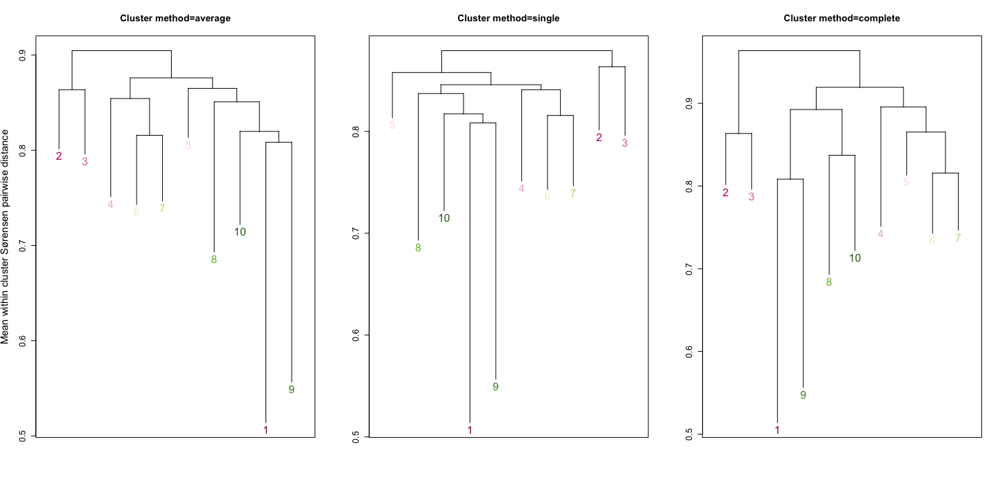

\

::: homelink
<a href="https://kellifeeser.github.io/ksu-paired-amplicon-workflow/index.html" target="_blank" style="text-align:right">Back to Home</a>
:::

\
\

# Prep data {.unlisted .unnumbered .hidden}

```{r load-packages, eval=T, include=F}
library("vegan"); packageVersion("vegan") # ‘2.6.4’
library("phyloseq"); packageVersion("phyloseq") # ‘1.41.1’
library("betapart"); packageVersion("betapart") # ‘1.6’
library("ecodist"); packageVersion("ecodist") # ‘2.0.9’
library("measurements"); packageVersion("measurements") # ‘1.5.1’
library("geosphere"); packageVersion("geosphere") # ‘1.5.18’
  # The legacy packages maptools, rgdal, and rgeos, underpinning the sp package,
  # which was just loaded, were retired in October 2023.
  # Please refer to R-spatial evolution reports for details, especially
  # https://r-spatial.org/r/2023/05/15/evolution4.html.
  # It may be desirable to make the sf package available;
  # package maintainers should consider adding sf to Suggests:.
library("gdata"); packageVersion("gdata") # ‘2.19.0’
library("spam"); packageVersion("spam") # ‘2.9.1’
library("ggplot2"); packageVersion("ggplot2") # ‘3.4.4’
library("ggpubr"); packageVersion("ggpubr") # ‘0.6.0’
library("cowplot"); packageVersion("cowplot") # ‘1.1.1’
library("geodist"); packageVersion("geodist") # ‘0.0.8’
library("leaflet"); packageVersion("leaflet") # ‘2.2.1’
library("htmlwidgets"); packageVersion("htmlwidgets") # ‘1.6.2’
library("IRdisplay"); packageVersion("IRdisplay") # ‘1.1’
library("cluster"); packageVersion("cluster") # ‘2.1.4’
# library("MVA"); packageVersion("MVA") # ‘1.0.8’
library("usedist"); packageVersion("usedist") # ‘0.4.0’
library("leaflet"); packageVersion("leaflet") # ‘2.2.1’


source("ksu_colors.R")
```

```{r readin-phylo, include=FALSE, eval=T}
## HAS ONF BEEN FIXED TO BIN=NORTH? CHECK
# View(sample_data(Fun_wholecommunity)[sample_data(Fun_wholecommunity)$Site == "ONF", c("sample_name", "Site", "Bin")])


# with GvS labs

#######
# Bac #
#######
# Bac_wholecommunityUNFIXED <- readRDS(file="../processed_data/clean_rds_saves/Bac_wholecommunity_shared.rds")
# Bac_generalistsUNFIXED <- readRDS(file="../processed_data/clean_rds_saves/Bac_generalists_allgrasses_shared.rds")
  # otu_table()   OTU Table:         [ 2145 taxa and 484 samples ]
  # sample_data() Sample Data:       [ 484 samples by 57 sample variables ]
  # tax_table()   Taxonomy Table:    [ 2145 taxa by 7 taxonomic ranks ]
# Bac_specialistsUNFIXED <- readRDS(file="../processed_data/clean_rds_saves/Bac_specialists_allgrasses_shared.rds")
  # otu_table()   OTU Table:         [ 5140 taxa and 484 samples ]
  # sample_data() Sample Data:       [ 484 samples by 57 sample variables ]
  # tax_table()   Taxonomy Table:    [ 5140 taxa by 7 taxonomic ranks ]

#######
# Fun #
#######
# Fun_wholecommunityUNFIXED <- readRDS(file="../processed_data/clean_rds_saves/Fun_wholecommunity_shared.rds")
# Fun_generalistsUNFIXED <- readRDS(file="../processed_data/clean_rds_saves/Fun_generalists_allgrasses_shared.rds")
  # otu_table()   OTU Table:         [ 896 taxa and 484 samples ]
  # sample_data() Sample Data:       [ 484 samples by 57 sample variables ]
  # tax_table()   Taxonomy Table:    [ 896 taxa by 8 taxonomic ranks ]
# Fun_specialistsUNFIXED <- readRDS(file="../processed_data/clean_rds_saves/Fun_specialists_allgrasses_shared.rds")
  # otu_table()   OTU Table:         [ 1803 taxa and 484 samples ]
  # sample_data() Sample Data:       [ 484 samples by 57 sample variables ]
  # tax_table()   Taxonomy Table:    [ 1803 taxa by 8 taxonomic ranks ]

##########
# phylo #
Bac_wholecommunity<-readRDS(file = "../processed_data/clean_rds_saves/Bac_wholecommunity.rds")
Fun_wholecommunity <- readRDS(file="../processed_data/clean_rds_saves/Fun_wholecommunity.rds")
##########

```

## relabel ONF as North

```{r fix-mislabeling-function, include=FALSE,eval=F}
# This function now creates a copy of the input phyloseq object and operates on the copy to update the metadata. It then returns the updated phyloseq object without modifying the original one.

fix_metadata <- function(physeq_obj) {
  # Create a copy of the input phyloseq object
  fixed_physeq_obj <- physeq_obj
  
  # Extract the sample_data dataframe
  sample_data_tofix <- sample_data(fixed_physeq_obj)
  
  # Fix the metadata based on the condition
  sample_data_tofix$Bin[sample_data_tofix$Site == "ONF" & sample_data_tofix$Bin == "South Central"] <- "North"
  
  # Assign the updated sample_data back to the phyloseq object
  sample_data(fixed_physeq_obj) <- sample_data_tofix
  
  # Return the updated phyloseq object
  return(fixed_physeq_obj)
}

# Usage:
# Replace 'Fun_wholecommunity' with your desired phyloseq object
# Updated phyloseq object will be stored in 'fixed_physeq_obj'
Fun_wholecommunity <- fix_metadata(Fun_wholecommunityUNFIXED)
Fun_generalists <- fix_metadata(Fun_generalistsUNFIXED)
Fun_specialists <- fix_metadata(Fun_specialistsUNFIXED)

Bac_wholecommunity <- fix_metadata(Bac_wholecommunityUNFIXED)
Bac_generalists <- fix_metadata(Bac_generalistsUNFIXED)
Bac_specialists <- fix_metadata(Bac_specialistsUNFIXED)

## HAS ONF BEEN FIXED TO BIN=NORTH? CHECK
# View(sample_data(Fun_wholecommunity)[sample_data(Fun_wholecommunity)$Site == "ONF", c("sample_name", "Site", "Bin")])

```

## load pam res

```{r load-pam, include=FALSE,eval=TRUE}
pam_fwc_sor_k10 <- readRDS(file = "../processed_data/clean_rds_saves/pam/pam_fwc_sor_k10.rds")
pam_bwc_sor_k14 <- readRDS(file = "../processed_data/clean_rds_saves/pam/pam_bwc_sor_k14.rds")
```

```{r add-pam2phylo, include=FALSE,eval=F}
sample_data(Fun_wholecommunity)$clus_sor_k10 <- pam_fwc_sor_k10
sample_data(Fun_wholecommunity)$clus_sor_k10 <- as.factor(sample_data(Fun_wholecommunity)$clus_sor_k10)

sample_data(Bac_wholecommunity)$clus_sor_k14 <- pam_bwc_sor_k14
sample_data(Bac_wholecommunity)$clus_sor_k14 <- as.factor(sample_data(Bac_wholecommunity)$clus_sor_k14)


# are any sites split by cluster?
  # yes, BNP
# unique(sample_data(Fun_wholecommunity)$Site)
# BLM BNP CAD CNF CPR DMT FCP FMT GMT GNF HAR HPG KAE KNZ LAR LBJ NWP ONF RNF SEV SFA UHC
# View(sample_data(Fun_wholecommunity)[sample_data(Fun_wholecommunity)$Site == "CAD", c("sample_name", "Site", "Grass", "clus_sor_k10")])
```

## leaflet metadata

```{r metadata-setup, include=FALSE,eval=TRUE}
####
####
# Extract GPS coordinates and other metadata from sample data
sd <- sample_data(Fun_wholecommunity)

# create df with only 1 rep/unique entry from each site
unique_sites <- unique(sd$Site)
first_entries <- sapply(unique_sites, function(site) which(sd$Site == site)[1])
Fun_meta_for_map <- sd[first_entries, ]
```

```{r load-ord-rds, include=FALSE,eval=TRUE}
Fun_wc_sor_k4.ord <- readRDS(file="../processed_data/clean_rds_saves/Fun_wc_sor_k4.ord.rds")
Bac_wc_sor_k5.ord <- readRDS(file="../processed_data/clean_rds_saves/Bac_wc_sor_k5.ord.rds")
```

```{r lat-long-cols-sorted-coords, include=FALSE,eval=TRUE, cache=TRUE}
# Sort the data frame by latitude (descending) and then by longitude (ascending)
sorted_coords <- as(Fun_meta_for_map[order(-Fun_meta_for_map$Latitude, Fun_meta_for_map$Longitude), ],"data.frame")

# Print the sorted coordinates
# print(sorted_coords)

# Calculate latitude and longitude ranges
lat_range <- range(sorted_coords$Latitude)
lon_range <- range(sorted_coords$Longitude)

# Normalize latitude and longitude values to [0, 1]
sorted_coords$Norm_Latitude <- (sorted_coords$Latitude - lat_range[1]) / (lat_range[2] - lat_range[1])
sorted_coords$Norm_Longitude <- (sorted_coords$Longitude - lon_range[1]) / (lon_range[2] - lon_range[1])

# Assign colors based on normalized latitude and longitude
sorted_coords$Color <- rgb(sorted_coords$Norm_Longitude, sorted_coords$Norm_Latitude, 0.5)


# Plot the sites on a map with colors based on gradients
# ggplot(sorted_coords, aes(x = Longitude, y = Latitude, color = Color)) +
#   geom_point(size = 5) +
#   scale_color_identity() +
#   labs(title = "Map with Colors Based on Latitude and Longitude Gradients")

# Create a named vector for scale_color_manual
color_latlong_mapping <- setNames(sorted_coords$Color, sorted_coords$Site)

  # for leaflet later
  latlong_cols <- sorted_coords$Color
  latlong_sitenames <- sorted_coords$Site

# Define the order of levels for the site factor
# site_levels <- unique(sorted_coords$Site)
site_levels <- factor(sorted_coords$Site, ordered=T)

# Create the colorFactor with explicit levels
colorFactor_latlong <- colorFactor(palette = color_latlong_mapping, domain = sorted_coords$Site, levels = site_levels)

Site_colors_list_fixed <- list("latlong_sitenames"=latlong_sitenames,"color_latlong_mapping"=color_latlong_mapping,"latlong_cols"=latlong_cols,"site_levels_orderedfactor"=site_levels)

# saveRDS(Site_colors_list_fixed,file = "/Users/L347123/Desktop/ksu-paired-amplicon-workflow/processed_data/clean_rds_saves/Site_colors_list_fixed.rds")
```

## leaflet maps

```{r basic-map-unfixed, include=FALSE,eval=F}
mapUNFIXED<-leaflet(data = Fun_meta_for_mapUNFIXED, width = 650, height = 500,
                    options = leafletOptions(minZoom=4, maxZoom = 7)) %>% 
  # addTiles() %>% 
  addTiles(urlTemplate = 'http://{s}.tile.openstreetmap.org/{z}/{x}/{y}.png', 
           attribution = '&copy; <a href="https://www.openstreetmap.org/copyright">OpenStreetMap</a> contributors') %>% 
  # addProviderTiles(providers$Esri.NatGeoWorldMap,
  # options = providerTileOptions(opacity = 0.35)) %>% 
  setView(-99.75329	, 34.62755, zoom = 5) %>%
  addLabelOnlyMarkers(
    lng = -94.13184, lat = 39.80954,
    label = "Site: ONF",
    labelOptions = labelOptions(noHide = TRUE, textOnly = TRUE,
                                direction = "top",
                                offset = c(0,-10),
                                fill = T,
                                style = list("color" = "black",
                                             "background-color" = "white",
                                             "font-style" = "bold",
                                             "box-shadow" = "3px 3px rgba(0,0,0,0.25)",
                                             "font-size" = "15px",
                                             "border-style" = "solid",
                                             "border-color" = "#FFFA6C",
                                             "border-width" = "3px",
                                             "padding" = "1px"
                                ))
    ) 
```

```{r basic-map, include=FALSE,eval=TRUE}
map<-leaflet(data = Fun_meta_for_map, width = 450, height = 450,
        options = leafletOptions(minZoom=4, maxZoom = 7)) %>% 
  # addTiles() %>% 
  addTiles(urlTemplate = 'http://{s}.tile.openstreetmap.org/{z}/{x}/{y}.png', 
           attribution = '&copy; <a href="https://www.openstreetmap.org/copyright">OpenStreetMap</a> contributors') %>% 
  # addProviderTiles(providers$Esri.NatGeoWorldMap,
    # options = providerTileOptions(opacity = 0.35)) %>% 
  setView(-99.75329	, 34.62755, zoom = 5)
```

# Set up Ordinations/NMDS {.unlisted .unnumbered .hidden}

## Check Gap Statistic on NMDS

```{r ord-on-gap-Bac, include=FALSE,eval=FALSE}
ent.ca.Bac = Bac_wholecommunity.k3.ord

# Now the Gap Statistic code
pam1 = function(x, k) list(cluster = pam(x, k, cluster.only = TRUE))
x = scores(ent.ca.Bac, display = "sites")
gskmn.Bac = clusGap(x[, 1:2], FUN = pam1, K.max = 6, B = 50)
gskmn.Bac

gap_statistic_ordination = function(ord, FUNcluster, type = "sites", K.max = 6, axes = c(1:2), B = 500, verbose = interactive(), ...) {
    require("cluster")
    if (FUNcluster == "pam1") {
        FUNcluster = function(x, k) list(cluster = pam(x, k, cluster.only = TRUE))
    }
    x = scores(ord, display = type)
    if (is.null(axes)) {
        axes = 1:ncol(x)
    }
    clusGap(x[, axes], FUN = FUNcluster, K.max = K.max, B = B, verbose = verbose)
}
gs.Bac = gap_statistic_ordination(ent.ca.Bac, "pam1", B = 50, verbose = FALSE)
print(gs.Bac, method = "Tibs2001SEmax")

plot_clusgap(gs.Bac)

gsbwc <- gs.Bac
saveRDS(gsbwc, file = "../processed_data/clean_rds_saves/gsbwc.rds")

plot(gsbwc, main = "Gap statistic for the 'Bac - whole comm' NMDS data")
mtext("k = 3 is best")
```

```{r ord-on-gap-Fun, include=FALSE,eval=FALSE}
# First perform the ordination using correspondence analysis
  # from http://joey711.github.io/phyloseq-demo/phyloseq-demo.html
library("cluster")
# Load data
data(enterotype)
# ordination
ent.ca = Fun_wholecommunity.k3.ord

# Now the Gap Statistic code
pam1 = function(x, k) list(cluster = pam(x, k, cluster.only = TRUE))
x = scores(ent.ca, display = "sites")
# gskmn = clusGap(x[, 1:2], FUN=kmeans, nstart=20, K.max = 6, B = 500)
gskmn = clusGap(x[, 1:2], FUN = pam1, K.max = 6, B = 50)
gskmn

# wrapper-function
gap_statistic_ordination = function(ord, FUNcluster, type = "sites", K.max = 6, 
    axes = c(1:2), B = 500, verbose = interactive(), ...) {
    require("cluster")
    # If 'pam1' was chosen, use this internally defined call to pam
    if (FUNcluster == "pam1") {
        FUNcluster = function(x, k) list(cluster = pam(x, k, cluster.only = TRUE))
    }
    # Use the scores function to get the ordination coordinates
    x = scores(ord, display = type)
    # If axes not explicitly defined (NULL), then use all of them
    if (is.null(axes)) {
        axes = 1:ncol(x)
    }
    # Finally, perform, and return, the gap statistic calculation using
    # cluster::clusGap
    clusGap(x[, axes], FUN = FUNcluster, K.max = K.max, B = B, verbose = verbose, 
        ...)
}

# Define a plot method for results
plot_clusgap = function(clusgap, title = "Gap Statistic calculation results") {
    require("ggplot2")
    gstab = data.frame(clusgap$Tab, k = 1:nrow(clusgap$Tab))
    p = ggplot(gstab, aes(k, gap)) + geom_line() + geom_point(size = 5)
    p = p + geom_errorbar(aes(ymax = gap + SE.sim, ymin = gap - SE.sim))
    p = p + ggtitle(title)
    return(p)
}

# Now try out this function. Should work on ordination classes recognized by scores function, and provide a ggplot graphic instead of a base graphic. (Special Note: the phyloseq-defined scores extensions are not exported as regular functions to avoid conflict, so phyloseq-defined scores extensions can only be accessed with the phyloseq::: namespace prefix in front.)
gs = gap_statistic_ordination(ent.ca, "pam1", B = 50, verbose = FALSE)
print(gs, method = "Tibs2001SEmax")

# plot
plot_clusgap(gs)

gsfwc <- gs
saveRDS(gsfwc, file = "../processed_data/clean_rds_saves/gsfwc.rds")

# Base graphics plotting, for comparison.
plot(gsfwc, main = "Gap statistic for the 'Fun - whole comm' NMDS data")
mtext("k = 3 is best")
```

```{r plot-gap, include=FALSE,eval=TRUE}
gsfwc <- readRDS(file = "../processed_data/clean_rds_saves/gsfwc.rds")

# Base graphics plotting, for comparison.
plot(gsfwc, main = "Gap statistic for the 'Fun - whole comm' NMDS")
mtext("k = 3 is best")
```

## ordinate

```{r make-ordinations-bray, include=FALSE, eval=F}
###############
## k=3
Fun_wholecommunity.k3.ord = ordinate(Fun_wholecommunity, "NMDS", "bray", k=3, maxit=500)
# Stress:     0.1708975 

  # flipping x axis coords for ease of interpretation
  Fun_wholecommunity.k3.ord$points[,1]<-Fun_wholecommunity.k3.ord$points[,1]*-1 # already done 
  
  # and y
  Fun_wholecommunity.k3.ord$points[,2]<-Fun_wholecommunity.k3.ord$points[,2]*-1 # already done
  
saveRDS(Fun_wholecommunity.k3.ord, file="../processed_data/clean_rds_saves/Fun_wholecommunity.k3.ord.rds")
###############


###############
## k=5
Fun_wholecommunity.k5.ord = ordinate(Fun_wholecommunity, "NMDS", "bray", k=5, maxit=500)
# Stress:     0.1135253

  # flipping x axis coords for ease of interpretation
  Fun_wholecommunity.k5.ord$points[,1]<-Fun_wholecommunity.k5.ord$points[,1]*-1 # already done
  
  # and y
  Fun_wholecommunity.k5.ord$points[,2]<-Fun_wholecommunity.k5.ord$points[,2]*-1 # already done
  
saveRDS(Fun_wholecommunity.k5.ord, file="../processed_data/clean_rds_saves/Fun_wholecommunity.k5.ord.rds")
###############
```

```{r make-ordinations-sor-Fun, include=FALSE, eval=F}

Fun_wholecommunity.beta.pair <- beta.pair(decostand(phylo2vegan_OTU(Fun_wholecommunity), method = "pa"), index.family = "sorensen")

###############
## compare/check ords

Fun_wholecommunity.SOR.k3.ord = ordinate(Fun_wholecommunity, "NMDS", distance = Fun_wholecommunity.beta.pair$beta.sor, k=3, maxit=500)
# Dimensions: 2 
# Stress:     0.2240035 
# Stress type 1, weak ties
# Best solution was not repeated after 20 tries
# The best solution was from try 5 (random start)
# Scaling: centring, PC rotation 
# Species: scores missing

ords_Fun <- list()
ords_Fun$f.s.oldk3_actk2 <- Fun_wholecommunity.SOR.k3.ord

f.s.k2.ord1 = ordinate(Fun_wholecommunity, "NMDS", distance = "bray", binary=T,k=2, maxit=500)
# *** Best solution was not repeated -- monoMDS stopping criteria:
#     17: stress ratio > sratmax
#      3: scale factor of the gradient < sfgrmin
# Dimensions: 2 
# Stress:     0.2238117 
# Stress type 1, weak ties
# Best solution was not repeated after 20 tries
# The best solution was from try 8 (random start)
# Scaling: centring, PC rotation, halfchange scaling 
# Species: expanded scores based on ‘wisconsin(sqrt(veganifyOTU(physeq)))’ 
ords_Fun$f.s.k2.ord1 <- f.s.k2.ord1
  
f.s.k2_dist.inline = ordinate(Fun_wholecommunity, "NMDS", distance = "bray", binary=T,k=2, maxit=500)
# *** Best solution was not repeated -- monoMDS stopping criteria:
#     20: stress ratio > sratmax
# Dimensions: 2 
# Stress:     0.2239563 
# Stress type 1, weak ties
# Best solution was not repeated after 20 tries
# The best solution was from try 1 (random start)
# Scaling: centring, PC rotation, halfchange scaling 
# Species: expanded scores based on ‘wisconsin(sqrt(veganifyOTU(physeq)))’ 
ords_Fun$f.s.k2_dist.inline <- f.s.k2_dist.inline
  
Fun_wholecommunity.beta.sor.matasdist <- as.dist(Fun_wholecommunity.beta.pair$beta.sor)

f.s.k2_dist.pre = ordinate(Fun_wholecommunity, "NMDS", distance = Fun_wholecommunity.beta.sor.matasdist,k=2, maxit=500)
# *** Best solution was not repeated -- monoMDS stopping criteria:
#     11: no. of iterations >= maxit
#      8: stress ratio > sratmax
#      1: scale factor of the gradient < sfgrmin
# Dimensions: 2 
# Stress:     0.2240106 
# Stress type 1, weak ties
# Best solution was not repeated after 20 tries
# The best solution was from try 3 (random start)
# Scaling: centring, PC rotation 
# Species: scores missing
ords_Fun$f.s.k2_dist.pre <- f.s.k2_dist.pre


ords_Fun$f.s.k3_dist.inline = ordinate(Fun_wholecommunity, "NMDS", distance = "bray", binary=T,k=3, maxit=500)
ords_Fun$f.s.k3_dist.inline
# *** Best solution was not repeated -- monoMDS stopping criteria:
#     16: stress ratio > sratmax
#      4: scale factor of the gradient < sfgrmin
# Dimensions: 3 
# Stress:     0.1600924 
# Stress type 1, weak ties
# Best solution was not repeated after 20 tries
# The best solution was from try 2 (random start)
# Scaling: centring, PC rotation, halfchange scaling 
# Species: expanded scores based on ‘wisconsin(sqrt(veganifyOTU(physeq)))’ 


ords_Fun$f.s.k3_di.wtF = ordinate(Fun_wholecommunity, "NMDS", distance = "bray", binary=T,k=3, maxit=500, weakties=F,trace=2, try = 20, trymax = 20)
# *** Best solution was not repeated -- monoMDS stopping criteria:
#     16: stress ratio > sratmax
#      4: scale factor of the gradient < sfgrmin
# Dimensions: 3 
# Stress:     0.1606506 
# Stress type 1, strong ties
# Best solution was not repeated after 20 tries
# The best solution was from try 6 (random start)
# Scaling: centring, PC rotation, halfchange scaling 
# Species: expanded scores based on ‘wisconsin(sqrt(veganifyOTU(physeq)))’ 

ords_Fun$f.s.k3_di.wtF.3050 = ordinate(Fun_wholecommunity, "NMDS", distance = "bray", binary=T,k=3, maxit=1000, weakties=F,trace=2, try = 30, trymax = 50)
# *** Best solution was not repeated -- monoMDS stopping criteria:
#     40: stress ratio > sratmax
#      10: scale factor of the gradient < sfgrmin
# Stress:     0.1606526 
# Stress type 1, strong ties
# Best solution was not repeated after 50 tries
# The best solution was from try 26 (random start)
# Scaling: centring, PC rotation, halfchange scaling 

ords_Fun$f.s.k3_di.wtT.3050 = ordinate(Fun_wholecommunity, "NMDS", distance = "bray", binary=T,k=3, maxit=1000, weakties=T,trace=2, try = 30, trymax = 50)
# Dimensions: 3 
# Stress:     0.1601339 
# Stress type 1, weak ties
# Best solution was not repeated after 50 tries
# The best solution was from try 32 (random start)
# Scaling: centring, PC rotation, halfchange scaling 
###

ords_Fun$f.s.k4_di.wtF.3050 = ordinate(Fun_wholecommunity, "NMDS", distance = "bray", binary=T,k=4, maxit=1000, weakties=F,trace=2, try = 30, trymax = 50)
# *** Best solution repeated 3 times
# Dimensions: 4 
# Stress:     0.1220325 
# Stress type 1, strong ties
# Best solution was repeated 3 times in 30 tries
# The best solution was from try 14 (random start)
# Scaling: centring, PC rotation, halfchange scaling 

ords_Fun$f.s.k4_di.wtT.3050 = ordinate(Fun_wholecommunity, "NMDS", distance = "bray", binary=T,k=4, maxit=1000, weakties=T,trace=2, try = 30, trymax = 50)
# *** Best solution repeated 4 times
# Dimensions: 4 
# Stress:     0.1215643 
# Stress type 1, weak ties
# Best solution was repeated 4 times in 30 tries
# The best solution was from try 21 (random start)
# Scaling: centring, PC rotation, halfchange scaling 
# Species: expanded scores based on ‘wisconsin(sqrt(veganifyOTU(physeq)))’ 

stressplot(ords_Fun$f.s.oldk3_actk2)
stressplot(ords_Fun$f.s.k2_dist.inline)
stressplot(ords_Fun$f.s.k3_dist.inline)
stressplot(ords_Fun$f.s.k3_di.wtF.3050)
stressplot(ords_Fun$f.s.k3_di.wtT.3050)
stressplot(ords_Fun$f.s.k4_di.wtT.3050)
stressplot(ords_Fun$f.s.k4_di.wtF.3050)

#best --> f.s.k4_di.wtT.3050
saveRDS(ords_Fun$f.s.k4_di.wtT.3050, file = "../processed_data/clean_rds_saves/Fun_wc_sor_k4.ord.rds")

###############

```

definitely a subset of samples with diss = 1 / lack of shared features. to investigate later?

```{r make-ordinations-sor-Bac, include=FALSE, eval=F}
ords_Bac <- list()
ords_Bac$f.s.k2_di.wtF.3050 = ordinate(Bac_wholecommunity, "NMDS", distance = "bray", binary=T,k=2, maxit=1000, weakties=T,trace=2, try = 30, trymax = 50)
# Stress:     0.1407248 
# Stress type 1, weak ties
# Best solution was not repeated after 50 tries

ords_Bac$f.s.k3_di.wtF.3050 = ordinate(Bac_wholecommunity, "NMDS", distance = "bray", binary=T,k=3, maxit=1000, weakties=T,trace=2, try = 30, trymax = 50)
# *** Best solution repeated 2 times
# Stress:     0.08875761 
# Stress type 1, weak ties
# Best solution was repeated 2 times in 30 tries
ords_Bac$f.s.k4_di.wtF.3050 = ordinate(Bac_wholecommunity, "NMDS", distance = "bray", binary=T,k=4, maxit=1000, weakties=T,trace=2, try = 30, trymax = 50)
# *** Best solution repeated 11 times
# Stress:     0.06465839 
# Stress type 1, weak ties
# Best solution was repeated 11 times in 30 tries

ords_Bac$f.s.k5_di.wtT.3050 = ordinate(Bac_wholecommunity, "NMDS", distance = "bray", binary=T,k=5, maxit=1000, weakties=T,trace=2, try = 30, trymax = 50)
# *** Best solution repeated 6 times
# Dimensions: 5 
# Stress:     0.05482393 
# Stress type 1, weak ties
# Best solution was repeated 6 times in 30 tries
# The best solution was from try 11 (random start)
# Scaling: centring, PC rotation, halfchange scaling 
# Species: expanded scores based on ‘wisconsin(sqrt(veganifyOTU(physeq)))’ 

ords_Bac$f.s.k5_di.wtF.3050 = ordinate(Bac_wholecommunity, "NMDS", distance = "bray", binary=T,k=5, maxit=1000, weakties=F,trace=2, try = 30, trymax = 50)
# Dimensions: 5 
# Stress:     0.05483343 
# Stress type 1, strong ties
# Best solution was repeated 2 times in 30 tries
# The best solution was from try 12 (random start)
# Scaling: centring, PC rotation, halfchange scaling 
# Species: expanded scores based on ‘wisconsin(sqrt(veganifyOTU(physeq)))’ 

stressplot(ords_Bac[[1]])
stressplot(ords_Bac[[2]])
stressplot(ords_Bac[[3]])
stressplot(ords_Bac$f.s.k5_di.wtF.3050)
stressplot(ords_Bac$f.s.k5_di.wtT.3050)

# best --> ords_Bac$f.s.k5_di.wtT.3050
saveRDS(ords_Bac$f.s.k5_di.wtT.3050, file = "../processed_data/clean_rds_saves/Bac_wc_sor_k5.ord.rds")

```

```{r -OLDmake-ordinations-sor-Bac, include=FALSE, eval=F}


# The equation can also contain any R functions that accepts vector arguments and returns vectors of the same length.

# Function sets argument "maxdist" similarly as vegdist, using NA when there is no fixed upper limit, and 0 for similarities.
bwc.designdist<-designdist(phylo2vegan_OTU(Bac_wholecommunity), method = "(A+B-2*J)/(A+B)",
           terms = c("binary"), 
           abcd = FALSE, alphagamma = FALSE, name="sorensen", maxdist=1)
head(bwc.designdist)

bwc.designdist2<-designdist(decostand(phylo2vegan_OTU(Bac_wholecommunity), method = "pa"), method = "(A+B-2*J)/(A+B)",
           terms = c("binary"), 
           abcd = FALSE, alphagamma = FALSE, name="sorensen", maxdist=1)
head(bwc.designdist2)

## Raw data and plotting
data(sipoo)
m <- betadiver(sipoo)
plot(m)
## The indices
betadiver(help=TRUE)
## The basic Whittaker index
d <- betadiver(sipoo, "w")
## This should be equal to Sorensen index (binary Bray-Curtis in
## vegan)
range(d - vegdist(sipoo, binary=TRUE))

betadiver(x, method = NA, order = FALSE, help = FALSE, ...)


Bac_wholecommunity.SOR.k2.ordA = ordinate(Bac_wholecommunity, method = "NMDS", k=2, maxit=500,autotransform = FALSE,distance = "bray", "binary")


#symmetric square matrix?
Bac_wholecommunity.beta.pair <- beta.pair(decostand(phylo2vegan_OTU(Bac_wholecommunity), method = "pa"), index.family = "sorensen")

head(Bac_wholecommunity.beta.pair$beta.sor)
#[1] 0.4772838 0.4720982 0.5444385 0.5029459 0.5285333 0.4763092

Bac_wholecommunity.beta.sor.mat <- as.matrix((Bac_wholecommunity.beta.pair$beta.sor))
Bac_wholecommunity.beta.sor.mat[1:3,1:3]
###############
## k=2
Bac_wholecommunity.SOR.k2.ord = ordinate(Bac_wholecommunity, method = "NMDS", 
                                         distance = "bray", binary=T,k=2, maxit=500,autotransform = FALSE)
# Stress:      
# metaMDS(comm = veganifyOTU(physeq), distance = distance, k = 2,      autotransform = FALSE, binary = ..1, maxit = 500)
# Stress:     0.1410716 
# Stress type 1, weak ties
# Best solution was not repeated after 20 tries
# The best solution was from try 0 (metric scaling or null solution)
# Scaling: centring, PC rotation, halfchange scaling 
# Species: expanded scores based on ‘veganifyOTU(physeq)’ 

Bac_wholecommunity.SOR.k2AT.ord = ordinate(Bac_wholecommunity, method = "NMDS", 
                                         distance = "bray", binary=T,k=2, maxit=500,autotransform = T)
# Stress:     0.1410716 
# Stress type 1, weak ties
# Best solution was not repeated after 20 tries
# The best solution was from try 0 (metric scaling or null solution)
# Scaling: centring, PC rotation, halfchange scaling 
# Species: expanded scores based on ‘wisconsin(sqrt(veganifyOTU(physeq)))’ 


Bac_wholecommunity.beta.sor.matasdist <- as.dist(Bac_wholecommunity.beta.pair$beta.sor)
Bac_wholecommunity.SOR.k2AD.ord = ordinate(Bac_wholecommunity, method = "NMDS", 
                                         distance = as.dist(Bac_wholecommunity.beta.pair$beta.sor), k=2, maxit=500,autotransform = FALSE)
# Stress:     0.1410716 
# Stress type 1, weak ties
# Best solution was not repeated after 20 tries
# The best solution was from try 0 (metric scaling or null solution)
# Scaling: centring, PC rotation 
# Species: scores missing

Bac_wholecommunity.SOR.k2AD.ord = ordinate(Bac_wholecommunity, method = "NMDS", binary=T,
                                         distance = Bac_wholecommunity.beta.sor.matasdist, k=2, maxit=500,autotransform = FALSE)
# Stress:     0.1410716 
# Stress type 1, weak ties
# Best solution was repeated 1 time in 20 tries
# The best solution was from try 0 (metric scaling or null solution)
# Scaling: centring, PC rotation 
# Species: scores missing

phyloseq::distance()
Bac_wholecommunity.SOR.k2ADAT.ord = ordinate(Bac_wholecommunity, method = "NMDS", 
                                         distance = Bac_wholecommunity.beta.sor.matasdist, k=2, maxit=500,autotransform = T)
# Stress:     0.1404755 
# Stress type 1, weak ties
# Best solution was not repeated after 20 tries
# The best solution was from try 17 (random start)
# Scaling: centring, PC rotation 
# Species: scores missing

Bac_wholecommunity.SOR.k2ADATb.ord = ordinate(Bac_wholecommunity, method = "NMDS",binary=T,
                                         distance = Bac_wholecommunity.beta.sor.matasdist, k=2, maxit=500,autotransform = T)
# Stress:     0.1410716 
# Stress type 1, weak ties
# Best solution was not repeated after 20 tries
# The best solution was from try 0 (metric scaling or null solution)
# Scaling: centring, PC rotation 
# Species: scores missing


Bac_wholecommunity.SOR.k2.ord = ordinate(Bac_wholecommunity, method = "NMDS", 
                                         distance = dist(Bac_wholecommunity.beta.sor.mat), k=2, maxit=500,autotransform = FALSE)
# Stress:     0.1019441 

### testig
Bac_wholecommunity.beta.sor.matasdist <- as.dist(Bac_wholecommunity.beta.pair$beta.sor)

distance(esophagus, "(A+B-2*J)/(A+B)")

Bac_wholecommunity.SOR.k2.ordB = ordinate(Bac_wholecommunity, method = "NMDS", 
                                         distance = as.dist(Bac_wholecommunity.beta.pair$beta.sor), binary=T,k=2, maxit=500,autotransform = FALSE)
# Stress:     0.1410716 

  # flipping x axis coords for ease of interpretation
  # Bac_wholecommunity.SOR.k3.ord$points[,1]<-Bac_wholecommunity.SOR.k3.ord$points[,1]*-1 # NOT done 
  
  # and y
  # Bac_wholecommunity.SOR.k3.ord$points[,2]<-Bac_wholecommunity.SOR.k3.ord$points[,2]*-1 # NOT done
  
saveRDS(Bac_wholecommunity.SOR.k2.ord, file="../processed_data/clean_rds_saves/Bac_wholecommunity.SOR.k2.ord.rds")
###############


Bac_wholecommunity.SOR.k3.ord = ordinate(Bac_wholecommunity, method = "NMDS", 
                                         distance = dist(Bac_wholecommunity.beta.sor.mat), k=3, maxit=500,autotransform = FALSE)


###############
## k=3
Bac_wholecommunity.SOR.k3.ord = ordinate(Bac_wholecommunity, "NMDS", distance = Bac_wholecommunity.beta.pair$beta.sor, k=3, maxit=500)
# Stress:     0.2240035 

  # flipping x axis coords for ease of interpretation
  # Bac_wholecommunity.SOR.k3.ord$points[,1]<-Bac_wholecommunity.SOR.k3.ord$points[,1]*-1 # NOT done 
  
  # and y
  # Bac_wholecommunity.SOR.k3.ord$points[,2]<-Bac_wholecommunity.SOR.k3.ord$points[,2]*-1 # NOT done
  
saveRDS(Bac_wholecommunity.SOR.k3.ord, file="../processed_data/clean_rds_saves/Bac_wholecommunity.SOR.k3.ord.rds")
###############


###############
## k=5
Bac_wholecommunity.SOR.k5.ord = ordinate(Bac_wholecommunity, "NMDS", distance = Bac_wholecommunity.beta.pair$beta.sor, k=5, maxit=500)
# Stress:     0.2241684

  # flipping x axis coords for ease of interpretation
  # Bac_wholecommunity.SOR.k5.ord$points[,1]<-Bac_wholecommunity.SOR.k5.ord$points[,1]*-1 # NOT done
  
  # and y
  # Bac_wholecommunity.SOR.k5.ord$points[,2]<-Bac_wholecommunity.SOR.k5.ord$points[,2]*-1 # NOT done
  
saveRDS(Bac_wholecommunity.SOR.k5.ord, file="../processed_data/clean_rds_saves/Bac_wholecommunity.SOR.k5.ord.rds")


sample_data(Bac_wholecommunity)$clus_sor_k10 <- pam_fwc_sor_k10
sample_data(Bac_wholecommunity)$clus_sor_k10 <- as.factor(sample_data(Bac_wholecommunity)$clus_sor_k10)


plot_ordination(Bac_wholecommunity, Bac_wholecommunity.SOR.k2.ord, color = "clus_sor_k10") +
  geom_text(mapping = aes(label = Site), size = 3.5, vjust = 1.25) +
  # scale_color_manual(values = color_latlong_mapping
  #                    # ,name="Grass Host"
  #                    ) +
  geom_point(size = 2, alpha = 0.8) +
  labs(y="") +
  ggtitle("", subtitle = "ITS - k=3") +
  theme_bw() +
  theme(legend.position="right",
    axis.text.x = element_text(color="black", size=12),
    axis.text.y = element_text(color="black", size=12),
    axis.title.x = element_text(color="black", size=14),
    axis.title.y = element_text(color="black", size=14),
    plot.background = element_blank(),panel.border = element_rect(colour = "black", fill=NA, linewidth=.75),
    panel.grid.major = element_blank(),panel.grid.minor = element_blank(),panel.background = element_blank())

plot_ordination(Bac_wholecommunity, Bac_wholecommunity.SOR.k2.ord, color = "Site") +
  geom_text(mapping = aes(label = Site), size = 3.5, vjust = 1.25) +
  # scale_color_manual(values = color_latlong_mapping
  #                    # ,name="Grass Host"
  #                    ) +
  geom_point(size = 2, alpha = 0.8) +
  facet_wrap(.~clus_sor_k10, scales = "free")+
  labs(y="") +
  ggtitle("", subtitle = "ITS - k=3") +
  theme_bw() +
  theme(legend.position="right",
    axis.text.x = element_text(color="black", size=12),
    axis.text.y = element_text(color="black", size=12),
    axis.title.x = element_text(color="black", size=14),
    axis.title.y = element_text(color="black", size=14),
    plot.background = element_blank(),panel.border = element_rect(colour = "black", fill=NA, linewidth=.75),
    panel.grid.major = element_blank(),panel.grid.minor = element_blank(),panel.background = element_blank())

###############
```

```{r test-ords, include=F,eval=F}
plot_ordination(Fun_wholecommunity, ords_Fun$f.s.oldk3_actk2, color = "clus_sor_k10") +
  geom_text(mapping = aes(label = Site), size = 3.5, vjust = 1.25) +
  scale_color_manual(values = col_clusn10,name="Fungal Cluster") +
  geom_point(size = 2, alpha = 0.8) +
  labs(y="") +
  ggtitle("", subtitle = "ITS - f.s.oldk3_actk2") +
  theme_bw() +
  theme(legend.position="right",
    axis.text.x = element_text(color="black", size=12),
    axis.text.y = element_text(color="black", size=12),
    axis.title.x = element_text(color="black", size=14),
    axis.title.y = element_text(color="black", size=14),
    plot.background = element_blank(),panel.border = element_rect(colour = "black", fill=NA, linewidth=.75),
    panel.grid.major = element_blank(),panel.grid.minor = element_blank(),panel.background = element_blank())

plot_ordination(Fun_wholecommunity, ords_Fun$f.s.k2_dist.inline, color = "clus_sor_k10") +
  geom_text(mapping = aes(label = Site), size = 3.5, vjust = 1.25) +
  scale_color_manual(values = col_clusn10,name="Fungal Cluster") +
  geom_point(size = 2, alpha = 0.8) +
  labs(y="") +
  ggtitle("", subtitle = "ITS - f.s.k2_dist.inline") +
  theme_bw() +
  theme(legend.position="right",
    axis.text.x = element_text(color="black", size=12),
    axis.text.y = element_text(color="black", size=12),
    axis.title.x = element_text(color="black", size=14),
    axis.title.y = element_text(color="black", size=14),
    plot.background = element_blank(),panel.border = element_rect(colour = "black", fill=NA, linewidth=.75),
    panel.grid.major = element_blank(),panel.grid.minor = element_blank(),panel.background = element_blank())

plot_ordination(Fun_wholecommunity, ords_Fun$f.s.k3_dist.inline, color = "clus_sor_k10") +
  geom_text(mapping = aes(label = Site), size = 3.5, vjust = 1.25) +
  scale_color_manual(values = col_clusn10,name="Fungal Cluster") +
  geom_point(size = 2, alpha = 0.8) +
  labs(y="") +
  ggtitle("", subtitle = "ITS - f.s.k3_dist.inline") +
  theme_bw() +
  theme(legend.position="right",
    axis.text.x = element_text(color="black", size=12),
    axis.text.y = element_text(color="black", size=12),
    axis.title.x = element_text(color="black", size=14),
    axis.title.y = element_text(color="black", size=14),
    plot.background = element_blank(),panel.border = element_rect(colour = "black", fill=NA, linewidth=.75),
    panel.grid.major = element_blank(),panel.grid.minor = element_blank(),panel.background = element_blank())

plot_ordination(Fun_wholecommunity, ords_Fun$f.s.k3_di.wtF.3050, color = "clus_sor_k10") +
  geom_text(mapping = aes(label = Site), size = 3.5, vjust = 1.25) +
  scale_color_manual(values = col_clusn10,name="Fungal Cluster") +
  geom_point(size = 2, alpha = 0.8) +
  labs(y="") +
  ggtitle("", subtitle = "ITS - f.s.k3_di.wtF.3050") +
  theme_bw() +
  theme(legend.position="right",
    axis.text.x = element_text(color="black", size=12),
    axis.text.y = element_text(color="black", size=12),
    axis.title.x = element_text(color="black", size=14),
    axis.title.y = element_text(color="black", size=14),
    plot.background = element_blank(),panel.border = element_rect(colour = "black", fill=NA, linewidth=.75),
    panel.grid.major = element_blank(),panel.grid.minor = element_blank(),panel.background = element_blank())

plot_ordination(Fun_wholecommunity, ords_Fun$f.s.k3_di.wtT.3050, color = "clus_sor_k10") +
  geom_text(mapping = aes(label = Site), size = 3.5, vjust = 1.25) +
  scale_color_manual(values = col_clusn10,name="Fungal Cluster") +
  geom_point(size = 2, alpha = 0.8) +
  labs(y="") +
  ggtitle("", subtitle = "ITS - f.s.k3_di.wtT.3050") +
  theme_bw() +
  theme(legend.position="right",
    axis.text.x = element_text(color="black", size=12),
    axis.text.y = element_text(color="black", size=12),
    axis.title.x = element_text(color="black", size=14),
    axis.title.y = element_text(color="black", size=14),
    plot.background = element_blank(),panel.border = element_rect(colour = "black", fill=NA, linewidth=.75),
    panel.grid.major = element_blank(),panel.grid.minor = element_blank(),panel.background = element_blank())


plot_ordination(Fun_wholecommunity, ords_Fun$f.s.k4_di.wtF.3050, color = "clus_sor_k10") +
  geom_text(mapping = aes(label = Site), size = 3.5, vjust = 1.25) +
  scale_color_manual(values = col_clusn10,name="Fungal Cluster") +
  geom_point(size = 2, alpha = 0.8) +
  labs(y="") +
  ggtitle("", subtitle = "ITS - f.s.k4_di.wtF.3050") +
  theme_bw() +
  theme(legend.position="right",
    axis.text.x = element_text(color="black", size=12),
    axis.text.y = element_text(color="black", size=12),
    axis.title.x = element_text(color="black", size=14),
    axis.title.y = element_text(color="black", size=14),
    plot.background = element_blank(),panel.border = element_rect(colour = "black", fill=NA, linewidth=.75),
    panel.grid.major = element_blank(),panel.grid.minor = element_blank(),panel.background = element_blank())

plot_ordination(Fun_wholecommunity, ords_Fun$f.s.k4_di.wtT.3050, color = "clus_sor_k10") +
  geom_text(mapping = aes(label = Site), size = 3.5, vjust = 1.25) +
  scale_color_manual(values = col_clusn10,name="Fungal Cluster") +
  geom_point(size = 2, alpha = 0.8) +
  labs(y="") +
  ggtitle("", subtitle = "ITS - f.s.k4_di.wtT.3050") +
  theme_bw() +
  theme(legend.position="right",
    axis.text.x = element_text(color="black", size=12),
    axis.text.y = element_text(color="black", size=12),
    axis.title.x = element_text(color="black", size=14),
    axis.title.y = element_text(color="black", size=14),
    plot.background = element_blank(),panel.border = element_rect(colour = "black", fill=NA, linewidth=.75),
    panel.grid.major = element_blank(),panel.grid.minor = element_blank(),panel.background = element_blank())

```


# Map of sites and samples

\

### Prior mislabeling of samples from ONF {.unnumbered .hidden .unlisted}

The Kansas site ONF was labeled as 'South Middle' in factor 'Bin' in previous manuscripts. It should be 'North'.

```{r map-ONF, echo=FALSE,eval=F}
# Define colors based on other metadata (change this according to your metadata)
colors_bin <- colorFactor(c("#6BE9FF","#6ABEF9","#FFFA6C","#FFC25B"), domain = NULL, levels(Fun_meta_for_mapUNFIXED$Bin))

# Create a leaflet map
mapUNFIXED %>% 
  addCircleMarkers(lng = ~Longitude, lat = ~Latitude, popup = ~as.character(Site),
                   color = ~colors_bin(Bin),fillOpacity = 0.9,radius = 12) %>%
  # addLabelOnlyMarkers(lng = ~Longitude, lat = ~Latitude, 
  #                  label = ~(Site)) %>%
  addLegend(pal = colors_bin, values = ~Bin, 
            group = "circles", position = "bottomright")
```

Map of sites colored by latitudinal bin.\
\
\
\

------------------------------------------------------------------------

# Overview of Site clusters (NMDS by Site) {.tabset .tabset-pills}

\
I wanted to see if samples grouped by geographic location, and given that sites range widely in distance from one another, I decided to visually assess using a color scheme that at least roughly represented their location in 2D space. See the map below:

```{r lat-long-cols-map, echo=FALSE,eval=TRUE}
map %>% 
  addCircleMarkers(lng = ~Longitude, lat = ~Latitude, popup = ~as.character(Site),
                   color = ~colorFactor_latlong(Site),fillOpacity = 0.8,radius = 10)
```

\
\

In the NMDS (Sørensen), we see definite clustering by Site, but not all groupings are distinct.\

We also see evidence of potentially significant spatial relationships (i.e., distance-decay).\

## Fun {.tabset .unnumbered}

### All in 1 plot {.unnumbered}

```{r, echo=FALSE,eval=TRUE}
plot_ordination(Fun_wholecommunity, Fun_wc_sor_k4.ord, color = "Site") +
  geom_text(mapping = aes(label = Site), size = 3.5, vjust = 1.25) +
  scale_color_manual(values = color_latlong_mapping,
                     breaks = site_levels,
                     # ,name="Grass Host"
                     ) +
  geom_point(size = 2, alpha = 0.8) +
  labs(y="") +
  ggtitle("", subtitle = "ITS - k=4") +
  theme_bw() +
  theme(legend.position="right",
    axis.text.x = element_text(color="black", size=12),
    axis.text.y = element_text(color="black", size=12),
    axis.title.x = element_text(color="black", size=14),
    axis.title.y = element_text(color="black", size=14),
    plot.background = element_blank(),panel.border = element_rect(colour = "black", fill=NA, linewidth=.75),
    panel.grid.major = element_blank(),panel.grid.minor = element_blank(),panel.background = element_blank())


plot_ordination(Bac_wholecommunity, Bac_wc_sor_k5.ord, color = "Site") +
  # geom_text(mapping = aes(label = Site), size = 3.5, vjust = 1.25) +
  scale_color_manual(values = color_latlong_mapping,
                     breaks = site_levels,
                     # ,name="Grass Host"
                     ) +
  geom_point(size = 2, alpha = 0.8) +
  labs(y="") +
  ggtitle("", subtitle = "16S - k=5") +
  theme_bw() +
  theme(legend.position="right",
    axis.text.x = element_text(color="black", size=12),
    axis.text.y = element_text(color="black", size=12),
    axis.title.x = element_text(color="black", size=14),
    axis.title.y = element_text(color="black", size=14),
    plot.background = element_blank(),panel.border = element_rect(colour = "black", fill=NA, linewidth=.75),
    panel.grid.major = element_blank(),panel.grid.minor = element_blank(),panel.background = element_blank())
```

\

------------------------------------------------------------------------

### Facet by Lat bin {.unnumbered}

```{r, echo=FALSE,eval=TRUE}
plot_ordination(Fun_wholecommunity, Fun_wc_sor_k4.ord, color = "Site") +
  geom_text(mapping = aes(label = Site), size = 3.5, vjust = 1.25) +
  scale_color_manual(values = color_latlong_mapping
                     ,breaks = site_levels,
                     # ,name="Grass Host"
                     ) +
  geom_point(size = 2, alpha = 0.8) +
  facet_wrap(.~Bin, scales = "free") +
  labs(y="") +
  ggtitle("", subtitle = "ITS - k=4") +
  theme_bw() +
  theme(legend.position="right",
    axis.text.x = element_text(color="black", size=12),
    axis.text.y = element_text(color="black", size=12),
    axis.title.x = element_text(color="black", size=14),
    axis.title.y = element_text(color="black", size=14),
    plot.background = element_blank(),panel.border = element_rect(colour = "black", fill=NA, linewidth=.75),
    panel.grid.major = element_blank(),panel.grid.minor = element_blank(),panel.background = element_blank())
```

\

------------------------------------------------------------------------

### Facet by Long bin {.unnumbered}

```{r, echo=FALSE,eval=TRUE}
plot_ordination(Fun_wholecommunity, Fun_wc_sor_k4.ord, color = "Site") +
  geom_text(mapping = aes(label = Site), size = 3.5, vjust = 1.25) +
  scale_color_manual(values = color_latlong_mapping
                     ,breaks = site_levels,
                    # ,name="Grass Host"
                     ) +
  geom_point(size = 2, alpha = 0.8) +
  facet_wrap(.~Gradient, scales = "free") +
  labs(y="") +
  ggtitle("", subtitle = "ITS - k=4") +
  theme_bw() +
  theme(legend.position="right",
    axis.text.x = element_text(color="black", size=12),
    axis.text.y = element_text(color="black", size=12),
    axis.title.x = element_text(color="black", size=14),
    axis.title.y = element_text(color="black", size=14),
    plot.background = element_blank(),panel.border = element_rect(colour = "black", fill=NA, linewidth=.75),
    panel.grid.major = element_blank(),panel.grid.minor = element_blank(),panel.background = element_blank())
```

\

------------------------------------------------------------------------

### Lat:Long {.unnumbered}

```{r, echo=FALSE,eval=TRUE}
plot_ordination(Fun_wholecommunity, Fun_wc_sor_k4.ord, color = "Site") +
  geom_text(mapping = aes(label = Site), size = 3.5, vjust = 1.25) +
  scale_color_manual(values = color_latlong_mapping
                     ,breaks = site_levels,
                     # ,name="Grass Host"
                     ) +
  geom_point(size = 2, alpha = 0.8) +
  facet_wrap(.~Bin:Gradient, scales = "free") +
  labs(y="") +
  ggtitle("", subtitle = "ITS - k=4") +
  theme_bw() +
  theme(legend.position="right",
    axis.text.x = element_text(color="black", size=12),
    axis.text.y = element_text(color="black", size=12),
    axis.title.x = element_text(color="black", size=14),
    axis.title.y = element_text(color="black", size=14),
    plot.background = element_blank(),panel.border = element_rect(colour = "black", fill=NA, linewidth=.75),
    panel.grid.major = element_blank(),panel.grid.minor = element_blank(),panel.background = element_blank())
```

\

------------------------------------------------------------------------

# More in-depth: distance-based clustering

\

[Background]{.underline}

Microbiome sample clustering can be performed using either model-based methods and machine learning methods.\
- Machine learning methods, which rely on defined distance metrics, are used more frequently than model-based statistical methods ("due to their efficient implementation and easy interpretation.")\
- I used the partition around medoids (PAM) clustering method, which is related to but considered more robust than K-means. In contrast to K-means, which can be sensitive to the effects of outliers, PAM's optimization goal is to minimize the sum of distances to the medoids instead of minimizing the sum of the squared distances to the cluster centers.\
\

***Note: clustering was performed directly on distance matrices,** not **ordinations or ordination scores***

```{r usedist, include=FALSE,eval=FALSE}
# README: https://cran.r-project.org/web/packages/usedist/readme/README.html

#dist vec
Fun_wc_bray_vec

sample_names(Fun_wholecommunity)[1:2]
# [1] "SRR13801399" "SRR13801186"
sample_data(Fun_wholecommunity)$sample_name[1:2]
# [1] "BLM_BOGR_10" "BLM_BOGR_11"

View(head(as.matrix(Fun_wc_bray_vec)))

# Suppose you have your phyloseq object named 'physeq'
# Extract the abundance data for the two samples of interest
abundance_sample1 <- otu_table(physeq)[, "Sample1"]
abundance_sample2 <- otu_table(physeq)[, "Sample2"]

# Calculate the Bray-Curtis dissimilarity between the two samples
bray_curtis_distance <- distance(physeq, method = "bray")

# Extract the distance between the two samples
sample1_index <- sample_names(physeq) == "Sample1"
sample2_index <- sample_names(physeq) == "Sample2"
bray_curtis_distance_between_samples <- bray_curtis_distance[sample1_index, sample2_index]

# View the distance
print(bray_curtis_distance_between_samples)


```

```{r bray-on-gap, include=FALSE,eval=FALSE}
# Now the Gap Statistic code

# Use the dissimilarity matrix instead of ordination coordinates
Fun_wholecommunity_matrix <- (phylo2vegan_OTU(Fun_wholecommunity))

# prep diss
  # x is typically the output of daisy or dist. Also a vector of length n*(n-1)/2 is allowed (where n is the number of observations), and will be interpreted in the same way as the output of the above-mentioned functions.
n=484
n*(n-1)/2
# 484 samples should have length 116886
# Fun_wc_bray_vec <- distance(otu_table(Fun_wholecommunity), method = "bray")

Fun_wc_bray_vec <- vegdist(Fun_wholecommunity_matrix, method = "bray", upper = F)
# length(Fun_wc_bray_vec)
dim(Fun_wc_bray_vec)

Fun_wc_bray_distmat <- as.matrix(Fun_wc_bray_vec)

gap_stat_diss = function(x, FUNcluster, K.max, B = 500, verbose = T, ...) {
    require("cluster")
    if (FUNcluster == "pam_diss") {
        FUNcluster = function(x, k) list(cluster = pam(x, k, diss=T, cluster.only = TRUE))
    }
    # Finally, perform, and return, the gap statistic calculation using
    # cluster::clusGap
    clusGap(x=x, FUN = FUNcluster, 
            K.max = K.max, B = B, verbose = verbose, ...)
}

gs_fwc_bc_kmax32_b500 = gap_stat_diss(x=Fun_wc_bray_distmat, "pam_diss",
                                     K.max = 32, B = 500, verbose = T)

print(gs_fwc_bc_kmax32_b500, method = "firstSEmax")
 # --> Number of clusters (method 'Tibs2001SEmax', SE.factor=1): 4
print(gs_fwc_bc_kmax32_b500, method = "firstSEmax")
 # --> Number of clusters (method 'firstSEmax', SE.factor=1): 4
print(gs_fwc_bc_kmax32_b500, method = "globalSEmax")
 # --> Number of clusters (method 'globalSEmax', SE.factor=1): 31
print(gs_fwc_bc_kmax32_b500, method = "firstmax")
 # --> Number of clusters (method 'firstmax'): 5


saveRDS(gs_fwc_bc_kmax32_b500, file = "../processed_data/clean_rds_saves/gs_fwc_bc_kmax32_b500.rds")


# Base graphics plotting
plot(gs_fwc_bc_kmax32_b500, main = "Gap statistic for the 'Fun - whole comm' data, based on bray diss")
mtext("K.max = 32, B = 500 (nboot); --> k = 4 is best")
# ---


```

```{r sorensen-on-gap-FUN, include=FALSE,eval=FALSE}
# Now the Gap Statistic code

# Use the dissimilarity matrix instead of ordination coordinates
Fun_wholecommunity_matrix <- (phylo2vegan_OTU(Fun_wholecommunity))

# Create presence absence matrices
Fun_wc_otu.pres.abs = decostand(x=Fun_wholecommunity_matrix, method="pa")

Fun_wc_betapair <- beta.pair(Fun_wc_otu.pres.abs, index.family = "sorensen")

Fun_wc_beta.sor <- Fun_wc_betapair$beta.sor
# prep diss
  # x is typically the output of daisy or dist. Also a vector of length n*(n-1)/2 is allowed (where n is the number of observations), and will be interpreted in the same way as the output of the above-mentioned functions.
n=484
n*(n-1)/2
# 484 samples should have length 116886
# Fun_wc_sorensen_vec <- distance(otu_table(Fun_wholecommunity), method = "sorensen")


Fun_wc_sorensen_distmat <- as.matrix(Fun_wc_beta.sor)

gs_fwc_sor_kmax32_b20 = gap_stat_diss(x=Fun_wc_sorensen_distmat, "pam_diss",
                                     K.max = 32, B = 20, verbose = T)

# print(gs_fwc_sor_kmax32_b20, method = "firstSEmax")
#  # --> Number of clusters (method 'Tibs2001SEmax', SE.factor=1): 30
# print(gs_fwc_sor_kmax32_b20, method = "firstSEmax")
#  # --> Number of clusters (method 'firstSEmax', SE.factor=1): 30
# print(gs_fwc_sor_kmax32_b20, method = "globalSEmax")
#  # --> Number of clusters (method 'globalSEmax', SE.factor=1): 30
# print(gs_fwc_sor_kmax32_b20, method = "firstmax")
#  # --> Number of clusters (method 'firstmax'): 30
# 
# 
# saveRDS(gs_fwc_sor_kmax32_b20, file = "../processed_data/clean_rds_saves/gs_fwc_sor_kmax32_b20.rds")


gs_fwc_sor_kmax32_b500 = gap_stat_diss(x=Fun_wc_sorensen_distmat, "pam_diss",
                                     K.max = 32, B = 500, verbose = T)

print(gs_fwc_sor_kmax32_b500, method = "Tibs2001SEmax")
 # --> Number of clusters (method 'Tibs2001SEmax', SE.factor=1): 10
print(gs_fwc_sor_kmax32_b500, method = "firstSEmax")
 # --> Number of clusters (method 'firstSEmax', SE.factor=1): 30
print(gs_fwc_sor_kmax32_b500, method = "globalSEmax")
 # --> Number of clusters (method 'globalSEmax', SE.factor=1): 30

print(gs_fwc_sor_kmax32_b500, method = "firstmax")
 # --> Number of clusters (method 'firstmax'): 30
print(gs_fwc_sor_kmax32_b500, method = "globalmax")
 # --> Number of clusters (method 'globalmax'): 32


saveRDS(gs_fwc_sor_kmax32_b500, file = "../processed_data/clean_rds_saves/gs_fwc_sor_kmax32_b500.rds")


# Base graphics plotting
plot(gs_fwc_sor_kmax32_b500, main = "Gap statistic for the 'Fun - whole comm' data, based on sorensen diss")
mtext("K.max = 32, B = 500 (nboot); --> k = 10 (or 30?) is best")
# ---


```

```{r sorensen-on-gap-Bac, include=FALSE,eval=FALSE}
# Now the Gap Statistic code

# Use the dissimilarity matrix instead of ordination coordinates
Bac_wholecommunity_matrix <- (phylo2vegan_OTU(Bac_wholecommunity))

# Create presence absence matrices
Bac_wc_otu.pres.abs = decostand(x=Bac_wholecommunity_matrix, method="pa")

Bac_wc_betapair <- beta.pair(Bac_wc_otu.pres.abs, index.family = "sorensen")

Bac_wc_beta.sor <- Bac_wc_betapair$beta.sor
# prep diss
  # x is typically the output of daisy or dist. Also a vector of length n*(n-1)/2 is allowed (where n is the number of observations), and will be interpreted in the same way as the output of the above-mentioned Bacctions.
n=484
n*(n-1)/2
# 484 samples should have length 116886
# Bac_wc_sorensen_vec <- distance(otu_table(Bac_wholecommunity), method = "sorensen")
tu

Bac_wc_sorensen_distmat <- as.matrix(Bac_wc_beta.sor)

gs_bwc_sor_kmax32_b20 = gap_stat_diss(x=Bac_wc_sorensen_distmat, "pam_diss",
                                     K.max = 32, B = 20, verbose = T)

# print(gs_bwc_sor_kmax32_b20, method = "firstSEmax")
#  # --> Number of clusters (method 'firstSEmax', SE.factor=1): 30
# print(gs_bwc_sor_kmax32_b20, method = "firstSEmax")
#  # --> Number of clusters (method 'firstSEmax', SE.factor=1): 30
# print(gs_bwc_sor_kmax32_b20, method = "globalSEmax")
#  # --> Number of clusters (method 'globalSEmax', SE.factor=1): 30
# print(gs_bwc_sor_kmax32_b20, method = "firstmax")
#  # --> Number of clusters (method 'firstmax'): 32
# 
# 
# saveRDS(gs_bwc_sor_kmax32_b20, file = "../processed_data/clean_rds_saves/gs_bwc_sor_kmax32_b20.rds")


gs_bwc_sor_kmax32_b500 = gap_stat_diss(x=Bac_wc_sorensen_distmat, "pam_diss",
                                     K.max = 32, B = 500, verbose = T)

print(gs_bwc_sor_kmax32_b500, method = "Tibs2001SEmax")
 # --> Number of clusters (method 'Tibs2001SEmax', SE.factor=1): 14
print(gs_bwc_sor_kmax32_b500, method = "firstSEmax")
 # --> Number of clusters (method 'firstSEmax', SE.factor=1): 30
print(gs_bwc_sor_kmax32_b500, method = "globalSEmax")
 # --> Number of clusters (method 'globalSEmax', SE.factor=1): 30

print(gs_bwc_sor_kmax32_b500, method = "firstmax")
 # --> Number of clusters (method 'firstmax'): 32
print(gs_bwc_sor_kmax32_b500, method = "globalmax")
 # --> Number of clusters (method 'globalmax'): 32


saveRDS(gs_bwc_sor_kmax32_b500, file = "../processed_data/clean_rds_saves/gs_bwc_sor_kmax32_b500.rds")


# Base graphics plotting
plot(gs_bwc_sor_kmax32_b500, main = "Gap statistic for the 'Bac - whole comm' data, based on sorensen diss")
mtext("K.max = 32, B = 500 (nboot); --> k = 14 is best")
# ---


```

\

## Gap Statistic (on distance matrix) {.tabset .tabset-pills}

\

### view gap on bray {.unnumbered .unlisted}

```{r, echo=FALSE,eval=TRUE}
# ("K.max = 32, B = 25 (nboot)")
gs_fwc_bc_kmax32_b500 <- readRDS(file = "../processed_data/clean_rds_saves/gs_fwc_bc_kmax32_b500.rds")

# print(gs_fwc_bc_kmax32_b500, method = "Tibs2001SEmax")
 # --> Number of clusters (method 'Tibs2001SEmax', SE.factor=1): 4

# Base graphics plotting
plot(gs_fwc_bc_kmax32_b500, main = "Gap statistic for the 'Fun - whole comm' data, based on bray diss")
mtext("K.max = 32, B = 500 (nboot) ---> k = 4 is best")
```

\

### view gap on sørensen {.unnumbered .unlisted}

```{r, echo=FALSE,eval=TRUE}
# ("K.max = 32, B = 25 (nboot)")
gs_fwc_sor_kmax32_b500 <- readRDS(file = "../processed_data/clean_rds_saves/gs_fwc_sor_kmax32_b500.rds")

# print(gs_fwc_sor_kmax32_b500, method = "Tibs2001SEmax")
 # --> Number of clusters (method 'Tibs2001SEmax', SE.factor=1): 10

# Base graphics plotting
plot(gs_fwc_sor_kmax32_b500, main = "Gap statistic for the 'Fun - whole comm' data, based on sørensen diss")
mtext("K.max = 32, B = 500 (nboot); --> k = 10 (or 30?) is best")
```

\

## perform PAM

```{r pam-save-export, echo=T, eval=FALSE}
# Perform PAM clustering and save - Fun
pam_fwc_sor_k10 <- pam(Fun_wc_sorensen_distmat, k = 10, diss = T, cluster.only = T) 

saveRDS(pam_fwc_sor_k10, file = "../processed_data/clean_rds_saves/pam/pam_fwc_sor_k10.rds")


# Perform PAM clustering and save - Bac
pam_bwc_sor_k14 <- pam(Bac_wc_sorensen_distmat, k = 14, diss = T, cluster.only = T) 
pam_bwc_sor_k14<-readRDS(file = "../processed_data/clean_rds_saves/pam/pam_bwc_sor_k14.rds")
saveRDS(pam_bwc_sor_k14, file = "../processed_data/clean_rds_saves/pam/pam_bwc_sor_k14.rds")

# add bac pam to bac sd
sample_data(Bac_wholecommunity)$bac_clus_sor_k10_og <- pam_bwc_sor_k14
sample_data(Bac_wholecommunity)$bac_clus_sor_k10_og <- as.factor(sample_data(Bac_wholecommunity)$bac_clus_sor_k10_og)

# add fun pam to bac sd
sample_data(Bac_wholecommunity)$Fun_sor_clusters <- sample_data(Fun_wholecommunity)$Fun_sor_clusters
sample_data(Bac_wholecommunity)$Fun_sor_clusters <- as.factor(sample_data(Bac_wholecommunity)$Fun_sor_clusters)

saveRDS(Bac_wholecommunity,file="../processed_data/clean_rds_saves/Bac_wholecommunity.rds")

# tail(colnames(sample_data(Bac_wholecommunity)))
# tail(sample_data(Fun_wholecommunity)[1:8])

# add bac pam to fun sd
sample_data(Fun_wholecommunity)$bac_clus_sor_k10_og <- as.factor(sample_data(Bac_wholecommunity)$bac_clus_sor_k10_og)
tail(colnames(sample_data(Fun_wholecommunity)))

saveRDS(Fun_wholecommunity,file="../processed_data/clean_rds_saves/Fun_wholecommunity.rds")

```

\

## view Sørensen clusters on NMDS {.tabset .tabset-pills}

\
Note the density of cluster 1 - I'll investigate that further.

### Fun, k = 10 {.unnumbered .unlisted .tabset .tabset-pills}

##### All samples {.unnumbered .unlisted}

```{r, echo=FALSE,eval=TRUE}
col_n10 <- c("F1"="#8E0152","F2"="#C51B7D","F3"="#DE77AE","F4"="#F1B6DA","F5"="#C5C2EA",
             "F6"="#8DC9BB","F7"="#86C37E","F8"="#7FBC41","F9"="#4D9221","F10"="#276419")


plot_ordination(Fun_wholecommunity, Fun_wc_sor_k4.ord, color = "Fun_sor_clusters") +
  geom_text(mapping = aes(label = Site), size = 3, vjust = 1.25) +
  scale_color_manual(values = col_n10, name = "Sørensen clusters",guide = guide_legend(ncol = 2))+
  geom_point(size = 1.5, alpha = 0.8) +
  labs(y="") +
  ggtitle("", subtitle = "ITS - k=4, Sørensen diss clusters based on pam (k = 10)") +
  theme_bw() +
  theme(legend.position="right",
    axis.text.x = element_text(color="black", size=12),
    axis.text.y = element_text(color="black", size=12),
    axis.title.x = element_text(color="black", size=14),
    axis.title.y = element_text(color="black", size=14),
    plot.background = element_blank(),panel.border = element_rect(colour = "black", fill=NA, linewidth=.75),
    panel.grid.major = element_blank(),panel.grid.minor = element_blank(),panel.background = element_blank())
```

\

##### Facet by Lat {.unnumbered .unlisted}

```{r, echo=FALSE,eval=TRUE}
plot_ordination(Fun_wholecommunity, Fun_wc_sor_k4.ord, color = "Fun_sor_clusters") +
  geom_text(mapping = aes(label = Site), size = 3, vjust = 1.25) +
  scale_color_manual(values = col_n10, name = "Sørensen clusters",guide = guide_legend(ncol = 2))+
  geom_point(size = 1.5, alpha = 0.8) +
  facet_wrap(.~Bin, scales = "free") +
  labs(y="") +
  ggtitle("", subtitle = "ITS - k=4, Sørensen diss clusters based on pam (k = 10)") +
  theme_bw() +
  theme(legend.position="right",
    axis.text.x = element_text(color="black", size=12),
    axis.text.y = element_text(color="black", size=12),
    axis.title.x = element_text(color="black", size=14),
    axis.title.y = element_text(color="black", size=14),
    plot.background = element_blank(),panel.border = element_rect(colour = "black", fill=NA, linewidth=.75),
    panel.grid.major = element_blank(),panel.grid.minor = element_blank(),panel.background = element_blank())
```

\

##### Facet by Long {.unnumbered .unlisted}

```{r, echo=FALSE,eval=TRUE}
plot_ordination(Fun_wholecommunity, Fun_wc_sor_k4.ord, color = "Fun_sor_clusters") +
  geom_text(mapping = aes(label = Site), size = 3, vjust = 1.25) +
  scale_color_manual(values = col_n10, name = "Sørensen clusters",guide = guide_legend(ncol = 2))+
  geom_point(size = 1.5, alpha = 0.8) +
  facet_wrap(.~Gradient, scales = "free") +
  labs(y="") +
  ggtitle("", subtitle = "ITS - k=4, Sørensen diss clusters based on pam (k = 10)") +
  theme_bw() +
  theme(legend.position="right",
    axis.text.x = element_text(color="black", size=12),
    axis.text.y = element_text(color="black", size=12),
    axis.title.x = element_text(color="black", size=14),
    axis.title.y = element_text(color="black", size=14),
    plot.background = element_blank(),panel.border = element_rect(colour = "black", fill=NA, linewidth=.75),
    panel.grid.major = element_blank(),panel.grid.minor = element_blank(),panel.background = element_blank())
```

\

#### Facet by Cluster {.unnumbered}

We do see clusters with only 1 site and others with multiple sites.\

```{r, echo=FALSE,eval=T}
plot_ordination(Fun_wholecommunity, Fun_wc_sor_k4.ord, color = "Site") +
  geom_text(mapping = aes(label = Site), size = 3, vjust = 1.25) +
  scale_color_manual(values = latlong_cols, 
                     breaks = site_levels,
                     name = "Site",guide = guide_legend(ncol = 2))+
  geom_point(size = 1.5, alpha = 0.8) +
  facet_wrap(.~Fun_sor_clusters, scales = "free") +
  labs(y="") +
  ggtitle("", subtitle = "ITS - k=4, Sørensen diss clusters based on pam (k = 10)") +
  theme_bw() +
  theme(legend.position="right",
    axis.text.x = element_text(color="black", size=12),
    axis.text.y = element_text(color="black", size=12),
    axis.title.x = element_text(color="black", size=14),
    axis.title.y = element_text(color="black", size=14),
    plot.background = element_blank(),panel.border = element_rect(colour = "black", fill=NA, linewidth=.75),
    panel.grid.major = element_blank(),panel.grid.minor = element_blank(),panel.background = element_blank())
```

```{r, include=FALSE,eval=F}
# hcl_palettes(type = "qualitative")
# qualitative_hcl(palette = "dark2", n=20)

# View(sample_data(Fun_wholecommunity)[,c("Site","Grass","clus_bc_k4")])


# colors_pH <- colorFactor(c("#6BE9FF","#6ABEF9","#FFFA6C","#FFC25B"), domain = NULL, levels(Fun_meta_for_map$Bin))

# colors_Fun_sor_clusters <- colorNumeric("viridis", domain = sort(Fun_meta_for_map$Fun_sor_clusters), reverse = TRUE)
# sd_Fun_wholecommunity
# 
# map %>% 
#   addCircleMarkers(lng = ~Longitude, lat = ~Latitude, popup = ~as.character(Site),
#                    color = ~colors_Fun_sor_clusters(Fun_sor_clusters),fillOpacity = 0.8,radius = 10) %>%
#   addLegend(pal = colors_Fun_sor_clusters, values = ~Fun_sor_clusters, 
#             group = "circles", 
#             position = "bottomright") 


```

```{r aov-by-cluster, include=FALSE,eval=F}
aov(pH ~ Fun_sor_clusters, data = as(sd_Fun_wholecommunity, "data.frame"))

TukeyHSD()

adonis2(Fun_wholecommunity.beta.pair$beta.sor ~ Fun_sor_clusters,data = as(sd_Fun_wholecommunity, "data.frame"))

adonis2(Fun_wholecommunity.beta.pair$beta.sor ~ Site,data = as(sd_Fun_wholecommunity, "data.frame"))

adonis2(Fun_wholecommunity.beta.pair$beta.sor ~ ppt3yr*GDD3yr,data = as(sd_Fun_wholecommunity, "data.frame"))

# adonis2(Fun_wholecommunity.beta.pair$beta.sor ~ Grass,data = as(sd_Fun_wholecommunity, "data.frame"), strata = sd_Fun_wholecommunity$Site)

adonis2(Fun_wholecommunity.beta.pair$beta.sor ~ Site+Fun_sor_clusters+Site:Grass,data = as(sd_Fun_wholecommunity, "data.frame"))

meta <- as(sd_Fun_wholecommunity, "data.frame")

summary(fm1 <- aov(pH ~ Fun_sor_clusters, data = ))

subset(as.data.frame((TukeyHSD(fm1, "Fun_sor_clusters", ordered = TRUE))$Fun_sor_clusters)["p adj"],`p adj` < 0.05)

boxplot(pH~Fun_sor_clusters, data = meta, col = col_n10)
boxplot(soil_moisture~Fun_sor_clusters, data = meta, col = col_n10)
boxplot(SOM~Fun_sor_clusters, data = meta, col = col_n10)
boxplot(ammonium~Fun_sor_clusters, data = meta, col = col_n10)
boxplot(Site~Fun_sor_clusters, data = meta, col = col_n10)
boxplot(Grass~Fun_sor_clusters, data = meta, col = col_n10)
boxplot(ppt3yr~Fun_sor_clusters, data = meta, col = col_n10)
boxplot(GDD3yr~Fun_sor_clusters, data = meta, col = col_n10)
# boxplot(avg_SRL~Fun_sor_clusters, data = meta, col = col_n10)
# boxplot(avg_SLA~Fun_sor_clusters, data = meta, col = col_n10)
boxplot(herbivory_perc~Fun_sor_clusters, data = meta, col = col_n10)
boxplot(Grassland~Fun_sor_clusters, data = meta, col = col_n10) #tallgrass mixed grass shortgrass desert
boxplot(Latitude~Fun_sor_clusters, data = meta, col = col_n10)
boxplot(Longitude~Fun_sor_clusters, data = meta, col = col_n10)
boxplot(as.matrix(Fun_wholecommunity.beta.pair$beta.sor)~Fun_sor_clusters, data = meta, col = col_n10)
boxplot(as.matrix(Fun_wholecommunity.beta.pair$beta.sim)~Fun_sor_clusters, data = meta, col = col_n10)
# boxplot(as.matrix(Fun_wholecommunity.beta.pair$beta.sne)~Fun_sor_clusters, data = meta, col = col_n10)

# clusters 2 and 9 are 1 grass specific
  # 2: Site=DMT,FMT,SEV,Grass=mostly BOER (4 BOGR)
  # 9: Site=SFA,Grass=SCSC
  # 10: high herbivory_perc, only site KAE, only tallgrass
View(sample_data(Fun_wholecommunity)[sample_data(Fun_wholecommunity)$Site == "KAE", c("sample_name", "Site", "Grass","Grassland", "Fun_sor_clusters")])
View(sample_data(Fun_wholecommunity)[sample_data(Fun_wholecommunity)$Fun_sor_clusters == "4", c("sample_name", "Site", "Grass","Grassland", "Fun_sor_clusters")])
View(sample_data(Fun_wholecommunity)[sample_data(Fun_wholecommunity)$Grassland == "tallgrass", c("sample_name", "Site", "Grass", "Fun_sor_clusters")])

pam_fwc_sor_k10

pam_fwc_sor_k10_wmed <- pam(Fun_wc_sorensen_distmat, k = 10, diss = T, cluster.only = F) 

cluster_assignments <- pam_fwc_sor_k10_wmed$clustering
cluster_centers <- pam_fwc_sor_k10_wmed$medoids
print(cluster_centers)

# Visualize the results (optional)
# For example, you can create a plot of the clustering results using multidimensional scaling (MDS)
library(MASS)  # Load the MASS package for the isoMDS function
mds_coords <- isoMDS(Fun_wc_sorensen_distmat)  # Perform MDS
plot(mds_coords$points, col = cluster_assignments)  # Plot MDS with colors representing clusters
legend("topright", legend = unique(cluster_assignments), col = col_n10, pch = 1)


# Extract the subset of data corresponding to cluster centers
cluster_center_data <- subset(Fun_wholecommunity.beta.pair$beta.sor, row.names(Fun_wholecommunity.beta.pair$beta.sor) %in% cluster_centers)

# Calculate the centroid of each cluster
centroid_data <- apply(cluster_center_data, 1, mean)

# Convert centroid_data to a matrix if it's not already
centroid_matrix <- as.matrix(centroid_data)

# Calculate distances between cluster centers
cluster_distances <- dist(centroid_matrix)

# Calculate distance between cluster centers
cluster_distances <- dist(cluster_centers)

# Visualize the distances
heatmap(as.matrix(cluster_distances), 
        symm = TRUE, 
        col = colorRampPalette(c("blue", "white", "red"))(100), 
        scale = "none", 
        margins = c(10, 10))

# Optional: Plot dendrogram to visualize hierarchical clustering of cluster centers
dendrogram <- as.dendrogram(hclust(cluster_distances))
plot(dendrogram)

```

#### Fungal cluster descriptions {.unnumbered}

[Fungal cluster descriptions]{.underline}

\
Clusters not yet relabled here...\

| Cluster | total n | Site(s)           | Grass(es)                 | Characteristics†                       | Exclusivity                                                           |     |
|-----------|-----------|-----------|-----------|-----------|-----------|-----------|
| 1       | 183     |                   |                           | spans pH range                         |                                                                       |     |
| 2       | 37      | BNP,DMT,FMT,SEV   | BOER (n=33), BOGR (n=4)   | high pH\* (6.8 - 8.3, mean 7.5)        |                                                                       |     |
| 3       | 56      |                   |                           | high pH\*\*\*\* (6.8 - 8.3, mean 7.8)  |                                                                       |     |
| 4       | 17      |                   |                           | lower pH\*\*\*\* (5.6 - 7.6, mean 6.2) |                                                                       |     |
| 5       | 43      |                   |                           | high pH\*\* (7.1 - 7.8, mean 7.6)      |                                                                       |     |
| 6       | 32      |                   |                           | lower pH\*\*\*\* (5.1 - 7.8, mean 6.2) |                                                                       |     |
| 7       | 38      |                   |                           |                                        |                                                                       |     |
| 8       | 29      | mostly LAR (n=27) |                           | high pH\*\*\*\* (7.2 - 8.2, mean 8.0)  |                                                                       |     |
| 9       | 9       | SFA               | SCSC (only grass present) |                                        | Site=SFA                                                              |     |
| 10      | 29      | KAE               |                           | lower pH\*\*\*\* (5.9 - 7.2, mean 6.3) | Site=KAE (of the 32 KAE samples, only 3 others were in diff clusters) |     |

: Descriptions of Sørensen distance-based clusters. †variables listed are significant in all vs. base-mean Wilcox test with BH p-value corrections. \* p-value \< 0.05, \*\* \< 0.001, \*\*\* \< 0.0001, \*\*\*\* \< 1e-5.

[\
]{.underline}

\
\
\

### Bac, k = 14 {.unnumbered .unlisted .tabset .tabset-pills}

##### All samples {.unnumbered .unlisted}

```{r, echo=FALSE,eval=TRUE}
# col_n10 <- c("#8E0152","#C51B7D","#DE77AE","#F1B6DA","#FDE0EF","#E6F5D0","#B8E186","#7FBC41","#4D9221","#276419")

col_n14 <- c("B1"="#730025","B2"="#AF0039","B3"="#E8004C","B4"="#FF65A3","B5"="#9E4D97",
             "B6"="#4D42B3","B7"="#7678ed","B8"="#5B7898","B9"="#17A398","B10"="#74A57F",
             "B11"="#B6AF40","B12"="#f7b801", "B13"="#f18701", "B14"="#f35b04")


plot_ordination(Bac_wholecommunity, Bac_wc_sor_k5.ord, color = "Bac_sor_clusters") +
  geom_text(mapping = aes(label = Site), size = 3, vjust = 1.25) +
  scale_color_manual(values = col_n14, 
                     name = "Sørensen clusters",
                     guide = guide_legend(ncol = 2))+
  geom_point(size = 1.5, alpha = 0.8) +
  labs(y="") +
  ggtitle("", subtitle = "16S - k=5, Sørensen diss clusters based on pam (k = 14)") +
  theme_bw() +
  theme(legend.position="right",
    axis.text.x = element_text(color="black", size=12),
    axis.text.y = element_text(color="black", size=12),
    axis.title.x = element_text(color="black", size=14),
    axis.title.y = element_text(color="black", size=14),
    plot.background = element_blank(),panel.border = element_rect(colour = "black", fill=NA, linewidth=.75),
    panel.grid.major = element_blank(),panel.grid.minor = element_blank(),panel.background = element_blank())
```

\


##### Facet by Lat {.unnumbered .unlisted}

```{r, echo=FALSE,eval=T}
plot_ordination(Bac_wholecommunity, Bac_wc_sor_k5.ord, color = "Bac_sor_clusters") +
  geom_text(mapping = aes(label = Site), size = 3, vjust = 1.25) +
  scale_color_manual(values = col_n14, 
                     name = "Sørensen clusters",
                     guide = guide_legend(ncol = 2))+
  facet_wrap(.~Bin, scales = "free") +
  geom_point(size = 1.5, alpha = 0.8) +
  labs(y="") +
  ggtitle("", subtitle = "16S - k=5, Sørensen diss clusters based on pam (k = 14)") +
  theme_bw() +
  theme(legend.position="right",
    axis.text.x = element_text(color="black", size=12),
    axis.text.y = element_text(color="black", size=12),
    axis.title.x = element_text(color="black", size=14),
    axis.title.y = element_text(color="black", size=14),
    plot.background = element_blank(),panel.border = element_rect(colour = "black", fill=NA, linewidth=.75),
    panel.grid.major = element_blank(),panel.grid.minor = element_blank(),panel.background = element_blank())
```

\

##### Facet by Long {.unnumbered .unlisted}

```{r, echo=FALSE,eval=T}
plot_ordination(Bac_wholecommunity, Bac_wc_sor_k5.ord, color = "Bac_sor_clusters") +
  geom_text(mapping = aes(label = Site), size = 3, vjust = 1.25) +
  scale_color_manual(values = col_n14, 
                     name = "Sørensen clusters",
                     guide = guide_legend(ncol = 2))+
  facet_wrap(.~Gradient, scales = "free") +
  geom_point(size = 1.5, alpha = 0.8) +
  labs(y="") +
  ggtitle("", subtitle = "16S - k=5, Sørensen diss clusters based on pam (k = 14)") +
  theme_bw() +
  theme(legend.position="right",
    axis.text.x = element_text(color="black", size=12),
    axis.text.y = element_text(color="black", size=12),
    axis.title.x = element_text(color="black", size=14),
    axis.title.y = element_text(color="black", size=14),
    plot.background = element_blank(),panel.border = element_rect(colour = "black", fill=NA, linewidth=.75),
    panel.grid.major = element_blank(),panel.grid.minor = element_blank(),panel.background = element_blank())
```

\

------------------------------------------------------------------------

------------------------------------------------------------------------

## Are the clusters distinct/distinguishable? (`randomForest`)

[Clusters]{.underline}: Sørensen dissimilarity clusters based on pam (k = 10)

[Method]{.underline}: R package `randomForest v4.7.1.1`

```         
predictors.all<-t(otu_table(Fun_wholecommunity))

response.Fun_sor_clusters<-as.factor(sample_data(Fun_wholecommunity)$Fun_sor_clusters)

rf.data.Fun_sor_clusters<-data.frame(response.Fun_sor_clusters, predictors.all)

classify.Fun_sor_clusters<-randomForest(response.Fun_sor_clusters~., data = rf.data.Fun_sor_clusters, ntree=999)
```

Call: randomForest(formula = response.Fun_sor_clusters \~ ., data = rf.data.Fun_sor_clusters, ntree = 999)

Type of random forest: classification

Number of trees: 999

No. of variables tried at each split: 81

OOB estimate of error rate: 6.82%

|        | 1   | 2   | 3   | 4   | 5   | 6   | 7   | 8   | 9   | 10  | Cluster error % |
|--------|-----|-----|-----|-----|-----|-----|-----|-----|-----|-----|-----------------|
| **F1**  | 183 |     |     |     |     |     |     |     |     |     | 0.0             |
| **F2**  |     | 34  | 3   |     |     |     |     |     |     |     | 8.1             |
| **F3**  |     | 5   | 50  |     | 1   |     |     |     |     |     | 10.7            |
| **F4**  |     |     |     | 12  | 4   |     | 1   |     |     |     | 29.4            |
| **F5**  |     |     | 1   |     | 50  | 1   | 1   |     |     |     | 5.7             |
| **F6**  |     |     |     |     | 7   | 23  | 2   |     |     |     | 28.1            |
| **F7**  |     |     | 1   |     |     | 2   | 34  |     |     | 1   | 10.5            |
| **F8**  |     |     | 1   |     |     |     |     | 27  |     | 1   | 6.9             |
| **F9**  |     |     |     |     |     |     |     |     | 10  |     | 0               |
| **F10** |     |     |     |     | 1   |     |     |     |     | 28  | 3.4             |

: Confusion matrix of fungal whole community randomForest classification based on Sørensen-based PAM clusters. Diagonals are accurate calls. Misclassifications are shown as values by row, i.e., cluster 2 was misclassified as cluster 3 in 3 samples, while 34 samples were accurately called, resulting in an error rate of 8.1% for that cluster.

Notes: OTU205 is highest in relative abundance in Cluster 1, most other clusters have minimal or no presence. ~~Exception is sample in Cluster 7, which was the one misclassified into Cluster 1.~~

OTU6679, Generalist\nwilcox.test: all (global RA = 1.65%) v. Cluster 1 (mean RA = 3.75%)

\

## Dendrogram of Sørensen-based clusters (k = 10)

\

**Fungal whole community**\

{out.width="500px"}

Clusters 2 & 3 seem to be the outgroup / most distantly related\
Clusters 1 & 9 are very similar, followed by 10 -\> wrap-around cluster numbering\

Which OTUs are driving the differences between clusters 1 & 2?\

### SIMPER results

[not updated yet]{.underline}

`average` - Species contribution to average between-group dissimilarity\
`cusum` - Ordered cumulative contribution (to between-group dissimilarity). These are based on item `average`, but they sum up to total 1\
`p` - Permutation $p$-value. Probability of getting a larger or equal average contribution in random permutation of the group factor\

**Mean Sørensen dissimilarity between Clusters 1 & 2:** 0.920 (unweighted) / 0.903 (weighted by sample size)\

*Mean within-cluster similarities*\
- Cluster 1: 0.514\
- Cluster 2: 0.802\

```{r load-simper, include=FALSE,eval=F}
SIMPER_Fun_wholecommunity_out<-readRDS(file = "../processed_data/Clustering/SIMPER_Fun_wholecommunity_out.rds")

Fwc_rel.clus_sor_k10<-readRDS(file = "../processed_data/Clustering/Fwc_rel.clus_sor_k10.rds")
# colnames(Fwc_rel.clus_sor_k10)[1]<-""
# colnames(Fwc_rel.clus_sor_k10)[6628]<-""
sum(Fwc_rel.clus_sor_k10[1,2:6627])
library(dplyr)

#mean abundance by cluster
fwc.clus.12_OTUsum<-Fwc_rel.clus_sor_k10 %>% 
  # as_tibble %>%
  group_by(clus_sor_k10) %>%
  summarise(across(2:6627, mean)) #%>%
  # mutate(across(2:6627, ~ .x *100 ))

colnames(fwc.clus.12_OTUsum)[1] <- "Sørensen Cluster"
fwc.clus.12_OTUsum[,2:6627] <- (fwc.clus.12_OTUsum[,2:6627]*100)
fwc.clus.12_OTUsumT<-as.data.frame(t(fwc.clus.12_OTUsum), check.names=F)
colnames(fwc.clus.12_OTUsumT)<-c("RA_Cluster1","RA_Cluster2","RA_Cluster3",
                                 "RA_Cluster4","RA_Cluster5","RA_Cluster6",
                                 "RA_Cluster7","RA_Cluster8","RA_Cluster9",
                                 "RA_Cluster10")

fwc.clus.12_OTUsumT<-fwc.clus.12_OTUsumT %>%  filter(!row_number() %in% c(1))


simp.fwc.clus.12_df<-(as.data.frame(SIMPER_Fun_wholecommunity_out$clus_sor_k10$`1_2`))
simp.fwc.clus.12_df[1:3,1:3]
# sum(Fwc_rel.clus_sor_k10[1,2:6627])
# 1

# sum(simp.fwc.clus.12_df[,2])
# 0.9198551

library(data.table)
fcdt<-DT(cbind("OTU"=simp.fwc.clus.12_df[,1],
      "OTU contrib. to dissim"=simp.fwc.clus.12_df[,2],
      "ordered cumulative\ncontribution"=simp.fwc.clus.12_df[,9],
      "p-value"=simp.fwc.clus.12_df[,10],
      fwc.clus.12_OTUsumT[,1:2],
      phylo2vegan_tax(Fun_wholecommunity.r),
      "order"=simp.fwc.clus.12_df[,8]))

# see Introduction to data.table

```

## Mapping metadata

\

### Edaphic {.tabset .tabset-pills}

\

#### pH {.unnumbered}

```{r map-pH, echo=FALSE,eval=TRUE, fig.show="hold", out.width="50%"}
# colors_pH <- colorFactor(c("#6BE9FF","#6ABEF9","#FFFA6C","#FFC25B"), domain = NULL, levels(Fun_meta_for_map$Bin))
colors_pH <- colorNumeric("viridis", domain = sort(Fun_meta_for_map$pH), reverse = TRUE)

map %>% 
  addCircleMarkers(lng = ~Longitude, lat = ~Latitude, popup = ~as.character(Site),
                   color = ~colors_pH(pH),fillOpacity = 0.8,radius = 10) %>%
  addLegend(pal = colors_pH, values = ~pH, 
            group = "circles", 
            position = "bottomright") 

# previewColors(colorNumeric("viridis", domain = NULL), (sort(Fun_meta_for_map$pH)))

# library("viridis")
# 
# colors_ord_pH <- colorNumeric("viridis", domain = sort(sample_data(Fun_wholecommunity)$pH), reverse = TRUE)


plot_ordination(Fun_wholecommunity, Fun_wc_sor_k4.ord, color = ("pH")) +
  geom_text(mapping = aes(label = Site), size = 3, vjust = 1.25) +
  scale_color_continuous(type = ("viridis"), direction = -1)+
  geom_point(size = 1.5, alpha = 0.8) +
  labs(y="") +
  ggtitle("", subtitle = "ITS - k=4, Sørensen diss clusters based on pam (k = 10)") +
  theme_bw() +
  theme(legend.position="right",
    axis.text.x = element_text(color="black", size=12),
    axis.text.y = element_text(color="black", size=12),
    axis.title.x = element_text(color="black", size=14),
    axis.title.y = element_text(color="black", size=14),
    plot.background = element_blank(),panel.border = element_rect(colour = "black", fill=NA, linewidth=.75),
    panel.grid.major = element_blank(),panel.grid.minor = element_blank(),panel.background = element_blank())
```

\

#### soil moisture {.unnumbered}

```{r map-soilmoisture, echo=FALSE,eval=TRUE, fig.show="hold", out.width="50%"}
colors_soilmoisture <- colorNumeric("Blues", domain = sort(Fun_meta_for_map$soil_moisture))

map %>% 
  addCircleMarkers(lng = ~Longitude, lat = ~Latitude, popup = ~as.character(Site),
                   color = ~colors_soilmoisture(soil_moisture),fillOpacity = 0.8,radius = 10)%>%
  addLegend(pal = colors_soilmoisture, values = ~soil_moisture, 
            group = "circles", 
            position = "bottomright") 

colors_ord_soilmoisture <- colorNumeric("Blues", domain = sort(sample_data(Fun_wholecommunity)$soil_moisture))

plot_ordination(Fun_wholecommunity, Fun_wc_sor_k4.ord, color = "soil_moisture") +
  geom_text(mapping = aes(label = Site), size = 3, vjust = 1.25) +
  scale_color_continuous(~colors_ord_soilmoisture(sort(sample_data(Fun_wholecommunity)$soil_moisture)),
                         # type = ("Blues"), 
                         # direction = -1,
                         guide = "colourbar",
                         name="% soil moisture")+
  geom_point(size = 1.5, alpha = 0.8) +
  labs(y="") +
  ggtitle("", subtitle = "ITS - k=4, Sørensen diss clusters based on pam (k = 10)") +
  theme_bw() +
  theme(legend.position="right",
    axis.text.x = element_text(color="black", size=12),
    axis.text.y = element_text(color="black", size=12),
    axis.title.x = element_text(color="black", size=14),
    axis.title.y = element_text(color="black", size=14),
    plot.background = element_blank(),panel.border = element_rect(colour = "black", fill=NA, linewidth=.75),
    panel.grid.major = element_blank(),panel.grid.minor = element_blank(),panel.background = element_blank())
```

\

#### SOM {.unnumbered}

```{r map-SOM, echo=FALSE,eval=TRUE, fig.show="hold", out.width="50%"}
# RColorBrewer palette, e.g. "BuPu" or "Greens"
colors_SOM <- colorNumeric("BuPu", domain = sort(Fun_meta_for_map$SOM), reverse = F)

map %>% 
  addCircleMarkers(lng = ~Longitude, lat = ~Latitude, popup = ~as.character(Site),
                   color = ~colors_SOM(SOM),fillOpacity = 0.8,radius = 10)%>%
  addLegend(pal = colors_SOM, values = ~SOM, 
            group = "circles", 
            position = "bottomright") 

# previewColors(colorNumeric("BuPu", domain = NULL), rev(sort(Fun_meta_for_map$SOM)))

# pal(colorNumeric("BuPu", domain = NULL), rev(sort(Fun_meta_for_map$SOM)))

# colors_ord_SOM <- colorNumeric("BuPu", domain = sort(sample_data(Fun_wholecommunity)$SOM), reverse = T)

library(RColorBrewer)
library(scales)
# View a single RColorBrewer palette by specifying its name
# display.brewer.pal(n = 9, name = 'BuPu')
# brewer.pal.info
# 
# SOM_vec_fwc<-as.vector(
#   sort(sample_data(Fun_wholecommunity)$SOM)
#   )
# 
# range((sample_data(Fun_wholecommunity)$SOM))
# pal_area(range = range((sample_data(Fun_wholecommunity)$SOM)))

plot_ordination(Fun_wholecommunity, Fun_wc_sor_k4.ord, color = ("SOM")) +
  geom_text(mapping = aes(label = Site), size = 3, vjust = 1.25) +
  scale_colour_gradientn(colours = c("#F7FCFD","#E0ECF4","#BFD3E6","#9EBCDA","#8C96C6","#8C6BB1","#88419D","#810F7C","#4D004B"))+
  guides(color=guide_colourbar(reverse=T,
                         frame.colour="black"))+
  geom_point(size = 1.5, alpha = 0.8) +
  labs(y="") +
  ggtitle("", subtitle = "ITS - k=4, Sørensen diss clusters based on pam (k = 10)") +
  theme_bw() +
  theme(legend.position="right",
    axis.text.x = element_text(color="black", size=12),
    axis.text.y = element_text(color="black", size=12),
    axis.title.x = element_text(color="black", size=14),
    axis.title.y = element_text(color="black", size=14),
    plot.background = element_blank(),panel.border = element_rect(colour = "black", fill=NA, linewidth=.75),
    panel.grid.major = element_blank(),panel.grid.minor = element_blank(),panel.background = element_blank())

```

\

#### ammonium {.unnumbered}

```{r map-ammonium, echo=FALSE,eval=TRUE, fig.show="hold", out.width="50%"}
colors_ammonium <- colorNumeric("inferno", domain = sort(Fun_meta_for_map$ammonium), reverse = TRUE)

map %>% 
  addCircleMarkers(lng = ~Longitude, lat = ~Latitude, popup = ~as.character(Site),
                   color = ~colors_ammonium(ammonium),fillOpacity = 0.8,radius = 10)%>%
  addLegend(pal = colors_ammonium, values = ~ammonium, 
            group = "circles", 
            position = "bottomright") 

plot_ordination(Fun_wholecommunity, Fun_wc_sor_k4.ord, color = ("ammonium")) +
  geom_text(mapping = aes(label = Site), size = 3, vjust = 1.25) +
  scale_colour_viridis_c(option = "inferno", direction=-1)+
  # scale_colour_gradientn(colours = c("#F7FCFD","#E0ECF4","#BFD3E6","#9EBCDA","#8C96C6","#8C6BB1","#88419D","#810F7C","#4D004B"))+
  guides(color=guide_colourbar(reverse=T,
                         frame.colour="black"))+
  geom_point(size = 1.5, alpha = 0.8) +
  labs(y="") +
  ggtitle("", subtitle = "ITS - k=4, Sørensen diss clusters based on pam (k = 10)") +
  theme_bw() +
  theme(legend.position="right",
    axis.text.x = element_text(color="black", size=12),
    axis.text.y = element_text(color="black", size=12),
    axis.title.x = element_text(color="black", size=14),
    axis.title.y = element_text(color="black", size=14),
    plot.background = element_blank(),panel.border = element_rect(colour = "black", fill=NA, linewidth=.75),
    panel.grid.major = element_blank(),panel.grid.minor = element_blank(),panel.background = element_blank())
```

\

#### phosphorous {.unnumbered}

```{r map-phos, echo=FALSE,eval=TRUE, fig.show="hold", out.width="40%"}
colors_phos <- colorNumeric("magma", domain = sort(Fun_meta_for_map$phos), reverse = TRUE)

map %>% 
  addCircleMarkers(lng = ~Longitude, lat = ~Latitude, popup = ~as.character(Site),
                   color = ~colors_phos(phos),fillOpacity = 0.8,radius = 10)%>%
  addLegend(pal = colors_phos, values = ~phos, 
            group = "circles", 
            position = "bottomright")

plot_ordination(Fun_wholecommunity, Fun_wc_sor_k4.ord, color = ("phos")) +
  geom_text(mapping = aes(label = Site), size = 3, vjust = 1.25) +
  scale_colour_viridis_c(option = "magma", direction=-1)+
  # scale_colour_gradientn(colours = c("#F7FCFD","#E0ECF4","#BFD3E6","#9EBCDA","#8C96C6","#8C6BB1","#88419D","#810F7C","#4D004B"))+
  guides(color=guide_colourbar(reverse=T,
                         frame.colour="black"))+
  geom_point(size = 1.5, alpha = 0.8) +
  labs(y="") +
  ggtitle("", subtitle = "ITS - k=4, Sørensen diss clusters based on pam (k = 10)") +
  theme_bw() +
  theme(legend.position="right",
    axis.text.x = element_text(color="black", size=12),
    axis.text.y = element_text(color="black", size=12),
    axis.title.x = element_text(color="black", size=14),
    axis.title.y = element_text(color="black", size=14),
    plot.background = element_blank(),panel.border = element_rect(colour = "black", fill=NA, linewidth=.75),
    panel.grid.major = element_blank(),panel.grid.minor = element_blank(),panel.background = element_blank())
```

\

### Climate {.tabset .tabset-pills}

\

#### Precipitation {.unnumbered}

ppt3yr = mean annual precipitation (determined over a 3-year window)\

```{r map-ppt3yr, echo=FALSE,eval=TRUE, fig.show="hold", out.width="50%"}
colors_ppt3yr <- colorNumeric("Blues", domain = sort(Fun_meta_for_map$ppt3yr), reverse = F)

map %>% 
  addCircleMarkers(lng = ~Longitude, lat = ~Latitude, popup = ~as.character(Site),
                   color = ~colors_ppt3yr(ppt3yr),fillOpacity = 0.9,radius = 10)%>%
  addLegend(pal = colors_ppt3yr, values = ~ppt3yr, 
            group = "circles", 
            position = "bottomright") 
```

\

#### Growing degree days {.unnumbered}

GDD3yr = growing degree days (determined over a 3-year window)\

```{r map-GDD3yr, echo=FALSE,eval=TRUE, fig.show="hold", out.width="50%"}
colors_GDD3yr <- colorNumeric("plasma", domain = sort(Fun_meta_for_map$GDD3yr), reverse = TRUE)

map %>% 
  addCircleMarkers(lng = ~Longitude, lat = ~Latitude, popup = ~as.character(Site),
                   color = ~colors_GDD3yr(GDD3yr),fillOpacity = 0.8,radius = 10)%>%
  addLegend(pal = colors_GDD3yr, values = ~GDD3yr, 
            group = "circles", 
            position = "bottomright") 
```

\

### Plant Traits {.tabset .tabset-pills}

\

#### Specific root length {.unnumbered}

avg_SRL = specific root length\

```{r map-avg_SRL, echo=FALSE,eval=TRUE, fig.show="hold", out.width="50%"}
colors_avg_SRL <- colorNumeric("BuPu", domain = sort(Fun_meta_for_map$avg_SRL), reverse = F)

map %>% 
  addCircleMarkers(lng = ~Longitude, lat = ~Latitude, popup = ~as.character(Site),
                   color = ~colors_avg_SRL(avg_SRL),fillOpacity = 0.8,radius = 10)%>%
  addLegend(pal = colors_avg_SRL, values = ~avg_SRL, 
            group = "circles", 
            position = "bottomright") 
```

\

#### Specific leaf area {.unnumbered}

avg_SLA = specific leaf area\

```{r map-avg_SLA, echo=FALSE,eval=TRUE, fig.show="hold", out.width="50%"}
colors_avg_SLA <- colorNumeric(colorRamp(c("#d9ed92","#34a0a4","#184e77"), interpolate = "linear"), domain = sort(Fun_meta_for_map$avg_SLA), reverse = F)

map %>% 
  addCircleMarkers(lng = ~Longitude, lat = ~Latitude, popup = ~as.character(Site),
                   color = ~colors_avg_SLA(avg_SLA),fillOpacity = 0.9,radius = 10)%>%
  addLegend(pal = colors_avg_SLA, values = ~avg_SLA, 
            group = "circles", 
            position = "bottomright") 

# colorRamp(c("#31A354", "#006D2C"), interpolate = "linear")
# pall <- colorBin("Greens", domain = 0:150)
# pall(runif(5, 90, 145))

```

\

#### Herbivory percent {.unnumbered}

herbivory_perc = average site level damage estimate for herbivory, averaged over all species and individuals at the site; could be used to indicate herbivory pressure at the site level - ranges from 1:17 (%)\

```{r map-herbivory_perc, echo=FALSE,eval=TRUE}
colors_herbivory_perc <- colorNumeric(colorRamp(c("#e0aaff","#3c096c" ,"#10002b"), interpolate = "linear"), domain = sort(Fun_meta_for_map$herbivory_perc), reverse = F)

map %>% 
  addCircleMarkers(lng = ~Longitude, lat = ~Latitude, popup = ~as.character(Site),
                   color = ~colors_herbivory_perc(herbivory_perc),fillOpacity = 0.8,radius = 10)%>%
  addLegend(pal = colors_herbivory_perc, values = ~herbivory_perc, 
            group = "circles", 
            position = "bottomright") 
```

\

### Factors {.tabset .tabset-pills}

\

#### Longitude (longitudinal 'gradients') {.unnumbered}

\

```{r map-Gradient, echo=FALSE,eval=TRUE}
colors_Gradient <- colorFactor(c("#3D91C6","#6543A7","#FD3C76"), domain = NULL, levels(Fun_meta_for_map$Gradient))

map %>% 
  addCircleMarkers(lng = ~Longitude, lat = ~Latitude, popup = ~as.character(Site),
                   color = ~colors_Gradient(Gradient),fillOpacity = 0.8,radius = 10)%>%
  addLegend(pal = colors_Gradient, values = ~Gradient, 
            group = "circles", 
            position = "bottomright") 

# map3<-leaflet(data = Fun_meta_for_map, width = 1250, height = 750,
#         options = leafletOptions(minZoom=4, maxZoom = 7)) %>% 
#   # addTiles() %>% 
#   addTiles(urlTemplate = 'http://{s}.tile.openstreetmap.org/{z}/{x}/{y}.png', 
#            attribution = '&copy; <a href="https://www.openstreetmap.org/copyright">OpenStreetMap</a> contributors') %>% 
#   # addProviderTiles(providers$Esri.NatGeoWorldMap,
#     # options = providerTileOptions(opacity = 0.35)) %>% 
#   setView(-103.75329	, 35.62755, zoom = 5)
# map3 %>% 
#   addCircleMarkers(lng = ~Longitude, lat = ~Latitude, popup = ~as.character(Site),
#                    color = "black",fillOpacity = 1,radius = 14)

```

\
\
\

------------------------------------------------------------------------

------------------------------------------------------------------------

\
\

# in progress {.hidden .unlisted .unnumbered}

next: - bioenv

```{r, include=FALSE, eval=FALSE}
# for bioenv
# http://joey711.github.io/phyloseq-demo/phyloseq-demo.html
```

## all?

```{r, eval=FALSE}
# no facet

plot_ordination(Fun_wholecommunity, Fun_wholecommunity.k3.ord, color = "Gradient") +
  geom_text(mapping = aes(label = Site_Grass), size = 4, vjust = 1.5) +
  scale_color_manual(values = fun_grad_cols_n3
                     # ,name="Grass Host"
                     ) +
  geom_point(size = 3, alpha = 0.9) +
  labs(y="") +
  ggtitle("", subtitle = "ITS - k=4") +
  theme_bw() +
  theme(legend.position="right",
    axis.text.x = element_text(color="black", size=12),
    axis.text.y = element_text(color="black", size=12),
    axis.title.x = element_text(color="black", size=14),
    axis.title.y = element_text(color="black", size=14),
    plot.background = element_blank(),panel.border = element_rect(colour = "black", fill=NA, linewidth=.75),
    panel.grid.major = element_blank(),panel.grid.minor = element_blank(),panel.background = element_blank())

plot_ordination(Fun_wholecommunity, Fun_wholecommunity.k3.ord, color = "Bin") +
  geom_text(mapping = aes(label = Site_Grass), size = 4, vjust = 1.5) +
  scale_color_manual(values = fun_bin_cols_n5
                     # ,name="Grass Host"
                     ) +
  geom_point(size = 3, alpha = 0.9) +
  labs(y="") +
  ggtitle("", subtitle = "ITS - k=4") +
  theme_bw() +
  theme(legend.position="right",
    axis.text.x = element_text(color="black", size=12),
    axis.text.y = element_text(color="black", size=12),
    axis.title.x = element_text(color="black", size=14),
    axis.title.y = element_text(color="black", size=14),
    plot.background = element_blank(),panel.border = element_rect(colour = "black", fill=NA, linewidth=.75),
    panel.grid.major = element_blank(),panel.grid.minor = element_blank(),panel.background = element_blank())

plot_ordination(Fun_wholecommunity, Fun_wholecommunity.k3.ord, color = "Grass") +
  geom_text(mapping = aes(label = Site_Grass), size = 4, vjust = 1.5) +
  scale_color_manual(values = fun_grass_cols
                     # ,name="Grass Host"
                     ) +
  geom_point(size = 3, alpha = 0.9) +
  labs(y="") +
  ggtitle("", subtitle = "ITS - k=4") +
  theme_bw() +
  theme(legend.position="right",
    axis.text.x = element_text(color="black", size=12),
    axis.text.y = element_text(color="black", size=12),
    axis.title.x = element_text(color="black", size=14),
    axis.title.y = element_text(color="black", size=14),
    plot.background = element_blank(),panel.border = element_rect(colour = "black", fill=NA, linewidth=.75),
    panel.grid.major = element_blank(),panel.grid.minor = element_blank(),panel.background = element_blank())

# facet Grass
plot_ordination(Fun_wholecommunity, Fun_wholecommunity.k3.ord, color = "Gradient") +
  geom_text(mapping = aes(label = Site_Grass), size = 4.5, vjust = 1.5) +
  scale_color_manual(values = fun_grad_cols_n3
                     # ,name="Grass Host"
                     ) +
  geom_point(size = 3, alpha = 0.9) +
  facet_wrap(.~Grass, scales = "free") +
  labs(y="") +
  ggtitle("", subtitle = "ITS - k=4") +
  theme_bw() +
  theme(legend.position="right",
    axis.text.x = element_text(color="black", size=12),
    axis.text.y = element_text(color="black", size=12),
    axis.title.x = element_text(color="black", size=14),
    axis.title.y = element_text(color="black", size=14),
    plot.background = element_blank(),panel.border = element_rect(colour = "black", fill=NA, linewidth=.75),
    panel.grid.major = element_blank(),panel.grid.minor = element_blank(),panel.background = element_blank())

plot_ordination(Fun_wholecommunity, Fun_wholecommunity.k3.ord, color = "Bin") +
  geom_text(mapping = aes(label = Site_Grass), size = 4.5, vjust = 1.5) +
  scale_color_manual(values = fun_bin_cols_n5
                     # ,name="Grass Host"
                     ) +
  geom_point(size = 4, alpha = 0.9) +
  # scale_size_manual(values = c(3,6)) +
  facet_wrap(.~Grass, scales = "free") +
  labs(y="") +
  ggtitle("", subtitle = "ITS - k=4") +
  theme_bw() + #default is 11
  theme(legend.position="right",
    axis.text.x = element_text(color="black", size=12),
    axis.text.y = element_text(color="black", size=12),
    axis.title.x = element_text(color="black", size=14),
    axis.title.y = element_text(color="black", size=14),
    plot.background = element_blank(),panel.border = element_rect(colour = "black", fill=NA, linewidth=.75),
    panel.grid.major = element_blank(),panel.grid.minor = element_blank(),panel.background = element_blank())

# facet Bin
plot_ordination(Fun_wholecommunity, Fun_wholecommunity.k3.ord, color = "Grass") +
  geom_text(mapping = aes(label = Site), size = 4.5, vjust = 1.5) +
  scale_color_manual(values = fun_grass_cols
                     # ,name="Grass Host"
                     ) +
  geom_point(size = 3, alpha = 0.9) +
  facet_wrap(.~Bin, scales = "free") +
  labs(y="") +
  ggtitle("", subtitle = "ITS - k=4") +
  theme_bw() +
  theme(legend.position="right",
    axis.text.x = element_text(color="black", size=12),
    axis.text.y = element_text(color="black", size=12),
    axis.title.x = element_text(color="black", size=14),
    axis.title.y = element_text(color="black", size=14),
    plot.background = element_blank(),panel.border = element_rect(colour = "black", fill=NA, linewidth=.75),
    panel.grid.major = element_blank(),panel.grid.minor = element_blank(),panel.background = element_blank())


```

```{r, eval=FALSE}
# facet Bin*Gradient
plot_ordination(Fun_wholecommunity, Fun_wholecommunity.k3.ord, color = "Grass") +
  geom_text(mapping = aes(label = Site), size = 4.5, vjust = 1.5) +
  scale_color_manual(values = fun_grass_cols
                     # ,name="Grass Host"
                     ) +
  geom_point(size = 3, alpha = 0.9) +
  facet_wrap(.~Bin:Gradient) +
  labs(y="") +
  ggtitle("", subtitle = "ITS - k=4, scales=fixed") +
  theme_bw() +
  theme(legend.position="right",
    axis.text.x = element_text(color="black", size=12),
    axis.text.y = element_text(color="black", size=12),
    axis.title.x = element_text(color="black", size=14),
    axis.title.y = element_text(color="black", size=14),
    plot.background = element_blank(),panel.border = element_rect(colour = "black", fill=NA, linewidth=.75),
    panel.grid.major = element_blank(),panel.grid.minor = element_blank(),panel.background = element_blank())

plot_ordination(Fun_wholecommunity, Fun_wholecommunity.k3.ord, color = "Grass") +
  geom_text(mapping = aes(label = Site), size = 4, vjust = 1.5) +
  scale_color_manual(values = fun_grass_cols
                     # ,name="Grass Host"
                     ) +
  geom_point(size = 3, alpha = 0.9) +
  facet_wrap(.~Bin:Gradient, scales = "free") +
  labs(y="") +
  ggtitle("", subtitle = "ITS - k=4, scales=free") +
  theme_bw() +
  theme(legend.position="right",
    axis.text.x = element_text(color="black", size=12),
    axis.text.y = element_text(color="black", size=12),
    axis.title.x = element_text(color="black", size=14),
    axis.title.y = element_text(color="black", size=14),
    plot.background = element_blank(),panel.border = element_rect(colour = "black", fill=NA, linewidth=.75),
    panel.grid.major = element_blank(),panel.grid.minor = element_blank(),panel.background = element_blank())

adonis2(phyloseq::distance(Fun_wholecommunity, method="bray") ~ Site*Grass, 
          data = (as(sample_data(Fun_wholecommunity), "data.frame")))

anosim(phyloseq::distance(Fun_wholecommunity, method="bray"),
          (as(sample_data(Fun_wholecommunity), "data.frame"))$Site, permutations = 1000
       )

anosim(BC.dist, meta$AgeGroup, permutations = 1000)

```

## long

```{r, eval=FALSE}
plot_ordination(Fun_wholecommunity, Fun_wholecommunity.k3.ord, color = "Gradient", label = "Grass") +
  scale_color_manual(values = fun_grad_cols_n3
                     # ,name="Grass Host"
                     ) +
  geom_point(size = 3, alpha = 0.9) +
  labs(y="") +
  ggtitle("", subtitle = "ITS - k=4") +
  theme_bw() +
  theme(legend.position="right",
    axis.text.x = element_text(color="black", size=12),
    axis.text.y = element_text(color="black", size=12),
    axis.title.x = element_text(color="black", size=14),
    axis.title.y = element_text(color="black", size=14),
    plot.background = element_blank(),panel.border = element_rect(colour = "black", fill=NA, linewidth=.75),
    panel.grid.major = element_blank(),panel.grid.minor = element_blank(),panel.background = element_blank())

plot_ordination(Fun_wholecommunity, Fun_wholecommunity.k5.ord, color = "Gradient", label = "Grass") +
  scale_color_manual(values = fun_grad_cols_n3
                     # ,name="Grass Host"
                     ) +
  geom_point(size = 3, alpha = 0.9) +
  labs(y="") +
  ggtitle("", subtitle = "ITS - k=5") +
  theme_bw() +
  theme(legend.position="right",
    axis.text.x = element_text(color="black", size=12),
    axis.text.y = element_text(color="black", size=12),
    axis.title.x = element_text(color="black", size=14),
    axis.title.y = element_text(color="black", size=14),
    plot.background = element_blank(),panel.border = element_rect(colour = "black", fill=NA, linewidth=.75),
    panel.grid.major = element_blank(),panel.grid.minor = element_blank(),panel.background = element_blank())
```

```{r, eval=FALSE}
plot_ordination(Fun_wholecommunity, Fun_wholecommunity.k3.ord, color = "Gradient", label = "Site") +
  scale_color_manual(values = fun_grad_cols_n3
                     # ,name="Grass Host"
                     ) +
  geom_point(size = 3, alpha = 0.9) +
  facet_wrap(.~Grass) +
  labs(y="") +
  ggtitle("", subtitle = "ITS - k=4") +
  theme_bw() +
  theme(legend.position="right",
    axis.text.x = element_text(color="black", size=12),
    axis.text.y = element_text(color="black", size=12),
    axis.title.x = element_text(color="black", size=14),
    axis.title.y = element_text(color="black", size=14),
    plot.background = element_blank(),panel.border = element_rect(colour = "black", fill=NA, linewidth=.75),
    panel.grid.major = element_blank(),panel.grid.minor = element_blank(),panel.background = element_blank())

plot_ordination(Fun_wholecommunity, Fun_wholecommunity.k5.ord, color = "Gradient", label = "Site") +
  scale_color_manual(values = fun_grad_cols_n3
                     # ,name="Grass Host"
                     ) +
  geom_point(size = 3, alpha = 0.9) +
  facet_wrap(.~Grass) +
  labs(y="") +
  ggtitle("", subtitle = "ITS - k=5") +
  theme_bw() +
  theme(legend.position="right",
    axis.text.x = element_text(color="black", size=12),
    axis.text.y = element_text(color="black", size=12),
    axis.title.x = element_text(color="black", size=14),
    axis.title.y = element_text(color="black", size=14),
    plot.background = element_blank(),panel.border = element_rect(colour = "black", fill=NA, linewidth=.75),
    panel.grid.major = element_blank(),panel.grid.minor = element_blank(),panel.background = element_blank())
```

## lat

```{r, eval=FALSE}
plot_ordination(Fun_wholecommunity, Fun_wholecommunity.k3.ord, color = "Bin", label = "Grass") +
  scale_color_manual(values = fun_bin_cols_n5
                     # ,name="Grass Host"
                     ) +
  geom_point(size = 3, alpha = 0.9) +
  labs(y="") +
  ggtitle("", subtitle = "ITS - k=4") +
  theme_bw() +
  theme(legend.position="right",
    axis.text.x = element_text(color="black", size=12),
    axis.text.y = element_text(color="black", size=12),
    axis.title.x = element_text(color="black", size=14),
    axis.title.y = element_text(color="black", size=14),
    plot.background = element_blank(),panel.border = element_rect(colour = "black", fill=NA, linewidth=.75),
    panel.grid.major = element_blank(),panel.grid.minor = element_blank(),panel.background = element_blank())

plot_ordination(Fun_wholecommunity, Fun_wholecommunity.k5.ord, color = "Bin", label = "Grass") +
  scale_color_manual(values = fun_bin_cols_n5
                     # ,name="Grass Host"
                     ) +
  geom_point(size = 3, alpha = 0.9) +
  labs(y="") +
  ggtitle("", subtitle = "ITS - k=5") +
  theme_bw() +
  theme(legend.position="right",
    axis.text.x = element_text(color="black", size=12),
    axis.text.y = element_text(color="black", size=12),
    axis.title.x = element_text(color="black", size=14),
    axis.title.y = element_text(color="black", size=14),
    plot.background = element_blank(),panel.border = element_rect(colour = "black", fill=NA, linewidth=.75),
    panel.grid.major = element_blank(),panel.grid.minor = element_blank(),panel.background = element_blank())
```


\
\

# not working/old/bad {.hidden .unlisted .unnumbered}

### REDUNDANT Combining lat and long {.tabset .tabset-pills. hidden}

```{r, include=FALSE,eval=F, cache=TRUE}
# Sort the data frame by latitude (descending) and then by longitude (ascending)
sorted_coords <- as(Fun_meta_for_map[order(-Fun_meta_for_map$Latitude, Fun_meta_for_map$Longitude), ],"data.frame")

# Print the sorted coordinates
# print(sorted_coords)

# Calculate latitude and longitude ranges
lat_range <- range(sorted_coords$Latitude)
lon_range <- range(sorted_coords$Longitude)

# Normalize latitude and longitude values to [0, 1]
sorted_coords$Norm_Latitude <- (sorted_coords$Latitude - lat_range[1]) / (lat_range[2] - lat_range[1])
sorted_coords$Norm_Longitude <- (sorted_coords$Longitude - lon_range[1]) / (lon_range[2] - lon_range[1])

# Assign colors based on normalized latitude and longitude
sorted_coords$Color <- rgb(sorted_coords$Norm_Longitude, sorted_coords$Norm_Latitude, 0.5)


# Plot the sites on a map with colors based on gradients
# ggplot(sorted_coords, aes(x = Longitude, y = Latitude, color = Color)) +
#   geom_point(size = 5) +
#   scale_color_identity() +
#   labs(title = "Map with Colors Based on Latitude and Longitude Gradients")

# Create a named vector for scale_color_manual
color_latlong_mapping <- setNames(sorted_coords$Color, sorted_coords$Site)

  # for leaflet later
  latlong_cols <- sorted_coords$Color
  latlong_sitenames <- sorted_coords$Site
  
  
saveRDS(latlong_cols, file = "../processed_data/clean_rds_saves/latlong_cols.rds")
```

Coloring by both lat and long gradients\
\

#### Map {.unnumbered}

\

```{r map-latlong, echo=FALSE,eval=F}
# Define the order of levels for the site factor
site_levels <- unique(sorted_coords$Site)

# Create the colorFactor with explicit levels
colorFactor_latlong <- colorFactor(palette = color_latlong_mapping, domain = sorted_coords$Site, levels = site_levels)


# colorFactor_latlong <- colorFactor(palette = latlong_cols, domain = sorted_coords$Site, ordered = T)

map %>% 
  addCircleMarkers(lng = ~Longitude, lat = ~Latitude, popup = ~as.character(Site),
                   color = ~colorFactor_latlong(Site),fillOpacity = 0.8,radius = 10)%>%
  addLegend(pal = colorFactor_latlong, values = ~Site, 
            group = "circles", 
            position = "bottomright") 

```

#### on a plot {.unnumbered}

\

```{r, include=FALSE,eval=F}
# Plot the sites on a map with colors based on gradients using scale_color_manual
ggplot(sorted_coords, aes(x = Longitude, y = Latitude, color = Site)) +
  geom_point(size = 5) +
  scale_color_manual(values = color_latlong_mapping) +
  labs(title = "Map with Colors Based on Latitude and Longitude Gradients")
```

```{r call-function-without-executing, include=FALSE,eval=FALSE}
# This will print out the arguments passed to the gap_stat_diss function and the nested functions within it, without executing the function body.


gap_stat_diss = function(dist,
                         mat,
                         FUNcluster,
                         K.max,
                         B = 500,
                         verbose = T,
                         ...) {
  CALL_gap<-match.call()
  cat("current call", "\n")
  # print(CALL_gap)
  cat("(gap_stat_diss) current frame is", sys.nframe(), "\n")
  cat("sys.calls", "\n")
  str(sys.calls()) ## list
  cat("sys.function", "\n")
  str(sys.function()) ## list
  cat("\n","\n")
  # print(sys.call(0))
  # print(sys.function(0))
  # print(ls(envir = sys.frame(-1)))
  require("cluster")
  if (FUNcluster == "pam_diss") {
    FUNcluster = function(x, k)
      cat("current call", match.call(), "\n")
      cat("(FUNcluster) current frame is", sys.nframe(), "\n")
      cat("sys.calls", "\n")
      str(sys.calls()) ## list
      cat("sys.function", "\n")
      str(sys.function()) ## list
      # print(ls(envir = sys.frame(0))) ## [1] "aa" "t2"
      cat("\n","\n")
      # print(sys.call(0))
      # print(sys.function(0))
      # print(ls(envir = sys.frame(-1)))
      list(cluster = pam(
        dist,
        k,
        diss = T,
        cluster.only = TRUE
      ))
  }
  do.call(FUNcluster)
  cat("current call", match.call(), "\n")
  cat("(prior to clusGap) current frame is", sys.nframe(), "\n")
  cat("sys.calls", "\n")
  str(sys.calls()) ## list
  cat("sys.function", "\n")
  str(sys.function()) ## list
  cat("\n","\n", "\n")
  # print(sys.call(0))
  # print(sys.function(0))
  # print(ls(envir = sys.frame(0)))

  # Last perform and return, the gap statistic calc using cluster::clusGap
  clusGap(
    x = mat,
    FUN = FUNcluster,
    K.max = K.max,
    B = B,
    verbose = verbose,
    ...
  )
  
  cat("current call", match.call(), "\n")
  cat("(post clusGap) current frame is", sys.nframe(), "\n")
  str(sys.calls()) ## list
  # print(sys.call(0))
  # print(sys.function(0))
  # print(ls(envir = sys.frame(0)))

}


# Call the function without executing it
gap_stat_diss(dist = Fun_wc_bray_vec,
              mat = Fun_wholecommunity_matrix,
              FUNcluster = "pam_diss",
              K.max = 12,
              B = 10,
              verbose = TRUE)

```

```{r OLD-bray-on-gap, include=FALSE,eval=FALSE}
# Now the Gap Statistic code

# Use the dissimilarity matrix instead of ordination coordinates
Fun_wholecommunity_matrix <- (phylo2vegan_OTU(Fun_wholecommunity))

# prep diss
  # x is typically the output of daisy or dist. Also a vector of length n*(n-1)/2 is allowed (where n is the number of observations), and will be interpreted in the same way as the output of the above-mentioned functions.
n=484
n*(n-1)/2
# 484 samples should have length 116886
# Fun_wc_bray_vec <- distance(otu_table(Fun_wholecommunity), method = "bray")

Fun_wc_bray_vec <- vegdist(Fun_wholecommunity_matrix, method = "bray", upper = F)
# length(Fun_wc_bray_vec)
dim(Fun_wc_bray_vec)

# Fun_wc_bray_distmat <- as.matrix.dist(Fun_wc_bray_vec)
# Fun_wc_bray_distmat <- as.dist.matrix(Fun_wc_bray_vec)

Fun_wc_bray_fulltri <- as(vegdist(Fun_wholecommunity_matrix, method = "bray", upper = F), "matrix")
# length(dim(Fun_wc_bray_fulltri))

# wrapper-function
gap_stat_diss = function(dist, mat, FUNcluster, K.max, B = 500, verbose = T, ...) {
    require("cluster")
    if (FUNcluster == "pam_diss") {
        FUNcluster = function(mat, k) list(cluster = pam(x=dist, k, diss=T, cluster.only = TRUE))
    }
    # Finally, perform, and return, the gap statistic calculation using
    # cluster::clusGap
    clusGap(x=mat, FUN = FUNcluster, 
            K.max = K.max, B = B, verbose = verbose, ...)
}

gs_fwc_bc_kmax48_b25 = gap_stat_diss(dist=Fun_wc_bray_vec,
                                      mat=Fun_wholecommunity_matrix, "pam_diss",
                                     K.max = 48, B = 25, verbose = T)
saveRDS(gs_fwc_bc_kmax48_b25, file = "../processed_data/clean_rds_saves/gs_fwc_bc_kmax48_b25.rds")


gs_fwc_bc_kmax48_b100 = gap_stat_diss(dist=Fun_wc_bray_vec,
                                      mat=Fun_wholecommunity_matrix, "pam_diss",
                                     K.max = 48, B = 100, verbose = T)
saveRDS(gs_fwc_bc_kmax48_b100, file = "../processed_data/clean_rds_saves/gs_fwc_bc_kmax48_b100.rds")


# pam3 = function(x, k) list(cluster = pam(x, k), diss = TRUE, cluster.only = TRUE)
# 
# FUNcluster = function(x, k) list(cluster = pam(x, k, cluster.only = TRUE)
# 
# gs_fwc_bc_kmax48_b100 <- clusGap(as.dist(Fun_wc_bray_fulltri), FUN = pam3, K.max = 48, B = 100, diss = TRUE, verbose = T)

# print(gs_fwc_bc_kmax32_b500, method = "Tibs2001SEmax")
# print(gs_fwc_bc_kmax16_b50, method = "Tibs2001SEmax")
# print(gs_fwc_bc_kmax32_b25, method = "Tibs2001SEmax")

# plot
plot_clusgap(gs_fwc_bc_kmax32_b25)


#### saving ----

# ----
# ("K.max = , B = 50 (nboot)")
saveRDS(gs_fwc_bc_kmax32_b500, file = "../processed_data/clean_rds_saves/gs_fwc_bc_kmax32_b500.rds")

 # --> Number of clusters (method 'Tibs2001SEmax', SE.factor=1): 4
print(gs_fwc_bc_kmax32_b500, method = "firstSEmax")
 # --> Number of clusters (method 'firstSEmax', SE.factor=1): 4
print(gs_fwc_bc_kmax32_b500, method = "globalSEmax")
 # --> Number of clusters (method 'globalSEmax', SE.factor=1): 31
print(gs_fwc_bc_kmax32_b500, method = "firstmax")
 # --> Number of clusters (method 'firstmax'): 5

print(gs_fwc_bc_kmax32_b500, method = "globalmax")
 # --> Number of clusters (method 'globalmax'): 31


# Base graphics plotting
plot(gs_fwc_bc_kmax32_b500, main = "Gap statistic for the 'Fun - whole comm' data, based on bray diss")
mtext("K.max = 32, B = 500 (nboot)\nk = 4 is best")
# ---


# ----
# ("K.max = 25, B = 50 (nboot)")
saveRDS(gs_fwc_bc_kmax25_b50, file = "../processed_data/clean_rds_saves/gs_fwc_bc_kmax25_b50.rds")

 # --> Number of clusters (method 'Tibs2001SEmax', SE.factor=1): 4

# Base graphics plotting
plot(gs_fwc_bc_kmax25_b50, main = "Gap statistic for the 'Fun - whole comm' data, based on bray diss")
mtext("K.max = 25, B = 50 (nboot)\nk = 20 is best")
# ---


# ----
# ("K.max = 32, B = 25 (nboot)")
saveRDS(gs_fwc_bc_kmax32_b25, file = "../processed_data/clean_rds_saves/gs_fwc_bc_kmax32_b25.rds")

 # --> Number of clusters (method 'Tibs2001SEmax', SE.factor=1): 20

# Base graphics plotting
plot(gs_fwc_bc_kmax32_b25, main = "Gap statistic for the 'Fun - whole comm' data, based on bray diss")
mtext("K.max = 32, B = 25 (nboot)\nk = 20 is best")
# ---


# ----
# ("K.max = 16, B = 50 (nboot)")
saveRDS(gs_fwc_bc_kmax16_b50, file = "../processed_data/clean_rds_saves/gs_fwc_bc_kmax16_b50.rds")

  #  --> Number of clusters (method 'Tibs2001SEmax', SE.factor=1): 16

# Base graphics plotting
plot(gs_fwc_bc_kmax16_b50, main = "Gap statistic for the 'Fun - whole comm' data, based on bray diss")
mtext("K.max = 16, B = 50 (nboot)\nk = 16 is best")
# ---
```
