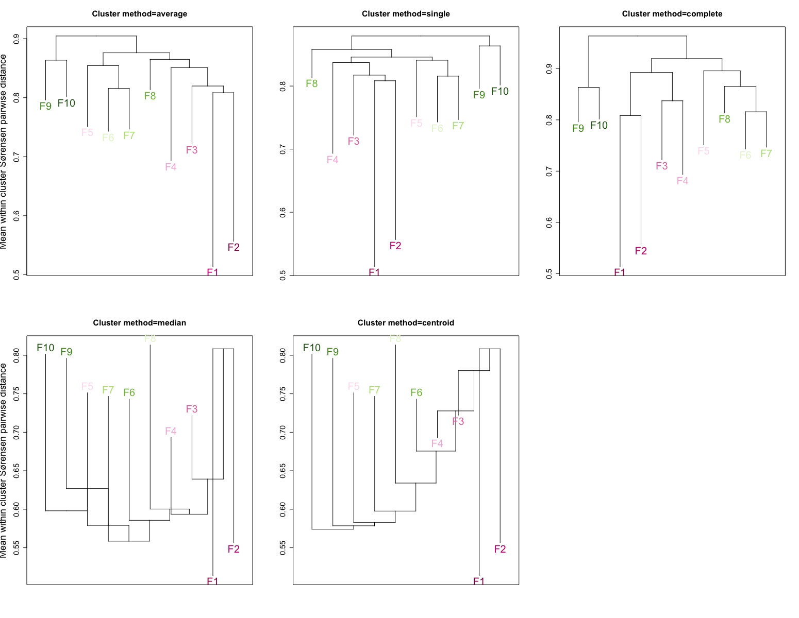
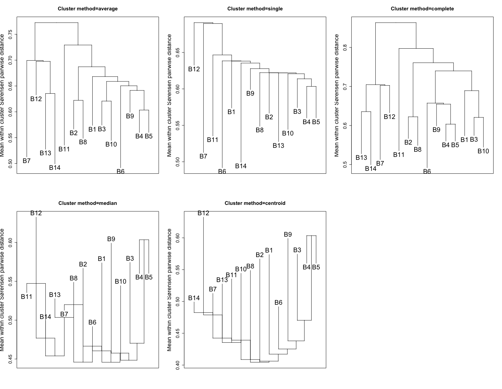

\

::: homelink
<a href="https://kellifeeser.github.io/ksu-paired-amplicon-workflow/index.html" target="_blank" style="text-align:right">Back to Home</a>
:::

\

------------------------------------------------------------------------

Document last updated: `r Sys.Date()`

------------------------------------------------------------------------

\

# Set-up {.unlisted .unnumbered .hidden}

```{r global_options, include=FALSE}
# packages
library(knitr)
# library(kableExtra)

# set up global R options
  # to list the current values of all options but better to F1
    #options()
    # easier way:
      #?options
  # to access the value of a single option
    #getOption("width")

# set up knitr global chunk options
  # See str(knitr::opts_chunk$get()) for a list of default chunk options.
#knitr::opts_chunk$set(fig.width = 8)
# knitr::opts_chunk$set(fig.path = "../figures/darksidea_plots/")
#knitr::opts_chunk$set(fig.path = "figures/taxa_plots/prefix-")

# How to use an object before it is created
  # see https://bookdown.org/yihui/rmarkdown-cookbook/load-cache.html

knitr::opts_chunk$set(echo = FALSE, warning = FALSE, message = FALSE,
                      fig.path="../docs/github_PAM_clustering_files/figure-html/",
                      cache.path = "../docs/github_PAM_clustering_files/")
opts_knit$set(eval.after = "fig.cap")
knitr::opts_chunk$set(fig.pos = '!h')
options(knitr.kable.NA = '')

## preload your R variables here ##
# variable_1 <- c("a", "b", "c")
####

```

```{r LANL-proxies, eval=T, include=FALSE}
# LANL proxies
Sys.setenv('HTTP_PROXY'='http://proxyout.lanl.gov:8080')
Sys.setenv('HTTPS_PROXY'='http://proxyout.lanl.gov:8080')
```

## load cache

```{r load-cache, include=FALSE, eval=TRUE}
# OBJECT <- if (file.exists('OBJECT.rds')) {
#   readRDS('OBJECT.rds')
# } else {
#   "The value of `OBJECT` is not available yet"
# }

# knitr::load_cache('CHUNK-NAME', 'OBJECT')


knitr::load_cache('adonis-predClus-Fun-calc', 'adonis_predClus_Fun')
knitr::load_cache('adonis-predClus-Bac-calc', 'adonis_predClus_Bac')
knitr::load_cache('calc-alpha', 'fwc_alpha')
knitr::load_cache('calc-alpha', 'bwc_alpha')
knitr::load_cache('gamma-fun-calc', 'Fun_gamma2')
knitr::load_cache('gamma-bac-calc', 'Bac_gamma2')

knitr::load_cache('mean-diss-bycluster-Fun', 'md_Fwc_self')
knitr::load_cache('mean-diss-bycluster-Fun', 'md_Fwc_clus_sor_k10.df.noself')
# knitr::load_cache('mean-diss-bycluster-Bac', 'md_Bwc_self')
# knitr::load_cache('mean-diss-bycluster-Bac', 'md_Bwc_clus_sor_k14.df.noself')

knitr::load_cache('subset-Fun-wc-byClus', 'sor.dist.list')
knitr::load_cache('subset-Bac-wc-byClus')

knitr::load_cache('calc-betadisp')
knitr::load_cache('betadisp-boxplot-Fun', 'betadisp_clus_Fun.df')
# knitr::load_cache('adonis_Fun_clus_bray')
knitr::load_cache('betadisp-aov-Fun')
# knitr::load_cache('', '')


# readin boxplots of fun taxa sig diffs
Fwc_Genus.r_otu_dat<-readRDS(file = "../processed_data/clean_rds_saves/Fwc_Genus.r_otu_dat.rds")

#SIMPER - Fun
SIMPER_Fun_wholecommunity_out<-readRDS(file = "../processed_data/Clustering/SIMPER_Fun_wholecommunity_out.rds")

Fwc_rel.clus_sor_k10<-readRDS(file = "../processed_data/Clustering/Fwc_rel.clus_sor_k10.rds")

```

## load packages

```{r load-packages, eval=T, include=F}
library("ggplot2"); packageVersion("ggplot2") #‘3.5.1’
library("vegan"); packageVersion("vegan") # # ‘2.6.10’
library("phyloseq"); packageVersion("phyloseq") #‘1.50.0’
library("scales"); packageVersion("scales") #‘1.3.0’
library("swatches"); packageVersion("swatches") #‘0.5.0’
library("ggsci"); packageVersion("ggsci") #‘3.2.0’
library("ggpubr"); packageVersion("ggpubr") #‘0.6.0’
library("viridis"); packageVersion("viridis") #‘0.6.5’
library("RColorBrewer"); packageVersion("RColorBrewer") #‘1.1.3’
library("cowplot"); packageVersion("cowplot") #‘1.1.3’
library("dplyr"); packageVersion("dplyr") #‘1.1.4’
library("plyr"); packageVersion("plyr") #‘1.8.9’
library("knitr"); packageVersion("knitr") #‘1.49’
#library("kableExtra"); packageVersion("kableExtra") #‘1.3.4’
library("DT"); packageVersion("DT") #‘0.33’
library("tidyverse"); packageVersion("tidyverse") #‘2.0.0’
library("prettydoc"); packageVersion("prettydoc") #‘0.4.1’
library("magrittr"); packageVersion("magrittr") #‘2.0.3’
library("broom"); packageVersion("broom") #‘1.0.7’
library("betapart"); packageVersion("betapart") #‘1.6’
# patch see: https://stackoverflow.com/questions/76118194/error-when-loading-kableextra-in-markdown-file-after-updating-to-r-4-3-0
# devtools::install_github("kupietz/kableExtra",force = TRUE)
library("kableExtra"); packageVersion("kableExtra") #‘1.4.0’

# library("microbiome"); packageVersion("microbiome") #‘1.22.0’

source("ksu_colors.R")
source("../../black-sheep-club/code/sheepish_scripts.R")
source("RAM_bulk_harvester.R")
```

## load rds - remove?

```{r load-pam-ord, include=FALSE,eval=F}
# pam_fwc_sor_k10 <- readRDS(file = "../processed_data/clean_rds_saves/pam/pam_fwc_sor_k10.rds")
# pam_bwc_sor_k14 <- readRDS(file = "../processed_data/clean_rds_saves/pam/pam_bwc_sor_k14.rds")

# checks
# colnames(sample_data(Fun_wholecommunity))
# 
# Fun_wholecommunity <- readRDS(file="../processed_data/clean_rds_saves/Fun_wholecommunity.rds")
# 
# Fun_wholecommunity.r<-readRDS(file = "../processed_data/clean_rds_saves/Fun_wholecommunity.r.rds")
# 
# Fun_wc_sor_k4.ord <- readRDS(file = "../processed_data/clean_rds_saves/Fun_wc_sor_k4.ord.rds")
# 
# col_clusn10 <- c("F1"="#8E0152","F2"="#C51B7D","F3"="#DE77AE","F4"="#F1B6DA",
#                  "F5"="#C5C2EA","F6"="#8DC9BB","F7"="#86C37E","F8"="#7FBC41","F9"="#4D9221","F10"="#276419")
# 
# 
# 
# Bac_wholecommunity<-readRDS(file = "../processed_data/clean_rds_saves/Bac_wholecommunity.rds")
# 
# Bac_wholecommunity.r<-readRDS(file = "../processed_data/clean_rds_saves/Bac_wholecommunity.r.rds")
# 
# Bac_wc_sor_k5.ord <- readRDS(file = "../processed_data/clean_rds_saves/Bac_wc_sor_k5.ord.rds")
# 
# col_n14 <- c("B1"="#730025","B2"="#AF0039","B3"="#E8004C","B4"="#FF65A3",
#              "B5"="#9E4D97","B6"="#4D42B3","B7"="#7678ed","B8"="#5B7898",
#              "B9"="#17A398","B10"="#74A57F","B11"="#B6AF40","B12"="#f7b801", 
#              "B13"="#f18701", "B14"="#f35b04")

# Fun_wholecommunity.r  = transform_sample_counts(Fun_wholecommunity, function(x) x / sum(x) )
# saveRDS(Fun_wholecommunity.r, file = "../processed_data/clean_rds_saves/Fun_wholecommunity.r.rds") 

# Bac_wholecommunity.r  = transform_sample_counts(Bac_wholecommunity, function(x) x / sum(x) )
# saveRDS(Bac_wholecommunity.r, file = "../processed_data/clean_rds_saves/Bac_wholecommunity.r.rds") 

# readin boxplots of fun taxa sig diffs
Fwc_Genus.r_otu_dat<-readRDS(file = "../processed_data/clean_rds_saves/Fwc_Genus.r_otu_dat.rds")

#SIMPER - Fun
SIMPER_Fun_wholecommunity_out<-readRDS(file = "../processed_data/Clustering/SIMPER_Fun_wholecommunity_out.rds")

Fwc_rel.clus_sor_k10<-readRDS(file = "../processed_data/Clustering/Fwc_rel.clus_sor_k10.rds")


```


```{r readin-phylo, include=FALSE, eval=F}
## HAS ONF BEEN FIXED TO BIN=NORTH? CHECK
# View(sample_data(Fun_wholecommunity)[sample_data(Fun_wholecommunity)$Site == "ONF", c("sample_name", "Site", "Bin")])


# with GvS labs

#######
# Bac #
#######
Bac_wholecommunityUNFIXED <- readRDS(file="../processed_data/clean_rds_saves/Bac_wholecommunity_shared.rds")
Bac_generalistsUNFIXED <- readRDS(file="../processed_data/clean_rds_saves/Bac_generalists_allgrasses_shared.rds")
  # otu_table()   OTU Table:         [ 2145 taxa and 484 samples ]
  # sample_data() Sample Data:       [ 484 samples by 57 sample variables ]
  # tax_table()   Taxonomy Table:    [ 2145 taxa by 7 taxonomic ranks ]
Bac_specialistsUNFIXED <- readRDS(file="../processed_data/clean_rds_saves/Bac_specialists_allgrasses_shared.rds")
  # otu_table()   OTU Table:         [ 5140 taxa and 484 samples ]
  # sample_data() Sample Data:       [ 484 samples by 57 sample variables ]
  # tax_table()   Taxonomy Table:    [ 5140 taxa by 7 taxonomic ranks ]

#######
# Fun #
#######
Fun_wholecommunityUNFIXED <- readRDS(file="../processed_data/clean_rds_saves/Fun_wholecommunity_shared.rds")
Fun_generalistsUNFIXED <- readRDS(file="../processed_data/clean_rds_saves/Fun_generalists_allgrasses_shared.rds")
  # otu_table()   OTU Table:         [ 896 taxa and 484 samples ]
  # sample_data() Sample Data:       [ 484 samples by 57 sample variables ]
  # tax_table()   Taxonomy Table:    [ 896 taxa by 8 taxonomic ranks ]
Fun_specialistsUNFIXED <- readRDS(file="../processed_data/clean_rds_saves/Fun_specialists_allgrasses_shared.rds")
  # otu_table()   OTU Table:         [ 1803 taxa and 484 samples ]
  # sample_data() Sample Data:       [ 484 samples by 57 sample variables ]
  # tax_table()   Taxonomy Table:    [ 1803 taxa by 8 taxonomic ranks ]
```

```{r fix-mislabeling-function, include=FALSE,eval=F}
# This function now creates a copy of the input phyloseq object and operates on the copy to update the metadata. It then returns the updated phyloseq object without modifying the original one.

fix_metadata <- function(physeq_obj) {
  # Create a copy of the input phyloseq object
  fixed_physeq_obj <- physeq_obj
  
  # Extract the sample_data dataframe
  sample_data_tofix <- sample_data(fixed_physeq_obj)
  
  # Fix the metadata based on the condition
  sample_data_tofix$Bin[sample_data_tofix$Site == "ONF" & sample_data_tofix$Bin == "South Central"] <- "North"
  
  # Assign the updated sample_data back to the phyloseq object
  sample_data(fixed_physeq_obj) <- sample_data_tofix
  
  # Return the updated phyloseq object
  return(fixed_physeq_obj)
}

# Usage:
# Replace 'Fun_wholecommunity' with your desired phyloseq object
# Updated phyloseq object will be stored in 'fixed_physeq_obj'
Fun_wholecommunity <- fix_metadata(Fun_wholecommunityUNFIXED)
Fun_generalists <- fix_metadata(Fun_generalistsUNFIXED)
Fun_specialists <- fix_metadata(Fun_specialistsUNFIXED)

Bac_wholecommunity <- fix_metadata(Bac_wholecommunityUNFIXED)
Bac_generalists <- fix_metadata(Bac_generalistsUNFIXED)
Bac_specialists <- fix_metadata(Bac_specialistsUNFIXED)

## HAS ONF BEEN FIXED TO BIN=NORTH? CHECK
# View(sample_data(Fun_wholecommunity)[sample_data(Fun_wholecommunity)$Site == "ONF", c("sample_name", "Site", "Bin")])


# change GPS 
## Site ONF should have GPS coordinates of 34.80954, -94.13184 instead of 39.80954, -94.13184

fix_metadataGPS <- function(physeq_obj) {
  # Create a copy of the input phyloseq object
  fixed_physeq_obj <- physeq_obj
  
  # Extract the sample_data dataframe
  sample_data_tofix <- sample_data(fixed_physeq_obj)
  
  # Fix the metadata based on the condition
  sample_data_tofix$Latitude[sample_data_tofix$Site == "ONF" & sample_data_tofix$Latitude == 39.80954] <- 34.80954
  
  # Assign the updated sample_data back to the phyloseq object
  sample_data(fixed_physeq_obj) <- sample_data_tofix
  
  # Return the updated phyloseq object
  return(fixed_physeq_obj)
}

# Usage:
# Replace 'Fun_wholecommunity' with your desired phyloseq object
# Updated phyloseq object will be stored in 'fixed_physeq_obj'
Fun_wholecommunityUNFIXED <- Fun_wholecommunity
Fun_wholecommunity <- fix_metadataGPS(Fun_wholecommunityUNFIXED)

## HAS ONF BEEN FIXED TO Latitude=34.80954? CHECK
# str(sample_data(Fun_wholecommunity)[sample_data(Fun_wholecommunity)$Site == "ONF", c("sample_name", "Site", "Latitude","Longitude")])

Bac_wholecommunityUNFIXED <- Bac_wholecommunity
Bac_wholecommunity <- fix_metadataGPS(Bac_wholecommunityUNFIXED)
# str(sample_data(Bac_wholecommunity)[sample_data(Bac_wholecommunity)$Site == "ONF", c("sample_name", "Site", "Latitude","Longitude")])

saveRDS(Fun_wholecommunity,file="../processed_data/clean_rds_saves/Fun_wholecommunity.rds")
saveRDS(Bac_wholecommunity,file="../processed_data/clean_rds_saves/Bac_wholecommunity.rds")

sd_GPSunfixed<-as(sample_data(Fun_wholecommunityUNFIXED),"data.frame")
```

```{r add-pam2phylo, include=FALSE,eval=F}
sample_data(Fun_wholecommunity)$clus_sor_k10 <- pam_fwc_sor_k10
sample_data(Fun_wholecommunity)$clus_sor_k10 <- as.factor(sample_data(Fun_wholecommunity)$clus_sor_k10)

# sample_data(Fun_wholecommunity)$clus_sor_k30 <- pam_fwc_sor_k30
# sample_data(Fun_wholecommunity)$clus_sor_k30 <- as.factor(sample_data(Fun_wholecommunity)$clus_sor_k30)

# are any sites split by cluster?
  # yes, BNP
# unique(sample_data(Fun_wholecommunity)$Site)
# BLM BNP CAD CNF CPR DMT FCP FMT GMT GNF HAR HPG KAE KNZ LAR LBJ NWP ONF RNF SEV SFA UHC
# View(sample_data(Fun_wholecommunity)[sample_data(Fun_wholecommunity)$Site == "CAD", c("sample_name", "Site", "Grass", "clus_sor_k10")])
```

## check metadata

```{r sampledata-check, include=FALSE,eval=FALSE}
# Bin should be north
unique(subset(sample_data(Fun_wholecommunity), Site=="ONF")$Bin)
unique(subset(sample_data(Bac_wholecommunity), Site=="ONF")$Bin)

tail(colnames(sample_data(Fun_wholecommunity)))
tail(colnames(sample_data(Bac_wholecommunity)))

```

\

------------------------------------------------------------------------

# Summary of key takeaways {.tabset .tabset-pills}

\

### *Fungal clusters* {.unnumbered}

[Unsupervised clustering]{.underline}

-   Unsupervised clustering of the fungal community data revealed 14 sub-assemblages of communities. These resultant sub-assemblages are a good representation of the data:

    -   Across the whole dataset, the fungal PAM clustering explained `r round(adonis_predClus_Fun$R2[1]*100,2)`% of the community composition, in terms of the presence/absence of OTUs (adonis2/permANOVA; $P$-value \< `r adonis_predClus_Fun[1,5]`) and `r round(adonis_Fun_clus_bray$R2[1]*100,2)`% of the abundance-weighted community composition  ($P$-value \< `r adonis_Fun_clus_bray[1,5]`)\*
    
    -   However, these sub-assemblages are a better representation of fungal community [*dispersal*]{.underline}, indicating that variability in the dispersal patterns of fungi is the primary driver in sub-assemblage differentiation. Variation in the dispersion of communities (distance to spatial median) accounted for `r round(betadisp_clus_Fun.aov$R_squared[1],2)`% of the differences observed among fungal sub-assemblages (Permutation test for homogeneity of multivariate dispersions; $P$-value \< `r betadisp_clus_Fun.aov[1,8]`).

-   Hierarchical clustering of fungal communities using Sørensen dissimilarities closely aligned with PAM clustering results, evidenced by concordance between PAM clusters and the dendrograms created using five different agglomeration methods ("average", "single", "complete", "median", and "centroid").

[𝝱-diversity]{.underline}

-   Mean dissimilarities (within-cluster variation in presence/absence of OTUs)
    -   [Clusters F1 & F2]{.underline} were the most closely related (mean diss. `r md_Fwc_clus_sor_k10.df[1,2]`) and had the lowest within-cluster average pairwise Sørensen dissimilarities (`r md_Fwc_clus_sor_k10.df[1,1]` and `r md_Fwc_clus_sor_k10.df[2,2]`, respectively).
        -   For a sample size of 183 (roughly 38% of samples), cluster F1 is a remarkably homogeneous group.
    -   [Cluster F8]{.underline} had the highest average within-cluster dissimilarity of `r md_Fwc_clus_sor_k10.df[8,8]`, indicating that it the most diverse (at least in terms of 𝝱-diversity.
    -   [Clusters F9 & F10]{.underline} had the next highest average within-cluster dissimilarities (`r md_Fwc_clus_sor_k10.df[9,9]` and `r md_Fwc_clus_sor_k10.df[10,10]`, respectively).\
-   Between-cluster variation
    -   Clusters F1 & F2 had the lowest mean between-cluster dissimilarity values of `r md_Fwc_clus_sor_k10.df[1,2]`, indicating that they were the most closely related clusters.\
    -   Clusters F6 & F10 had the high mean between-cluster dissimilarity values of `r md_Fwc_clus_sor_k10.df[6,10]`.
    -   Clusters F1 & F10: The most dissimilar cluster to F1 was F10 (F1-F10: `r md_Fwc_clus_sor_k10.df[1,10]`), i.e., of all comparisons to F1, F10 had the highest value. This lends support to anchoring the cluster numbering to F1 as the initial and F10 as the last. However, F1 is not the most dissimilar to F10. Compared to F10, the most dissimilar cluster was F6 (F6-F10: `r md_Fwc_clus_sor_k10.df[6,10]`), followed by F9 (F9-F10: `r md_Fwc_clus_sor_k10.df[9,10]`).\
-   Beta dispersion among clusters
    -   Beta dispersion did vary among clusters (distance to spatial media, ANOVA; $F$ = `r round(betadisp_clus_Fun.aov$F.statistic[1],3)`, $R^2$ =`r round((betadisp_clus_Fun.aov$R_squared[1]/100),3)`, p = `r betadisp_clus_Fun.aov$P.value[1]`).
        -   \*Note that this means that the adonis2/permANOVA results are undercut, this violates the assumption of equal variance
    -   F1 had the highest beta dispersions (mean distance to spatial media of `r round(mean(betadisp_clus_Fun.df$distances[betadisp_clus_Fun.df$Fun_sor_clusters=="F1"]),3)`), significantly higher than the global mean of `r round(mean(betadisp_clus_Fun.df$distances),3)` (KW; p \< 0.001).

[𝝰-diversity]{.underline}

-   F1 and F2 had the highest species richness values (mean of `r round(mean(fwc_alpha$Observed[fwc_alpha$Fun_sor_clusters=="F1"]),0)` and `r round(mean(fwc_alpha$Observed[fwc_alpha$Fun_sor_clusters=="F2"]),0)` observed species per community, respectively.), significantly higher than the global mean of `r round(mean(fwc_alpha$Observed),0)` (KW; p \< 0.001).

-   F1 and F2 had the highest Chao1 diversity (mean values of `r round(mean(fwc_alpha$Chao1[fwc_alpha$Fun_sor_clusters=="F1"]),1)` and `r round(mean(fwc_alpha$Chao1[fwc_alpha$Fun_sor_clusters=="F2"]),1)`, respectively), significantly high than the global mean of `r round(mean(fwc_alpha$Chao1),1)` (KW; p \< 0.001).

-   F1 and F2 had the highest inverse Simpson index values (mean $1 - D_{simpson_inv}$ values of `r round(mean(fwc_alpha$simpson_inv[fwc_alpha$Fun_sor_clusters=="F1"]),2)` and `r round(mean(fwc_alpha$simpson_inv[fwc_alpha$Fun_sor_clusters=="F2"]),2)`, respectively), significantly lower than the global mean of `r round(mean(fwc_alpha$simpson_inv),2)` (KW; p \< 0.001), again indicating that these communities had the most even distribution of OTU abundances.

-   F1 and F2 had below average Simpson evenness (mean values of `r round(mean(fwc_alpha$simpsoneven[fwc_alpha$Fun_sor_clusters=="F1"]),4)` and `r round(mean(fwc_alpha$simpsoneven[fwc_alpha$Fun_sor_clusters=="F2"]),4)`, respectively). F1 had significantly lower than the global mean of `r round(mean(fwc_alpha$simpsoneven),4)` (KW; p \< 0.001).

    -   This takes into account observed species.. and we see a diminished effect.

[𝛄-diversity]{.underline}

-   F1 the highest 𝛄-diversity (`r Fun_gamma2[1]` OTUs) out of a total species pool of 6,626 OTUs.\

[Distance-decay]{.underline}

-   Distance-decay analyses revealed that spatial structuring accounted for 1.08% of variation total fungal community dissimilarity at the (most coarse level?/least granular/across all samples...) (MRM; p \< 0.001, $F$ = 1411.974, F.p-val \< 0.001), with β~sor~ distance (in km) intercept = 3.922e-05 (?phrasing... p \< 0.001).\

#### Summary of F1 {.unnumbered}

-   highest richness, most homogeneous in terms of the evenness of OTU abundance profiles

-   ?s: what is the F1 vs. global proportion and/or distribution of Whittaker's beta?

-   [ ] <mark style="background-color:powderblue;">nestedness v turnover in global vs. F1 vs. non-F1</mark>

-   plot edaphic lengths and distributions in clusters vs global lengths

\

------------------------------------------------------------------------

\

### *Bacterial clusters* {.unnumbered}

[Unsupervised clustering]{.underline}

-   Across the whole dataset, the bacterial PAM clustering explained `r round(adonis_predClus_Bac$R2[1]*100,2)`% of the community variability, in terms of the presence/absence of OTUs (adonis2; $P$-value \< `r adonis_predClus_Bac[1,5]`).\*

-   Hierarchical clustering of bacterial communities using Sørensen dissimilarities closely aligned with PAM clustering results, evidenced by concordance between PAM clusters and the dendrograms created using five different agglomeration methods ("average", "single", "complete", "median", and "centroid").

[𝝰-diversity]{.underline}

-   B4, B10, and B11 had the highest species richness values (mean of `r round(mean(bwc_alpha$Observed[bwc_alpha$Bac_sor_clusters=="B4"]),0)` (`r round(sd(bwc_alpha$Observed[bwc_alpha$Bac_sor_clusters=="B4"]),0)`), `r round(mean(bwc_alpha$Observed[bwc_alpha$Bac_sor_clusters=="B10"]),0)` (`r round(sd(bwc_alpha$Observed[bwc_alpha$Bac_sor_clusters=="B10"]),0)`) and `r round(mean(bwc_alpha$Observed[bwc_alpha$Bac_sor_clusters=="B11"]),0)` (`r round(sd(bwc_alpha$Observed[bwc_alpha$Bac_sor_clusters=="B1"]),0)`) observed species per community, respectively.), significantly higher than the global mean of `r round(mean(bwc_alpha$Observed),0)` (wilcox.test; all p \< 0.001). B12 had the lowest species richness values (mean of `r round(mean(bwc_alpha$Observed[bwc_alpha$Bac_sor_clusters=="B12"]),0)` (`r round(sd(bwc_alpha$Observed[bwc_alpha$Bac_sor_clusters=="B12"]),0)`)).

-   B4, B10, and B11 had the highest species richness values (mean of `r round(mean(bwc_alpha$Chao1[bwc_alpha$Bac_sor_clusters=="B4"]),0)` (`r round(sd(bwc_alpha$Chao1[bwc_alpha$Bac_sor_clusters=="B4"]),0)`), `r round(mean(bwc_alpha$Chao1[bwc_alpha$Bac_sor_clusters=="B10"]),0)` (`r round(sd(bwc_alpha$Chao1[bwc_alpha$Bac_sor_clusters=="B10"]),0)`) and `r round(mean(bwc_alpha$Chao1[bwc_alpha$Bac_sor_clusters=="B11"]),0)` (`r round(sd(bwc_alpha$Chao1[bwc_alpha$Bac_sor_clusters=="B11"]),0)`) observed species per community, respectively.), significantly higher than the global mean of `r round(mean(bwc_alpha$Chao1),0)` (wilcox.test; all p \< 0.001). B12 had the lowest species richness values (mean of `r round(mean(bwc_alpha$Chao1[bwc_alpha$Bac_sor_clusters=="B12"]),0)` (`r round(sd(bwc_alpha$Chao1[bwc_alpha$Bac_sor_clusters=="B12"]),0)`)).

-   B12 had the highest dominance (mean $D_{simpson}$ values of `r round(mean(bwc_alpha$simpsonD[bwc_alpha$Bac_sor_clusters=="B12"]),3)` (`r round(sd(bwc_alpha$simpsonD[bwc_alpha$Bac_sor_clusters=="B12"]),3)`), significantly higher the global mean of `r round(mean(bwc_alpha$simpsonD),3)` (`r round(sd(bwc_alpha$simpsonD),3)`) (wilcox.test; p \< 0.001), indicating these communities were dominated by certain OTUs.

-   B4, B10, and B11 had the highest inverse Simpson index values (mean (SD) $1 - D_{simpson_inv}$ values of `r round(mean(bwc_alpha$simpson_inv[bwc_alpha$Bac_sor_clusters=="B4"]),0)` (`r round(sd(bwc_alpha$simpson_inv[bwc_alpha$Bac_sor_clusters=="B4"]),0)`), `r round(mean(bwc_alpha$simpson_inv[bwc_alpha$Bac_sor_clusters=="B10"]),0)` (`r round(sd(bwc_alpha$simpson_inv[bwc_alpha$Bac_sor_clusters=="B10"]),0)`) and `r round(mean(bwc_alpha$simpson_inv[bwc_alpha$Bac_sor_clusters=="B11"]),0)` (`r round(sd(bwc_alpha$simpson_inv[bwc_alpha$Bac_sor_clusters=="B11"]),0)`), respectively), significantly higher than the global mean of `r round(mean(bwc_alpha$simpson_inv),0)` (wilcox.test; all p \< 0.001), indicating that these communities had the most even distribution of OTU abundances. B12 had the lowest inverse Simpson index values with a mean of `r round(mean(bwc_alpha$simpson_inv[bwc_alpha$Bac_sor_clusters=="B12"]),0)` (`r round(sd(bwc_alpha$simpson_inv[bwc_alpha$Bac_sor_clusters=="B12"]),0)`)), indicating that these communities had the most uneven distribution of OTU abundances.

\

------------------------------------------------------------------------

\

# Background: PAM clustering based on Sørensen-distance matrices (Approach 1)

\

Revealing the microbial assemblage structure in the rhizosphere microbiome of North American grasslands using unsupervised clustering.

\

[A metadata agnostic approach]{.underline}

Microbiome sample clustering can be performed using either model-based methods and machine learning methods. Machine learning methods, which rely on defined distance metrics, are used more frequently than model-based statistical methods ("due to their efficient implementation and easy interpretation.")\
- I used the **partition around medoids (PAM)** clustering method, which is related to but considered more robust than K-means. In contrast to K-means, which can be sensitive to the effects of outliers, PAM's optimization goal is to minimize the sum of distances to the medoids instead of minimizing the sum of the squared distances to the cluster centers.\

::: {style="color: darkblue;"}
***Note: clustering was performed directly on distance matrices, [not]{.underline} ordinations or ordination scores.** This was done to eliminate the introduction of artifacts arising from clustering ordination scores.*
:::

\
\

------------------------------------------------------------------------

\

## Methods

\

[Approach 1:]{.underline} clustering algorithm: partition around medoids (PAM)\
distance metric: Sørensen-based dissimilarities\
\
[Approach 2:]{.underline} clustering algorithm: hierarchical clustering\
distance metric: Sørensen-based dissimilarities\
\

[in progress below]\

"In this paper, we focused on the partition around medoids (PAM) [14] clustering method, which is related to but considered more robust than K-means. In contrast to K-means, which can be sensitive to the effects of outliers, PAM's optimization goal is to minimize the sum of distances to the medoids instead of minimizing the sum of the squared distances to the cluster centers."

"We also evaluated another frequently used method for non-Euclidean metrics, hierarchical clustering with complete linkage. This method initially bundles the closest observations (with distances defined by the longest distance between any two observations in two clusters) and gradually results in a binary tree that combines the two closest clusters."\

"The choice of clustering algorithm and distance metric together determine the performance of a machine learning clustering method."\

"Due to the generally similar results between PAM and hierarchical clustering (see Fig. 2), we presented the results in our main text only using PAM." (ref: <https://link.springer.com/article/10.1186/s40168-021-01199-3>).\
\

## Clustering evaluation: Gap Statistic {.tabset .tabset-pills}

\
[Methods]{.underline}

Partitioning methods, such as PAM clustering require the number of clusters to be generated as an input value. Here we are viewing the gap statistic as calculated by the function `cluster::clusGap`(). The optimal number of clusters was specified using the "Tibs2001SEmax" method, Tibshirani et al's recommendation of determining the number of clusters from the gap statistics and their standard deviations.

`clusGap()` calculates a goodness of clustering measure, the "gap" statistic. For each number of clusters $k$, it compares $log(W(k))$ with $E∗[log(W(k))]$ where the latter is defined via bootstrapping, i.e., simulating from a reference ($H_0$) distribution, a uniform distribution on the hypercube determined by the ranges of `x`, after first centering, and then [`svd`](http://127.0.0.1:39411/help/library/cluster/help/svd) (aka 'PCA')-rotating them when (as by default) `spaceH0 = "scaledPCA"`.

The optimal number of clusters was determined using the method `"Tibs2001SEmax"`, Tibshirani et. al.'s recommendation of determining the number of clusters from the gap statistics and their standard deviations.\
\

**References**\
Tibshirani, R., Walther, G. and Hastie, T. (2001). Estimating the number of data clusters via the Gap statistic. Journal of the Royal Statistical Society B, 63, 411--423.

Tibshirani, R., Walther, G. and Hastie, T. (2000). Estimating the number of clusters in a dataset via the Gap statistic. Technical Report. Stanford.

Dudoit, S. and Fridlyand, J. (2002) A prediction-based resampling method for estimating the number of clusters in a dataset. Genome Biology 3(7). [[doi:10.1186/gb-2002-3-7-research0036\\\\](doi:10.1186/gb-2002-3-7-research0036){.uri}](%5Bdoi:10.1186/gb-2002-3-7-research0036%5D(doi:10.1186/gb-2002-3-7-research0036)%7B.uri%7D){.uri}

Per Broberg (2006). SAGx: Statistical Analysis of the GeneChip. R package version 1.9.7. <https://bioconductor.org/packages/3.12/bioc/html/SAGx.html> Deprecated and removed from Bioc ca. 2022\
\

### Fun {.unnumbered}

\
We found the optimal number of clusters for the Sørensen-based dissimilarities of the fungal communities to be 10.\

```{r plot_gs_Fun, echo=FALSE, message=T, out.height='70%'}
# ("K.max = 32, B = 25 (nboot)")
gs_fwc_sor_kmax32_b500 <- readRDS(file = "../processed_data/clean_rds_saves/gs_fwc_sor_kmax32_b500.rds")

# print(gs_fwc_sor_kmax32_b500, method = "Tibs2001SEmax")
 # --> Number of clusters (method 'Tibs2001SEmax', SE.factor=1): 10

plot(gs_fwc_sor_kmax32_b500, main = "Gap statistic for the Fun - whole communities,\nbased on Sørensen dissimilarities", cex.main=0.8)
  mtext("K.max = 32, B = 500 (nboot); --> k = 10 is best", cex=0.9)
```

\
\

------------------------------------------------------------------------

### Bac {.unnumbered}

\
We found the optimal number of clusters for the Sørensen-based dissimilarities of the bacterial communities to be 14.\

```{r plot_gs_Bac, echo=FALSE, message=T, out.height='70%'}
# ("K.max = 32, B = 25 (nboot)")
gs_bwc_sor_kmax32_b500 <- readRDS(file = "../processed_data/clean_rds_saves/gs_bwc_sor_kmax32_b500.rds")

# print(gs_bwc_sor_kmax32_b500, method = "Tibs2001SEmax")
 # --> Number of clusters (method 'Tibs2001SEmax', SE.factor=1): 14

plot(gs_bwc_sor_kmax32_b500, main = "Gap statistic for the Bac - whole communities,\nbased on Sørensen dissimilarities", cex.main=0.8)
  mtext("K.max = 32, B = 500 (nboot); --> k = 14 is best", cex=0.9)
```

\
\

------------------------------------------------------------------------

## View clustering results overlaid onto NMDS plots

\

### Sørensen-based clusters {.unnumbered .unlisted .tabset .tabset-pills}

\

#### Fun {.unnumbered .tabset}

Note the density of cluster 1 (now F1) - I'll investigate that further below. Fungal clusters have now been relabeled in an intuitive order based on decreasing mean similiarity to F1.\

```{r revalue-fun-clusters, include=FALSE,eval=FALSE}
library(plyr)

sample_data(Fun_wholecommunity)$clus_sor_k10_new <- sample_data(Fun_wholecommunity)$Fun_sor_clusters

levels(sample_data(Fun_wholecommunity)$clus_sor_k10_new)

sample_data(Fun_wholecommunity)$clus_sor_k10_new <- 
revalue(sample_data(Fun_wholecommunity)$clus_sor_k10_new, c("1" = "F1",
                                                            "2" = "F10",
                                                            "3" = "F9",
                                                            "4" = "F5",
                                                            "5" = "F8",
                                                            "6" = "F6",
                                                            "7" = "F7",
                                                            "8" = "F4",
                                                            "9" = "F2",
                                                            "10" = "F3"))

levels(sample_data(Fun_wholecommunity)$clus_sor_k10_new)
levels(sample_data(Fun_wholecommunity)$Fun_sor_clusters)

sample_data(Fun_wholecommunity)$clus_sor_k10_new <- factor(sample_data(Fun_wholecommunity)$clus_sor_k10_new, levels = c("F1","F2","F3","F4","F5","F6","F7","F8","F9","F10"))

saveRDS(Fun_wholecommunity,file="../processed_data/clean_rds_saves/Fun_wholecommunity.rds")
```

##### All samples (labeled by cluster) {.unnumbered .unlisted}

(ref:Fun-NMDS-Sor-PAM-all-fig-caption) NMDS plot showing variation in the presence/absence-based composition of root-associated fungi in relation to PAM cluster designations. NMDS plot based on Sørensen dissimilarities: k = 4, 2-dimensional stress = `r round(Fun_wc_sor_k4.ord$stress,3)`, non-metric fit R^2^ = 0.985, linear fit R^2^ = 0.908.

```{r, echo=FALSE,eval=TRUE, out.height="90%",fig.cap='(ref:Fun-NMDS-Sor-PAM-all-fig-caption)'}
# col_n10 <- c("#8E0152","#C51B7D","#DE77AE","#F1B6DA","#C5C2EA","#8DC9BB","#86C37E","#7FBC41","#4D9221","#276419")


plot_ordination(Fun_wholecommunity, Fun_wc_sor_k4.ord, color = "Fun_sor_clusters") +
  geom_text(mapping = aes(label = Fun_sor_clusters), size = 4, vjust = 1.1, show.legend = F) +
  scale_color_manual(values = col_n10, name = "Sørensen clusters",
                     guide = guide_legend(ncol = 2))+
  geom_point(size = 0.3, alpha = 0.7) +
  guides(color = guide_legend(override.aes = list(size = 4), ncol=2)) +
  ggtitle("", subtitle = "ITS - Sørensen dissim. clusters based on PAM (k = 10)") +
  theme_bw() +
  theme(legend.position="right",
    axis.text = element_text(color="black", size=10),
    axis.title = element_text(color="black", size=12),
    legend.text = element_text(color="black", size=8),legend.title = element_text(color="black", size=10),
    plot.background = element_blank(),panel.border = element_rect(colour = "black", fill=NA, linewidth=.75),
    panel.grid.major = element_blank(),panel.grid.minor = element_blank(),panel.background = element_blank())
```

\

##### All samples (labeled by Site) {.unnumbered .unlisted}

```{r, echo=FALSE,eval=TRUE}
plot_ordination(Fun_wholecommunity, Fun_wc_sor_k4.ord, color = "clus_sor_k10_new") +
  geom_text(mapping = aes(label = Site), size = 3, vjust = 1.25, show.legend = F) +
  scale_color_manual(values = col_n10, name = "Sørensen clusters",guide = guide_legend(ncol = 2))+
  geom_point(size = 0.3, alpha = 0.7) +
  guides(color = guide_legend(override.aes = list(size = 4), ncol=2)) +
  ggtitle("", subtitle = "ITS - k=4, Sørensen diss clusters based on pam (k = 10)") +
  theme_bw() +
  theme(legend.position="right",
    axis.text = element_text(color="black", size=10),
    axis.title = element_text(color="black", size=12),
    legend.text = element_text(color="black", size=8),legend.title = element_text(color="black", size=10),
    plot.background = element_blank(),panel.border = element_rect(colour = "black", fill=NA, linewidth=.75),
    panel.grid.major = element_blank(),panel.grid.minor = element_blank(),panel.background = element_blank())
```

\

##### Facet by Lat {.unnumbered .unlisted}

```{r, echo=FALSE,eval=TRUE}
plot_ordination(Fun_wholecommunity, Fun_wc_sor_k4.ord, color = "Fun_sor_clusters") +
  geom_text(mapping = aes(label = Site), size = 3, vjust = 1.25, show.legend = F) +
  scale_color_manual(values = col_n10, name = "Sørensen clusters") +
  geom_point(size = 0.3, alpha = 0.7) +
  guides(color = guide_legend(override.aes = list(size = 4), ncol=2)) +
  facet_wrap(.~Bin, scales = "free") +
  labs(y="") +
  ggtitle("", subtitle = "ITS - k=4, Sørensen diss clusters based on pam (k = 10)") +
  theme_bw() +
  theme(legend.position="right",
    axis.text = element_text(color="black", size=10),axis.title = element_text(color="black", size=12),
    legend.text = element_text(color="black", size=8),legend.title = element_text(color="black", size=10),
    plot.background = element_blank(),panel.border = element_rect(colour = "black", fill=NA, linewidth=.75),
    panel.grid.major = element_blank(),panel.grid.minor = element_blank(),panel.background = element_blank())
```

\

##### Facet by Long {.unnumbered .unlisted}

```{r, echo=FALSE,eval=TRUE}
plot_ordination(Fun_wholecommunity, Fun_wc_sor_k4.ord, color = "Fun_sor_clusters") +
  geom_text(mapping = aes(label = Site), size = 3, vjust = 1.25, show.legend = F) +
  scale_color_manual(values = col_n10, name = "Sørensen clusters") +
  geom_point(size = 0.3, alpha = 0.7) +
  guides(color = guide_legend(override.aes = list(size = 4), ncol=1)) +
  facet_wrap(.~Gradient, scales = "free") +
  labs(y="") +
  ggtitle("", subtitle = "ITS - k=4, Sørensen diss clusters based on pam (k = 10)") +
  theme_bw() +
  theme(legend.position="right",
    axis.text = element_text(color="black", size=10),
    axis.title = element_text(color="black", size=12),
    legend.text = element_text(color="black", size=8),legend.title = element_text(color="black", size=10),
    plot.background = element_blank(),panel.border = element_rect(colour = "black", fill=NA, linewidth=.75),
    panel.grid.major = element_blank(),panel.grid.minor = element_blank(),panel.background = element_blank())
```

\

##### Facet by Cluster, color Site {.unnumbered .unlisted}

We do see clusters with only 1 site and others with multiple sites.\

    - F2 has only Site = SFA, and all SFA site samples are exclusive to F3\

    - F3 has only Site = KAE, however 3 KAE site samples belong to other clusters (F4, F7, F9 - all 3 were BUDA grass samples, but the other 9 BUDA samples clustered with F3) \
    
    - F4 is mostly site LAR (and all LAR site samples are exclusive to F4) and 2 samples from 2 other sites: 1 from KAE and 1 from FCP. Those 2 samples were both BUDA, however no BUDA grasses were present at LAR.
    
    - F5 has samples from 5 sites, (BNP - all BOGR, n=2; CPR - all BOER, n=11; DMT - SCSC, n=1; FCP & HPG - all BOGR, n=1 & 2, respectively). \
    
    - F6 was mostly KNZ samples (25/32 samples in cluster)
        - KNZ was exclusive to F6 and F7. In F6, KNZ had 10 ANGE grass samples (of 11, the other is in F7), 3 BOGR (of 9, the others are in F7), 1 BUDA (of 11, the others are in F7), and all of the 11 SCSC samples (of 11). \
      
    - F7 was mostly KNZ (n=17), HAR (n=13), and FCP (n=7). 1 KAE BUDA sample also clustered with F7.
        - By Grass
            - 13 (of 38) samples were from BOGR grasses at sites FCP, HAR, and KNZ.\
            - 21 (of 38) samples were from BUDA grasses at sites FCP, HAR, and KNZ.\
            - 3 (of 38) samples were from SCSC grasses, all at site FCP.\
            - 1 (of 38) sample was from ANGE grasses at site KNZ\
        - Site-by-grass exclusivity
            - 9 of 10 BUDA samlpes from site HAR were in F7 (1 other was in F9)
            - 4 of 6 BOGR samlpes from site HAR were in F7 (1 other was in F8 and F9)\
            - 10 of 11 BUDA samlpes from site KNZ were in F7 (1 other was in F6)
            - 6 of 9 BOGR samlpes from site KNZ were in F7 (3 others were in F6)
            - 1 of 11 ANGE samlpes from site KNZ were in F7 (all 10 others were in F6)\
            - 1 of 12 BUDA samlpes from site FCP were in F7 (1 other was in F4 and F8, 9 were in F9)
            - 3 of 4 BOGR samlpes from site FCP were in F7 (1 other was in F5)
            - 3 of 11 SCSC samlpes from site FCP were in F7 (all 8 others were in F9)
            
    - F8 was mostly ANGE and SCSC grasses (18 and 32 of 53 samples, respectively). 2 BOGR (from HAR and HPG) and 1 BUDA (FCP) samples were also in this cluster. This cluster was comprised primarily of sites HAR (n=22), CAD (n=15), DMT (n=7), DMT (n=7), and 1 sample each from FCP and HPG.
        - KNZ was exclusive to F6 and F7. In F6, KNZ had 10 ANGE grass samples (of 11, the other is in F7), 3 BOGR (of 9, the others are in F7), 1 BUDA (of 11, the others are in F7), and all of the 11 SCSC samples (of 11). \

All ANGE and SCSC grasses at site HAR were exclusive to F8
8 of 11 CAD ANGE were in F8 (all 3 others were in F6)
7 of 10 CAD SCSC were in F8 (all 3 others were in F6)

```{r, echo=FALSE,eval=T, fig.height=8,out.width="75%"}
plot_ordination(Fun_wholecommunity, Fun_wc_sor_k4.ord, color = "Site") +
  geom_text(mapping = aes(label = Site), size = 4, vjust = 1.25, show.legend = F) +
  scale_color_manual(values = latlong_cols, name = "Site",guide = guide_legend(nrow = 2, byrow = F))+
  guides(color = guide_legend(override.aes = list(size = 4), nrow = 2, byrow = F)) +
  geom_point(size = 1, alpha = 0.8) +
  # facet_grid(vars(Fun_sor_clusters), scales = "free") +
  facet_wrap(.~Fun_sor_clusters, scales = "free", ncol = 3) +
  labs(y="") +
  ggtitle("", subtitle = "ITS - k=4, Sørensen diss clusters based on pam (k = 10)") +
  theme_bw() +
  theme(legend.position="bottom",
    axis.text = element_text(color="black", size=10),
    axis.title = element_text(color="black", size=12),
    strip.background = NULL,
    strip.text = element_text(color="black", size=11),
    legend.text = element_text(color="black", size=10),
    plot.background = element_blank(),panel.border = element_rect(colour = "black", fill=NA, linewidth=.75),
    panel.grid.major = element_blank(),panel.grid.minor = element_blank(),panel.background = element_blank())
```

\
\

------------------------------------------------------------------------

\

#### Bac {.unnumbered .tabset}

\

```{r revalue-Bac-clusters, include=FALSE,eval=FALSE}
library(plyr)

# sample_data(Bac_wholecommunity)$Bac_sor_clusters <- sample_data(Bac_wholecommunity)$bac_clus_sor_k10_og

levels(sample_data(Bac_wholecommunity)$bac_clus_sor_k10_og)

sample_data(Bac_wholecommunity)$Bac_sor_clusters <- 
revalue(sample_data(Bac_wholecommunity)$bac_clus_sor_k10_og, c("1" = "B1",
                                                            "2" = "B2",
                                                            "3" = "B3",
                                                            "4" = "B4",
                                                            "5" = "B5",
                                                            "6" = "B6",
                                                            "7" = "B7",
                                                            "8" = "B8",
                                                            "9" = "B9",
                                                            "10" = "B10",
                                                            "11" = "B11",
                                                            "12" = "B12",
                                                            "13" = "B13",
                                                            "14" = "B14"))

levels(sample_data(Bac_wholecommunity)$bac_clus_sor_k10_og)
levels(sample_data(Bac_wholecommunity)$Bac_sor_clusters)

# sample_data(Bac_wholecommunity)$bac_clus_sor_k10_og <- factor(sample_data(Bac_wholecommunity)$bac_clus_sor_k10_og, levels = c("B1","B2","B3","B4","B5","B6","B7","B8","B9","B10"))

sample_data(Fun_wholecommunity)$Fun_sor_clus2 <- 
revalue(sample_data(Fun_wholecommunity)$Fun_sor_clusters, c("F1" = "F1",
                                                            "F2" = "non-F1",
                                                            "F3" = "non-F1",
                                                            "F4" = "non-F1",
                                                            "F5" = "non-F1",
                                                            "F6" = "non-F1",
                                                            "F7" = "non-F1",
                                                            "F8" = "non-F1",
                                                            "F9" = "non-F1",
                                                            "F10" = "non-F1"))

levels(sample_data(Fun_wholecommunity)$Fun_sor_clus2)


sample_data(Bac_wholecommunity)$Fun_sor_clus2 <- as.factor(sample_data(Fun_wholecommunity)$Fun_sor_clus2)


saveRDS(Bac_wholecommunity,file="../processed_data/clean_rds_saves/Bac_wholecommunity.rds")

# add bac pam to fun sd
sample_data(Fun_wholecommunity)$Bac_sor_clusters <- as.factor(sample_data(Bac_wholecommunity)$Bac_sor_clusters)
tail(colnames(sample_data(Fun_wholecommunity)))
tail(colnames(sample_data(Bac_wholecommunity)))

saveRDS(Fun_wholecommunity,file="../processed_data/clean_rds_saves/Fun_wholecommunity.rds")

```

##### All samples (labeled by cluster) {.unnumbered .unlisted}

(ref:Bac-NMDS-Sor-PAM-all-fig-caption) NMDS plot showing variation in the presence/absence-based composition of root-associated fungi in relation to PAM cluster designations. NMDS plot based on Sørensen dissimilarities: k = 5, 2-dimensional stress = 0.055, non-metric fit R^2^ = 0.997, linear fit R^2^ = 0.981.

```{r, echo=FALSE,eval=TRUE, out.height="90%",fig.cap='(ref:Bac-NMDS-Sor-PAM-all-fig-caption)'}
# col_n10 <- c("#8E0152","#C51B7D","#DE77AE","#F1B6DA","#C5C2EA","#8DC9BB","#86C37E","#7FBC41","#4D9221","#276419")
# "#FEC9F1", "#FA4C8E", "#", "#29235F","#3D348B","#758FB6",

plot_ordination(Bac_wholecommunity, Bac_wc_sor_k5.ord, color = "Bac_sor_clusters") +
  geom_text(mapping = aes(label = Bac_sor_clusters), size = 3, vjust = 1.1, show.legend = F) +
  scale_color_manual(values = col_n14, name = "Sørensen clusters",
                     guide = guide_legend(ncol = 2,
                                          override.aes = list(size = 4)))+
 geom_point(size = 0.1, alpha = 0.5) +
  ggtitle("", subtitle = "16S - Sørensen dissim. clusters based on PAM (k = 14)") +
  theme_bw() +
  theme(legend.position="right",
    axis.text = element_text(color="black", size=10),
    axis.title = element_text(color="black", size=12),
    legend.text = element_text(color="black", size=8),legend.title = element_text(color="black", size=10),
    plot.background = element_blank(),panel.border = element_rect(colour = "black", fill=NA, linewidth=.75),
    panel.grid.major = element_blank(),panel.grid.minor = element_blank(),panel.background = element_blank())
```

\

##### All samples (labeled by Site) {.unnumbered .unlisted}

```{r, echo=FALSE,eval=TRUE}
plot_ordination(Bac_wholecommunity, Bac_wc_sor_k5.ord, color = "Bac_sor_clusters") +
  geom_text(mapping = aes(label = Site), size = 3, vjust = 1.25, show.legend = F) +
  scale_color_manual(values = col_n14, name = "Sørensen clusters",guide = guide_legend(ncol = 2))+
  geom_point(size = 1.5, alpha = 0.8) +
  # labs(y="") +
  ggtitle("", subtitle = "16S - k=5, Sørensen diss clusters based on PAM (k = 14)") +
  theme_bw() +
  theme(legend.position="right",
    axis.text = element_text(color="black", size=10),
    axis.title = element_text(color="black", size=12),
    legend.text = element_text(color="black", size=8),legend.title = element_text(color="black", size=10),
    plot.background = element_blank(),panel.border = element_rect(colour = "black", fill=NA, linewidth=.75),
    panel.grid.major = element_blank(),panel.grid.minor = element_blank(),panel.background = element_blank())
```

\

##### Facet by Lat {.unnumbered .unlisted}

```{r, echo=FALSE,eval=TRUE}
plot_ordination(Bac_wholecommunity, Bac_wc_sor_k5.ord, color = "Bac_sor_clusters") +
  geom_text(mapping = aes(label = Site), size = 3, vjust = 1.25, show.legend = F) +
  scale_color_manual(values = col_n14, name = "Sørensen clusters",guide = guide_legend(ncol = 2))+
  geom_point(size = 1.5, alpha = 0.8) +
  facet_wrap(.~Bin, scales = "free") +
  labs(y="") +
  ggtitle("", subtitle = "16S - k=5, Sørensen diss clusters based on pam (k = 14)") +
  theme_bw() +
  theme(legend.position="right",
    axis.text = element_text(color="black", size=10),axis.title = element_text(color="black", size=12),
    legend.text = element_text(color="black", size=8),legend.title = element_text(color="black", size=10),
    plot.background = element_blank(),panel.border = element_rect(colour = "black", fill=NA, linewidth=.75),
    panel.grid.major = element_blank(),panel.grid.minor = element_blank(),panel.background = element_blank())
```

\

##### Facet by Long {.unnumbered .unlisted}

```{r, echo=FALSE,eval=TRUE}
plot_ordination(Bac_wholecommunity, Bac_wc_sor_k5.ord, color = "Bac_sor_clusters") +
  geom_text(mapping = aes(label = Site), size = 3, vjust = 1.25, show.legend = F) +
  scale_color_manual(values = col_n14, name = "Sørensen clusters",guide = guide_legend(ncol = 2))+
  geom_point(size = 1.5, alpha = 0.8) +
  facet_wrap(.~Gradient, scales = "free") +
  labs(y="") +
  ggtitle("", subtitle = "16S - k=5, Sørensen diss clusters based on PAM (k = 14)") +
  theme_bw() +
  theme(legend.position="right",
    axis.text = element_text(color="black", size=10),
    axis.title = element_text(color="black", size=12),
    legend.text = element_text(color="black", size=8),legend.title = element_text(color="black", size=10),
    plot.background = element_blank(),panel.border = element_rect(colour = "black", fill=NA, linewidth=.75),
    panel.grid.major = element_blank(),panel.grid.minor = element_blank(),panel.background = element_blank())
```

\

##### Facet by Cluster, color Site {.unnumbered .unlisted}

We do see some clusters with only 1 site and others with multiple sites.\

    - B6: only site CNF (n=12, all SCSC). The remainng samples from CNF clustered in B2 (4 BOER and 11 BOER)

    - B7: Site CPR samples clustered only in B7 (n=11, all BOER). B7 was also comprised of an additional sample from site DMT (SCSC). \

    - B13: Site NWP samples clustered only in B13 (n=20, 10 ANGE and 10 SCSC). B13 was also comprised of an additional sample from site KAE (SCSC). \

    - B14: B14 was comprised of only site ONF samples (n=20, 9 ANGE and 11 SCSC). Site ONF samples clustered mainly in B14 (20 of 22 samples), however 2 of the 12 SCSC clustered with other groups (1 each in B9 and B10). \

```{r, echo=FALSE,eval=T, fig.height=10,out.width="75%"}
plot_ordination(Bac_wholecommunity, Bac_wc_sor_k5.ord, color = "Site") +
  geom_text(mapping = aes(label = Site), size = 3, vjust = 1.25) +
  scale_color_manual(values = latlong_cols, name = "Site",guide = guide_legend(nrow = 2, byrow = F))+
  geom_point(size = 1.5, alpha = 0.8) +
  # facet_grid(vars(Bac_sor_clusters), scales = "free") +
  facet_wrap(.~Bac_sor_clusters, scales = "free", ncol = 3) +
  labs(y="") +
  ggtitle("", subtitle = "16S - k=5, Sørensen diss clusters based on PAM (k = 14)") +
  theme_bw() +
  theme(legend.position="bottom",
    axis.text = element_text(color="black", size=10),
    axis.title = element_text(color="black", size=12),
    strip.background = NULL,
    strip.text = element_text(color="black", size=11),
    legend.text = element_text(color="black", size=10),
    plot.background = element_blank(),panel.border = element_rect(colour = "black", fill=NA, linewidth=.75),
    panel.grid.major = element_blank(),panel.grid.minor = element_blank(),panel.background = element_blank())
```

\
\

#### TO_DO: FACET BY FUN_SOR_CLUS2 - Bac clus on Fun ord {.unnumbered .tabset}

B12 <-> F3

```{r}
plot_ordination(Fun_wholecommunity, Fun_wc_sor_k4.ord, color = "Bac_sor_clusters") +
  scale_color_manual(values = col_n14, name = "Bac Sørensen clusters",guide = guide_legend(ncol = 2, override.aes = list(size=4)))+
  geom_point(size = 0.4, alpha = 0.7) +
  geom_text(mapping = aes(label = Fun_sor_clusters), size = 4, vjust = 1.1, show.legend = F) +
  ggtitle("ITS - Sørensen dissim. clusters based on PAM (k = 10)", subtitle = "Fungal communities (labeled) colored by corresponding bacterial cluster") +
  theme_bw() +
  theme(legend.position="right",
    axis.text = element_text(color="black", size=10),
    axis.title = element_text(color="black", size=12),
    legend.text = element_text(color="black", size=8),legend.title = element_text(color="black", size=10),
    plot.background = element_blank(),panel.border = element_rect(colour = "black", fill=NA, linewidth=.75),
    panel.grid.major = element_blank(),panel.grid.minor = element_blank(),panel.background = element_blank())
```

\
\

#### Fun clus on Bac ord {.unnumbered .tabset}

F5 <-> B7

```{r}
plot_ordination(Bac_wholecommunity, Bac_wc_sor_k5.ord, color = "Fun_sor_clusters") +
  scale_color_manual(values = col_n10, name = "Fun Sørensen clusters",guide = guide_legend(ncol = 2, override.aes = list(size=4)))+
  geom_point(size = 0.4, alpha = 0.7) +
  geom_text(mapping = aes(label = Bac_sor_clusters), size = 4, vjust = 1.1, show.legend = F) +
  ggtitle("16S - Sørensen dissim. clusters based on PAM (k = 14)", subtitle = "Bacterial communities (labeled) colored by corresponding fungal cluster") +
  theme_bw() +
  theme(legend.position="right",
    axis.text = element_text(color="black", size=10),
    axis.title = element_text(color="black", size=12),
    legend.text = element_text(color="black", size=8),legend.title = element_text(color="black", size=10),
    plot.background = element_blank(),panel.border = element_rect(colour = "black", fill=NA, linewidth=.75),
    panel.grid.major = element_blank(),panel.grid.minor = element_blank(),panel.background = element_blank())

plot_ordination(Bac_wholecommunity, Bac_wc_sor_k5.ord, color = "Fun_sor_clus2") +
  scale_color_manual(values = c("F1"="#8E0152","non-F1"="#86C37E"), name = "Fun Sørensen clusters",guide = guide_legend(ncol = 1))+
  geom_point(size = 0.4, alpha = 0.7) +
  geom_text(mapping = aes(label = Bac_sor_clusters), size = 4, vjust = 1.1, show.legend = F) +
  ggtitle("16S - Sørensen dissim. clusters based on PAM (k = 14)", subtitle = "Bacterial communities (labeled) colored by corresponding fungal cluster") +
  theme_bw() +
  theme(legend.position="right",
    axis.text = element_text(color="black", size=10),
    axis.title = element_text(color="black", size=12),
    legend.text = element_text(color="black", size=8),legend.title = element_text(color="black", size=10),
    plot.background = element_blank(),panel.border = element_rect(colour = "black", fill=NA, linewidth=.75),
    panel.grid.major = element_blank(),panel.grid.minor = element_blank(),panel.background = element_blank())
```

\
\

------------------------------------------------------------------------

#  {.unnumbered .unlisted}

------------------------------------------------------------------------

\

# Explanatory power of metadata - adonis2(. \~ metadata, strata = clusters)

\

## Explanatory power of cluster designations {.tabset .tabset-pills}

```{r attempted-auto-adonis2, eval=F, include=F}
comm.names.by.domain<-c("Fun_wholecommunity","Bac_wholecommunity")

sor.dist.list<-list()

sor.dist.list$Fun_wholecommunity <- betapart_results[["Fun"]][["all"]][["pairwise"]]$beta.sor
sor.dist.list$Bac_wholecommunity <- betapart_results[["Bac"]][["all"]][["pairwise"]]$beta.sor

sample_data(Fun_wholecommunity)$Fun_sor_clusters <- sample_data(Fun_wholecommunity)$clus_sor_k10_new

# create container array (dim = c(nrow, ncol, n_df))
adonis.out_predClus.list = vector("list", length = length(comm.names.by.domain))

for (comm in comm.names.by.domain) {
  adonis.temp_predClus <- adonis2(sor.dist.list[[comm]] ~ Fun_sor_clusters, 
          data = (as(sample_data(get(comm)), "data.frame")))
  
  adonis.temp_predClus$comm <- comm 
  
  adonis.out_predClus.list[[comm]] <- (as.data.frame(adonis.temp_predClus))

  }

adonis.out.array_predClus = do.call(rbind, adonis.out_predClus.list)

adonis.temp_predclus$Fun_wholecommunity <- Fun_wholecommunity

adonis.out_predclus.list[[Fun_wholecommunity]] <- (as.data.frame(adonis.temp_predclus))

knitr::kable((as.data.frame(subset(adonis.out.array_predClus, 
                    comm==comm.names.by.grass[1])))[,1:5], "simple", 
             digits =c (0,1,3,2,3), 
             align = 'c')

knitr::kable((as.data.frame(subset(adonis.out.array_predClus, 
                    comm==comm.names.by.grass[2])))[,1:5], "simple", 
             digits =c (0,1,3,2,3), 
             align = 'c')
```

\
Caveat: PERMANOVA often produces significant p-values testing PAM clustering. "This is because PERMANOVA takes the group labels as known, and tests the null hypothesis that both the centroids and dispersion are the same across groups. There may be evidence to reject this null even in settings where the groups overlap substantially." (cite: Shi 2022)\

### Fun {.unnumbered .unlisted}

\

```{r adonis-predClus-Fun-calc, echo=F, cache=TRUE,eval=TRUE,cache.path="../docs/github_PAM_clustering_files/"}
# sample_data(Fun_wholecommunity)$Fun_sor_clusters <- sample_data(Fun_wholecommunity)$clus_sor_k10_new

adonis_predClus_Fun <- adonis2(beta.pair(decostand(phylo2vegan_OTU(Fun_wholecommunity), method = "pa"), index.family = "sorensen")$beta.sor ~ Fun_sor_clusters, 
          data = (as(sample_data(Fun_wholecommunity), "data.frame")))

# library(kableExtra)

knitr::kable((as.data.frame(adonis_predClus_Fun)[,1:5]), "simple", 
             digits =c (0,1,3,2,3), 
             align = 'c')
```

\

[*Key takeaway:*]{.underline}\

-   Across the whole dataset, the fungal clustering explained `r round(adonis_predClus_Fun$R2[1]*100,2)`% of the community variability, in terms of the presence/absence of OTUs (adonis2; $P$-value \< `r adonis_predClus_Fun[1,5]`).\
    \
    \

### Bac {.unnumbered .unlisted}

\

```{r adonis-predClus-Bac-calc, echo=F, cache=TRUE,eval=TRUE, cache.path="../docs/github_PAM_clustering_files/"}
adonis_predClus_Bac <- adonis2(beta.pair(decostand(phylo2vegan_OTU(Bac_wholecommunity), method = "pa"), index.family = "sorensen")$beta.sor ~ Bac_sor_clusters, 
          data = (as(sample_data(Bac_wholecommunity), "data.frame")))

# library(kableExtra)

knitr::kable((as.data.frame(adonis_predClus_Bac)[,1:5]), "simple", 
             digits =c (0,1,3,2,3), 
             align = 'c')
```

\

[*Key takeaway:*]{.underline}\

-   Across the whole dataset, the bacterial clustering explained `r # round(adonis_predClus_Bac$R2[1]*100,2)`% of the community variability, in terms of the presence/absence of OTUs (adonis2; $P$-value \< `r # adonis_predClus_Bac[1,5]`).\
    \
    \

## Explanatory power of metadata globally and within clusters {.tabset .tabset-pills}

\

### Fun {.unnumbered .unlisted .tabset}

\
Note that in fungal cluster "F2" there were only 10 samples (all site=SFA, grass=SCSC), and because environmental data was measured on a pooled site-by-grass bases, no underlying variability exists to perform stats on.\

```{r subset-Fun-wc-byClus, include=FALSE,eval=T,cache=TRUE, cache.path="../docs/github_PAM_clustering_files/"}
sor.dist.list<-list()

#### Fun ####
sor.dist.list$Fun_wholecommunity<-beta.pair(decostand(phylo2vegan_OTU(Fun_wholecommunity), method = "pa"), index.family = "sorensen")$beta.sor

Fun_wc_F1 <- subset_samples(Fun_wholecommunity, Fun_sor_clusters=="F1") 
Fun_wc_F1 <- prune_taxa(taxa_sums(Fun_wc_F1) > 0, Fun_wc_F1) 
sor.dist.list$Fun_wc_F1<-beta.pair(decostand(phylo2vegan_OTU(Fun_wc_F1), method = "pa"), index.family = "sorensen")$beta.sor

Fun_wc_F2 <- subset_samples(Fun_wholecommunity, Fun_sor_clusters=="F2") 
Fun_wc_F2 <- prune_taxa(taxa_sums(Fun_wc_F2) > 0, Fun_wc_F2) 
sor.dist.list$Fun_wc_F2<-beta.pair(decostand(phylo2vegan_OTU(Fun_wc_F2), method = "pa"), index.family = "sorensen")$beta.sor

Fun_wc_F3 <- subset_samples(Fun_wholecommunity, Fun_sor_clusters=="F3") 
Fun_wc_F3 <- prune_taxa(taxa_sums(Fun_wc_F3) > 0, Fun_wc_F3) 
sor.dist.list$Fun_wc_F3<-beta.pair(decostand(phylo2vegan_OTU(Fun_wc_F3), method = "pa"), index.family = "sorensen")$beta.sor

Fun_wc_F4 <- subset_samples(Fun_wholecommunity, Fun_sor_clusters=="F4") 
Fun_wc_F4 <- prune_taxa(taxa_sums(Fun_wc_F4) > 0, Fun_wc_F4) 
sor.dist.list$Fun_wc_F4<-beta.pair(decostand(phylo2vegan_OTU(Fun_wc_F4), method = "pa"), index.family = "sorensen")$beta.sor

Fun_wc_F5 <- subset_samples(Fun_wholecommunity, Fun_sor_clusters=="F5") 
Fun_wc_F5 <- prune_taxa(taxa_sums(Fun_wc_F5) > 0, Fun_wc_F5) 
sor.dist.list$Fun_wc_F5<-beta.pair(decostand(phylo2vegan_OTU(Fun_wc_F5), method = "pa"), index.family = "sorensen")$beta.sor

Fun_wc_F6 <- subset_samples(Fun_wholecommunity, Fun_sor_clusters=="F6") 
Fun_wc_F6 <- prune_taxa(taxa_sums(Fun_wc_F6) > 0, Fun_wc_F6) 
sor.dist.list$Fun_wc_F6<-beta.pair(decostand(phylo2vegan_OTU(Fun_wc_F6), method = "pa"), index.family = "sorensen")$beta.sor

Fun_wc_F7 <- subset_samples(Fun_wholecommunity, Fun_sor_clusters=="F7") 
Fun_wc_F7 <- prune_taxa(taxa_sums(Fun_wc_F7) > 0, Fun_wc_F7) 
sor.dist.list$Fun_wc_F7<-beta.pair(decostand(phylo2vegan_OTU(Fun_wc_F7), method = "pa"), index.family = "sorensen")$beta.sor

Fun_wc_F8 <- subset_samples(Fun_wholecommunity, Fun_sor_clusters=="F8") 
Fun_wc_F8 <- prune_taxa(taxa_sums(Fun_wc_F8) > 0, Fun_wc_F8) 
sor.dist.list$Fun_wc_F8<-beta.pair(decostand(phylo2vegan_OTU(Fun_wc_F8), method = "pa"), index.family = "sorensen")$beta.sor

Fun_wc_F9 <- subset_samples(Fun_wholecommunity, Fun_sor_clusters=="F9") 
Fun_wc_F9 <- prune_taxa(taxa_sums(Fun_wc_F9) > 0, Fun_wc_F9) 
sor.dist.list$Fun_wc_F9<-beta.pair(decostand(phylo2vegan_OTU(Fun_wc_F9), method = "pa"), index.family = "sorensen")$beta.sor

Fun_wc_F10 <- subset_samples(Fun_wholecommunity, Fun_sor_clusters=="F10") 
Fun_wc_F10 <- prune_taxa(taxa_sums(Fun_wc_F10) > 0, Fun_wc_F10) 
sor.dist.list$Fun_wc_F10<-beta.pair(decostand(phylo2vegan_OTU(Fun_wc_F10), method = "pa"), index.family = "sorensen")$beta.sor

#### Fun ####


#### Bac ####
sor.dist.list$Bac_wholecommunity<-beta.pair(decostand(phylo2vegan_OTU(Bac_wholecommunity), method = "pa"), index.family = "sorensen")$beta.sor

Bac_wc_B1 <- subset_samples(Bac_wholecommunity, Bac_sor_clusters=="B1") 
Bac_wc_B1 <- prune_taxa(taxa_sums(Bac_wc_B1) > 0, Bac_wc_B1) 
sor.dist.list$Bac_wc_B1<-beta.pair(decostand(phylo2vegan_OTU(Bac_wc_B1), method = "pa"), index.family = "sorensen")$beta.sor

Bac_wc_B2 <- subset_samples(Bac_wholecommunity, Bac_sor_clusters=="B2") 
Bac_wc_B2 <- prune_taxa(taxa_sums(Bac_wc_B2) > 0, Bac_wc_B2) 
sor.dist.list$Bac_wc_B2<-beta.pair(decostand(phylo2vegan_OTU(Bac_wc_B2), method = "pa"), index.family = "sorensen")$beta.sor

Bac_wc_B3 <- subset_samples(Bac_wholecommunity, Bac_sor_clusters=="B3") 
Bac_wc_B3 <- prune_taxa(taxa_sums(Bac_wc_B3) > 0, Bac_wc_B3) 
sor.dist.list$Bac_wc_B3<-beta.pair(decostand(phylo2vegan_OTU(Bac_wc_B3), method = "pa"), index.family = "sorensen")$beta.sor

Bac_wc_B4 <- subset_samples(Bac_wholecommunity, Bac_sor_clusters=="B4") 
Bac_wc_B4 <- prune_taxa(taxa_sums(Bac_wc_B4) > 0, Bac_wc_B4) 
sor.dist.list$Bac_wc_B4<-beta.pair(decostand(phylo2vegan_OTU(Bac_wc_B4), method = "pa"), index.family = "sorensen")$beta.sor

Bac_wc_B5 <- subset_samples(Bac_wholecommunity, Bac_sor_clusters=="B5") 
Bac_wc_B5 <- prune_taxa(taxa_sums(Bac_wc_B5) > 0, Bac_wc_B5) 
sor.dist.list$Bac_wc_B5<-beta.pair(decostand(phylo2vegan_OTU(Bac_wc_B5), method = "pa"), index.family = "sorensen")$beta.sor

Bac_wc_B6 <- subset_samples(Bac_wholecommunity, Bac_sor_clusters=="B6") 
Bac_wc_B6 <- prune_taxa(taxa_sums(Bac_wc_B6) > 0, Bac_wc_B6) 
sor.dist.list$Bac_wc_B6<-beta.pair(decostand(phylo2vegan_OTU(Bac_wc_B6), method = "pa"), index.family = "sorensen")$beta.sor

Bac_wc_B7 <- subset_samples(Bac_wholecommunity, Bac_sor_clusters=="B7") 
Bac_wc_B7 <- prune_taxa(taxa_sums(Bac_wc_B7) > 0, Bac_wc_B7) 
sor.dist.list$Bac_wc_B7<-beta.pair(decostand(phylo2vegan_OTU(Bac_wc_B7), method = "pa"), index.family = "sorensen")$beta.sor

Bac_wc_B8 <- subset_samples(Bac_wholecommunity, Bac_sor_clusters=="B8") 
Bac_wc_B8 <- prune_taxa(taxa_sums(Bac_wc_B8) > 0, Bac_wc_B8) 
sor.dist.list$Bac_wc_B8<-beta.pair(decostand(phylo2vegan_OTU(Bac_wc_B8), method = "pa"), index.family = "sorensen")$beta.sor

Bac_wc_B9 <- subset_samples(Bac_wholecommunity, Bac_sor_clusters=="B9") 
Bac_wc_B9 <- prune_taxa(taxa_sums(Bac_wc_B9) > 0, Bac_wc_B9) 
sor.dist.list$Bac_wc_B9<-beta.pair(decostand(phylo2vegan_OTU(Bac_wc_B9), method = "pa"), index.family = "sorensen")$beta.sor

Bac_wc_B10 <- subset_samples(Bac_wholecommunity, Bac_sor_clusters=="B10") 
Bac_wc_B10 <- prune_taxa(taxa_sums(Bac_wc_B10) > 0, Bac_wc_B10) 
sor.dist.list$Bac_wc_B10<-beta.pair(decostand(phylo2vegan_OTU(Bac_wc_B10), method = "pa"), index.family = "sorensen")$beta.sor

Bac_wc_B11 <- subset_samples(Bac_wholecommunity, Bac_sor_clusters=="B11") 
Bac_wc_B11 <- prune_taxa(taxa_sums(Bac_wc_B11) > 0, Bac_wc_B11) 
sor.dist.list$Bac_wc_B11<-beta.pair(decostand(phylo2vegan_OTU(Bac_wc_B11), method = "pa"), index.family = "sorensen")$beta.sor

Bac_wc_B12 <- subset_samples(Bac_wholecommunity, Bac_sor_clusters=="B12") 
Bac_wc_B12 <- prune_taxa(taxa_sums(Bac_wc_B12) > 0, Bac_wc_B12) 
sor.dist.list$Bac_wc_B12<-beta.pair(decostand(phylo2vegan_OTU(Bac_wc_B12), method = "pa"), index.family = "sorensen")$beta.sor

Bac_wc_B13 <- subset_samples(Bac_wholecommunity, Bac_sor_clusters=="B13") 
Bac_wc_B13 <- prune_taxa(taxa_sums(Bac_wc_B13) > 0, Bac_wc_B13) 
sor.dist.list$Bac_wc_B13<-beta.pair(decostand(phylo2vegan_OTU(Bac_wc_B13), method = "pa"), index.family = "sorensen")$beta.sor

Bac_wc_B14 <- subset_samples(Bac_wholecommunity, Bac_sor_clusters=="B14") 
Bac_wc_B14 <- prune_taxa(taxa_sums(Bac_wc_B14) > 0, Bac_wc_B14) 
sor.dist.list$Bac_wc_B14<-beta.pair(decostand(phylo2vegan_OTU(Bac_wc_B14), method = "pa"), index.family = "sorensen")$beta.sor
#### Bac ####


# comm.names.by.domain<-c("Fun_wholecommunity","Fun_wc_F1","Fun_wc_F2",
                        # "Fun_wc_F3","Fun_wc_F4","Fun_wc_F5")

comm.names.by.domain<-c("Fun_wholecommunity","Fun_wc_F1",
                        "Fun_wc_F3","Fun_wc_F4","Fun_wc_F5","Fun_wc_F6",
                        "Fun_wc_F7","Fun_wc_F8","Fun_wc_F9","Fun_wc_F10"
                        # ,"Bac_wholecommunity"
                        )

edaphic_var <- c("pH_m.std","soil_moisture_m.std","SOM_m.std",
                 "ammonium_m.std","phos_m.std")
climate_var <- c("ppt3yr_m.std","GDD3yr_m.std")
plant_var <- c("avg_SRL_m.std","avg_SLA_m.std","herbivory_perc_m.std")
expl_var <- c(edaphic_var,climate_var,plant_var)

# pH
adonis.out_predpH.list = vector("list", length = length(comm.names.by.domain))

for (comm in comm.names.by.domain) {
  
  comm.name<-comm
  
  adonis.temp_predpH <- adonis2(as.matrix(sor.dist.list[[paste(comm.name,sep = "''")]]) ~ 
                                    pH_m.std,
          data = (as(sample_data(get(comm)), "data.frame")))
  
  adonis.temp_predpH$comm <- comm 
  
  adonis.temp_predpH$expl_var <- "pH" 
  
  adonis.out_predpH.list[[comm]] <- (as.data.frame(adonis.temp_predpH))

  }

adonis.out.array_predpH = do.call(rbind, adonis.out_predpH.list)
###

# soil_moisture
adonis.out_predsoil_moisture.list = vector("list", length = length(comm.names.by.domain))

for (comm in comm.names.by.domain) {
  
  comm.name<-comm
  
  adonis.temp_predsoil_moisture <- adonis2(sor.dist.list[[paste(comm.name,sep = "''")]] ~ 
                                    soil_moisture_m.std,
          data = (as(sample_data(get(comm)), "data.frame")))
  
  adonis.temp_predsoil_moisture$comm <- comm 
  
  adonis.temp_predsoil_moisture$expl_var <- "soil_moisture" 
  
  adonis.out_predsoil_moisture.list[[comm]] <- (as.data.frame(adonis.temp_predsoil_moisture))

  }

adonis.out.array_predsoil_moisture = do.call(rbind, adonis.out_predsoil_moisture.list)
###

# SOM
adonis.out_predSOM.list = vector("list", length = length(comm.names.by.domain))

for (comm in comm.names.by.domain) {
  
  comm.name<-comm
  
  adonis.temp_predSOM <- adonis2(sor.dist.list[[paste(comm.name,sep = "''")]] ~ 
                                    SOM_m.std,
          data = (as(sample_data(get(comm)), "data.frame")))
  
  adonis.temp_predSOM$comm <- comm 
  
  adonis.temp_predSOM$expl_var <- "SOM" 
  
  adonis.out_predSOM.list[[comm]] <- (as.data.frame(adonis.temp_predSOM))

  }

adonis.out.array_predSOM = do.call(rbind, adonis.out_predSOM.list)
###

# ammonium
adonis.out_predammonium.list = vector("list", length = length(comm.names.by.domain))

for (comm in comm.names.by.domain) {
  
  comm.name<-comm
  
  adonis.temp_predammonium <- adonis2(sor.dist.list[[paste(comm.name,sep = "''")]] ~ 
                                    ammonium_m.std,
          data = (as(sample_data(get(comm)), "data.frame")))
  
  adonis.temp_predammonium$comm <- comm 
  
  adonis.temp_predammonium$expl_var <- "ammonium" 
  
  adonis.out_predammonium.list[[comm]] <- (as.data.frame(adonis.temp_predammonium))

  }

adonis.out.array_predammonium = do.call(rbind, adonis.out_predammonium.list)
###

# phos
adonis.out_predphos.list = vector("list", length = length(comm.names.by.domain))

for (comm in comm.names.by.domain) {
  
  comm.name<-comm
  
  adonis.temp_predphos <- adonis2(sor.dist.list[[paste(comm.name,sep = "''")]] ~ 
                                    phos_m.std,
          data = (as(sample_data(get(comm)), "data.frame")))
  
  adonis.temp_predphos$comm <- comm 
  
  adonis.temp_predphos$expl_var <- "phos" 
  
  adonis.out_predphos.list[[comm]] <- (as.data.frame(adonis.temp_predphos))

  }

adonis.out.array_predphos = do.call(rbind, adonis.out_predphos.list)
###

# ppt3yr
adonis.out_predppt3yr.list = vector("list", length = length(comm.names.by.domain))

for (comm in comm.names.by.domain) {
  
  comm.name<-comm
  
  adonis.temp_predppt3yr <- adonis2(sor.dist.list[[paste(comm.name,sep = "''")]] ~ 
                                    ppt3yr_m.std,
          data = (as(sample_data(get(comm)), "data.frame")))
  
  adonis.temp_predppt3yr$comm <- comm 
  
  adonis.temp_predppt3yr$expl_var <- "ppt3yr" 
  
  adonis.out_predppt3yr.list[[comm]] <- (as.data.frame(adonis.temp_predppt3yr))

  }

adonis.out.array_predppt3yr = do.call(rbind, adonis.out_predppt3yr.list)
###

# GDD3yr
adonis.out_predGDD3yr.list = vector("list", length = length(comm.names.by.domain))

for (comm in comm.names.by.domain) {
  
  comm.name<-comm
  
  adonis.temp_predGDD3yr <- adonis2(sor.dist.list[[paste(comm.name,sep = "''")]] ~ 
                                    GDD3yr_m.std,
          data = (as(sample_data(get(comm)), "data.frame")))
  
  adonis.temp_predGDD3yr$comm <- comm 
  
  adonis.temp_predGDD3yr$expl_var <- "GDD3yr" 
  
  adonis.out_predGDD3yr.list[[comm]] <- (as.data.frame(adonis.temp_predGDD3yr))

  }

adonis.out.array_predGDD3yr = do.call(rbind, adonis.out_predGDD3yr.list)
###

# avg_SRL
adonis.out_predavg_SRL.list = vector("list", length = length(comm.names.by.domain))

for (comm in comm.names.by.domain) {
  
  comm.name<-comm
  
  adonis.temp_predavg_SRL <- adonis2(sor.dist.list[[paste(comm.name,sep = "''")]] ~ 
                                    avg_SRL_m.std,
          data = (as(sample_data(get(comm)), "data.frame")))
  
  adonis.temp_predavg_SRL$comm <- comm 
  
  adonis.temp_predavg_SRL$expl_var <- "avg_SRL" 
  
  adonis.out_predavg_SRL.list[[comm]] <- (as.data.frame(adonis.temp_predavg_SRL))

  }

adonis.out.array_predavg_SRL = do.call(rbind, adonis.out_predavg_SRL.list)
###

# avg_SLA
adonis.out_predavg_SLA.list = vector("list", length = length(comm.names.by.domain))

for (comm in comm.names.by.domain) {
  
  comm.name<-comm
  
  adonis.temp_predavg_SLA <- adonis2(sor.dist.list[[paste(comm.name,sep = "''")]] ~ 
                                    avg_SLA_m.std,
          data = (as(sample_data(get(comm)), "data.frame")))
  
  adonis.temp_predavg_SLA$comm <- comm 
  
  adonis.temp_predavg_SLA$expl_var <- "avg_SLA" 
  
  adonis.out_predavg_SLA.list[[comm]] <- (as.data.frame(adonis.temp_predavg_SLA))

  }

adonis.out.array_predavg_SLA = do.call(rbind, adonis.out_predavg_SLA.list)
###

# herbivory_perc
adonis.out_predherbivory_perc.list = vector("list", length = length(comm.names.by.domain))

for (comm in comm.names.by.domain) {
  
  comm.name<-comm
  
  adonis.temp_predherbivory_perc <- adonis2(sor.dist.list[[paste(comm.name,sep = "''")]] ~ 
                                    herbivory_perc_m.std,
          data = (as(sample_data(get(comm)), "data.frame")))
  
  adonis.temp_predherbivory_perc$comm <- comm 
  
  adonis.temp_predherbivory_perc$expl_var <- "herbivory_perc" 
  
  adonis.out_predherbivory_perc.list[[comm]] <- (as.data.frame(adonis.temp_predherbivory_perc))

  }

adonis.out.array_predherbivory_perc = do.call(rbind, adonis.out_predherbivory_perc.list)
###


adonis.out.array_Fun_wc<-rbind(adonis.out.array_predpH,adonis.out.array_predsoil_moisture,
                               adonis.out.array_predSOM,adonis.out.array_predammonium,
                               adonis.out.array_predphos,
                               adonis.out.array_predppt3yr,adonis.out.array_predGDD3yr,
                               adonis.out.array_predavg_SRL,
                               adonis.out.array_predavg_SLA,adonis.out.array_predherbivory_perc)


# library(kableExtra)
adonis.out.array_Fun_wc$comm<-as.factor(adonis.out.array_Fun_wc$comm)
adonis.out.array_Fun_wc$expl_var<-as.factor(adonis.out.array_Fun_wc$expl_var)
adonis.out.array_Fun_wc$SumOfSqs<-round(adonis.out.array_Fun_wc$SumOfSqs, digits = 3)
adonis.out.array_Fun_wc$`F`<-round(adonis.out.array_Fun_wc$`F`, digits = 3)
adonis.out.array_Fun_wc$R2<-round(adonis.out.array_Fun_wc$R2, digits = 3)

# selct every 3rd row to extract r2 values
adonis.out.array_Fun_wc.r2 = adonis.out.array_Fun_wc[seq(1, nrow(adonis.out.array_Fun_wc), 3), ]

# saveRDS(adonis.out.array_Fun_wc,file = "../processed_data/clean_rds_saves/adonis.out.array_Fun_wc.rds")
# saveRDS(adonis.out.array_Fun_wc.r2,file = "../processed_data/clean_rds_saves/adonis.out.array_Fun_wc.r2.rds")
```

\

#### whole community {.unnumbered .unlisted}

```{r, echo=FALSE}
subset(adonis.out.array_Fun_wc.r2,comm=="Fun_wholecommunity") %>%
  kbl(caption = "adonis2 outputs for single-term models") %>%
  pack_rows("Edaphic", 1, 5) %>%
  pack_rows("Climate", 6, 7) %>%
  pack_rows("Plant", 8, 10) %>%
  kable_styling() %>%
  scroll_box(width = "80%", height = "600px") 
```

\

#### F1 {.unnumbered .unlisted}

```{r, echo=FALSE}
subset(adonis.out.array_Fun_wc.r2,comm=="Fun_wc_F1") %>%
  kbl(caption = "adonis2 outputs for single-term models") %>%
  pack_rows("Edaphic", 1, 5) %>%
  pack_rows("Climate", 6, 7) %>%
  pack_rows("Plant", 8, 10) %>%
  kable_styling() %>%
  scroll_box(width = "80%", height = "600px") 
```

\

#### F3 {.unnumbered .unlisted}

```{r, echo=FALSE}
subset(adonis.out.array_Fun_wc.r2,comm=="Fun_wc_F3") %>%
  kbl(caption = "adonis2 outputs for single-term models") %>%
  pack_rows("Edaphic", 1, 5) %>%
  pack_rows("Climate", 6, 7) %>%
  pack_rows("Plant", 8, 10) %>%
  kable_styling() %>%
  scroll_box(width = "80%", height = "600px") 
```

\

#### F4 {.unnumbered .unlisted}

```{r, echo=FALSE}
subset(adonis.out.array_Fun_wc.r2,comm=="Fun_wc_F4") %>%
  kbl(caption = "adonis2 outputs for single-term models") %>%
  pack_rows("Edaphic", 1, 5) %>%
  pack_rows("Climate", 6, 7) %>%
  pack_rows("Plant", 8, 10) %>%
  kable_styling() %>%
  scroll_box(width = "80%", height = "600px") 
```

\

#### F5 {.unnumbered .unlisted}

```{r, echo=FALSE}
subset(adonis.out.array_Fun_wc.r2,comm=="Fun_wc_F5") %>%
  kbl(caption = "adonis2 outputs for single-term models") %>%
  pack_rows("Edaphic", 1, 5) %>%
  pack_rows("Climate", 6, 7) %>%
  pack_rows("Plant", 8, 10) %>%
  kable_styling() %>%
  scroll_box(width = "80%", height = "600px") 
```

\

#### F6 {.unnumbered .unlisted}

```{r, echo=FALSE}
subset(adonis.out.array_Fun_wc.r2,comm=="Fun_wc_F6") %>%
  kbl(caption = "adonis2 outputs for single-term models") %>%
  pack_rows("Edaphic", 1, 5) %>%
  pack_rows("Climate", 6, 7) %>%
  pack_rows("Plant", 8, 10) %>%
  kable_styling() %>%
  scroll_box(width = "80%", height = "600px") 
```

\

#### F7 {.unnumbered .unlisted}

```{r, echo=FALSE}
subset(adonis.out.array_Fun_wc.r2,comm=="Fun_wc_F7") %>%
  kbl(caption = "adonis2 outputs for single-term models") %>%
  pack_rows("Edaphic", 1, 5) %>%
  pack_rows("Climate", 6, 7) %>%
  pack_rows("Plant", 8, 10) %>%
  kable_styling() %>%
  scroll_box(width = "80%", height = "600px") 
```

\

#### F8 {.unnumbered .unlisted}

```{r, echo=FALSE}
subset(adonis.out.array_Fun_wc.r2,comm=="Fun_wc_F8") %>%
  kbl(caption = "adonis2 outputs for single-term models") %>%
  pack_rows("Edaphic", 1, 5) %>%
  pack_rows("Climate", 6, 7) %>%
  pack_rows("Plant", 8, 10) %>%
  kable_styling() %>%
  scroll_box(width = "80%", height = "600px") 
```

\

#### F9 {.unnumbered .unlisted}

```{r, echo=FALSE}
subset(adonis.out.array_Fun_wc.r2,comm=="Fun_wc_F9") %>%
  kbl(caption = "adonis2 outputs for single-term models") %>%
  pack_rows("Edaphic", 1, 5) %>%
  pack_rows("Climate", 6, 7) %>%
  pack_rows("Plant", 8, 10) %>%
  kable_styling() %>%
  scroll_box(width = "80%", height = "600px") 
```

\

#### F10 {.unnumbered .unlisted}

```{r, echo=FALSE}
subset(adonis.out.array_Fun_wc.r2,comm=="Fun_wc_F10") %>%
  kbl(caption = "adonis2 outputs for single-term models") %>%
  pack_rows("Edaphic", 1, 5) %>%
  pack_rows("Climate", 6, 7) %>%
  pack_rows("Plant", 8, 10) %>%
  kable_styling() %>%
  scroll_box(width = "80%", height = "600px") 
```

\
\

------------------------------------------------------------------------

### Bac {.unnumbered .unlisted .tabset}

\

```{r r subset-Bac-wc-byClus, include=FALSE,eval=T,cache=TRUE,cache.path= "../docs/github_PAM_clustering_files/"}
comm.names.by.domainB<-c("Bac_wholecommunity","Bac_wc_B1","Bac_wc_B2",
                        "Bac_wc_B3","Bac_wc_B4","Bac_wc_B5","Bac_wc_B6",
                        "Bac_wc_B7","Bac_wc_B8","Bac_wc_B9","Bac_wc_B10",
                        "Bac_wc_B11","Bac_wc_B12","Bac_wc_B13","Bac_wc_B14"
                        # ,"Bac_wholecommunity"
                        )

edaphic_var <- c("pH_m.std","soil_moisture_m.std","SOM_m.std",
                 "ammonium_m.std","phos_m.std")
climate_var <- c("ppt3yr_m.std","GDD3yr_m.std")
plant_var <- c("avg_SRL_m.std","avg_SLA_m.std","herbivory_perc_m.std")
expl_var <- c(edaphic_var,climate_var,plant_var)

# pH
adonisB.out_predpH.list = vector("list", length = length(comm.names.by.domainB))

for (comm in comm.names.by.domainB) {
  
  comm.name<-comm
  
  adonisB.temp_predpH <- adonis2(as.matrix(sor.dist.list[[paste(comm.name,sep = "''")]]) ~ 
                                    pH_m.std,
          data = (as(sample_data(get(comm)), "data.frame")))
  
  adonisB.temp_predpH$comm <- comm 
  
  adonisB.temp_predpH$expl_var <- "pH" 
  
  adonisB.out_predpH.list[[comm]] <- (as.data.frame(adonisB.temp_predpH))

  }

adonisB.out.array_predpH = do.call(rbind, adonisB.out_predpH.list)
###

# soil_moisture
adonisB.out_predsoil_moisture.list = vector("list", length = length(comm.names.by.domainB))

for (comm in comm.names.by.domainB) {
  
  comm.name<-comm
  
  adonisB.temp_predsoil_moisture <- adonis2(sor.dist.list[[paste(comm.name,sep = "''")]] ~ 
                                    soil_moisture_m.std,
          data = (as(sample_data(get(comm)), "data.frame")))
  
  adonisB.temp_predsoil_moisture$comm <- comm 
  
  adonisB.temp_predsoil_moisture$expl_var <- "soil_moisture" 
  
  adonisB.out_predsoil_moisture.list[[comm]] <- (as.data.frame(adonisB.temp_predsoil_moisture))

  }

adonisB.out.array_predsoil_moisture = do.call(rbind, adonisB.out_predsoil_moisture.list)
###

# SOM
adonisB.out_predSOM.list = vector("list", length = length(comm.names.by.domainB))

for (comm in comm.names.by.domainB) {
  
  comm.name<-comm
  
  adonisB.temp_predSOM <- adonis2(sor.dist.list[[paste(comm.name,sep = "''")]] ~ 
                                    SOM_m.std,
          data = (as(sample_data(get(comm)), "data.frame")))
  
  adonisB.temp_predSOM$comm <- comm 
  
  adonisB.temp_predSOM$expl_var <- "SOM" 
  
  adonisB.out_predSOM.list[[comm]] <- (as.data.frame(adonisB.temp_predSOM))

  }

adonisB.out.array_predSOM = do.call(rbind, adonisB.out_predSOM.list)
###

# ammonium
adonisB.out_predammonium.list = vector("list", length = length(comm.names.by.domainB))

for (comm in comm.names.by.domainB) {
  
  comm.name<-comm
  
  adonisB.temp_predammonium <- adonis2(sor.dist.list[[paste(comm.name,sep = "''")]] ~ 
                                    ammonium_m.std,
          data = (as(sample_data(get(comm)), "data.frame")))
  
  adonisB.temp_predammonium$comm <- comm 
  
  adonisB.temp_predammonium$expl_var <- "ammonium" 
  
  adonisB.out_predammonium.list[[comm]] <- (as.data.frame(adonisB.temp_predammonium))

  }

adonisB.out.array_predammonium = do.call(rbind, adonisB.out_predammonium.list)
###

# phos
adonisB.out_predphos.list = vector("list", length = length(comm.names.by.domainB))

for (comm in comm.names.by.domainB) {
  
  comm.name<-comm
  
  adonisB.temp_predphos <- adonis2(sor.dist.list[[paste(comm.name,sep = "''")]] ~ 
                                    phos_m.std,
          data = (as(sample_data(get(comm)), "data.frame")))
  
  adonisB.temp_predphos$comm <- comm 
  
  adonisB.temp_predphos$expl_var <- "phos" 
  
  adonisB.out_predphos.list[[comm]] <- (as.data.frame(adonisB.temp_predphos))

  }

adonisB.out.array_predphos = do.call(rbind, adonisB.out_predphos.list)
###

# ppt3yr
adonisB.out_predppt3yr.list = vector("list", length = length(comm.names.by.domainB))

for (comm in comm.names.by.domainB) {
  
  comm.name<-comm
  
  adonisB.temp_predppt3yr <- adonis2(sor.dist.list[[paste(comm.name,sep = "''")]] ~ 
                                    ppt3yr_m.std,
          data = (as(sample_data(get(comm)), "data.frame")))
  
  adonisB.temp_predppt3yr$comm <- comm 
  
  adonisB.temp_predppt3yr$expl_var <- "ppt3yr" 
  
  adonisB.out_predppt3yr.list[[comm]] <- (as.data.frame(adonisB.temp_predppt3yr))

  }

adonisB.out.array_predppt3yr = do.call(rbind, adonisB.out_predppt3yr.list)
###

# GDD3yr
adonisB.out_predGDD3yr.list = vector("list", length = length(comm.names.by.domainB))

for (comm in comm.names.by.domainB) {
  
  comm.name<-comm
  
  adonisB.temp_predGDD3yr <- adonis2(sor.dist.list[[paste(comm.name,sep = "''")]] ~ 
                                    GDD3yr_m.std,
          data = (as(sample_data(get(comm)), "data.frame")))
  
  adonisB.temp_predGDD3yr$comm <- comm 
  
  adonisB.temp_predGDD3yr$expl_var <- "GDD3yr" 
  
  adonisB.out_predGDD3yr.list[[comm]] <- (as.data.frame(adonisB.temp_predGDD3yr))

  }

adonisB.out.array_predGDD3yr = do.call(rbind, adonisB.out_predGDD3yr.list)
###

# avg_SRL
adonisB.out_predavg_SRL.list = vector("list", length = length(comm.names.by.domainB))

for (comm in comm.names.by.domainB) {
  
  comm.name<-comm
  
  adonisB.temp_predavg_SRL <- adonis2(sor.dist.list[[paste(comm.name,sep = "''")]] ~ 
                                    avg_SRL_m.std,
          data = (as(sample_data(get(comm)), "data.frame")))
  
  adonisB.temp_predavg_SRL$comm <- comm 
  
  adonisB.temp_predavg_SRL$expl_var <- "avg_SRL" 
  
  adonisB.out_predavg_SRL.list[[comm]] <- (as.data.frame(adonisB.temp_predavg_SRL))

  }

adonisB.out.array_predavg_SRL = do.call(rbind, adonisB.out_predavg_SRL.list)
###

# avg_SLA
adonisB.out_predavg_SLA.list = vector("list", length = length(comm.names.by.domainB))

for (comm in comm.names.by.domainB) {
  
  comm.name<-comm
  
  adonisB.temp_predavg_SLA <- adonis2(sor.dist.list[[paste(comm.name,sep = "''")]] ~ 
                                    avg_SLA_m.std,
          data = (as(sample_data(get(comm)), "data.frame")))
  
  adonisB.temp_predavg_SLA$comm <- comm 
  
  adonisB.temp_predavg_SLA$expl_var <- "avg_SLA" 
  
  adonisB.out_predavg_SLA.list[[comm]] <- (as.data.frame(adonisB.temp_predavg_SLA))

  }

adonisB.out.array_predavg_SLA = do.call(rbind, adonisB.out_predavg_SLA.list)
###

# herbivory_perc
adonisB.out_predherbivory_perc.list = vector("list", length = length(comm.names.by.domainB))

for (comm in comm.names.by.domainB) {
  
  comm.name<-comm
  
  adonisB.temp_predherbivory_perc <- adonis2(sor.dist.list[[paste(comm.name,sep = "''")]] ~ 
                                    herbivory_perc_m.std,
          data = (as(sample_data(get(comm)), "data.frame")))
  
  adonisB.temp_predherbivory_perc$comm <- comm 
  
  adonisB.temp_predherbivory_perc$expl_var <- "herbivory_perc" 
  
  adonisB.out_predherbivory_perc.list[[comm]] <- (as.data.frame(adonisB.temp_predherbivory_perc))

  }

adonisB.out.array_predherbivory_perc = do.call(rbind, adonisB.out_predherbivory_perc.list)
###


adonis.out.array_Bac_wc<-rbind(adonisB.out.array_predpH,adonisB.out.array_predsoil_moisture,
                               adonisB.out.array_predSOM,adonisB.out.array_predammonium,
                               adonisB.out.array_predphos,
                               adonisB.out.array_predppt3yr,adonisB.out.array_predGDD3yr,
                               adonisB.out.array_predavg_SRL,
                               adonisB.out.array_predavg_SLA,adonisB.out.array_predherbivory_perc)


# library(kableExtra)
adonis.out.array_Bac_wc$comm<-as.factor(adonis.out.array_Bac_wc$comm)
adonis.out.array_Bac_wc$expl_var<-as.factor(adonis.out.array_Bac_wc$expl_var)
adonis.out.array_Bac_wc$SumOfSqs<-round(adonis.out.array_Bac_wc$SumOfSqs, digits = 3)
adonis.out.array_Bac_wc$`F`<-round(adonis.out.array_Bac_wc$`F`, digits = 3)
adonis.out.array_Bac_wc$R2<-round(adonis.out.array_Bac_wc$R2, digits = 3)

# selct every 3rd row to extract r2 values
adonis.out.array_Bac_wc.r2 = adonis.out.array_Bac_wc[seq(1, nrow(adonis.out.array_Bac_wc), 3), ]

# saveRDS(adonis.out.array_Bac_wc,file = "../processed_data/clean_rds_saves/adonis.out.array_Bac_wc.rds")
# saveRDS(adonis.out.array_Bac_wc.r2,file = "../processed_data/clean_rds_saves/adonis.out.array_Bac_wc.r2.rds")
```

\

#### whole community {.unnumbered .unlisted}

```{r, echo=FALSE}
subset(adonis.out.array_Bac_wc.r2,comm=="Bac_wholecommunity") %>%
  kbl(caption = "adonis2 outputs for single-term models") %>%
  pack_rows("Edaphic", 1, 5) %>%
  pack_rows("Climate", 6, 7) %>%
  pack_rows("Plant", 8, 10) %>%
  kable_styling() %>%
  scroll_box(width = "80%", height = "600px") 
```

\

#### B1 {.unnumbered .unlisted}

```{r, echo=FALSE}
subset(adonis.out.array_Bac_wc.r2,comm=="Bac_wc_B1") %>%
  kbl(caption = "adonis2 outputs for single-term models") %>%
  pack_rows("Edaphic", 1, 5) %>%
  pack_rows("Climate", 6, 7) %>%
  pack_rows("Plant", 8, 10) %>%
  kable_styling() %>%
  scroll_box(width = "80%", height = "600px") 
```

\

#### B2 {.unnumbered .unlisted}

```{r, echo=FALSE}
subset(adonis.out.array_Bac_wc.r2,comm=="Bac_wc_B2") %>%
  kbl(caption = "adonis2 outputs for single-term models") %>%
  pack_rows("Edaphic", 1, 5) %>%
  pack_rows("Climate", 6, 7) %>%
  pack_rows("Plant", 8, 10) %>%
  kable_styling() %>%
  scroll_box(width = "80%", height = "600px") 
```

\

#### B3 {.unnumbered .unlisted}

```{r, echo=FALSE}
subset(adonis.out.array_Bac_wc.r2,comm=="Bac_wc_B3") %>%
  kbl(caption = "adonis2 outputs for single-term models") %>%
  pack_rows("Edaphic", 1, 5) %>%
  pack_rows("Climate", 6, 7) %>%
  pack_rows("Plant", 8, 10) %>%
  kable_styling() %>%
  scroll_box(width = "80%", height = "600px") 
```

\

#### B4 {.unnumbered .unlisted}

```{r, echo=FALSE}
subset(adonis.out.array_Bac_wc.r2,comm=="Bac_wc_B4") %>%
  kbl(caption = "adonis2 outputs for single-term models") %>%
  pack_rows("Edaphic", 1, 5) %>%
  pack_rows("Climate", 6, 7) %>%
  pack_rows("Plant", 8, 10) %>%
  kable_styling() %>%
  scroll_box(width = "80%", height = "600px") 
```

\

#### B5 {.unnumbered .unlisted}

```{r, echo=FALSE}
subset(adonis.out.array_Bac_wc.r2,comm=="Bac_wc_B5") %>%
  kbl(caption = "adonis2 outputs for single-term models") %>%
  pack_rows("Edaphic", 1, 5) %>%
  pack_rows("Climate", 6, 7) %>%
  pack_rows("Plant", 8, 10) %>%
  kable_styling() %>%
  scroll_box(width = "80%", height = "600px") 
```

\

#### B6 {.unnumbered .unlisted}

```{r, echo=FALSE}
subset(adonis.out.array_Bac_wc.r2,comm=="Bac_wc_B6") %>%
  kbl(caption = "adonis2 outputs for single-term models") %>%
  pack_rows("Edaphic", 1, 5) %>%
  pack_rows("Climate", 6, 7) %>%
  pack_rows("Plant", 8, 10) %>%
  kable_styling() %>%
  scroll_box(width = "80%", height = "600px") 
```

\

#### B7 {.unnumbered .unlisted}

```{r, echo=FALSE}
subset(adonis.out.array_Bac_wc.r2,comm=="Bac_wc_B7") %>%
  kbl(caption = "adonis2 outputs for single-term models") %>%
  pack_rows("Edaphic", 1, 5) %>%
  pack_rows("Climate", 6, 7) %>%
  pack_rows("Plant", 8, 10) %>%
  kable_styling() %>%
  scroll_box(width = "80%", height = "600px") 
```

\

#### B8 {.unnumbered .unlisted}

```{r, echo=FALSE}
subset(adonis.out.array_Bac_wc.r2,comm=="Bac_wc_B8") %>%
  kbl(caption = "adonis2 outputs for single-term models") %>%
  pack_rows("Edaphic", 1, 5) %>%
  pack_rows("Climate", 6, 7) %>%
  pack_rows("Plant", 8, 10) %>%
  kable_styling() %>%
  scroll_box(width = "80%", height = "600px") 
```

\

#### B9 {.unnumbered .unlisted}

```{r, echo=FALSE}
subset(adonis.out.array_Bac_wc.r2,comm=="Bac_wc_B9") %>%
  kbl(caption = "adonis2 outputs for single-term models") %>%
  pack_rows("Edaphic", 1, 5) %>%
  pack_rows("Climate", 6, 7) %>%
  pack_rows("Plant", 8, 10) %>%
  kable_styling() %>%
  scroll_box(width = "80%", height = "600px") 
```

\

#### B10 {.unnumbered .unlisted}

```{r, echo=FALSE}
subset(adonis.out.array_Bac_wc.r2,comm=="Bac_wc_B10") %>%
  kbl(caption = "adonis2 outputs for single-term models") %>%
  pack_rows("Edaphic", 1, 5) %>%
  pack_rows("Climate", 6, 7) %>%
  pack_rows("Plant", 8, 10) %>%
  kable_styling() %>%
  scroll_box(width = "80%", height = "600px") 
```

\

#### B11 {.unnumbered .unlisted}

```{r, echo=FALSE}
subset(adonis.out.array_Bac_wc.r2,comm=="Bac_wc_B11") %>%
  kbl(caption = "adonis2 outputs for single-term models") %>%
  pack_rows("Edaphic", 1, 5) %>%
  pack_rows("Climate", 6, 7) %>%
  pack_rows("Plant", 8, 10) %>%
  kable_styling() %>%
  scroll_box(width = "80%", height = "600px") 
```

\

#### B12 {.unnumbered .unlisted}

```{r, echo=FALSE}
subset(adonis.out.array_Bac_wc.r2,comm=="Bac_wc_B12") %>%
  kbl(caption = "adonis2 outputs for single-term models") %>%
  pack_rows("Edaphic", 1, 5) %>%
  pack_rows("Climate", 6, 7) %>%
  pack_rows("Plant", 8, 10) %>%
  kable_styling() %>%
  scroll_box(width = "80%", height = "600px") 
```

\

#### B13 {.unnumbered .unlisted}

```{r, echo=FALSE}
subset(adonis.out.array_Bac_wc.r2,comm=="Bac_wc_B13") %>%
  kbl(caption = "adonis2 outputs for single-term models") %>%
  pack_rows("Edaphic", 1, 5) %>%
  pack_rows("Climate", 6, 7) %>%
  pack_rows("Plant", 8, 10) %>%
  kable_styling() %>%
  scroll_box(width = "80%", height = "600px") 
```

\

#### B14 {.unnumbered .unlisted}

```{r, echo=FALSE}
subset(adonis.out.array_Bac_wc.r2,comm=="Bac_wc_B14") %>%
  kbl(caption = "adonis2 outputs for single-term models") %>%
  pack_rows("Edaphic", 1, 5) %>%
  pack_rows("Climate", 6, 7) %>%
  pack_rows("Plant", 8, 10) %>%
  kable_styling() %>%
  scroll_box(width = "80%", height = "600px") 
```

\
\

------------------------------------------------------------------------

------------------------------------------------------------------------

\

# Hierarchical clustering of Sørensen dissimilarities (Approach 2)

\

## Dendrograms of Sørensen-based clusters {.tabset .tabset-pills}

\

#### Fun {.unnumbered}

\

**Fungal whole community**\

Hierarchical clustering of Sørensen dissimilarities supports PAM results, as can be seen in these dendrograms (annotated with PAM clusters and color scheme).\

```{r mean-diss-bycluster-Fun, include=FALSE,eval=TRUE, cache=TRUE, cache.path="../docs/github_PAM_clustering_files/"}
Fun_wc_sorensen_distmat <- as.matrix(sor.dist.list$Fun_wholecommunity)

Fun_wc_sorensen_dist<-as.dist(Fun_wc_sorensen_distmat)

md_Fwc_clus_sor_k10<-meandist(Fun_wc_sorensen_dist, phylo2vegan_sd(Fun_wholecommunity)$Fun_sor_clusters)

md_Fwc_clus_sor_k10.r <- round(md_Fwc_clus_sor_k10,digits = 3)

# Diagonal elements = mean within-group dissimilarity
  # extract the diagonals directly from matrix, preserving names in 
  # vectorized output
  md_Fwc_clus_sor_k10.df.self <- diag(md_Fwc_clus_sor_k10.r)

# Off-diagonals = mean between-group dissimilarity
  md_Fwc_clus_sor_k10.df.noself <- md_Fwc_clus_sor_k10.r
  diag(md_Fwc_clus_sor_k10.df.noself) <- NA
  md_Fwc_clus_sor_k10.noself_vec <- as.vector(md_Fwc_clus_sor_k10.df.noself)
  

# md_Fwc_clus_sor_k10.df<-as.data.frame(unclass(md_Fwc_clus_sor_k10.r))
# 
# md_Fwc_clus_sor_k10.df.noself <- as.matrix(md_Fwc_clus_sor_k10.df)
# md_Fwc_clus_sor_k10.df.self <- diag(md_Fwc_clus_sor_k10.df.noself)
# md_Fwc_self <- md_Fwc_clus_sor_k10.df.self
# # min(md_Fwc_self)
# # max(md_Fwc_self)
# 
# diag(md_Fwc_clus_sor_k10.df.noself) <- "NA"
# md_Fwc_clus_sor_k10.df.noself<-as.numeric(md_Fwc_clus_sor_k10.df.noself)
# # min(md_Fwc_clus_sor_k10.df.noself, na.rm=T)
# # max(md_Fwc_clus_sor_k10.df.noself, na.rm=T)

```

{out.width="500px"}

\

[*Key takeaway:*]{.underline}\

-   Hierarchical clustering of fungal communities using Sørensen dissimilarities closely aligned with PAM clustering results, evidenced by concordance between PAM clusters and the dendrograms created using five different agglomeration methods ("average", "single", "complete", "median", and "centroid").\
    \
    \

#### Bac {.unnumbered}

\

**Bacterial whole community**\

Hierarchical clustering of Sørensen dissimilarities supports PAM results, as can be seen in these dendrograms (annotated with PAM clusters and color scheme).\

```{r mean-diss-bycluster-Bac, include=FALSE,eval=TRUE, cache=TRUE, cache.path="../docs/github_PAM_clustering_files/"}
Bac_wc_sorensen_distmat <- as.matrix(sor.dist.list$Bac_wholecommunity)

Bac_wc_sorensen_dist<-as.dist(Bac_wc_sorensen_distmat)

md_Bwc_clus_sor_k14<-meandist(Bac_wc_sorensen_dist, phylo2vegan_sd(Bac_wholecommunity)$Bac_sor_clusters)

md_Bwc_clus_sor_k14.r <- round(md_Bwc_clus_sor_k14,digits = 3)

# Diagonal elements = mean within-group dissimilarity
  # extract the diagonals directly from matrix, preserving names in 
  # vectorized output
  md_Bwc_clus_sor_k14.df.self <- diag(md_Bwc_clus_sor_k14.r)

# Off-diagonals = mean between-group dissimilarity
  md_Bwc_clus_sor_k14.df.noself <- md_Bwc_clus_sor_k14.r
  diag(md_Bwc_clus_sor_k14.df.noself) <- NA
  md_Bwc_clus_sor_k14.noself_vec <- as.vector(md_Bwc_clus_sor_k14.df.noself)

```

{out.width="500px"}

\

[*Key takeaway:*]{.underline}\

-   Hierarchical clustering of bacterial communities using Sørensen dissimilarities \_\_\_\_\_ with PAM clustering results, evidenced by concordance between PAM clusters and the dendrograms created using five different agglomeration methods ("average", "single", "complete", "median", and "centroid").\
    \
    \

# 𝝱 - Relationships among clusters and community beta diversity {.tabset .tabset-pills}

\

## Fun {.unnumbered .unlisted}

\

### Mean dissimilarities within- and among-clusters

Rationale for comparing dissimilarities within and among groups (clusters) - If two groups of sampling units are really different (e.g. in their species composition), then average of the within-group compositional dissimilarities ought to be less than the average of the dissimilarities between two random collection of sampling units drawn from the entire population.

-   Within-cluster average pairwise Sørensen dissimilarities ranged from `r min(md_Fwc_self)` (F1-F2) to `r max(md_Fwc_self)` (F6-F10).

-   Between-cluster average dissimilarities ranged from `r min(md_Fwc_clus_sor_k10.df.noself, na.rm=T)` (F1-F2) to `r max(md_Fwc_clus_sor_k10.df.noself, na.rm=T)` (F6-F10).\
    \

#### Within-cluster variation {.unnumbered}

[Clusters F1 & F2]{.underline} were the most closely related (mean diss. `r md_Fwc_clus_sor_k10.df[1,2]`) and had the lowest within-cluster average pairwise Sørensen dissimilarities (`r md_Fwc_clus_sor_k10.df[1,1]` and `r md_Fwc_clus_sor_k10.df[2,2]`, respectively).

-   For a sample size of 183 (roughly 38% of samples), cluster F1 is a remarkably homogeneous group.\

[Cluster F8]{.underline} had the highest average within-cluster dissimilarity of `r md_Fwc_clus_sor_k10.df[8,8]`, indicating that it the most diverse (at least in terms of 𝝱-diversity.

[Clusters F9 & F10]{.underline} had the next highest average within-cluster dissimilarities (`r md_Fwc_clus_sor_k10.df[9,9]` and `r md_Fwc_clus_sor_k10.df[10,10]`, respectively).\
\

#### Between-cluster variation {.unnumbered}

(this is 'between'-cluster, right? we are only considering instances of pairwise dissimilarities. 'among' implies \>2 comparisons...?)

[Clusters F1 & F2]{.underline} had the lowest mean between-cluster dissimilarity values of `r md_Fwc_clus_sor_k10.df[1,2]`, indicating that they were the most closely related clusters.\

[Clusters F6 & F10]{.underline} had the high mean between-cluster dissimilarity values of `r md_Fwc_clus_sor_k10.df[6,10]`.\

[Clusters F1 & F10:]{.underline} The most dissimilar cluster to F1 was F10 (F1-F10: `r md_Fwc_clus_sor_k10.df[1,10]`), i.e., of all comparisons to F1, F10 had the highest value. This lends support to anchoring the cluster numbering to F1 as the initial and F10 as the last. However, F1 is not the most dissimilar to F10. Compared to F10, the most dissimilar cluster was F6 (F6-F10: `r md_Fwc_clus_sor_k10.df[6,10]`), followed by F9 (F9-F10: `r md_Fwc_clus_sor_k10.df[9,10]`).\
\
\

### Sample sizes of clusters

```{r, echo=FALSE,eval=TRUE, results='markup'}
attr(md_Fwc_clus_sor_k10, "n")
```

\
\

### Cluster beta dispersion {.tabset}

\

Methods: We used `vegan::betadisper`, a multivariate analogue of Levene's test, to assess the homogeneity of group dispersions (variances). In this test, we measured the multivariate dispersions of each cluster by calculating the average Sørensen distance of group members to the spatial median (`type = "median"`). 'Stewart Schultz noticed that the permutation test for type="centroid" had the wrong type I error and was anti-conservative. As such,' we selected type = "median", 'which uses the spatial median as the group centroid. Tests suggests that the permutation test for this type of analysis gives the correct error rates.' Additional arguments included `bias.adjust = TRUE` to adjust for small sample bias and `add = "lingoes"` to add a constant to the non-diagonal dissimilarities such that all eigenvalues are non-negative in the underlying Principal Co-ordinates Analysis. We subjected the distances of group members to the group centroid to ANOVA to test if the dispersions of one or more clusters differed.

This was followed by *post-hoc* testing of pairwise comparisons of group mean dispersions using the permutational test `vegan::permutest.betadisper`, which permutes model residuals to generate a permutation distribution of $F$ under the Null hypothesis of no difference in dispersion between groups (n = 999 permutations).

-   Purpose: `vegan::betadisper` implements Marti Anderson's PERMDISP2 procedure for the analysis of multivariate homogeneity of group dispersions (variances). betadisper is a multivariate analogue of Levene's test for homogeneity of variances. Non-euclidean distances between objects and group centers (spatial medians) are handled by reducing the original distances to principal coordinates. This procedure has latterly been used as a means of assessing beta diversity.

```{r calc-betadisp, include=FALSE,eval=TRUE,cache=TRUE, cache.path="../docs/github_PAM_clustering_files/"}
# Fun
Fun_wc_sorensen_distmat <- as.matrix(sor.dist.list$Fun_wholecommunity)

Fun_wc_sorensen_dist<-as.dist(Fun_wc_sorensen_distmat)

## Calculate multivariate dispersions
betadisp_clus_Fun_addC <- betadisper(Fun_wc_sorensen_dist,
                            group = phylo2vegan_sd(Fun_wholecommunity)$Fun_sor_clusters,
                            type = "median", # type = "median" (distance from each sample unit to the spatial median of its group)
                            bias.adjust = T, # adjust for small sample bias in beta div estimates?
                            sqrt.dist = FALSE,
                            add = "lingoes")

# Bac
Bac_wc_sorensen_distmat <- as.matrix(beta.pair(decostand(phylo2vegan_OTU(Bac_wholecommunity), method = "pa"), index.family = "sorensen")$beta.sor)

Bac_wc_sorensen_dist<-as.dist(Bac_wc_sorensen_distmat)

## Calculate multivariate dispersions
betadisp_clus_Bac_addC <- betadisper(Bac_wc_sorensen_dist,
                            group = phylo2vegan_sd(Bac_wholecommunity)$Bac_sor_clusters,
                            type = "median", # type = "median" (distance from each sample unit to the spatial median of its group)
                            bias.adjust = T, # adjust for small sample bias in beta div estimates?
                            sqrt.dist = FALSE,
                            add = "lingoes")

## Perform ANOVA
# betadisp_clus_Fun_aov <- anova(betadisp_clus_Fun)

perform_anova_betadisper <- function(betadisper_object, grouping) {

  # Perform ANOVA 
  anova_result <- anova(betadisper_object)
  
  tidy_aov <- tidy(anova_result)
  tidy_df <- as.data.frame(tidy_aov)
  
  tidy_df$term[1] <- paste0(grouping)

  sum_squares_regression <- tidy_df$sumsq[1]
  sum_squares_residuals <- tidy_df$sumsq[2]

  R_squared <- sum_squares_regression /
            (sum_squares_regression + sum_squares_residuals)*100

  tidier_df <- data.frame(Term = character(),df = numeric(),
                          SumSq = numeric(),MeanSq = numeric(),
                          F.statistic = numeric(),
                          R_squared = numeric(),p.value = character(),
                          stringsAsFactors = FALSE)
  
  tidier_df[1,"Term"] <- tidy_df$term[1]
  tidier_df[2,"Term"] <- tidy_df$term[2]
  tidier_df[1:2,2] <- (tidy_df$df)[1:2]
  tidier_df$SumSq <- round(tidy_df$sumsq[1:2],2)
  tidier_df$MeanSq <- round(tidy_df$meansq[1:2],3)
  tidier_df$F.statistic <- round(tidy_df$statistic,2)
  tidier_df[1,"R_squared"] <- round(R_squared,2)
  tidier_df[2,"R_squared"] <- 100-(round(R_squared,2))
  tidier_df[1,"P.value"] <- prettyNum(tidy_df$p.value[1],digits=2)

  # Return ANOVA results for the specified taxa_of_interest
  return(tidier_df)
}
library("broom"); packageVersion("broom") #‘1.0.5’
betadisp_clus_Fun.aov<-perform_anova_betadisper(betadisp_clus_Fun_addC, "Fun_sor_clusters")

betadisp_clus_Bac.aov<-perform_anova_betadisper(betadisp_clus_Bac_addC, "Bac_sor_clusters")
```

\

#### beta disp ANOVA {.unnumbered .unlisted}

```{r betadisp-aov-Fun,eval=TRUE, message=TRUE, cache=F, results='asis', include=TRUE,echo=FALSE}
betadisp_clus_Fun.aov
```

\
\

#### permutational pairwise comparisons {.unnumbered .unlisted}

```{r permutest-pairwise-Fun, eval=TRUE, cache=TRUE}
## Permutation test for F
permutest(betadisp_clus_Fun_addC, pairwise = TRUE, permutations = 999)
```

\
\

#### PCoA {.unnumbered .unlisted}

PCoA represents dispersion (distance of group members to the spatial median in multivariate space, reduced to principal coordinates).

```{r, eval=TRUE}
par(mfrow = c(1, 2)) #c(nr, nc)
plot(betadisp_clus_Fun_addC, axes = c(1,2), seg.col = col_clusn10, seg.lty = "dashed",
     col=col_clusn10,hull = T,ellipse = TRUE, conf = 0.90)
plot(betadisp_clus_Fun_addC, axes = c(1,3), seg.col = col_clusn10, seg.lty = "dashed",
     col=col_clusn10,hull = T,ellipse = TRUE, conf = 0.90)
```

\
\

#### Boxplots {.unnumbered .unlisted}

```{r betadisp-boxplot-Fun, eval=TRUE,cache=TRUE}
betadisp_clus_Fun.df<-data.frame("Fun_sor_clusters"=betadisp_clus_Fun_addC$group,
"distances"=betadisp_clus_Fun_addC$distances)

ggboxplot(betadisp_clus_Fun.df, x = "Fun_sor_clusters", y = "distances",
          fill = "Fun_sor_clusters", palette = col_clusn10)+ 
  stat_compare_means(aes(label = after_stat(p.signif)),
                     method = "wilcox.test", ref.group = "F1", # Add pairwise comparisons p-value
                     label = "p.signif",hide.ns=T, paired = F
                     ,label.y = 0.9)+ 
  stat_compare_means(label.y = 0.95,label.x = 1.5)+     # Add global p-value
  geom_hline(yintercept = mean(betadisp_clus_Fun.df$distances), linetype = 2)+ # add mean hline
  # scale_y_continuous(limits = c(0,0.305),labels = scales::percent)+
  theme(legend.position = "none",
        axis.text = element_text(size=12, color = "black"),
        axis.title = element_text(size=14, color = "black"))+
  labs(y = "Distance to spatial median",
       title = "Beta-dispersion",caption = "pairwise wilcox.test, ref.group = Cluster 1",
       subtitle = paste("Cluster 1 (mean = ",
                        round(mean(betadisp_clus_Fun.df$distances[betadisp_clus_Fun.df$Fun_sor_clusters=="F1"]),3),
                        ") vs. all (global mean = ", 
                        round(mean(betadisp_clus_Fun.df$distances),3),
                        ")",sep = ""))

```

\
\

#### TukeyHSD {.unnumbered .unlisted}

```{r, eval=TRUE}
TukeyHSD(betadisp_clus_Fun_addC)
```

\
\

### Which OTUs are driving the differences between clusters F1 & F10? {.tabset}

\
(F10 was previously Cluster 2)\

#### SIMPER results {.unnumbered}

\

`average` - Species contribution to average between-group dissimilarity\
`cusum` - Ordered cumulative contribution (to between-group dissimilarity). These are based on item `average`, but they sum up to total 1\
`p` - Permutation $p$-value. Probability of getting a larger or equal average contribution in random permutation of the group factor\
\
\
[I still need to update the cluster numbering here]\

**Mean Sørensen dissimilarity between Clusters F1 & 2:** 0.920 (unweighted) / 0.903 (weighted by sample size)\

*Mean within-cluster similarities*\
- Cluster F1: `r md_Fwc_self[1]`\
- Cluster 2: `r md_Fwc_self[2]`\
\

```{r load-simper, include=FALSE,eval=TRUE, cache=F}
# colnames(Fwc_rel.clus_sor_k10)[1]<-""
# colnames(Fwc_rel.clus_sor_k10)[6628]<-""
# sum(Fwc_rel.clus_sor_k10[1,2:6627])
library(dplyr)

#mean abundance by cluster
fwc.clus.12_OTUsum<-Fwc_rel.clus_sor_k10 %>% 
  # as_tibble %>%
  group_by(clus_sor_k10) %>%
  dplyr::summarise(across(2:6627, mean)) #%>%
  # mutate(across(2:6627, ~ .x *100 ))

colnames(fwc.clus.12_OTUsum)[1] <- "Sørensen Cluster"
fwc.clus.12_OTUsum[,2:6627] <- (fwc.clus.12_OTUsum[,2:6627]*100)
fwc.clus.12_OTUsumT<-as.data.frame(t(fwc.clus.12_OTUsum), check.names=F)
colnames(fwc.clus.12_OTUsumT)<-c("RA_Cluster1","RA_Cluster2","RA_Cluster3",
                                 "RA_Cluster4","RA_Cluster5","RA_Cluster6",
                                 "RA_Cluster7","RA_Cluster8","RA_Cluster9",
                                 "RA_Cluster10")

fwc.clus.12_OTUsumT<-fwc.clus.12_OTUsumT %>%  filter(!row_number() %in% c(1))


simp.fwc.clus.12_df<-(as.data.frame(SIMPER_Fun_wholecommunity_out$clus_sor_k10$`1_2`))
simp.fwc.clus.12_df[1:3,1:3]
# sum(Fwc_rel.clus_sor_k10[1,2:6627])
# 1

# sum(simp.fwc.clus.12_df[,2])
# 0.9198551

# library(data.table)
# fcdt<-DT(cbind("OTU"=simp.fwc.clus.12_df[,1],
#       "OTU contrib. to dissim"=simp.fwc.clus.12_df[,2],
#       "ordered cumulative\ncontribution"=simp.fwc.clus.12_df[,9],
#       "p-value"=simp.fwc.clus.12_df[,10],
#       fwc.clus.12_OTUsumT[,1:2],
#       phylo2vegan_tax(Fun_wholecommunity.r),
#       "order"=simp.fwc.clus.12_df[,8]))

# see Introduction to data.table


```

```{r, echo=FALSE}
kbl(as.data.frame(cbind("OTU contrib. to dissim"=simp.fwc.clus.12_df[,2],
      "ordered cumul. contrib."=simp.fwc.clus.12_df[,9],
      "p-value"=simp.fwc.clus.12_df[,10],
      fwc.clus.12_OTUsumT[,1:2],
      phylo2vegan_tax(Fun_wholecommunity.r),
      "order"=simp.fwc.clus.12_df[,8])
     )
    ) %>%
  kable_styling() %>%
  scroll_box(width = "80%", height = "600px") 
```

\

------------------------------------------------------------------------

\

# Cluster descriptions

\

## Area of clusters

\

```{r}
library(sf) # ‘1.0.19’   #For working with spatial data
library(tidyverse) # ‘2.0.0’   #For data wrangling and ggplot2
library(ggspatial) # ‘1.1.9’   #For spatial data with ggplot2
library("s2"); packageVersion("s2") # ‘1.1.7’ 

# CRS - coordinate reference system
  ## EPSG:4326
  ## https://epsg.io/4326 
  ## WGS 84 -- WGS84 - World Geodetic System 1984, used in GPS
    ## Attributes
      ### Unit: degree (supplier to define representation)
      ### Geodetic CRS: WGS 84
      ### Datum: World Geodetic System 1984 ensemble
      ### Data source: EPSG
      ### Information source: EPSG. See 3D CRS for original information source.
      ### Revision date: 2022-11-29
      ### Scope: Horizontal component of 3D system.
      ### Area of use: World
      ### Coordinate system: Ellipsoidal 2D CS. Axes: latitude, longitude. Orientations: north, east. UoM: degree


lonlat_BFclusters_df <- as(sample_data(Bac_wholecommunity),"data.frame")[,c("Site_Grass","Bac_sor_clusters","Fun_sor_clusters","Fun_sor_clus2","Longitude","Latitude")]

# subset by cluster
# subset(lonlat_BFclusters_df, Fun_sor_clusters=="F1")[,c("Fun_sor_clusters","Longitude","Latitude")] 

lonlat_Fun_sor_clusters_df <- subset(lonlat_BFclusters_df, select = c(Fun_sor_clusters,Longitude,Latitude))

lonlat_Site_Grass_df_unique <- lonlat_BFclusters_df %>% subset(., select = c(Site_Grass,Longitude,Latitude)) %>% distinct(Site_Grass,Longitude,Latitude, .keep_all = TRUE) %>% group_by(Site_Grass,Longitude,Latitude) %>% filter(row_number() == 1) %>% group_by(Site_Grass,Longitude,Latitude) %>%
  as.data.frame()


lonlat_Fun_sor_clusters_df_unique <- lonlat_Fun_sor_clusters_df %>% distinct(Fun_sor_clusters,Longitude,Latitude, .keep_all = TRUE) %>% group_by(Fun_sor_clusters,Longitude,Latitude) %>% filter(row_number() == 1) %>% group_by(Fun_sor_clusters,Longitude,Latitude) %>%
  as.data.frame()

# find unique rows/dedup
# lonlat_BFclusters_df %>% distinct(Fun_sor_clusters,Longitude,Latitude, .keep_all = TRUE) %>% group_by(Fun_sor_clusters,Longitude,Latitude) %>% filter(row_number() == 1) %>% group_by(Fun_sor_clusters,Longitude,Latitude) %>%
#   as.data.frame() # %>% slice((.),1)


Fun_sor_clusters_polygon <- st_sfc(st_polygon(list(cbind(lonlat_Fun_sor_clusters_df_unique$Longitude, lonlat_Fun_sor_clusters_df_unique$Latitude)))) %>%
  st_set_crs(4326)

s2_make_polygon(longitude = 
  as.vector(lonlat_Fun_sor_clusters_df_unique$Longitude),  latitude = as.vector(lonlat_Fun_sor_clusters_df_unique$Latitude),
  feature_id = lonlat_Fun_sor_clusters_df_unique$Fun_sor_clusters,
  oriented = F,
  check = T
  # ring_id = c(1, 1, 1, 1, 1, 2, 2, 2, 1, 1, 1)
)


# Convert to sf POINTS
sf_points_Fun_sor_clusters <- st_as_sf(lonlat_Fun_sor_clusters_df_unique,
                      coords = c("Longitude", "Latitude"),
                      crs = 4326)

# Group by cluster and create convex hulls
sf_hulls_Fun_sor_clusters <- sf_points_Fun_sor_clusters %>%
  group_by(Fun_sor_clusters) %>%
  filter(n() >= 3) %>%
  summarise(geometry = st_combine(geometry)) %>%
  mutate(geometry = st_convex_hull(geometry)) %>%
  st_as_sf()


# Split by cluster and keep only those with 3+ points
valid_Fun_sor_clusters <- lonlat_Fun_sor_clusters_df_unique %>%
  group_by(Fun_sor_clusters) %>%
  filter(n() >= 3) %>%
  group_split()

# Generate polygons
s2_polygons_Fun_sor_clusters <- lapply(valid_Fun_sor_clusters, function(df) {
  s2_make_polygon(
    longitude = df$Longitude,
    latitude = df$Latitude,
    feature_id = as.character(unique(df$Fun_sor_clusters)),
    oriented = FALSE,
    check = TRUE
  )
})

# Combine into one s2 object
s2_polygons_combined <- do.call(c, s2_polygons)

# Optional: label by cluster
names(s2_polygons_combined) <- sapply(valid_clusters, function(df) unique(as.character(df$Fun_sor_clusters)))


polygon <- pracma::polyarea(lonlat_F1u$Longitude, lonlat_F1u$Latitude)

  Bac_all.geo<-as(subset(sd, select = c(Longitude,Latitude)), "data.frame")
  Bac_all.geodist_mat <- as.dist(geodist(Bac_all.geo, measure = 'geodesic' )/1000) #converting it to km

# library(remotes)
# install_github("r-spatial/sf")
# library(sf)
library(pracma)


  
# x_coordinates_1<-c(786.0,712.3,717.7,804.9,866.1,877.5,866.0,823.2,765.5,791.8,830.3,846.9,937.1,941.1,983.2,1020.5,997.1,996.9,921.5,921.2,850.6,850.6,786.0)

# y_coordinates_1<-c(139.8,245.3,291.7,335.6,352.7,402.4,492.9,560.1,603.6,631.7,617.8,618.1,538.5,476.4,443.0,338.4,232.7,232.7,145.0,145.0,121.0,120.7,139.8)

# Transform your list of points to a polygon, create a simple feature from them and set its crs according to its EPSG code (here I set it to UTM 15 N)
polygon <- st_sfc(st_polygon(list(cbind(x_coordinates_1,y_coordinates_1)))) %>%
  st_set_crs(4326)

# Plot the polygon to check if geoemtry is the expected
plot(lonlat_F7u,axes = TRUE)

# Calculate area of the polygon
st_area(multipoint)
# 78579.21


(geodist(lonlat_F7u, measure = 'geodesic' )/1000)
  
# Fun
## F1
subset(sd, Fun_sor_clusters=="F1")
lonlat_F1<-subset(subset(sd, Fun_sor_clusters=="F1"), select = c(Longitude,Latitude))
lonlat_F1u<-unique(lonlat_F1)
## F2
subset(sd, Fun_sor_clusters=="F2")
lonlat_F2<-subset(subset(sd, Fun_sor_clusters=="F2"), select = c(Longitude,Latitude))
lonlat_F2u<-unique(lonlat_F2)
## F3
subset(sd, Fun_sor_clusters=="F3")
lonlat_F3<-subset(subset(sd, Fun_sor_clusters=="F3"), select = c(Longitude,Latitude))
lonlat_F3u<-unique(lonlat_F3)
## F4
subset(sd, Fun_sor_clusters=="F4")
lonlat_F4<-subset(subset(sd, Fun_sor_clusters=="F4"), select = c(Longitude,Latitude))
lonlat_F4u<-unique(lonlat_F4)
## F5
subset(sd, Fun_sor_clusters=="F5")
lonlat_F5<-subset(subset(sd, Fun_sor_clusters=="F5"), select = c(Longitude,Latitude))
lonlat_F5u<-unique(lonlat_F5)
## F6
subset(sd, Fun_sor_clusters=="F6")
lonlat_F6<-subset(subset(sd, Fun_sor_clusters=="F6"), select = c(Longitude,Latitude))
lonlat_F6u<-unique(lonlat_F6)
## F7
subset(sd, Fun_sor_clusters=="F7")
lonlat_F7<-subset(subset(sd, Fun_sor_clusters=="F7"), select = c(Longitude,Latitude))
lonlat_F7u<-unique(lonlat_F7)
## F8
subset(sd, Fun_sor_clusters=="F8")
lonlat_F8<-subset(subset(sd, Fun_sor_clusters=="F8"), select = c(Longitude,Latitude))
lonlat_F8u<-unique(lonlat_F8)
## F9
subset(sd, Fun_sor_clusters=="F9")
lonlat_F9<-subset(subset(sd, Fun_sor_clusters=="F9"), select = c(Longitude,Latitude))
lonlat_F9u<-unique(lonlat_F9)
## F10
subset(sd, Fun_sor_clusters=="F10")
lonlat_F10<-subset(subset(sd, Fun_sor_clusters=="F10"), select = c(Longitude,Latitude))
lonlat_F10u<-unique(lonlat_F10)


(geodist(lonlat_F3u, measure = 'geodesic' )/1000)
plot(lonlat_F3u,axes = TRUE)

data.frame(lonlat_F3u$Latitude,lonlat_F3u$Longitude)
```


## Table of fungal clusters

\
[in-progress]\

| Cluster | total n | Within-cluster mean dissimilarity (𝝱-div) | Mean cluster 𝝰-diversity (SD) | Cluster 𝛄-diversity | Site(s) | Grass(es) | Characteristics† | Exclusive features |     |
|:-------|:------:|:------:|:------:|:------:|:-------|:-------|--------|--------|--------|
| F1      |   183   |            `r md_Fwc_self[1]`             |  `r round(mean(fwc_alpha$Observed[fwc_alpha$Fun_sor_clusters=="F1"]),0)` (`r round(sd(fwc_alpha$Observed[fwc_alpha$Fun_sor_clusters=="F1"]),0)`)  |  `r Fun_gamma2[1]`  |                   |                           | spans pH range                         |                                                                       |     |
| F2      |   10    |            `r md_Fwc_self[2]`             |  `r round(mean(fwc_alpha$Observed[fwc_alpha$Fun_sor_clusters=="F2"]),0)` (`r round(sd(fwc_alpha$Observed[fwc_alpha$Fun_sor_clusters=="F2"]),0)`)  |  `r Fun_gamma2[2]`  | SFA               | SCSC (only grass present) |                                        | Site=SFA                                                              |     |
| F3      |   29    |            `r md_Fwc_self[3]`             |  `r round(mean(fwc_alpha$Observed[fwc_alpha$Fun_sor_clusters=="F3"]),0)` (`r round(sd(fwc_alpha$Observed[fwc_alpha$Fun_sor_clusters=="F3"]),0)`)  |  `r Fun_gamma2[3]`  | KAE               |                           | lower pH\*\*\*\* (5.9 - 7.2, mean 6.3) | Site=KAE (of the 32 KAE samples, only 3 others were in diff clusters) |     |
| F4      |   29    |            `r md_Fwc_self[4]`             |  `r round(mean(fwc_alpha$Observed[fwc_alpha$Fun_sor_clusters=="F4"]),0)` (`r round(sd(fwc_alpha$Observed[fwc_alpha$Fun_sor_clusters=="F4"]),0)`)  |  `r Fun_gamma2[4]`  | mostly LAR (n=27) |                           | high pH\*\*\*\* (7.2 - 8.2, mean 8.0)  |                                                                       |     |
| F5      |   17    |            `r md_Fwc_self[5]`             |  `r round(mean(fwc_alpha$Observed[fwc_alpha$Fun_sor_clusters=="F5"]),0)` (`r round(sd(fwc_alpha$Observed[fwc_alpha$Fun_sor_clusters=="F5"]),0)`)  |  `r Fun_gamma2[5]`  |                   |                           | lower pH\*\*\*\* (5.6 - 7.6, mean 6.2) |                                                                       |     |
| F6      |   32    |            `r md_Fwc_self[6]`             |  `r round(mean(fwc_alpha$Observed[fwc_alpha$Fun_sor_clusters=="F6"]),0)` (`r round(sd(fwc_alpha$Observed[fwc_alpha$Fun_sor_clusters=="F6"]),0)`)  |  `r Fun_gamma2[6]`  |                   |                           | lower pH\*\*\*\* (5.1 - 7.8, mean 6.2) |                                                                       |     |
| F7      |   38    |            `r md_Fwc_self[7]`             |  `r round(mean(fwc_alpha$Observed[fwc_alpha$Fun_sor_clusters=="F7"]),0)` (`r round(sd(fwc_alpha$Observed[fwc_alpha$Fun_sor_clusters=="F7"]),0)`)  |  `r Fun_gamma2[7]`  |                   |                           |                                        |                                                                       |     |
| F8      |   53    |            `r md_Fwc_self[8]`             |  `r round(mean(fwc_alpha$Observed[fwc_alpha$Fun_sor_clusters=="F8"]),0)` (`r round(sd(fwc_alpha$Observed[fwc_alpha$Fun_sor_clusters=="F8"]),0)`)  |  `r Fun_gamma2[8]`  |                   |                           | high pH\*\* (7.1 - 7.8, mean 7.6)      |                                                                       |     |
| F9      |   56    |            `r md_Fwc_self[9]`             |  `r round(mean(fwc_alpha$Observed[fwc_alpha$Fun_sor_clusters=="F9"]),0)` (`r round(sd(fwc_alpha$Observed[fwc_alpha$Fun_sor_clusters=="F9"]),0)`)  |  `r Fun_gamma2[9]`  |                   |                           | high pH\*\*\*\* (6.8 - 8.3, mean 7.8)  |                                                                       |     |
| F10     |   37    |            `r md_Fwc_self[10]`            | `r round(mean(fwc_alpha$Observed[fwc_alpha$Fun_sor_clusters=="F10"]),0)` (`r round(sd(fwc_alpha$Observed[fwc_alpha$Fun_sor_clusters=="F10"]),0)`) | `r Fun_gamma2[10]`  | BNP,DMT,FMT,SEV   | BOER (n=33), BOGR (n=4)   | high pH\* (6.8 - 8.3, mean 7.5)        |                                                                       |     |

: Descriptions of fungal Sørensen distance-based clusters. Cluster 𝝰-diversity values are reported as mean number of observed OTUs (SD). Cluster 𝛄-diversity values are reported as number of observed OTUs.†variables listed are significant in all vs. base-mean Wilcox test with BH p-value corrections. \* p-value \< 0.05, \*\* \< 0.001, \*\*\* \< 0.0001, \*\*\*\* \< 1e-5.

[\
]{.underline}

\
\

------------------------------------------------------------------------

\

## Fungal clusters were distinct/distinguishable (randomForest)

[Clusters]{.underline}: Sørensen dissimilarity clusters based on pam (k = 10)

[Method]{.underline}: R package `randomForest v4.7.1.1`

```         
predictors.all<-t(otu_table(Fun_wholecommunity))

response.clus_sor_k10<-as.factor(sample_data(Fun_wholecommunity)$Fun_sor_clusters)

rf.data.clus_sor_k10<-data.frame(response.clus_sor_k10, predictors.all)

classify.clus_sor_k10<-randomForest(response.clus_sor_k10~., data = rf.data.clus_sor_k10, ntree=999, importance=T, localImp=F)
```

Call: randomForest(formula = response.clus_sor_k10 \~ ., data = rf.data.clus_sor_k10, ntree = 999, importance = T, localImp = F)

Type of random forest: classification

Number of trees: 999

No. of variables tried at each split: 81

OOB estimate of error rate: 6.40%

|         | F1  | F2  | F3  | F4  | F5  | F6  | F7  | F8  | F9  | F10 | Cluster error % |
|---------|:---:|:---:|:---:|:---:|:---:|:---:|:---:|:---:|:---:|:---:|:---------------:|
| **F1**  | 183 |     |     |     |     |     |     |     |     |     |       0.0       |
| **F2**  |     | 10  |     |     |     |     |     |     |     |     |       0.0       |
| **F3**  |     |     | 29  |     |     |     |     |     |     |     |       0.0       |
| **F4**  |     |     |  1  | 27  |     |     |     |     |  1  |     |       6.9       |
| **F5**  |     |     |     |     | 12  |     |  1  |  4  |     |     |      29.4       |
| **F6**  |     |     |     |     |     | 23  |  2  |  7  |     |     |      28.1       |
| **F7**  |     |     |  1  |     |     |  2  | 34  |     |  1  |     |      10.5       |
| **F8**  |     |     |     |     |     |  1  |  1  | 51  |     |     |       3.8       |
| **F9**  |     |     |     |     |     |     |  1  |  1  | 50  |  4  |      10.7       |
| **F10** |     |     |     |     |     |     |     |     |  2  | 35  |       5.4       |

: Confusion matrix of fungal whole community randomForest classification based on Sørensen-based PAM clusters. Diagonals are accurate calls. Misclassifications are shown as values by row, i.e., cluster F4 was misclassified as cluster F3 in 1 sample and F9 in another, while 27 samples were accurately called, resulting in an error rate of 6.9% for that cluster. Cluster F5 and F6 were the least distinct and often called miscorrectly, although interestingly, rarely were they confused with each other. Instead, F5 and F6 were most often misclassified as F8.

\
\
\

**adonis2**\
Bray-Curtis\

Fungal: 

```{r, echo=FALSE,eval=TRUE, cache=TRUE}
adonis_Fun_clus_bray<-adonis2(phyloseq::distance(Fun_wholecommunity, method="bray") ~ Fun_sor_clusters, 
          data = (as(sample_data(Fun_wholecommunity), "data.frame")))
adonis_Fun_clus_bray
```

\

Bacterial: 

```{r, echo=FALSE,eval=TRUE, cache=TRUE}
adonis_Bac_clus_bray<-adonis2(phyloseq::distance(Bac_wholecommunity, method="bray") ~ Bac_sor_clusters, 
          data = (as(sample_data(Bac_wholecommunity), "data.frame")))
adonis_Bac_clus_bray
```

\
\
\

# 𝝰 - Relationships between clusters and community alpha diversity {.tabset .tabset-pills}

\
The naming conventions of alpha (and beta) diversity measures vary between sources. For example Wikipedia calls $D$ the Simpson index and $1 − D$ the Gini-Simpson index. We have followed the convention from `vegan`, to avoid confusion within the R ecosystem.

```{r calc-alpha, include=FALSE,eval=TRUE,cache=TRUE}
fwc_alpha <- data.frame(sample_data(Fun_wholecommunity),
                        estimate_richness(Fun_wholecommunity))


# renaming for consistency
  # simpson_inv 
  # fwc_alpha <- subset(fwc_alpha, select = -c(InvSimpson))
  # names(fwc_alpha)[names(fwc_alpha) == "Simpson"] <- "simpson_inv"
  
  # inv_simpson
  names(fwc_alpha)[names(fwc_alpha) == "InvSimpson"] <- "simpson_inv"
  
  # simpson
  names(fwc_alpha)[names(fwc_alpha) == "Simpson"] <- "simpson"
  
  # shannon
  names(fwc_alpha)[names(fwc_alpha) == "Shannon"] <- "shannonH"


# calculations needed
  # simpsonD
  fwc_alpha$simpsonD <- 1-fwc_alpha$simpson
  
  # simpsoneven
  fwc_alpha$simpsoneven <- 1/(fwc_alpha$simpsonD*fwc_alpha$Observed)
  
  # shannoneven
  fwc_alpha$shannoneven <- fwc_alpha$shannonH/log(fwc_alpha$Observed)

  # fwc_alpha$simpson<- 1-(fwc_alpha$simpsonD)

  
  bwc_alpha <- data.frame(sample_data(Bac_wholecommunity),
                        estimate_richness(Bac_wholecommunity))
  # inv_simpson
  names(bwc_alpha)[names(bwc_alpha) == "InvSimpson"] <- "simpson_inv"
  # simpson
  names(bwc_alpha)[names(bwc_alpha) == "Simpson"] <- "simpson"
  # shannon
  names(bwc_alpha)[names(bwc_alpha) == "Shannon"] <- "shannonH"
  # simpsonD
  bwc_alpha$simpsonD <- 1-bwc_alpha$simpson
  # simpsoneven
  bwc_alpha$simpsoneven <- 1/(bwc_alpha$simpsonD*bwc_alpha$Observed)
  # shannoneven
  bwc_alpha$shannoneven <- bwc_alpha$shannonH/log(bwc_alpha$Observed)

```

## Fun {.unnumbered .unlisted .tabset}

\

[*Key takeaways:*]{.underline}\

-   F1 and F2 had the highest species richness values (mean of `r round(mean(fwc_alpha$Observed[fwc_alpha$Fun_sor_clusters=="F1"]),0)` and `r round(mean(fwc_alpha$Observed[fwc_alpha$Fun_sor_clusters=="F2"]),0)` observed species per community, respectively.), significantly higher than the global mean of `r round(mean(fwc_alpha$Observed),0)` (KW; p \< 0.001).

-   F1 and F2 had the highest Chao1 diversity (mean values of `r round(mean(fwc_alpha$Chao1[fwc_alpha$Fun_sor_clusters=="F1"]),1)` and `r round(mean(fwc_alpha$Chao1[fwc_alpha$Fun_sor_clusters=="F2"]),1)`, respectively), significantly high than the global mean of `r round(mean(fwc_alpha$Chao1),1)` (KW; p \< 0.001).

-   F1 and F2 had the lowest dominance (mean $D_{simpson}$ values of `r round(mean(fwc_alpha$simpsonD[fwc_alpha$Fun_sor_clusters=="F1"]),3)` and `r round(mean(fwc_alpha$simpsonD[fwc_alpha$Fun_sor_clusters=="F2"]),3)`, respectively), significantly lower than the global mean of `r round(mean(fwc_alpha$simpsonD),3)` (KW; p \< 0.001).

-   F1 and F2 had the highest Simpson index values (mean $1 - D_{simpson}$ values of `r round(mean(fwc_alpha$simpson[fwc_alpha$Fun_sor_clusters=="F1"]),3)` and `r round(mean(fwc_alpha$simpson[fwc_alpha$Fun_sor_clusters=="F2"]),3)`, respectively), significantly lower than the global mean of `r round(mean(fwc_alpha$simpson),3)` (KW; p \< 0.001), indicating that these communities had the most even distribution of OTU abundances.

-   F1 and F2 had the highest inverse Simpson index values (mean $1 - D_{simpson_inv}$ values of `r round(mean(fwc_alpha$simpson_inv[fwc_alpha$Fun_sor_clusters=="F1"]),2)` and `r round(mean(fwc_alpha$simpson_inv[fwc_alpha$Fun_sor_clusters=="F2"]),2)`, respectively), significantly lower than the global mean of `r round(mean(fwc_alpha$simpson_inv),2)` (KW; p \< 0.001), again indicating that these communities had the most even distribution of OTU abundances.

-   F1 and F2 had below average Simpson evenness (mean values of `r round(mean(fwc_alpha$simpsoneven[fwc_alpha$Fun_sor_clusters=="F1"]),4)` and `r round(mean(fwc_alpha$simpsoneven[fwc_alpha$Fun_sor_clusters=="F2"]),4)`, respectively). F1 had significantly lower than the global mean of `r round(mean(fwc_alpha$simpsoneven),4)` (KW; p \< 0.001).

    -   This takes into account observed species.. and we see a diminished effect.

### Observed species {.unnumbered}

***Species Richness*** (observed species)

-   $S_{obs} = \sum_ix_i$
    -   $x_i$ is a numeric vector of species counts per sample
        -   Equivalents
            -   `estimate_richness()` R package `vegan 2.6-4` with `measures = "Observed"` (I used this)\

[*Key takeaway:*]{.underline}\
F1 and F2 had the highest species richness values (mean of `r round(mean(fwc_alpha$Observed[fwc_alpha$Fun_sor_clusters=="F1"]),0)` and `r round(mean(fwc_alpha$Observed[fwc_alpha$Fun_sor_clusters=="F2"]),0)` observed species per community, respectively.), significantly higher than the global mean of `r round(mean(fwc_alpha$Observed),0)` (KW; p \< 0.001).

```{r, echo=FALSE, fig.height=3.5, fig.width=5, dpi=300, out.height="70%",out.width="70%"}
ggboxplot(fwc_alpha, x = "Fun_sor_clusters", y = "Observed",
          fill = "Fun_sor_clusters", palette = col_clusn10)+ 
  stat_compare_means(aes(label = after_stat(p.signif)),
                     method = "wilcox.test", ref.group = "F1", # Add pairwise p-value
                     label = "p.signif",hide.ns=T, paired = F
                     ,label.y = 300
                     )+ 
  stat_compare_means(label.y = 10,label.x = 1.5)+     # Add global p-value
  geom_hline(yintercept = mean(fwc_alpha$Observed), linetype = 2)+ # add mean hline
  scale_y_continuous(limits = c(0,350))+
  theme(legend.position = "none",
        axis.text = element_text(size=10, color = "black"),
        axis.title = element_text(size=12, color = "black"))+
  labs(x = "Fun clusters",title = "\u03b1-diversity: observed species",caption = "pairwise wilcox.test, ref.group = Cluster F1",
       subtitle = paste("Cluster F1 (mean = ",
round(mean(fwc_alpha$Observed[fwc_alpha$Fun_sor_clusters=="F1"]),0),
                        ") vs. all (global mean = ", 
                        round(mean(fwc_alpha$Observed),0),
                        ")",sep = ""))
```

\

### Chao1 {.unnumbered}

[*Key takeaway:*]{.underline}\
F1 and F2 had the highest Chao1 diversity (mean values of `r round(mean(fwc_alpha$Chao1[fwc_alpha$Fun_sor_clusters=="F1"]),1)` and `r round(mean(fwc_alpha$Chao1[fwc_alpha$Fun_sor_clusters=="F2"]),1)`, respectively), significantly high than the global mean of `r round(mean(fwc_alpha$Chao1),1)` (KW; p \< 0.001).

```{r, echo=FALSE, fig.height=4, out.width="80%"}
ggboxplot(fwc_alpha, x = "Fun_sor_clusters", y = "Chao1",
          fill = "Fun_sor_clusters", palette = col_clusn10)+ 
  stat_compare_means(aes(label = after_stat(p.signif)),
                     method = "wilcox.test", ref.group = "F1", # Add pairwise p-value
                     label = "p.signif",hide.ns=T, paired = F
                     ,label.y = 425
                     )+ 
  stat_compare_means(label.y = 10,label.x = 1.5)+     # Add global p-value
  geom_hline(yintercept = mean(fwc_alpha$Chao1), linetype = 2)+ # add mean hline
  # scale_y_continuous(limits = c(0,400))+
  theme(legend.position = "none",
        axis.text = element_text(size=12, color = "black"),
        axis.title = element_text(size=14, color = "black"))+
  labs(title = "\u03b1-diversity: Chao1",caption = "pairwise wilcox.test, ref.group = Cluster F1",
       subtitle = paste("Cluster F1 (mean = ",
round(mean(fwc_alpha$Chao1[fwc_alpha$Fun_sor_clusters=="F1"]),1),
                        ") vs. all (global mean = ", 
                        round(mean(fwc_alpha$Chao1),1),
                        ")",sep = ""))
```

### Dominance ($D_{simpson}$) {.unnumbered}

```{r, include=FALSE,eval=FALSE}
x <- c(15, 6, 4, 0, 3, 0)
x <- c(15, 15, 14, 15, 15, 15)
x <- c(15, 15, 95, 15, 15, 15)
x <- c(15, 15, 95, 55, 15, 15)

# Simpson D
abdiv::dominance(x)
  # 0.365
  # 0.167
  # 0.351
  # 0.309

# inverse simpson 1 - D
abdiv::simpson(x)
1 - abdiv::dominance(x)
  # 0.635
  # 0.833
  # 0.649
  # 0.706


# Inverse Simpson is 1/D
abdiv::invsimpson(x)
1 / abdiv::dominance(x)
  # 
  # 
  # 
  # 


# Simpson's evenness is 1 / (D * S)
abdiv::simpson_e(x)
1 / (abdiv::dominance(x) * abdiv::richness(x))
  # 
  # 
  # 
  # 

```

***Dominance*** is $D_{simpson}$, while 'Simpson' typically refers to $1 - D_{simpson}$, as it is a more intuitive transformation where higher values reflect more diverse communities, in terms of community evenness.\

Simpson measures are based on the sum of squared species proportions.\

-   $D_{simpson} = \sum_ip^2_i$, where $p_i$ is the species proportion and $N$ is the total number of counts (i.e., the rarefaction depth - 10,116 sequences/sample in our data)
    -   $p_i = x_i(x_i - 1)/(N(N - 1))$
    -   Approximate equivalents (these use a different calculation for $p_i$ ($p_i = x_i/N$))
        -   `simpson` calculator in Mothur
        -   `dominance()` in `skbio.diversity.alpha`
        -   `dominance()` in R package `abdiv 0.2.0`
        -   1 - `diversity()` in R package `vegan 2.6-4` with `index = "simpson"`
        -   1 - `estimate_richness()` R package `vegan 2.6-4` with `measures = "Simpson"` (I used this)\

Higher values $D_{simpson}$ indicate that communities are increasingly dominated by a few species (decreased evenness, higher dominance).\

[*Key takeaway:*]{.underline}\
F1 and F2 had the lowest dominance (mean $D_{simpson}$ values of `r round(mean(fwc_alpha$simpsonD[fwc_alpha$Fun_sor_clusters=="F1"]),3)` and `r round(mean(fwc_alpha$simpsonD[fwc_alpha$Fun_sor_clusters=="F2"]),3)`, respectively), significantly lower than the global mean of `r round(mean(fwc_alpha$simpsonD),3)` (KW; p \< 0.001).\

```{r, echo=FALSE, fig.height=4, out.width="80%"}
ggboxplot(fwc_alpha, x = "Fun_sor_clusters", y = "simpsonD",
          fill = "Fun_sor_clusters", palette = col_clusn10)+ 
  stat_compare_means(aes(label = after_stat(p.signif)),
                     method = "wilcox.test", ref.group = "F1", # Add pairwise p-value
                     label = "p.signif",hide.ns=T, paired = F
                     ,label.y = 0.74
                     )+ 
  stat_compare_means(label.y = 0.86,label.x = 1.5)+     # Add global p-value
  geom_hline(yintercept = mean(fwc_alpha$simpsonD), linetype = 2)+ # add mean hline
  scale_y_continuous(limits = c(0,0.9))+
  theme(legend.position = "none",
        axis.text = element_text(size=12, color = "black"),
        axis.title = element_text(size=14, color = "black"))+
  labs(title = "\u03b1-diversity: Dominance (SimpsonD)",caption = "pairwise wilcox.test, ref.group = Cluster F1",
       subtitle = paste("Cluster F1 (mean = ",
round(mean(fwc_alpha$simpsonD[fwc_alpha$Fun_sor_clusters=="F1"]),3),
                        ") vs. all (global mean = ", 
                        round(mean(fwc_alpha$simpsonD),3),
                        ")",sep = ""))
```

\

### Simpson ($1 - D_{simpson}$) {.unnumbered}

***Simpson*** (unbiased estimate of dominance index)

Simpson measures are based on the sum of squared species proportions.\

-   $1 - D_{simpson}$, where $D_{simpson} = \sum_ip^2_i$, and $p_i$ is the species proportion and $N$ is the total number of counts (i.e., the rarefaction depth - 10,116 sequences/sample in our data)
    -   $p_i = x_i(x_i - 1)/(N(N - 1))$
    -   Approximate equivalents (these use a different calculation for $p_i$ ($p_i = x_i/N$))
        -   `simpson()` in `skbio.diversity.alpha`
        -   `simpson()` in R package `abdiv 0.2.0`
        -   `diversity()` in R package `vegan 2.6-4` with `index = "simpson"`
        -   `estimate_richness()` R package `vegan 2.6-4` with `measures = "Simpson"` (I used this)\

Higher values indicate that communities are increasingly more even and less dominated by a few species (increased evenness, decreased dominance).\

[*Key takeaway:*]{.underline}\
F1 and F2 had the highest Simpson index values (mean $1 - D_{simpson}$ values of `r round(mean(fwc_alpha$simpson[fwc_alpha$Fun_sor_clusters=="F1"]),3)` and `r round(mean(fwc_alpha$simpson[fwc_alpha$Fun_sor_clusters=="F2"]),3)`, respectively), significantly lower than the global mean of `r round(mean(fwc_alpha$simpson),3)` (KW; p \< 0.001), indicating that these communities had the most even distribution of OTU abundances.\

```{r, echo=FALSE, fig.height=4, out.width="80%"}
# vegan::diversity(phylo2vegan_OTU(Fun_wholecommunity),index = "simpson")

ggboxplot(fwc_alpha, x = "Fun_sor_clusters", y = "simpson",
          fill = "Fun_sor_clusters", palette = col_clusn10)+ 
  stat_compare_means(aes(label = after_stat(p.signif)),
                     method = "wilcox.test", ref.group = "F1", # Add pairwise p-value
                     label = "p.signif",hide.ns=T, paired = F
                     ,label.y = 0.97
                     )+ 
  stat_compare_means(label.y = 0.15,label.x = 1.5)+     # Add global p-value
  geom_hline(yintercept = mean(fwc_alpha$simpson), linetype = 2)+ # add mean hline
  # scale_y_continuous(limits = c(0,350))+
  theme(legend.position = "none",
        axis.text = element_text(size=12, color = "black"),
        axis.title = element_text(size=14, color = "black"))+
  labs(title = "\u03b1-diversity: Simpson (1 - SimpsonD)",caption = "pairwise wilcox.test, ref.group = Cluster F1",
       subtitle = paste("Cluster F1 (mean = ",
round(mean(fwc_alpha$simpson[fwc_alpha$Fun_sor_clusters=="F1"]),3),
                        ") vs. all (global mean = ", 
                        round(mean(fwc_alpha$simpson),3),
                        ")",sep = ""))
```

\

### inverse Simpson {.unnumbered}

***Inverse Simpson*** (the probability of selecting two individuals from different species, with replacement, using an unbiased estimate of dominance index)

-   This is defined as $1/D_{simpson}$
    -   Approximate equivalents
        -   `enspie()` in `skbio.diversity.alpha`
        -   `invsimpson()` in R package `abdiv 0.2.0`
        -   `diversity()` in R package `vegan 2.6-4` with `index = "invsimpson"`
        -   `estimate_richness()` R package `vegan 2.6-4` with `measures = "invsimpson"` (I used this)\

Lower values indicate that communities are increasingly dominated by a few species (decreased evenness).\
(Inverse Simpson is another intuitive transformation of Simpson, i.e., higher values indicate greater diversity in terms of greater evenness.)

[*Key takeaway:*]{.underline}\
F1 and F2 had the highest inverse Simpson index values (mean $1 - D_{simpson_inv}$ values of `r round(mean(fwc_alpha$simpson_inv[fwc_alpha$Fun_sor_clusters=="F1"]),2)` and `r round(mean(fwc_alpha$simpson_inv[fwc_alpha$Fun_sor_clusters=="F2"]),2)`, respectively), significantly lower than the global mean of `r round(mean(fwc_alpha$simpson_inv),2)` (KW; p \< 0.001), again indicating that these communities had the most even distribution of OTU abundances.\

```{r, echo=FALSE, fig.height=4, out.width="80%"}
ggboxplot(fwc_alpha, x = "Fun_sor_clusters", y = "simpson_inv",
          fill = "Fun_sor_clusters", palette = col_clusn10,
          ylab = "inverse Simpson")+ 
  stat_compare_means(aes(label = after_stat(p.signif)),
                     method = "wilcox.test", ref.group = "F1", # Add pairwise p-value
                     label = "p.signif",hide.ns=T, paired = F
                     ,label.y = 31
                     )+ 
  stat_compare_means(label.y = 34,label.x = 1.5)+     # Add global p-value
  geom_hline(yintercept = mean(fwc_alpha$simpson_inv), linetype = 2)+ # add mean hline
  scale_y_continuous(limits = c(0,35))+
  theme(legend.position = "none",
        axis.text = element_text(size=12, color = "black"),
        axis.title = element_text(size=14, color = "black"))+
  labs(title = "\u03b1-diversity: inverse Simpson",caption = "pairwise wilcox.test, ref.group = Cluster F1",
       subtitle = paste("Cluster F1 (mean = ",
round(mean(fwc_alpha$simpson_inv[fwc_alpha$Fun_sor_clusters=="F1"]),2),
                        ") vs. all (global mean = ", 
                        prettyNum(mean(fwc_alpha$simpson_inv),digits=2,format = "fg"),
                        ")",sep = ""))
```

\

### Simpson evenness {.unnumbered}

***Simpson evenness*** (inverse Simpson index divided by the theoretical maximum diversity)

-   $E_{simpson} = 1 / (D_{simpson}*S_{obs})$
    -   The logic is that in a perfectly even community (all OTUs are present in equal ratios), the $D_{simpson}$ would just be $1/(S_{obs})$ so any deviation in the observed $D_{simpson}$ from this value is the result of uneveness.
    -   Approximate equivalents
        -   `simpsoneven` calculator in Mothur
        -   `simpson_e()` in skbio.diversity.alpha
        -   `simpson_e()` in R package `abdiv 0.2.0`
        -   Derived from $D_{simpson}$ (using `diversity()` in R package `vegan 2.6-4` with `index = "simpson"` or `estimate_richness()` in R package `vegan 2.6-4` with `measures = "Simpson"`).
            -   I used the latter, then applied the above equation ($E_{simpson} = 1 /(D_{simpson}*S_{obs})$)\

[*Key takeaway:*]{.underline}\
F1 and F2 had below average Simpson evenness (mean values of `r round(mean(fwc_alpha$simpsoneven[fwc_alpha$Fun_sor_clusters=="F1"]),4)` and `r round(mean(fwc_alpha$simpsoneven[fwc_alpha$Fun_sor_clusters=="F2"]),4)`, respectively). F1 had significantly lower than the global mean of `r round(mean(fwc_alpha$simpsoneven),4)` (KW; p \< 0.001). - This takes into account observed species.. and we see a diminished effect.\

```{r, echo=FALSE, fig.height=4, out.width="80%"}
ggboxplot(fwc_alpha, x = "Fun_sor_clusters", y = "simpsoneven",
          fill = "Fun_sor_clusters", palette = col_clusn10)+ 
  stat_compare_means(aes(label = after_stat(p.signif)),
                     method = "wilcox.test", ref.group = "F1", # Add pairwise p-value
                     label = "p.signif",hide.ns=T, paired = F
                     ,label.y = 0.15
                     )+ 
  stat_compare_means(label.y = 0.165,label.x = 1.5)+     # Add global p-value
  geom_hline(yintercept = mean(fwc_alpha$simpsoneven), linetype = 2)+ # add mean hline
  scale_y_continuous(limits = c(0,0.17))+
  theme(legend.position = "none",
        axis.text = element_text(size=12, color = "black"),
        axis.title = element_text(size=14, color = "black"))+
  labs(title = "\u03b1-diversity: Simpson evenness",caption = "pairwise wilcox.test, ref.group = Cluster F1",
       subtitle = paste("Cluster F1 (mean = ",
round(mean(fwc_alpha$simpsoneven[fwc_alpha$Fun_sor_clusters=="F1"]),4),
                        ") vs. all (global mean = ", 
                        round(mean(fwc_alpha$simpsoneven),4),
                        ")",sep = ""))
```

\

### Shannon {.unnumbered}

***Shannon***

-   $H_{shannon} = -\sum\limits_ip_i log p_i$, where $p_i$ is the species proportion
    -   $p_i = x_i(x_i - 1)/(N(N - 1))$
    -   Equivalents
        -   `shannon` calculator in Mothur
        -   `shannon()` in `skbio.diversity.alpha`
        -   `shannon()` in R package `abdiv 0.2.0` (I used this)
        -   `diversity()` in R package `vegan 2.6-4` with `index = "shannon"`
        -   `estimate_richness()` R package `vegan 2.6-4` with `measures = "Shannon"` (I used this)

```{r, echo=FALSE, fig.height=4, out.width="80%"}
ggboxplot(fwc_alpha, x = "Fun_sor_clusters", y = "shannonH",
          fill = "Fun_sor_clusters", palette = col_clusn10)+ 
  stat_compare_means(aes(label = after_stat(p.signif)),
                     method = "wilcox.test", ref.group = "F1", # Add pairwise p-value
                     label = "p.signif",hide.ns=T, paired = F
                     # ,label.y = 300
                     )+ 
  stat_compare_means(label.y = 0.8,label.x = 1.5)+     # Add global p-value
  geom_hline(yintercept = mean(fwc_alpha$shannonH), linetype = 2)+ # add mean hline
  # scale_y_continuous(limits = c(0,350))+
  theme(legend.position = "none",
        axis.text = element_text(size=12, color = "black"),
        axis.title = element_text(size=14, color = "black"))+
  labs(title = "\u03b1-diversity: ShannonH",caption = "pairwise wilcox.test, ref.group = Cluster F1",
       subtitle = paste("Cluster F1 (mean = ",
round(mean(fwc_alpha$shannonH[fwc_alpha$Fun_sor_clusters=="F1"]),1),
                        ") vs. all (global mean = ", 
                        round(mean(fwc_alpha$shannonH),1),
                        ")",sep = ""))
```

\

### Shannon evenness {.unnumbered}

***Shannon evenness*** (Shannon index divided by the theoretical maximum diversity, aka Pielou's Evenness index)

-   $E_{shannon} = H_{shannon}/ln(S_{obs})$
    -   Equivalents
        -   `shannoneven` calculator in Mothur
        -   `peilou_e()` in `skbio.diversity.alpha`
        -   `pielou_e()` in R package `abdiv 0.2.0` (I used this)
        -   Derived from $H_{shannon}$ (using `diversity()` in R package `vegan 2.6-4` with `index = "shannon"` or `estimate_richness()` in R package `vegan 2.6-4` with `measures = "Shannon"`) (I used the latter)
            -   In R, $E_{shannon} = H_{shannon}/log(S_{obs})$
                -   note that in R, `log` is the natural logarithm, the typical base 10 logarithm is invoked with `log10`

```{r, echo=FALSE, fig.height=4, out.width="80%"}
ggboxplot(fwc_alpha, x = "Fun_sor_clusters", y = "shannoneven",
          fill = "Fun_sor_clusters", palette = col_clusn10)+ 
  stat_compare_means(aes(label = after_stat(p.signif)),
                     method = "wilcox.test", ref.group = "F1", # Add pairwise p-value
                     label = "p.signif",hide.ns=T, paired = F
                     # ,label.y = 300
                     )+ 
  stat_compare_means(label.y = 0.1,label.x = 1.5)+     # Add global p-value
  geom_hline(yintercept = mean(fwc_alpha$shannoneven), linetype = 2)+ # add mean hline
  # scale_y_continuous(limits = c(0,350))+
  theme(legend.position = "none",
        axis.text = element_text(size=12, color = "black"),
        axis.title = element_text(size=14, color = "black"))+
  labs(title = "\u03b1-diversity: Shannon evenness",caption = "pairwise wilcox.test, ref.group = Cluster F1",
       subtitle = paste("Cluster F1 (mean = ",
round(mean(fwc_alpha$shannoneven[fwc_alpha$Fun_sor_clusters=="F1"]),2),
                        ") vs. all (global mean = ", 
                        round(mean(fwc_alpha$shannoneven),2),
                        ")",sep = ""))
```

\

\

## Bac {.unnumbered .unlisted .tabset}

\

[*Key takeaways:*]{.underline}\

-   B4, B10, and B11 had the highest species richness values (mean of `r round(mean(bwc_alpha$Observed[bwc_alpha$Bac_sor_clusters=="B4"]),0)` (`r round(sd(bwc_alpha$Observed[bwc_alpha$Bac_sor_clusters=="B4"]),0)`), `r round(mean(bwc_alpha$Observed[bwc_alpha$Bac_sor_clusters=="B10"]),0)` (`r round(sd(bwc_alpha$Observed[bwc_alpha$Bac_sor_clusters=="B10"]),0)`) and `r round(mean(bwc_alpha$Observed[bwc_alpha$Bac_sor_clusters=="B11"]),0)` (`r round(sd(bwc_alpha$Observed[bwc_alpha$Bac_sor_clusters=="B1"]),0)`) observed species per community, respectively.), significantly higher than the global mean of `r round(mean(bwc_alpha$Observed),0)` (wilcox.test; all p \< 0.001). B12 had the lowest species richness values (mean of `r round(mean(bwc_alpha$Observed[bwc_alpha$Bac_sor_clusters=="B12"]),0)` (`r round(sd(bwc_alpha$Observed[bwc_alpha$Bac_sor_clusters=="B12"]),0)`)).

-   B4, B10, and B11 had the highest species richness values (mean of `r round(mean(bwc_alpha$Chao1[bwc_alpha$Bac_sor_clusters=="B4"]),0)` (`r round(sd(bwc_alpha$Chao1[bwc_alpha$Bac_sor_clusters=="B4"]),0)`), `r round(mean(bwc_alpha$Chao1[bwc_alpha$Bac_sor_clusters=="B10"]),0)` (`r round(sd(bwc_alpha$Chao1[bwc_alpha$Bac_sor_clusters=="B10"]),0)`) and `r round(mean(bwc_alpha$Chao1[bwc_alpha$Bac_sor_clusters=="B11"]),0)` (`r round(sd(bwc_alpha$Chao1[bwc_alpha$Bac_sor_clusters=="B11"]),0)`) observed species per community, respectively.), significantly higher than the global mean of `r round(mean(bwc_alpha$Chao1),0)` (wilcox.test; all p \< 0.001). B12 had the lowest species richness values (mean of `r round(mean(bwc_alpha$Chao1[bwc_alpha$Bac_sor_clusters=="B12"]),0)` (`r round(sd(bwc_alpha$Chao1[bwc_alpha$Bac_sor_clusters=="B12"]),0)`)).

-   B12 had the highest dominance (mean $D_{simpson}$ values of `r round(mean(bwc_alpha$simpsonD[bwc_alpha$Bac_sor_clusters=="B12"]),3)` (`r round(sd(bwc_alpha$simpsonD[bwc_alpha$Bac_sor_clusters=="B12"]),3)`), significantly higher the global mean of `r round(mean(bwc_alpha$simpsonD),3)` (`r round(sd(bwc_alpha$simpsonD),3)`) (wilcox.test; p \< 0.001), indicating these communities were dominated by certain OTUs.

-   ~~B1 and B2 had the highest Simpson index values (mean~~ $1 - D_{simpson}$ values of `r round(mean(bwc_alpha$simpson[bwc_alpha$Bac_sor_clusters=="B1"]),3)` and `r round(mean(bwc_alpha$simpson[bwc_alpha$Bac_sor_clusters=="B2"]),3)`, respectively), significantly lower than the global mean of `r round(mean(bwc_alpha$simpson),3)` (KW; p \< 0.001), indicating that these communities had the most even distribution of OTU abundances.

-   B4, B10, and B11 had the highest inverse Simpson index values (mean (SD) $1 - D_{simpson_inv}$ values of `r round(mean(bwc_alpha$simpson_inv[bwc_alpha$Bac_sor_clusters=="B4"]),0)` (`r round(sd(bwc_alpha$simpson_inv[bwc_alpha$Bac_sor_clusters=="B4"]),0)`), `r round(mean(bwc_alpha$simpson_inv[bwc_alpha$Bac_sor_clusters=="B10"]),0)` (`r round(sd(bwc_alpha$simpson_inv[bwc_alpha$Bac_sor_clusters=="B10"]),0)`) and `r round(mean(bwc_alpha$simpson_inv[bwc_alpha$Bac_sor_clusters=="B11"]),0)` (`r round(sd(bwc_alpha$simpson_inv[bwc_alpha$Bac_sor_clusters=="B11"]),0)`), respectively), significantly higher than the global mean of `r round(mean(bwc_alpha$simpson_inv),0)` (wilcox.test; all p \< 0.001), indicating that these communities had the most even distribution of OTU abundances. B12 had the lowest inverse Simpson index values with a mean of `r round(mean(bwc_alpha$simpson_inv[bwc_alpha$Bac_sor_clusters=="B12"]),0)` (`r round(sd(bwc_alpha$simpson_inv[bwc_alpha$Bac_sor_clusters=="B12"]),0)`)), indicating that these communities had the most uneven distribution of OTU abundances.

-   ~~B1 and B2 had below average Simpson evenness (mean values of `r round(mean(bwc_alpha$simpsoneven[bwc_alpha$Bac_sor_clusters=="B1"]),4)` and `r round(mean(bwc_alpha$simpsoneven[bwc_alpha$Bac_sor_clusters=="B2"]),4)`, respectively). B1 had significantly lower than the global mean of `r round(mean(bwc_alpha$simpsoneven),4)` (KW; p \< 0.001).~~

### Observed species {.unnumbered}

***Species Richness*** (observed species)

-   $S_{obs} = \sum_ix_i$
    -   $x_i$ is a numeric vector of species counts per sample
        -   Equivalents
            -   `estimate_richness()` R package `vegan 2.6-4` with `measures = "Observed"` (I used this)\

[*Key takeaway:*]{.underline}\
B4, B10, and B11 had the highest species richness values (mean of `r round(mean(bwc_alpha$Observed[bwc_alpha$Bac_sor_clusters=="B4"]),0)` (`r round(sd(bwc_alpha$Observed[bwc_alpha$Bac_sor_clusters=="B4"]),0)`), `r round(mean(bwc_alpha$Observed[bwc_alpha$Bac_sor_clusters=="B10"]),0)` (`r round(sd(bwc_alpha$Observed[bwc_alpha$Bac_sor_clusters=="B10"]),0)`) and `r round(mean(bwc_alpha$Observed[bwc_alpha$Bac_sor_clusters=="B11"]),0)` (`r round(sd(bwc_alpha$Observed[bwc_alpha$Bac_sor_clusters=="B11"]),0)`) observed species per community, respectively.), significantly higher than the global mean of `r round(mean(bwc_alpha$Observed),0)` (wilcox.test; all p \< 0.001). B12 had the lowest species richness values (mean of `r round(mean(bwc_alpha$Observed[bwc_alpha$Bac_sor_clusters=="B12"]),0)` (`r round(sd(bwc_alpha$Observed[bwc_alpha$Bac_sor_clusters=="B12"]),0)`)).

```{r, echo=FALSE, fig.height=3.5, fig.width=5.5, dpi=300, out.height="70%",out.width="80%"}
ggboxplot(bwc_alpha, x = "Bac_sor_clusters", y = "Observed",
          fill = "Bac_sor_clusters", palette = col_n14)+ 
  stat_compare_means(aes(label = after_stat(p.signif)),
                     method = "wilcox.test", ref.group = ".all.", # Add pairwise p-value
                     label = "p.signif",hide.ns=T, paired = F
                     ,label.y = 1880
                     )+ 
  stat_compare_means(label.y = 1995,label.x = 1.85)+     # Add global p-value
  geom_hline(yintercept = mean(bwc_alpha$Observed), linetype = 2)+ # add mean hline
  scale_y_continuous(limits = c(0,2000))+
  theme(legend.position = "none",
        axis.text = element_text(size=10, color = "black"),
        axis.title = element_text(size=12, color = "black"))+
  labs(x = "Bac clusters",title = "\u03b1-diversity: observed species",caption = "pairwise wilcox.test, ref.group = '.all.' (basemean)"
#        ,subtitle = paste("Cluster B1 (mean = ",
# round(mean(bwc_alpha$Observed[bwc_alpha$Bac_sor_clusters=="B1"]),0),
#                         ") vs. all (global mean = ", 
#                         round(mean(bwc_alpha$Observed),0),
#                         ")",sep = "")
)
```

\

### Chao1 {.unnumbered}

[*Key takeaway:*]{.underline}\
B4, B10, and B11 had the highest species richness values (mean of `r round(mean(bwc_alpha$Chao1[bwc_alpha$Bac_sor_clusters=="B4"]),0)` (`r round(sd(bwc_alpha$Chao1[bwc_alpha$Bac_sor_clusters=="B4"]),0)`), `r round(mean(bwc_alpha$Chao1[bwc_alpha$Bac_sor_clusters=="B10"]),0)` (`r round(sd(bwc_alpha$Chao1[bwc_alpha$Bac_sor_clusters=="B10"]),0)`) and `r round(mean(bwc_alpha$Chao1[bwc_alpha$Bac_sor_clusters=="B11"]),0)` (`r round(sd(bwc_alpha$Chao1[bwc_alpha$Bac_sor_clusters=="B11"]),0)`) observed species per community, respectively.), significantly higher than the global mean of `r round(mean(bwc_alpha$Chao1),0)` (wilcox.test; all p \< 0.001). B12 had the lowest species richness values (mean of `r round(mean(bwc_alpha$Chao1[bwc_alpha$Bac_sor_clusters=="B12"]),0)` (`r round(sd(bwc_alpha$Chao1[bwc_alpha$Bac_sor_clusters=="B12"]),0)`)).

```{r, echo=FALSE, fig.height=3.5, fig.width=5.5, dpi=300, out.height="70%",out.width="80%"}
ggboxplot(bwc_alpha, x = "Bac_sor_clusters", y = "Chao1",
          fill = "Bac_sor_clusters", palette = col_n14)+ 
  stat_compare_means(aes(label = after_stat(p.signif)),
                     method = "wilcox.test", ref.group = ".all.", # Add pairwise p-value
                     label = "p.signif",hide.ns=T, paired = F
                     ,label.y = 3350
                     )+ 
  stat_compare_means(label.y = 3600,label.x = 1.85)+     # Add global p-value
  geom_hline(yintercept = mean(bwc_alpha$Chao1), linetype = 2)+ # add mean hline
  # scale_y_continuous(limits = c(0,400))+
  theme(legend.position = "none",
        axis.text = element_text(size=10, color = "black"),
        axis.title = element_text(size=12, color = "black"))+
  labs(title = "\u03b1-diversity: Chao1",caption = "pairwise wilcox.test, ref.group = '.all.' (basemean)"
#        ,subtitle = paste("Cluster B1 (mean = ",
# round(mean(bwc_alpha$Chao1[bwc_alpha$Bac_sor_clusters=="B1"]),1),
#                         ") vs. all (global mean = ", 
#                         round(mean(bwc_alpha$Chao1),1),
#                         ")",sep = "")
)
```

### Dominance ($D_{simpson}$) {.unnumbered}

```{r, include=FALSE,eval=FALSE}
x <- c(15, 6, 4, 0, 3, 0)
x <- c(15, 15, 14, 15, 15, 15)
x <- c(15, 15, 95, 15, 15, 15)
x <- c(15, 15, 95, 55, 15, 15)

# Simpson D
abdiv::dominance(x)
  # 0.365
  # 0.167
  # 0.351
  # 0.309

# inverse simpson 1 - D
abdiv::simpson(x)
1 - abdiv::dominance(x)
  # 0.635
  # 0.833
  # 0.649
  # 0.706


# Inverse Simpson is 1/D
abdiv::invsimpson(x)
1 / abdiv::dominance(x)
  # 
  # 
  # 
  # 


# Simpson's evenness is 1 / (D * S)
abdiv::simpson_e(x)
1 / (abdiv::dominance(x) * abdiv::richness(x))
  # 
  # 
  # 
  # 

```

***Dominance*** is $D_{simpson}$, while 'Simpson' typically refers to $1 - D_{simpson}$, as it is a more intuitive transformation where higher values reflect more diverse communities, in terms of community evenness.\

Simpson measures are based on the sum of squared species proportions.\

-   $D_{simpson} = \sum_ip^2_i$, where $p_i$ is the species proportion and $N$ is the total number of counts (i.e., the rarefaction depth - 10,116 sequences/sample in our data)
    -   $p_i = x_i(x_i - 1)/(N(N - 1))$
    -   Approximate equivalents (these use a different calculation for $p_i$ ($p_i = x_i/N$))
        -   `simpson` calculator in Mothur
        -   `dominance()` in `skbio.diversity.alpha`
        -   `dominance()` in R package `abdiv 0.2.0`
        -   1 - `diversity()` in R package `vegan 2.6-4` with `index = "simpson"`
        -   1 - `estimate_richness()` R package `vegan 2.6-4` with `measures = "Simpson"` (I used this)\

Higher values $D_{simpson}$ indicate that communities are increasingly dominated by a few species (decreased evenness, higher dominance).\

[*Key takeaway:*]{.underline}\
B12 had the highest dominance (mean $D_{simpson}$ values of `r round(mean(bwc_alpha$simpsonD[bwc_alpha$Bac_sor_clusters=="B12"]),3)` (`r round(sd(bwc_alpha$simpsonD[bwc_alpha$Bac_sor_clusters=="B12"]),3)`), significantly higher the global mean of `r round(mean(bwc_alpha$simpsonD),3)` (`r round(sd(bwc_alpha$simpsonD),3)`) (wilcox.test; p \< 0.001), indicating these communities were dominated by certain OTUs.\

```{r, echo=FALSE, fig.height=3.5, fig.width=5.5, dpi=300, out.height="70%",out.width="80%"}
ggboxplot(bwc_alpha, x = "Bac_sor_clusters", y = "simpsonD",
          fill = "Bac_sor_clusters", palette = col_n14)+ 
  stat_compare_means(aes(label = after_stat(p.signif)),
                     method = "wilcox.test", ref.group = ".all.", # Add pairwise p-value
                     label = "p.signif",hide.ns=T, paired = F
                     ,label.y = log10(0.55)
                     )+ 
  stat_compare_means(label.y = log10(0.86),label.x = 1.85)+     # Add global p-value
  geom_hline(yintercept = mean(bwc_alpha$simpsonD), linetype = 2)+ # add mean hline
  scale_y_continuous(limits = c(0.001,0.9), trans = "log10")+
  theme(legend.position = "none",
        axis.text = element_text(size=10, color = "black"),
        axis.title = element_text(size=12, color = "black"))+
  labs(title = "\u03b1-diversity: Dominance (SimpsonD)",caption = "pairwise wilcox.test, ref.group = '.all.' (basemean)",
       y = "simpsonD\n(log10 transformed)"
       # ,subtitle = paste("Cluster B1 (mean = ",
# round(mean(bwc_alpha$simpsonD[bwc_alpha$Bac_sor_clusters=="B1"]),3),
                        # ") vs. all (global mean = ", 
                        # round(mean(bwc_alpha$simpsonD),3),
                        # ")",sep = "")
)
```

\

### Simpson ($1 - D_{simpson}$) {.unnumbered}

***Simpson*** (unbiased estimate of dominance index)

Simpson measures are based on the sum of squared species proportions.\

-   $1 - D_{simpson}$, where $D_{simpson} = \sum_ip^2_i$, and $p_i$ is the species proportion and $N$ is the total number of counts (i.e., the rarefaction depth - 10,116 sequences/sample in our data)
    -   $p_i = x_i(x_i - 1)/(N(N - 1))$
    -   Approximate equivalents (these use a different calculation for $p_i$ ($p_i = x_i/N$))
        -   `simpson()` in `skbio.diversity.alpha`
        -   `simpson()` in R package `abdiv 0.2.0`
        -   `diversity()` in R package `vegan 2.6-4` with `index = "simpson"`
        -   `estimate_richness()` R package `vegan 2.6-4` with `measures = "Simpson"` (I used this)\

Higher values indicate that communities are increasingly more even and less dominated by a few species (increased evenness, decreased dominance).\

[*Key takeaway:*]{.underline}\
~~\_\_\_ had the highest Simpson index values (mean~~ $1 - D_{simpson}$ values of `r # round(mean(bwc_alpha$simpson[bwc_alpha$Bac_sor_clusters=="B1"]),3)` and `r # round(mean(bwc_alpha$simpson[bwc_alpha$Bac_sor_clusters=="B2"]),3)`, respectively), significantly lower than the global mean of `r round(mean(bwc_alpha$simpson),3)` (KW; p \< 0.001), indicating that these communities had the most even distribution of OTU abundances.\

```{r, echo=FALSE, fig.height=3.5, fig.width=5.5, dpi=300, out.height="70%",out.width="80%"}
# vegan::diversity(phylo2vegan_OTU(Bac_wholecommunity),index = "simpson")

ggboxplot(bwc_alpha, x = "Bac_sor_clusters", y = "simpson",
          fill = "Bac_sor_clusters", palette = col_n14)+ 
  stat_compare_means(aes(label = after_stat(p.signif)),
                     method = "wilcox.test", ref.group = ".all.", # Add pairwise p-value
                     label = "p.signif",hide.ns=T, paired = F
                     ,label.y = 1.01
                     )+ 
  stat_compare_means(label.y = 0.3,label.x = 1.85)+     # Add global p-value
  geom_hline(yintercept = mean(bwc_alpha$simpson), linetype = 2)+ # add mean hline
  # scale_y_continuous(limits = c(0,350))+
  theme(legend.position = "none",
        axis.text = element_text(size=10, color = "black"),
        axis.title = element_text(size=12, color = "black"))+
  labs(title = "\u03b1-diversity: Simpson (1 - SimpsonD)",caption = "pairwise wilcox.test, ref.group = '.all.' (basemean)"
#        ,subtitle = paste("Cluster B1 (mean = ",
# round(mean(bwc_alpha$simpson[bwc_alpha$Bac_sor_clusters=="B1"]),3),
#                         ") vs. all (global mean = ", 
#                         round(mean(bwc_alpha$simpson),3),
#                         ")",sep = "")
)
```

\

### inverse Simpson {.unnumbered}

***Inverse Simpson*** (the probability of selecting two individuals from different species, with replacement, using an unbiased estimate of dominance index)

-   This is defined as $1/D_{simpson}$
    -   Approximate equivalents
        -   `enspie()` in `skbio.diversity.alpha`
        -   `invsimpson()` in R package `abdiv 0.2.0`
        -   `diversity()` in R package `vegan 2.6-4` with `index = "invsimpson"`
        -   `estimate_richness()` R package `vegan 2.6-4` with `measures = "invsimpson"` (I used this)\

Lower values indicate that communities are increasingly dominated by a few species (decreased evenness).\
(Inverse Simpson is another intuitive transformation of Simpson, i.e., higher values indicate greater diversity in terms of greater evenness.)

[*Key takeaway:*]{.underline}\
B4, B10, and B11 had the highest inverse Simpson index values (mean (SD) $1 - D_{simpson_inv}$ values of `r round(mean(bwc_alpha$simpson_inv[bwc_alpha$Bac_sor_clusters=="B4"]),0)` (`r round(sd(bwc_alpha$simpson_inv[bwc_alpha$Bac_sor_clusters=="B4"]),0)`), `r round(mean(bwc_alpha$simpson_inv[bwc_alpha$Bac_sor_clusters=="B10"]),0)` (`r round(sd(bwc_alpha$simpson_inv[bwc_alpha$Bac_sor_clusters=="B10"]),0)`) and `r round(mean(bwc_alpha$simpson_inv[bwc_alpha$Bac_sor_clusters=="B11"]),0)` (`r round(sd(bwc_alpha$simpson_inv[bwc_alpha$Bac_sor_clusters=="B11"]),0)`), respectively), significantly higher than the global mean of `r round(mean(bwc_alpha$simpson_inv),0)` (wilcox.test; all p \< 0.001), indicating that these communities had the most even distribution of OTU abundances. B12 had the lowest inverse Simpson index values with a mean of `r round(mean(bwc_alpha$simpson_inv[bwc_alpha$Bac_sor_clusters=="B12"]),0)` (`r round(sd(bwc_alpha$simpson_inv[bwc_alpha$Bac_sor_clusters=="B12"]),0)`)), indicating that these communities had the most uneven distribution of OTU abundances.\

```{r, echo=FALSE, fig.height=3.5, fig.width=5.5, dpi=300, out.height="70%",out.width="80%"}
ggboxplot(bwc_alpha, x = "Bac_sor_clusters", y = "simpson_inv",
          fill = "Bac_sor_clusters", palette = col_n14,
          ylab = "inverse Simpson")+ 
  stat_compare_means(aes(label = after_stat(p.signif)),
                     method = "wilcox.test", ref.group = ".all.", # Add pairwise p-value
                     label = "p.signif",hide.ns=T, paired = F
                     ,label.y = 320
                     )+ 
  stat_compare_means(label.y = 350,label.x = 1.85)+     # Add global p-value
  geom_hline(yintercept = mean(bwc_alpha$simpson_inv), linetype = 2)+ # add mean hline
  # scale_y_continuous(limits = c(0,100))+
  theme(legend.position = "none",
        axis.text = element_text(size=10, color = "black"),
        axis.title = element_text(size=12, color = "black"))+
  labs(title = "\u03b1-diversity: inverse Simpson",caption = "pairwise wilcox.test, ref.group = '.all.' (basemean)"
       # ,subtitle = paste("Cluster B1 (mean = ",
# round(mean(bwc_alpha$simpson_inv[bwc_alpha$Bac_sor_clusters=="B1"]),2),
#                         ") vs. all (global mean = ", 
#                         prettyNum(mean(bwc_alpha$simpson_inv),digits=2,format = "fg"),
#                         ")",sep = "")
)
```

\

### Simpson evenness {.unnumbered}

***Simpson evenness*** (inverse Simpson index divided by the theoretical maximum diversity)

-   $E_{simpson} = 1 / (D_{simpson}*S_{obs})$
    -   The logic is that in a perfectly even community (all OTUs are present in equal ratios), the $D_{simpson}$ would just be $1/(S_{obs})$ so any deviation in the observed $D_{simpson}$ from this value is the result of uneveness.
    -   Approximate equivalents
        -   `simpsoneven` calculator in Mothur
        -   `simpson_e()` in skbio.diversity.alpha
        -   `simpson_e()` in R package `abdiv 0.2.0`
        -   Derived from $D_{simpson}$ (using `diversity()` in R package `vegan 2.6-4` with `index = "simpson"` or `estimate_richness()` in R package `vegan 2.6-4` with `measures = "Simpson"`).
            -   I used the latter, then applied the above equation ($E_{simpson} = 1 /(D_{simpson}*S_{obs})$)\

[*Key takeaway:*]{.underline}\
ABC\

```{r, echo=FALSE, fig.height=3.5, fig.width=5.5, dpi=300, out.height="70%",out.width="80%"}
ggboxplot(bwc_alpha, x = "Bac_sor_clusters", y = "simpsoneven",
          fill = "Bac_sor_clusters", palette = col_n14)+ 
  stat_compare_means(aes(label = after_stat(p.signif)),
                     method = "wilcox.test", ref.group = ".all.", # Add pairwise p-value
                     label = "p.signif",hide.ns=T, paired = F
                     ,label.y = 0.175
                     )+ 
  stat_compare_means(label.y = 0.19,label.x = 1.85)+     # Add global p-value
  geom_hline(yintercept = mean(bwc_alpha$simpsoneven), linetype = 2)+ # add mean hline
  # scale_y_continuous(limits = c(0,0.17))+
  theme(legend.position = "none",
        axis.text = element_text(size=10, color = "black"),
        axis.title = element_text(size=12, color = "black"))+
  labs(title = "\u03b1-diversity: Simpson evenness",caption = "pairwise wilcox.test, ref.group = '.all.' (basemean)"
       # ,subtitle = paste("Cluster B1 (mean = ",
# round(mean(bwc_alpha$simpsoneven[bwc_alpha$Bac_sor_clusters=="B1"]),4),
#                         ") vs. all (global mean = ", 
#                         round(mean(bwc_alpha$simpsoneven),4),
#                         ")",sep = "")
)
```

\

### Shannon {.unnumbered}

***Shannon***

-   $H_{shannon} = -\sum\limits_ip_i log p_i$, where $p_i$ is the species proportion
    -   $p_i = x_i(x_i - 1)/(N(N - 1))$
    -   Equivalents
        -   `shannon` calculator in Mothur
        -   `shannon()` in `skbio.diversity.alpha`
        -   `shannon()` in R package `abdiv 0.2.0` (I used this)
        -   `diversity()` in R package `vegan 2.6-4` with `index = "shannon"`
        -   `estimate_richness()` R package `vegan 2.6-4` with `measures = "Shannon"` (I used this)

```{r, echo=FALSE, fig.height=3.5, fig.width=5.5, dpi=300, out.height="70%",out.width="80%"}
ggboxplot(bwc_alpha, x = "Bac_sor_clusters", y = "shannonH",
          fill = "Bac_sor_clusters", palette = col_n14)+ 
  stat_compare_means(aes(label = after_stat(p.signif)),
                     method = "wilcox.test", ref.group = ".all.", # Add pairwise p-value
                     label = "p.signif",hide.ns=T, paired = F
                     # ,label.y = 300
                     )+ 
  stat_compare_means(label.y = 0.8,label.x = 1.85)+     # Add global p-value
  geom_hline(yintercept = mean(bwc_alpha$shannonH), linetype = 2)+ # add mean hline
  # scale_y_continuous(limits = c(0,350))+
  theme(legend.position = "none",
        axis.text = element_text(size=10, color = "black"),
        axis.title = element_text(size=12, color = "black"))+
  labs(title = "\u03b1-diversity: ShannonH",caption = "pairwise wilcox.test, ref.group = '.all.' (basemean)"
#        ,subtitle = paste("Cluster B1 (mean = ",
# round(mean(bwc_alpha$shannonH[bwc_alpha$Bac_sor_clusters=="B1"]),1),
#                         ") vs. all (global mean = ", 
#                         round(mean(bwc_alpha$shannonH),1),
#                         ")",sep = "")
)

```

\

### Shannon evenness {.unnumbered}

***Shannon evenness*** (Shannon index divided by the theoretical maximum diversity, aka Pielou's Evenness index)

-   $E_{shannon} = H_{shannon}/ln(S_{obs})$
    -   Equivalents
        -   `shannoneven` calculator in Mothur
        -   `peilou_e()` in `skbio.diversity.alpha`
        -   `pielou_e()` in R package `abdiv 0.2.0` (I used this)
        -   Derived from $H_{shannon}$ (using `diversity()` in R package `vegan 2.6-4` with `index = "shannon"` or `estimate_richness()` in R package `vegan 2.6-4` with `measures = "Shannon"`) (I used the latter)
            -   In R, $E_{shannon} = H_{shannon}/log(S_{obs})$
                -   note that in R, `log` is the natural logarithm, the typical base 10 logarithm is invoked with `log10`

```{r, echo=FALSE, fig.height=3.5, fig.width=5.5, dpi=300, out.height="70%",out.width="80%"}
ggboxplot(bwc_alpha, x = "Bac_sor_clusters", y = "shannoneven",
          fill = "Bac_sor_clusters", palette = col_n14)+ 
  stat_compare_means(aes(label = after_stat(p.signif)),
                     method = "wilcox.test", ref.group = ".all.", # Add pairwise p-value
                     label = "p.signif",hide.ns=T, paired = F
                     # ,label.y = 300
                     )+ 
  stat_compare_means(label.y = 0.1,label.x = 1.85)+     # Add global p-value
  geom_hline(yintercept = mean(bwc_alpha$shannoneven), linetype = 2)+ # add mean hline
  # scale_y_continuous(limits = c(0,350))+
  theme(legend.position = "none",
        axis.text = element_text(size=10, color = "black"),
        axis.title = element_text(size=12, color = "black"))+
  labs(title = "\u03b1-diversity: Shannon evenness",caption = "pairwise wilcox.test, ref.group = '.all.' (basemean)"
#        ,subtitle = paste("Cluster B1 (mean = ",
# round(mean(bwc_alpha$shannoneven[bwc_alpha$Bac_sor_clusters=="B1"]),2),
#                         ") vs. all (global mean = ", 
#                         round(mean(bwc_alpha$shannoneven),2),
#                         ")",sep = "")
)
```

\

##  {.unnumbered .unlisted}

\

------------------------------------------------------------------------

------------------------------------------------------------------------

\

# 𝛄 - Gamma diversity of clusters {.tabset .tabset-pills}

\

## Fun {.unnumbered .unlisted}

\

```{r gamma-fun-calc, echo=FALSE, eval=TRUE, cache=TRUE}
Fun_gamma<-vegan::specnumber(phylo2vegan_OTU(Fun_wholecommunity),
                  groups = phylo2vegan_sd(Fun_wholecommunity)$Fun_sor_clusters,
                  MARGIN=1) # MARGIN = 1, finds # of species; MARGIN = 2, finds frequencies of species

Fun_gamma2<-prettyNum(Fun_gamma,big.mark = ',')

# Fun_gamma2 %>%
#   kbl(caption = "Gamma diversity of fungal clusters",
#       col.names = c("Number of OTUs","Number of samples")
#       ,align = 'c'
#       # ,format.args = format(list(big.mark = ',', digit))
#       ) %>%
#   kable_styling() %>%
#   scroll_box(width = "40%", height = "500px") 

Fun_gamma2<-cbind(prettyNum(Fun_gamma,big.mark = ','),
  (as.data.frame(attr(md_Fwc_clus_sor_k10, "n"))[,2]))
  
# Fun_gamma\(attr(md_Fwc_clus_sor_k10, "n"))
#   
# attr(md_Fwc_clus_sor_k10, "n")[,2]
# as.list(attr(md_Fwc_clus_sor_k10, "n"))
# Fun_nsamp<-(as.data.frame(attr(md_Fwc_clus_sor_k10, "n"))[,2])

Fun_gamma3temp<-as.data.frame(
  cbind("Number of OTUs" = Fun_gamma,
        "Number of samples"=(as.data.frame(attr(md_Fwc_clus_sor_k10, "n"))[,2]),
        "Expected mean alpha" = as.numeric()
        )
)
# Fun_gamma3temp$`Expected mean 𝝰` 
Fun_gamma3temp$`Expected mean alpha` <- (
  round(
    as.numeric(Fun_gamma3temp$`Number of OTUs`) * (1/as.numeric(Fun_gamma3temp$`Number of samples`))
  ,1)
)


Fun_gamma3<-cbind("Number of OTUs"=Fun_gamma2[,1],
  "Number of samples"=(as.data.frame(attr(md_Fwc_clus_sor_k10, "n"))[,2]),
  "Expected mean 𝝰" = Fun_gamma3temp$`Expected mean alpha`,
  "Observed mean 𝝰" = c(round(mean(fwc_alpha$Observed[fwc_alpha$Fun_sor_clusters=="F1"]),1),
   round(mean(fwc_alpha$Observed[fwc_alpha$Fun_sor_clusters=="F2"]),1),
   round(mean(fwc_alpha$Observed[fwc_alpha$Fun_sor_clusters=="F3"]),1),
   round(mean(fwc_alpha$Observed[fwc_alpha$Fun_sor_clusters=="F4"]),1),
   round(mean(fwc_alpha$Observed[fwc_alpha$Fun_sor_clusters=="F5"]),1),
   round(mean(fwc_alpha$Observed[fwc_alpha$Fun_sor_clusters=="F6"]),1),
   round(mean(fwc_alpha$Observed[fwc_alpha$Fun_sor_clusters=="F7"]),1),
   round(mean(fwc_alpha$Observed[fwc_alpha$Fun_sor_clusters=="F8"]),1),
   round(mean(fwc_alpha$Observed[fwc_alpha$Fun_sor_clusters=="F9"]),1),
   round(mean(fwc_alpha$Observed[fwc_alpha$Fun_sor_clusters=="F10"]),1)
)
  )

Fun_gamma3 %>%
  kbl(caption = "Gamma diversity of fungal clusters",
            align = 'c',
      # col.names = c("Number of OTUs","Number of samples")

      # ,format.args = format(list(big.mark = ',', digit))
      ) %>%
  kable_styling() %>%
  scroll_box(width = "70%", height = "550px")

```

\

## Bac {.unnumbered .unlisted}

\

```{r gamma-bac-calc, echo=FALSE, eval=TRUE, cache=TRUE}
Bac_gamma<-vegan::specnumber(phylo2vegan_OTU(Bac_wholecommunity),
                  groups = phylo2vegan_sd(Bac_wholecommunity)$Bac_sor_clusters,
                  MARGIN=1) # MARGIN = 1, finds # of species; MARGIN = 2, finds frequencies of species

Bac_gamma2<-prettyNum(Bac_gamma,big.mark = ',')

# Bac_gamma2 %>%
#   kbl(caption = "Gamma diversity of bacterial clusters",
#       col.names = c("Number of OTUs","Number of samples")
#       ,align = 'c'
#       # ,format.args = format(list(big.mark = ',', digit))
#       ) %>%
#   kable_styling() %>%
#   scroll_box(width = "40%", height = "500px") 

Bac_gamma2<-cbind(prettyNum(Bac_gamma,big.mark = ','),
  (as.data.frame(attr(md_Bwc_clus_sor_k14, "n"))[,2]))
  
# Bac_gamma\(attr(md_Bwc_clus_sor_k14, "n"))
#   
# attr(md_Bwc_clus_sor_k14, "n")[,2]
# as.list(attr(md_Bwc_clus_sor_k14, "n"))
# Bac_nsamp<-(as.data.frame(attr(md_Bwc_clus_sor_k14, "n"))[,2])

Bac_gamma3temp<-as.data.frame(
  cbind("Number of OTUs" = Bac_gamma,
        "Number of samples"=(as.data.frame(attr(md_Bwc_clus_sor_k14, "n"))[,2]),
        "Expected mean alpha" = as.numeric()
        )
)
# Bac_gamma3temp$`Expected mean 𝝰` 
Bac_gamma3temp$`Expected mean alpha` <- (
  round(
    as.numeric(Bac_gamma3temp$`Number of OTUs`) * (1/as.numeric(Bac_gamma3temp$`Number of samples`))
  ,1)
)


Bac_gamma3<-cbind("Number of OTUs"=Bac_gamma2[,1],
  "Number of samples"=(as.data.frame(attr(md_Bwc_clus_sor_k14, "n"))[,2]),
  "Expected mean 𝝰" = Bac_gamma3temp$`Expected mean alpha`,
  "Observed mean 𝝰" = c(round(mean(bwc_alpha$Observed[bwc_alpha$Bac_sor_clusters=="B1"]),1),
   round(mean(bwc_alpha$Observed[bwc_alpha$Bac_sor_clusters=="B2"]),1),
   round(mean(bwc_alpha$Observed[bwc_alpha$Bac_sor_clusters=="B3"]),1),
   round(mean(bwc_alpha$Observed[bwc_alpha$Bac_sor_clusters=="B4"]),1),
   round(mean(bwc_alpha$Observed[bwc_alpha$Bac_sor_clusters=="B5"]),1),
   round(mean(bwc_alpha$Observed[bwc_alpha$Bac_sor_clusters=="B6"]),1),
   round(mean(bwc_alpha$Observed[bwc_alpha$Bac_sor_clusters=="B7"]),1),
   round(mean(bwc_alpha$Observed[bwc_alpha$Bac_sor_clusters=="B8"]),1),
   round(mean(bwc_alpha$Observed[bwc_alpha$Bac_sor_clusters=="B9"]),1),
   round(mean(bwc_alpha$Observed[bwc_alpha$Bac_sor_clusters=="B10"]),1)
)
  )

Bac_gamma3 %>%
  kbl(caption = "Gamma diversity of bacterial clusters",
            align = 'c',
      # col.names = c("Number of OTUs","Number of samples")

      # ,format.args = format(list(big.mark = ',', digit))
      ) %>%
  kable_styling() %>%
  scroll_box(width = "70%", height = "550px")

```

\

#  {.unnumbered .unlisted}

\
\

------------------------------------------------------------------------

------------------------------------------------------------------------

\

# Significantly differential taxa among clusters

\

## Genus-level

\

### Fusarium {.unnumbered}

\

```{r, echo=FALSE}
ggboxplot(Fwc_Genus.r_otu_dat, x = "clus_sor_k10", y = "Fusarium",
          fill = "clus_sor_k10", palette = col_clusn10)+ 
  stat_compare_means(aes(label = after_stat(p.signif)),
                     method = "wilcox.test", ref.group = "1", # Add pairwise comparisons p-value
                     label = "p.signif",hide.ns=T, paired = F
                     ,label.y = 0.28)+ 
  stat_compare_means(label.y = 0.3,label.x = 1.5)+     # Add global p-value
  geom_hline(yintercept = mean(Fwc_Genus.r_otu_dat$Fusarium), linetype = 2)+ # add mean hline
  scale_y_continuous(limits = c(0,0.305),labels = scales::percent)+
  theme(legend.position = "none",
        axis.text = element_text(size=12, color = "black"),
        axis.title = element_text(size=14, color = "black"))+
  labs(title = "Genus: Fusarium",caption = "pairwise wilcox.test, ref.group = Cluster 1",
       subtitle = paste("Cluster 1 (mean RA = ",
                        round(mean(Fwc_Genus.r_otu_dat$Fusarium[Fwc_Genus.r_otu_dat$clus_sor_k10=="1"])*100,1),
                        "%) vs. all (global RA = ", 
                        round(mean(Fwc_Genus.r_otu_dat$Fusarium)*100,1),
                        "%)",sep = ""))
```

\

## OTU-level {.tabset}

\

### OTU1252 {.unnumbered}

\

```{r, echo=FALSE,eval=T, warning=FALSE}
OTU1252_taxstring<-paste(tax_table(Fun_wholecommunity)["OTU1252",2],
                         tax_table(Fun_wholecommunity)["OTU1252",3],
                         tax_table(Fun_wholecommunity)["OTU1252",4],
                         tax_table(Fun_wholecommunity)["OTU1252",5],
                         tax_table(Fun_wholecommunity)["OTU1252",6],
                         tax_table(Fun_wholecommunity)["OTU1252",7],
                         sep = ";")

ggboxplot(Fwc_rel.clus_sor_k10, x = "clus_sor_k10", y = "OTU1252",
          fill = "clus_sor_k10", palette = col_clusn10)+ 
  stat_compare_means(aes(label = after_stat(p.signif)),
                     method = "wilcox.test", ref.group = "1", # Add pairwise comparisons p-value
                     label = "p.signif",hide.ns=T, paired = F
                     ,label.y = 0.0047)+ 
  stat_compare_means(label.y = 0.005,label.x = 1.5)+     # Add global p-value
  geom_hline(yintercept = mean(Fwc_rel.clus_sor_k10$OTU1252), linetype = 2)+ # add mean hline
  scale_y_continuous(limits = c(0,0.005),labels = scales::percent)+
  theme(legend.position = "none")+
  ggtitle(paste("OTU1252 - ",OTU1252_taxstring,
                "\nwilcox.test: all (global RA = ", round(mean(Fwc_rel.clus_sor_k10$OTU1252)*100,2),
                "%) v. Cluster 1 (mean RA = ",
                round(mean(Fwc_rel.clus_sor_k10$OTU1252[Fwc_rel.clus_sor_k10$response.clus_sor_k10=="1"])*100,2),
                "%)",sep = ""))
```

\

### OTU6679 {.unnumbered}

\

```{r, echo=FALSE,eval=T, warning=FALSE}
OTU6679_taxstring<-paste(tax_table(Fun_wholecommunity)["OTU6679",2],
                         tax_table(Fun_wholecommunity)["OTU6679",3],
                         tax_table(Fun_wholecommunity)["OTU6679",4],
                         tax_table(Fun_wholecommunity)["OTU6679",5],
                         tax_table(Fun_wholecommunity)["OTU6679",6],
                         tax_table(Fun_wholecommunity)["OTU6679",7],
                         sep = ";")

ggboxplot(Fwc_rel.clus_sor_k10, x = "clus_sor_k10", y = "OTU6679",
          fill = "clus_sor_k10", palette = col_clusn10)+ 
  stat_compare_means(aes(label = after_stat(p.signif)),
                     method = "wilcox.test", ref.group = "1", # Add pairwise comparisons p-value
                     label = "p.signif",hide.ns=T, paired = F
                     ,label.y = 0.037)+ 
  stat_compare_means(label.y = 0.04,label.x = 1.5)+     # Add global p-value
  geom_hline(yintercept = mean(Fwc_rel.clus_sor_k10$OTU6679), linetype = 2)+ # add mean hline
  scale_y_continuous(limits = c(0,0.04),labels = scales::percent)+
  theme(legend.position = "none")+
  ggtitle(paste("OTU6679 - ",OTU6679_taxstring,
                "\nwilcox.test: all (global RA = ", round(mean(Fwc_rel.clus_sor_k10$OTU6679)*100,2),
                "%) v. Cluster 1 (mean RA = ",
                round(mean(Fwc_rel.clus_sor_k10$OTU6679[Fwc_rel.clus_sor_k10$response.clus_sor_k10=="1"])*100,2),
                "%)",sep = ""))
```

\

### OTU205 {.unnumbered}

\

```{r, echo=FALSE,eval=T, warning=FALSE}
OTU205_taxstring<-paste(tax_table(Fun_wholecommunity)["OTU205",2],
                         tax_table(Fun_wholecommunity)["OTU205",3],
                         tax_table(Fun_wholecommunity)["OTU205",4],
                         tax_table(Fun_wholecommunity)["OTU205",5],
                         tax_table(Fun_wholecommunity)["OTU205",6],
                         tax_table(Fun_wholecommunity)["OTU205",7],
                         sep = ";")

ggboxplot(Fwc_rel.clus_sor_k10, x = "clus_sor_k10", y = "OTU205",
          fill = "clus_sor_k10", palette = col_clusn10)+ 
  stat_compare_means(aes(label = after_stat(p.signif)),
                     method = "wilcox.test", ref.group = "1", # Add pairwise comparisons p-value
                     label = "p.signif",hide.ns=T, paired = F
                     ,label.y = 0.0047)+ 
  stat_compare_means(label.y = 0.005,label.x = 1.5)+     # Add global p-value
  geom_hline(yintercept = mean(Fwc_rel.clus_sor_k10$OTU205), linetype = 2)+ # add mean hline
  scale_y_continuous(limits = c(0,0.005),labels = scales::percent)+
  theme(legend.position = "none")+
  ggtitle(paste("OTU205 - ",OTU205_taxstring,
                "\nwilcox.test: all (global RA = ", round(mean(Fwc_rel.clus_sor_k10$OTU205)*100,2),
                "%) v. Cluster 1 (mean RA = ",
                round(mean(Fwc_rel.clus_sor_k10$OTU205[Fwc_rel.clus_sor_k10$response.clus_sor_k10=="1"])*100,2),
                "%)",sep = ""))
```

\
\
\
\

------------------------------------------------------------------------

\

# Taxonomy of clusters {.tabset .tabset-pills}

\
\

## Fungal: All Clusters {.tabset}

### Phylum {.unnumbered}

{width="100%"}

\

### Class {.unnumbered}

{width="100%"}

\

### Order {.unnumbered}

{width="100%"}

\

### Family {.unnumbered}

{width="100%"}

\

### Genus {.unnumbered}

{width="100%"}

\

\
\
\

## Fungal: F1 vs. non-F1 {.tabset}

### Phylum {.unnumbered}

{width="100%"}

\

### Class {.unnumbered}

{width="100%"}

\

### Order {.unnumbered}

{width="100%"}

\

### Family {.unnumbered}

{width="100%"}

\

### Genus {.unnumbered}

{width="100%"}

\

\
\
\

## Bacterial: All Clusters {.tabset}

### Phylum {.unnumbered}

{width="100%"}

\

### Class {.unnumbered}

{width="100%"}

\

### Order {.unnumbered}

{width="100%"}

\

### Family {.unnumbered}

{width="100%"}

\

### Genus {.unnumbered}

{width="100%"}

\
\
\

#  {.unnumbered .unlisted}

\

------------------------------------------------------------------------

------------------------------------------------------------------------

\
\

# Relationships among bacterial-fungal clusters

\

## Chord diagram {.tabset}

### fungal emphasis 

```{r, echo=FALSE,eval=TRUE}
  # Transform input data in a adjacency matrix
adjacencyData1 <- with(sd, table(Fun_sor_clusters, Bac_sor_clusters))

# Charge the circlize library
library(circlize)
 
# Make the circular plot

#fungal links
chordDiagram(adjacencyData1, transparency = 0.5
             ,grid.col = c(col_clusn10,col_n14))

chordDiagram(adjacencyData1, transparency = 0.5
             , link.sort = TRUE, link.decreasing = F
             ,grid.col = c(col_clusn10,col_n14)
)

chordDiagram(adjacencyData1, transparency = 0.5
             , link.sort = T, link.decreasing = T
             ,grid.col = c(col_clusn10,col_n14)
)

```


### bacterial emphasis 

```{r, echo=FALSE,eval=TRUE}
  # Transform input data in a adjacency matrix
adjacencyData1 <- with(sd, table(Fun_sor_clusters, Bac_sor_clusters))


chordDiagram(t(adjacencyData1), transparency = 0.5
             , link.sort = TRUE, link.decreasing = F
             ,grid.col = c(col_n14,col_clusn10)
)

chordDiagram(t(adjacencyData1), transparency = 0.5
             , link.sort = TRUE, link.decreasing = T
             ,grid.col = c(col_n14,col_clusn10)
)

```


## Computing multiple categorical factor pairwise comparisons

We used `supernova::pairwise` for generating and testing all pairwise comparisons of categorical terms (BFC) in a linear model. This function computes the pooled standard error by using the mean squared error (MSE) from the full model fit (not of each group) and then weighting it based on the size of the groups in question (divide by n).\

```{r pair-BFclus-stats, include=FALSE,eval=F}
library("supernova"); packageVersion("supernova") #‘3.0.0’
library("lme4"); packageVersion("lme4") #‘1.1.34’

# If we are predicting a car's miles-per-gallon (mpg) based on whether it has an automatic or manual transmission (am), we can create that linear model and get the pairwise comparisons like this:

pairwise(lm(mpg ~ factor(am), data = mtcars))

# add the car's displacement (disp) as a quantitative predictor:
  # Importantly, the interpretation of the outcome is different than in other traditional t-tests. Instead of saying, "there is a difference in miles-per-gallon based on the type of transmission," we must add that this difference is found "after accounting for displacement"
pairwise(lm(mpg ~ factor(am) + disp, data = mtcars))

# create all type 2 comparison models
models <- generate_models(
  lm(mpg ~ hp * factor(am), data = mtcars),
  type = 2
)

# compute the SS for the hp term
anova_hp <- anova(models$hp$simple, models$hp$complex)
anova_hp[["Sum of Sq"]][[2]]

sd<-as(sample_data(Fun_wholecommunity), "data.frame")

pairwise_(lm(factor(Bac_sor_clusters) ~ factor(Fun_sor_clusters), data = sd))

# create all type 2 comparison models
models <- generate_models(
  glm(Bac_sor_clusters ~ Fun_sor_clusters, data = sd),
  type = 2
)

ggplot(data = sd, aes(x=Bac_sor_clusters, y=Fun_sor_clusters))+
  stat_density_2d(aes(fill = ..count..), geom = "polygon", colour="white")
  geom_bin_2d(aes(fill = after_stat(count))) +
  stat_bin2d(geom = "text", aes(label = ..count..), binwidth = 1) +
  # facet_wrap( ~ Grass)+
  scale_x_discrete(limits=c("B1","B6","B2","B3","B4","B5","B7","B8","B9","B10","B11","B12","B13","B14"))+
  theme_pubr()+
  scale_fill_gradientn(limits=c(0,36), 
                       # breaks=seq(0, 40, by=10), 
                       # colours=topo.colors(10, rev = T)
                       # colours=terrain.colors(10, rev = T)
                       # colours=topo.colors(10, rev = T)
                       # colours=hcl.colors(7,"Dark Mint",rev = T)
                       colours=hcl.colors(7,"Emrld",rev = T)
                       # colours=viridis(3)
                       # colours=cm.colors(36)
                         )

# print(chisq.test(x = sd$Bac_sor_clusters, y = sd$Fun_sor_clusters)[['p.value']])
  


```


```{r, eval=FALSE}
### You need several libraries
library(circlize)
library(migest)
library(dplyr)
 
### Make data
m <- data.frame(order = 1:6,
            country = c("Ausralia", "India", "China", "Japan", "Thailand", "Malaysia"),
            V3 = c(1, 150000, 90000, 180000, 15000, 10000),
            V4 = c(35000, 1, 10000, 12000, 25000, 8000),
            V5 = c(10000, 7000, 1, 40000, 5000, 4000),
            V6 = c(7000, 8000, 175000, 1, 11000, 18000),
            V7 = c(70000, 30000, 22000, 120000, 1, 40000),
            V8 = c(60000, 90000, 110000, 14000, 30000, 1),
            r = c(255,255,255,153,51,51),
            g = c(51, 153, 255, 255, 255, 255),
            b = c(51, 51, 51, 51, 51, 153),
            stringsAsFactors = FALSE)
df1 <- m[, c(1,2, 9:11)]
m <- m[,-(1:2)]/1e04
m <- as.matrix(m[,c(1:6)])
dimnames(m) <- list(orig = df1$country, dest = df1$country) # m is our adjcenacy matrix
#Sort order of data.frame and matrix for plotting in circos
df1 <- arrange(df1, order)
df1$country <- factor(df1$country, levels = df1$country)
m <- m[levels(df1$country),levels(df1$country)]
 
 
### Define ranges of circos sectors and their colors (both of the sectors and the links)
df1$xmin <- 0
df1$xmax <- rowSums(m) + colSums(m)
n <- nrow(df1)
df1$rcol<-rgb(df1$r, df1$g, df1$b, max = 255)
df1$lcol<-rgb(df1$r, df1$g, df1$b, alpha=200, max = 255)
 
### Plot sectors (outer part)
par(mar=rep(0,4))
circos.clear()
 
### Basic circos graphic parameters
circos.par(cell.padding=c(0,0,0,0), track.margin=c(0,0.15), start.degree = 90, gap.degree =4)
 
### Sector details
circos.initialize(factors = df1$country, xlim = cbind(df1$xmin, df1$xmax))
 
### Plot sectors
circos.trackPlotRegion(ylim = c(0, 1), factors = df1$country, track.height=0.1,
                      #panel.fun for each sector
                      panel.fun = function(x, y) {
                      #select details of current sector
                      name = get.cell.meta.data("sector.index")
                      i = get.cell.meta.data("sector.numeric.index")
                      xlim = get.cell.meta.data("xlim")
                      ylim = get.cell.meta.data("ylim")
 
                      #text direction (dd) and adjusmtents (aa)
                      theta = circlize(mean(xlim), 1.3)[1, 1] %% 360
                      dd <- ifelse(theta < 90 || theta > 270, "clockwise", "reverse.clockwise")
                      aa = c(1, 0.5)
                      if(theta < 90 || theta > 270)  aa = c(0, 0.5)
 
                      #plot country labels
                      circos.text(x=mean(xlim), y=1.7, labels=name, facing = dd, cex=0.6,  adj = aa)
 
                      #plot main sector
                      circos.rect(xleft=xlim[1], ybottom=ylim[1], xright=xlim[2], ytop=ylim[2], 
                                  col = df1$rcol[i], border=df1$rcol[i])
 
                      #blank in part of main sector
                      circos.rect(xleft=xlim[1], ybottom=ylim[1], xright=xlim[2]-rowSums(m)[i], ytop=ylim[1]+0.3, 
                                  col = "white", border = "white")
 
                      #white line all the way around
                      circos.rect(xleft=xlim[1], ybottom=0.3, xright=xlim[2], ytop=0.32, col = "white", border = "white")
 
                      #plot axis
                      circos.axis(labels.cex=0.6, direction = "outside", major.at=seq(from=0,to=floor(df1$xmax)[i],by=5), 
                                  minor.ticks=1, labels.away.percentage = 0.15)
                    })
 
### Plot links (inner part)
### Add sum values to df1, marking the x-position of the first links
### out (sum1) and in (sum2). Updated for further links in loop below.
df1$sum1 <- colSums(m)
df1$sum2 <- numeric(n)
 
### Create a data.frame of the flow matrix sorted by flow size, to allow largest flow plotted first
df2 <- cbind(as.data.frame(m),orig=rownames(m),  stringsAsFactors=FALSE)
df2 <- reshape(df2, idvar="orig", varying=list(1:n), direction="long",
           timevar="dest", time=rownames(m),  v.names = "m")
df2 <- arrange(df2,desc(m))
 
### Keep only the largest flows to avoid clutter
df2 <- subset(df2, m > quantile(m,0.6))
 
### Plot links
for(k in 1:nrow(df2)){
    #i,j reference of flow matrix
    i<-match(df2$orig[k],df1$country)
    j<-match(df2$dest[k],df1$country)
 
#plot link
circos.link(sector.index1=df1$country[i], point1=c(df1$sum1[i], df1$sum1[i] + abs(m[i, j])),
            sector.index2=df1$country[j], point2=c(df1$sum2[j], df1$sum2[j] + abs(m[i, j])),
            col = df1$lcol[i])
 
#update sum1 and sum2 for use when plotting the next link
df1$sum1[i] = df1$sum1[i] + abs(m[i, j])
df1$sum2[j] = df1$sum2[j] + abs(m[i, j])
}
```


# hide {.unnumbered .hidden .unlisted}

Notes: OTU205 is highest in relative abundance in Cluster 1, most other clusters have minimal or no presence. ~~Exception is sample in Cluster 7, which was the one misclassified into Cluster 1.~~

OTU6679, Generalist\nwilcox.test: all (global RA = 1.65%) v. Cluster 1 (mean RA = 3.75%)

```{r, include=FALSE,eval=F}
# hcl_palettes(type = "qualitative")
# qualitative_hcl(palette = "dark2", n=20)

# View(sample_data(Fun_wholecommunity)[,c("Site","Grass","clus_bc_k4")])


# colors_pH <- colorFactor(c("#6BE9FF","#6ABEF9","#FFFA6C","#FFC25B"), domain = NULL, levels(Fun_meta_for_map$Bin))

# colors_clus_sor_k10 <- colorNumeric("viridis", domain = sort(Fun_meta_for_map$clus_sor_k10), reverse = TRUE)
# sd_wholecommunity
# 
# map %>% 
#   addCircleMarkers(lng = ~Longitude, lat = ~Latitude, popup = ~as.character(Site),
#                    color = ~colors_clus_sor_k10(clus_sor_k10),fillOpacity = 0.8,radius = 10) %>%
#   addLegend(pal = colors_clus_sor_k10, values = ~clus_sor_k10, 
#             group = "circles", 
#             position = "bottomright") 


```

```{r aov-by-cluster, include=FALSE,eval=F}
aov(pH ~ clus_sor_k10, data = as(sd_wholecommunity, "data.frame"))

TukeyHSD()

adonis2(Fun_wholecommunity.beta.pair$beta.sor ~ clus_sor_k10,data = as(sd_wholecommunity, "data.frame"))

adonis2(Fun_wholecommunity.beta.pair$beta.sor ~ Site,data = as(sd_wholecommunity, "data.frame"))

adonis2(Fun_wholecommunity.beta.pair$beta.sor ~ ppt3yr*GDD3yr,data = as(sd_wholecommunity, "data.frame"))

# adonis2(Fun_wholecommunity.beta.pair$beta.sor ~ Grass,data = as(sd_wholecommunity, "data.frame"), strata = sd_wholecommunity$Site)

adonis2(Fun_wholecommunity.beta.pair$beta.sor ~ Site+clus_sor_k10+Site:Grass,data = as(sd_wholecommunity, "data.frame"))

meta <- as(sd_wholecommunity, "data.frame")

summary(fm1 <- aov(pH ~ clus_sor_k10, data = ))

subset(as.data.frame((TukeyHSD(fm1, "clus_sor_k10", ordered = TRUE))$clus_sor_k10)["p adj"],`p adj` < 0.05)

boxplot(pH~clus_sor_k10, data = meta, col = col_n10)
boxplot(soil_moisture~clus_sor_k10, data = meta, col = col_n10)
boxplot(SOM~clus_sor_k10, data = meta, col = col_n10)
boxplot(ammonium~clus_sor_k10, data = meta, col = col_n10)
boxplot(Site~clus_sor_k10, data = meta, col = col_n10)
boxplot(Grass~clus_sor_k10, data = meta, col = col_n10)
boxplot(ppt3yr~clus_sor_k10, data = meta, col = col_n10)
boxplot(GDD3yr~clus_sor_k10, data = meta, col = col_n10)
# boxplot(avg_SRL~clus_sor_k10, data = meta, col = col_n10)
# boxplot(avg_SLA~clus_sor_k10, data = meta, col = col_n10)
boxplot(herbivory_perc~clus_sor_k10, data = meta, col = col_n10)
boxplot(Grassland~clus_sor_k10, data = meta, col = col_n10) #tallgrass mixed grass shortgrass desert
boxplot(Latitude~clus_sor_k10, data = meta, col = col_n10)
boxplot(Longitude~clus_sor_k10, data = meta, col = col_n10)
boxplot(as.matrix(Fun_wholecommunity.beta.pair$beta.sor)~clus_sor_k10, data = meta, col = col_n10)
boxplot(as.matrix(Fun_wholecommunity.beta.pair$beta.sim)~clus_sor_k10, data = meta, col = col_n10)
# boxplot(as.matrix(Fun_wholecommunity.beta.pair$beta.sne)~clus_sor_k10, data = meta, col = col_n10)

# clusters 2 and 9 are 1 grass specific
  # 2: Site=DMT,FMT,SEV,Grass=mostly BOER (4 BOGR)
  # 9: Site=SFA,Grass=SCSC
  # 10: high herbivory_perc, only site KAE, only tallgrass
View(sample_data(Fun_wholecommunity)[sample_data(Fun_wholecommunity)$Site == "KAE", c("sample_name", "Site", "Grass","Grassland", "clus_sor_k10")])
View(sample_data(Fun_wholecommunity)[sample_data(Fun_wholecommunity)$clus_sor_k10 == "4", c("sample_name", "Site", "Grass","Grassland", "clus_sor_k10")])
View(sample_data(Fun_wholecommunity)[sample_data(Fun_wholecommunity)$Grassland == "tallgrass", c("sample_name", "Site", "Grass", "clus_sor_k10")])

pam_fwc_sor_k10

pam_fwc_sor_k10_wmed <- pam(Fun_wc_sorensen_distmat, k = 10, diss = T, cluster.only = F) 

cluster_assignments <- pam_fwc_sor_k10_wmed$clustering
cluster_centers <- pam_fwc_sor_k10_wmed$medoids
print(cluster_centers)

# Visualize the results (optional)
# For example, you can create a plot of the clustering results using multidimensional scaling (MDS)
library(MASS)  # Load the MASS package for the isoMDS function
mds_coords <- isoMDS(Fun_wc_sorensen_distmat)  # Perform MDS
plot(mds_coords$points, col = cluster_assignments)  # Plot MDS with colors representing clusters
legend("topright", legend = unique(cluster_assignments), col = col_n10, pch = 1)


# Extract the subset of data corresponding to cluster centers
cluster_center_data <- subset(Fun_wholecommunity.beta.pair$beta.sor, row.names(Fun_wholecommunity.beta.pair$beta.sor) %in% cluster_centers)

# Calculate the centroid of each cluster
centroid_data <- apply(cluster_center_data, 1, mean)

# Convert centroid_data to a matrix if it's not already
centroid_matrix <- as.matrix(centroid_data)

# Calculate distances between cluster centers
cluster_distances <- dist(centroid_matrix)

# Calculate distance between cluster centers
cluster_distances <- dist(cluster_centers)

# Visualize the distances
heatmap(as.matrix(cluster_distances), 
        symm = TRUE, 
        col = colorRampPalette(c("blue", "white", "red"))(100), 
        scale = "none", 
        margins = c(10, 10))

# Optional: Plot dendrogram to visualize hierarchical clustering of cluster centers
dendrogram <- as.dendrogram(hclust(cluster_distances))
plot(dendrogram)

```

\
