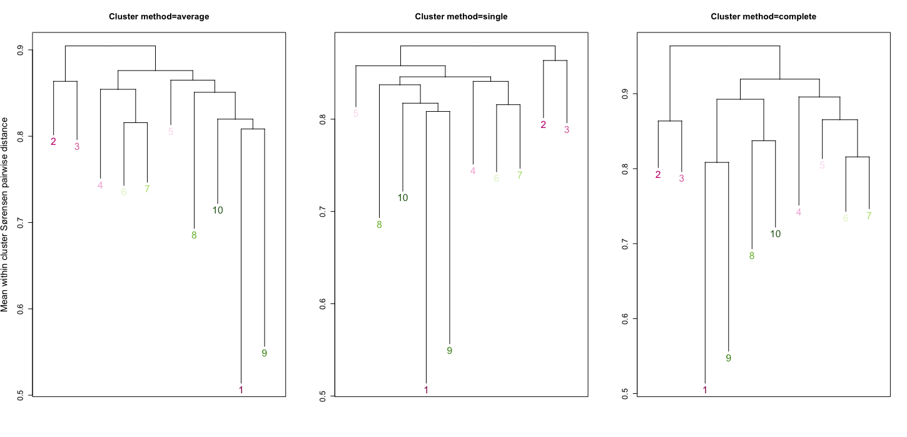

\

::: homelink
<a href="https://kellifeeser.github.io/ksu-paired-amplicon-workflow/index.html" target="_blank" style="text-align:right">Back to Home</a>
:::

\
\

# Prep data {.unlisted .unnumbered .hidden}


## relabel ONF as North


## load pam res


## leaflet metadata


## leaflet maps


# Set up Ordinations/NMDS {.unlisted .unnumbered .hidden}

## Check Gap Statistic on NMDS


# Map of sites and samples

\

### Prior mislabeling of samples from ONF

The Kansas site ONF was labeled as 'South Middle' in factor 'Bin' in previous manuscripts. It should be 'North'.


```{=html}
<div id="htmlwidget-72448ab049d84f238c64" style="width:450px;height:450px;" class="leaflet html-widget "></div>
<script type="application/json" data-for="htmlwidget-72448ab049d84f238c64">{"x":{"options":{"minZoom":4,"maxZoom":7,"crs":{"crsClass":"L.CRS.EPSG3857","code":null,"proj4def":null,"projectedBounds":null,"options":{}}},"calls":[{"method":"addTiles","args":["http://{s}.tile.openstreetmap.org/{z}/{x}/{y}.png",null,null,{"minZoom":0,"maxZoom":18,"tileSize":256,"subdomains":"abc","errorTileUrl":"","tms":false,"noWrap":false,"zoomOffset":0,"zoomReverse":false,"opacity":1,"zIndex":1,"detectRetina":false,"attribution":"&copy; <a href=\"https://www.openstreetmap.org/copyright\">OpenStreetMap<\/a> contributors"}]},{"method":"addCircleMarkers","args":[[37.627547,29.23005,33.307867,36.23189,40.81553,30.34736,36.0235,32.03624,31.09185,31.95908,32.74914,39.0878,41.122,34.9779,39.0745,40.66462,30.1847,36.0417,39.80954,38.188203,34.342141,29.39087],[-106.253289,-103.37832,-97.60541670000001,-106.37604,-104.7456,-104.046683,-99.9439,-107.64451,-94.26535,-104.76002,-108.2876,-99.1559,-104.5313,-97.5228,-96.6036,-98.9063,-97.86750000000001,-94.8137,-94.13184,-106.514975,-106.62261,-95.03443],12,null,null,{"interactive":true,"className":"","stroke":true,"color":["#6ABEF9","#FFC25B","#FFFA6C","#6ABEF9","#6BE9FF","#FFC25B","#6ABEF9","#FFFA6C","#FFC25B","#FFC25B","#FFFA6C","#6BE9FF","#6BE9FF","#FFFA6C","#6BE9FF","#6BE9FF","#FFC25B","#6ABEF9","#FFFA6C","#6ABEF9","#FFFA6C","#FFC25B"],"weight":5,"opacity":0.5,"fill":true,"fillColor":["#6ABEF9","#FFC25B","#FFFA6C","#6ABEF9","#6BE9FF","#FFC25B","#6ABEF9","#FFFA6C","#FFC25B","#FFC25B","#FFFA6C","#6BE9FF","#6BE9FF","#FFFA6C","#6BE9FF","#6BE9FF","#FFC25B","#6ABEF9","#FFFA6C","#6ABEF9","#FFFA6C","#FFC25B"],"fillOpacity":0.9},null,null,["BLM","BNP","CAD","CNF","CPR","DMT","FCP","FMT","SFA","GMT","GNF","HAR","HPG","KAE","KNZ","LAR","LBJ","NWP","ONF","RNF","SEV","UHC"],null,null,{"interactive":false,"permanent":false,"direction":"auto","opacity":1,"offset":[0,0],"textsize":"10px","textOnly":false,"className":"","sticky":true},null]},{"method":"addLegend","args":[{"colors":["#6BE9FF","#6ABEF9","#FFFA6C","#FFC25B"],"labels":["North","North Central","South Central","South"],"na_color":null,"na_label":"NA","opacity":0.5,"position":"bottomright","type":"factor","title":"Bin","extra":null,"layerId":null,"className":"info legend","group":"circles"}]}],"setView":[[34.62755,-99.75329000000001],4.5,[]],"limits":{"lat":[29.23005,41.122],"lng":[-108.2876,-94.13184]}},"evals":[],"jsHooks":[]}</script>
```

Map of sites colored by latitudinal bin.\
\
\
\

# Overview of Site clusters (NMDS by Site) {.tabset .tabset-pills}

\
I wanted to see if samples grouped by geographic location, and given that sites range widely in distance from one another, I decided to visually assess using a color scheme that at least roughly represented their location in 2D space. See the map below:


```{=html}
<div id="htmlwidget-cbc265dc7427b72d5ab6" style="width:450px;height:450px;" class="leaflet html-widget "></div>
<script type="application/json" data-for="htmlwidget-cbc265dc7427b72d5ab6">{"x":{"options":{"minZoom":4,"maxZoom":7,"crs":{"crsClass":"L.CRS.EPSG3857","code":null,"proj4def":null,"projectedBounds":null,"options":{}}},"calls":[{"method":"addTiles","args":["http://{s}.tile.openstreetmap.org/{z}/{x}/{y}.png",null,null,{"minZoom":0,"maxZoom":18,"tileSize":256,"subdomains":"abc","errorTileUrl":"","tms":false,"noWrap":false,"zoomOffset":0,"zoomReverse":false,"opacity":1,"zIndex":1,"detectRetina":false,"attribution":"&copy; <a href=\"https://www.openstreetmap.org/copyright\">OpenStreetMap<\/a> contributors"}]},{"method":"addCircleMarkers","args":[[37.627547,29.23005,33.307867,36.23189,40.81553,30.34736,36.0235,32.03624,31.09185,31.95908,32.74914,39.0878,41.122,34.9779,39.0745,40.66462,30.1847,36.0417,39.80954,38.188203,34.342141,29.39087],[-106.253289,-103.37832,-97.60541670000001,-106.37604,-104.7456,-104.046683,-99.9439,-107.64451,-94.26535,-104.76002,-108.2876,-99.1559,-104.5313,-97.5228,-96.6036,-98.9063,-97.86750000000001,-94.8137,-94.13184,-106.514975,-106.62261,-95.03443],10,null,null,{"interactive":true,"className":"","stroke":true,"color":["#25B480","#580080","#C05780","#229680","#40F880","#4C1880","#969280","#0C3C80","#FD2880","#403B80","#004B80","#A4D380","#44FF80","#C27B80","#D2D380","#A9F580","#BC1480","#F39280","#FFE380","#20C080","#1E6E80","#EF0380"],"weight":5,"opacity":0.5,"fill":true,"fillColor":["#25B480","#580080","#C05780","#229680","#40F880","#4C1880","#969280","#0C3C80","#FD2880","#403B80","#004B80","#A4D380","#44FF80","#C27B80","#D2D380","#A9F580","#BC1480","#F39280","#FFE380","#20C080","#1E6E80","#EF0380"],"fillOpacity":0.8},null,null,["BLM","BNP","CAD","CNF","CPR","DMT","FCP","FMT","SFA","GMT","GNF","HAR","HPG","KAE","KNZ","LAR","LBJ","NWP","ONF","RNF","SEV","UHC"],null,null,{"interactive":false,"permanent":false,"direction":"auto","opacity":1,"offset":[0,0],"textsize":"10px","textOnly":false,"className":"","sticky":true},null]}],"setView":[[34.62755,-99.75329000000001],5,[]],"limits":{"lat":[29.23005,41.122],"lng":[-108.2876,-94.13184]}},"evals":[],"jsHooks":[]}</script>
```

\
\

In the NMDS (Bray-Curtis), we see definite clustering by Site, but not all groupings are distinct.\

We also see evidence of potentially significant spatial relationships (i.e., distance-decay).\

## All in 1 plot

<!-- -->

\

## Facet by Lat bin

<!-- -->

\

## Facet by Long bin

<!-- -->

\

## Lat:Long

<!-- -->

\

# More in-depth: distance-based clustering

\

[Background]{.underline} Microbiome sample clustering can be performed using either model-based methods and machine learning methods.\
- Machine learning methods, which rely on defined distance metrics, are used more frequently than model-based statistical methods ("due to their efficient implementation and easy interpretation.")\
- I used the partition around medoids (PAM) clustering method, which is related to but considered more robust than K-means. In contrast to K-means, which can be sensitive to the effects of outliers, PAM's optimization goal is to minimize the sum of distances to the medoids instead of minimizing the sum of the squared distances to the cluster centers.\
\

***Note: clustering was performed directly on distance matrices,** not **ordinations or ordination scores***


\

## Gap Statistic (on distance matrix) {.tabset .tabset-pills}

\

### view gap on bray {.unnumbered .unlisted}

<!-- -->

\

### view gap on sørensen {.unnumbered .unlisted}

<!-- -->

\

## perform PAM


```r
# Perform PAM clustering
pam_fwc_bc_k4 <- pam(Fun_wc_bray_distmat, k = 4, diss = T, cluster.only = T) 

pam_fwc_sor_k10 <- pam(Fun_wc_sorensen_distmat, k = 10, diss = T, cluster.only = T) 
pam_fwc_sor_k30 <- pam(Fun_wc_sorensen_distmat, k = 30, diss = T, cluster.only = T) 

saveRDS(pam_fwc_bc_k4, file = "../processed_data/clean_rds_saves/pam/pam_fwc_bc_k4.rds")
saveRDS(pam_fwc_sor_k10, file = "../processed_data/clean_rds_saves/pam/pam_fwc_sor_k10.rds")
saveRDS(pam_fwc_sor_k30, file = "../processed_data/clean_rds_saves/pam/pam_fwc_sor_k30.rds")
```

\

## view clusters on NMDS {.tabset .tabset-pills}

\

### Sørensen-based clusters {.unnumbered .unlisted .tabset .tabset-pills}

\

#### k = 10 {.unnumbered .unlisted .tabset}

Note the density of cluster 1 - I'll investigate that further.

[Cluster descriptions]{.underline}

| Cluster | total n | Site(s)           | Grass(es)                 | Characteristics†                       | Exclusivity                                                           |     |
|-----------|-----------|-----------|-----------|-----------|-----------|-----------|
| 1       | 183     |                   |                           | spans pH range                         |                                                                       |     |
| 2       | 37      | BNP,DMT,FMT,SEV   | BOER (n=33), BOGR (n=4)   | high pH\* (6.8 - 8.3, mean 7.5)        |                                                                       |     |
| 3       | 56      |                   |                           | high pH\*\*\*\* (6.8 - 8.3, mean 7.8)  |                                                                       |     |
| 4       | 17      |                   |                           | lower pH\*\*\*\* (5.6 - 7.6, mean 6.2) |                                                                       |     |
| 5       | 43      |                   |                           | high pH\*\* (7.1 - 7.8, mean 7.6)      |                                                                       |     |
| 6       | 32      |                   |                           | lower pH\*\*\*\* (5.1 - 7.8, mean 6.2) |                                                                       |     |
| 7       | 38      |                   |                           |                                        |                                                                       |     |
| 8       | 29      | mostly LAR (n=27) |                           | high pH\*\*\*\* (7.2 - 8.2, mean 8.0)  |                                                                       |     |
| 9       | 9       | SFA               | SCSC (only grass present) |                                        | Site=SFA                                                              |     |
| 10      | 29      | KAE               |                           | lower pH\*\*\*\* (5.9 - 7.2, mean 6.3) | Site=KAE (of the 32 KAE samples, only 3 others were in diff clusters) |     |

: Descriptions of Sørensen distance-based clusters. †variables listed are significant in all vs. base-mean Wilcox test with BH p-value corrections. \* p-value \< 0.05, \*\* \< 0.001, \*\*\* \< 0.0001, \*\*\*\* \< 1e-5.

[\
]{.underline}

##### All samples {.unnumbered .unlisted}

<!-- -->

\

##### Facet by Lat {.unnumbered .unlisted}

<!-- -->

\

##### Facet by Long {.unnumbered .unlisted}

<!-- -->

\

####  {.unnumbered}

We do see clusters with only 1 site and others with multiple sites.\

<!-- -->


\

#### k = 30 {.unnumbered .unlisted .hidden}


\
\
\

### Bray-Curtis {.unnumbered .unlisted .tabset .tabset-pills}

\

#### k = 4 {.unnumbered .unlisted .tabset}

##### All samples {.unnumbered .unlisted}

<!-- -->

\

##### Facet by Lat {.unnumbered .unlisted}

<!-- -->

\

##### Facet by Long {.unnumbered .unlisted}

<!-- -->

\

## Are the clusters distinct/distinguishable?

[Clusters]{.underline}: Sørensen dissimilarity clusters based on pam (k = 10)

[Method]{.underline}: R package `randomForest v4.7.1.1`

```         
predictors.all<-t(otu_table(Fun_wholecommunity))

response.clus_sor_k10<-as.factor(sample_data(Fun_wholecommunity)$clus_sor_k10)

rf.data.clus_sor_k10<-data.frame(response.clus_sor_k10, predictors.all)

classify.clus_sor_k10<-randomForest(response.clus_sor_k10~., data = rf.data.clus_sor_k10, ntree=999)
```

Call: randomForest(formula = response.clus_sor_k10 \~ ., data = rf.data.clus_sor_k10, ntree = 999)

Type of random forest: classification

Number of trees: 999

No. of variables tried at each split: 81

OOB estimate of error rate: 6.82%

|        | 1   | 2   | 3   | 4   | 5   | 6   | 7   | 8   | 9   | 10  | Cluster error % |
|--------|-----|-----|-----|-----|-----|-----|-----|-----|-----|-----|-----------------|
| **1**  | 183 |     |     |     |     |     |     |     |     |     | 0.0             |
| **2**  |     | 34  | 3   |     |     |     |     |     |     |     | 8.1             |
| **3**  |     | 5   | 50  |     | 1   |     |     |     |     |     | 10.7            |
| **4**  |     |     |     | 12  | 4   |     | 1   |     |     |     | 29.4            |
| **5**  |     |     | 1   |     | 50  | 1   | 1   |     |     |     | 5.7             |
| **6**  |     |     |     |     | 7   | 23  | 2   |     |     |     | 28.1            |
| **7**  |     |     | 1   |     |     | 2   | 34  |     |     | 1   | 10.5            |
| **8**  |     |     | 1   |     |     |     |     | 27  |     | 1   | 6.9             |
| **9**  |     |     |     |     |     |     |     |     | 10  |     | 0               |
| **10** |     |     |     |     | 1   |     |     |     |     | 28  | 3.4             |

: Confusion matrix of fungal whole community randomForest classification based on Sørensen-based PAM clusters. Diagonals are accurate calls. Misclassifications are shown as values by row, i.e., cluster 2 was misclassified as cluster 3 in 3 samples, while 34 samples were accurately called, resulting in an error rate of 8.1% for that cluster.

Notes: OTU205 is highest in relative abundance in Cluster 1, most other clusters have minimal or no presence. ~~Exception is sample in Cluster 7, which was the one misclassified into Cluster 1.~~

OTU6679, Generalist\nwilcox.test: all (global RA = 1.65%) v. Cluster 1 (mean RA = 3.75%)

\

## Dendrogram of Sørensen-based clusters (k = 10)

\

**Fungal whole community**\

{out.width="500px"}

Clusters 2 & 3 seem to be the outgroup / most distantly related \
Clusters 1 & 9 are very similar, followed by 10 -> wrap-around cluster numbering\

## Mapping metadata

\

### Edaphic {.tabset .tabset-pills}

\

#### pH {.unnumbered}


```{=html}
<div id="htmlwidget-4ff2214eec343ac61bc7" style="width:450px;height:450px;" class="leaflet html-widget "></div>
<script type="application/json" data-for="htmlwidget-4ff2214eec343ac61bc7">{"x":{"options":{"minZoom":4,"maxZoom":7,"crs":{"crsClass":"L.CRS.EPSG3857","code":null,"proj4def":null,"projectedBounds":null,"options":{}}},"calls":[{"method":"addTiles","args":["http://{s}.tile.openstreetmap.org/{z}/{x}/{y}.png",null,null,{"minZoom":0,"maxZoom":18,"tileSize":256,"subdomains":"abc","errorTileUrl":"","tms":false,"noWrap":false,"zoomOffset":0,"zoomReverse":false,"opacity":1,"zIndex":1,"detectRetina":false,"attribution":"&copy; <a href=\"https://www.openstreetmap.org/copyright\">OpenStreetMap<\/a> contributors"}]},{"method":"addCircleMarkers","args":[[37.627547,29.23005,33.307867,36.23189,40.81553,30.34736,36.0235,32.03624,31.09185,31.95908,32.74914,39.0878,41.122,34.9779,39.0745,40.66462,30.1847,36.0417,39.80954,38.188203,34.342141,29.39087],[-106.253289,-103.37832,-97.60541670000001,-106.37604,-104.7456,-104.046683,-99.9439,-107.64451,-94.26535,-104.76002,-108.2876,-99.1559,-104.5313,-97.5228,-96.6036,-98.9063,-97.86750000000001,-94.8137,-94.13184,-106.514975,-106.62261,-95.03443],10,null,null,{"interactive":true,"className":"","stroke":true,"color":["#3F4788","#48186A","#414387","#472E7C","#C0DF25","#424186","#20938C","#2A778E","#228B8D","#440154","#3E4C8A","#404588","#2B758E","#81D34D","#1F9A8A","#453781","#94D741","#3CBB75","#FDE725","#33628D","#1F948C","#1E9C89"],"weight":5,"opacity":0.5,"fill":true,"fillColor":["#3F4788","#48186A","#414387","#472E7C","#C0DF25","#424186","#20938C","#2A778E","#228B8D","#440154","#3E4C8A","#404588","#2B758E","#81D34D","#1F9A8A","#453781","#94D741","#3CBB75","#FDE725","#33628D","#1F948C","#1E9C89"],"fillOpacity":0.8},null,null,["BLM","BNP","CAD","CNF","CPR","DMT","FCP","FMT","SFA","GMT","GNF","HAR","HPG","KAE","KNZ","LAR","LBJ","NWP","ONF","RNF","SEV","UHC"],null,null,{"interactive":false,"permanent":false,"direction":"auto","opacity":1,"offset":[0,0],"textsize":"10px","textOnly":false,"className":"","sticky":true},null]},{"method":"addLegend","args":[{"colors":["#FDE725 , #D1E21B 6.84039087947883%, #67CC5C 23.1270358306189%, #23A983 39.413680781759%, #26828E 55.700325732899%, #375A8C 71.9869706840391%, #472A7A 88.2736156351792%, #440154 "],"labels":["5.5","6.0","6.5","7.0","7.5","8.0"],"na_color":null,"na_label":"NA","opacity":0.5,"position":"bottomright","type":"numeric","title":"pH","extra":{"p_1":0.06840390879478828,"p_n":0.8827361563517917},"layerId":null,"className":"info legend","group":"circles"}]}],"setView":[[34.62755,-99.75329000000001],5,[]],"limits":{"lat":[29.23005,41.122],"lng":[-108.2876,-94.13184]}},"evals":[],"jsHooks":[]}</script>
```


\

#### soil moisture {.unnumbered}


```{=html}
<div id="htmlwidget-5ede10b7035de1e4eb62" style="width:450px;height:450px;" class="leaflet html-widget "></div>
<script type="application/json" data-for="htmlwidget-5ede10b7035de1e4eb62">{"x":{"options":{"minZoom":4,"maxZoom":7,"crs":{"crsClass":"L.CRS.EPSG3857","code":null,"proj4def":null,"projectedBounds":null,"options":{}}},"calls":[{"method":"addTiles","args":["http://{s}.tile.openstreetmap.org/{z}/{x}/{y}.png",null,null,{"minZoom":0,"maxZoom":18,"tileSize":256,"subdomains":"abc","errorTileUrl":"","tms":false,"noWrap":false,"zoomOffset":0,"zoomReverse":false,"opacity":1,"zIndex":1,"detectRetina":false,"attribution":"&copy; <a href=\"https://www.openstreetmap.org/copyright\">OpenStreetMap<\/a> contributors"}]},{"method":"addCircleMarkers","args":[[37.627547,29.23005,33.307867,36.23189,40.81553,30.34736,36.0235,32.03624,31.09185,31.95908,32.74914,39.0878,41.122,34.9779,39.0745,40.66462,30.1847,36.0417,39.80954,38.188203,34.342141,29.39087],[-106.253289,-103.37832,-97.60541670000001,-106.37604,-104.7456,-104.046683,-99.9439,-107.64451,-94.26535,-104.76002,-108.2876,-99.1559,-104.5313,-97.5228,-96.6036,-98.9063,-97.86750000000001,-94.8137,-94.13184,-106.514975,-106.62261,-95.03443],10,null,null,{"interactive":true,"className":"","stroke":true,"color":["#1F6EB3","#09468B","#6EAFD7","#093878","#083876","#4694C7","#08336F","#093F81","#569FCD","#165FA7","#2F7DBB","#3D8CC3","#D6E5F4","#4E99CA","#579FCE","#093877","#E6F0F9","#71B1D7","#317FBC","#317FBC","#08306B","#F7FBFF"],"weight":5,"opacity":0.5,"fill":true,"fillColor":["#1F6EB3","#09468B","#6EAFD7","#093878","#083876","#4694C7","#08336F","#093F81","#569FCD","#165FA7","#2F7DBB","#3D8CC3","#D6E5F4","#4E99CA","#579FCE","#093877","#E6F0F9","#71B1D7","#317FBC","#317FBC","#08306B","#F7FBFF"],"fillOpacity":0.8},null,null,["BLM","BNP","CAD","CNF","CPR","DMT","FCP","FMT","SFA","GMT","GNF","HAR","HPG","KAE","KNZ","LAR","LBJ","NWP","ONF","RNF","SEV","UHC"],null,null,{"interactive":false,"permanent":false,"direction":"auto","opacity":1,"offset":[0,0],"textsize":"10px","textOnly":false,"className":"","sticky":true},null]},{"method":"addLegend","args":[{"colors":["#F7FBFF , #E6F0FA 8.58125664789847%, #C7DCEF 24.4052534960621%, #94C4DF 40.2292503442258%, #58A0CE 56.0532471923894%, #2B79B9 71.8772440405531%, #08509B 87.7012408887167%, #08306B "],"labels":["0.70","0.75","0.80","0.85","0.90","0.95"],"na_color":null,"na_label":"NA","opacity":0.5,"position":"bottomright","type":"numeric","title":"soil_moisture","extra":{"p_1":0.08581256647898468,"p_n":0.8770124088871667},"layerId":null,"className":"info legend","group":"circles"}]}],"setView":[[34.62755,-99.75329000000001],5,[]],"limits":{"lat":[29.23005,41.122],"lng":[-108.2876,-94.13184]}},"evals":[],"jsHooks":[]}</script>
```


\

#### SOM {.unnumbered}


```{=html}
<div id="htmlwidget-5099c8a4f5fbf54c6a24" style="width:450px;height:450px;" class="leaflet html-widget "></div>
<script type="application/json" data-for="htmlwidget-5099c8a4f5fbf54c6a24">{"x":{"options":{"minZoom":4,"maxZoom":7,"crs":{"crsClass":"L.CRS.EPSG3857","code":null,"proj4def":null,"projectedBounds":null,"options":{}}},"calls":[{"method":"addTiles","args":["http://{s}.tile.openstreetmap.org/{z}/{x}/{y}.png",null,null,{"minZoom":0,"maxZoom":18,"tileSize":256,"subdomains":"abc","errorTileUrl":"","tms":false,"noWrap":false,"zoomOffset":0,"zoomReverse":false,"opacity":1,"zIndex":1,"detectRetina":false,"attribution":"&copy; <a href=\"https://www.openstreetmap.org/copyright\">OpenStreetMap<\/a> contributors"}]},{"method":"addCircleMarkers","args":[[37.627547,29.23005,33.307867,36.23189,40.81553,30.34736,36.0235,32.03624,31.09185,31.95908,32.74914,39.0878,41.122,34.9779,39.0745,40.66462,30.1847,36.0417,39.80954,38.188203,34.342141,29.39087],[-106.253289,-103.37832,-97.60541670000001,-106.37604,-104.7456,-104.046683,-99.9439,-107.64451,-94.26535,-104.76002,-108.2876,-99.1559,-104.5313,-97.5228,-96.6036,-98.9063,-97.86750000000001,-94.8137,-94.13184,-106.514975,-106.62261,-95.03443],10,null,null,{"interactive":true,"className":"","stroke":true,"color":["#9FBDDA","#CDDEEC","#4D004B","#F6FBFD","#D1E1EE","#D0E0ED","#99B0D4","#E6F0F6","#BED3E6","#AEC7E0","#E3EEF5","#8C70B4","#8D7DBA","#C9DBEA","#821880","#F7FCFD","#730A6F","#832185","#640560","#B0C9E1","#EBF3F8","#8C66AE"],"weight":5,"opacity":0.5,"fill":true,"fillColor":["#9FBDDA","#CDDEEC","#4D004B","#F6FBFD","#D1E1EE","#D0E0ED","#99B0D4","#E6F0F6","#BED3E6","#AEC7E0","#E3EEF5","#8C70B4","#8D7DBA","#C9DBEA","#821880","#F7FCFD","#730A6F","#832185","#640560","#B0C9E1","#EBF3F8","#8C66AE"],"fillOpacity":0.8},null,null,["BLM","BNP","CAD","CNF","CPR","DMT","FCP","FMT","SFA","GMT","GNF","HAR","HPG","KAE","KNZ","LAR","LBJ","NWP","ONF","RNF","SEV","UHC"],null,null,{"interactive":false,"permanent":false,"direction":"auto","opacity":1,"offset":[0,0],"textsize":"10px","textOnly":false,"className":"","sticky":true},null]},{"method":"addLegend","args":[{"colors":["#F7FCFD , #EAF3F8 7.22599683997051%, #CBDCEB 20.3839376469185%, #A9C3DE 33.5418784538665%, #91A0CB 46.6998192608146%, #8C74B5 59.8577600677626%, #8948A0 73.0157008747106%, #82177F 86.1736416816586%, #50004E 99.3315824886066%, #4D004B "],"labels":["1","2","3","4","5","6","7","8"],"na_color":null,"na_label":"NA","opacity":0.5,"position":"bottomright","type":"numeric","title":"SOM","extra":{"p_1":0.07225996839970515,"p_n":0.993315824886066},"layerId":null,"className":"info legend","group":"circles"}]}],"setView":[[34.62755,-99.75329000000001],5,[]],"limits":{"lat":[29.23005,41.122],"lng":[-108.2876,-94.13184]}},"evals":[],"jsHooks":[]}</script>
```


\

#### ammonium {.unnumbered}


```{=html}
<div id="htmlwidget-e04e8dfac1bd1e5b07e3" style="width:450px;height:450px;" class="leaflet html-widget "></div>
<script type="application/json" data-for="htmlwidget-e04e8dfac1bd1e5b07e3">{"x":{"options":{"minZoom":4,"maxZoom":7,"crs":{"crsClass":"L.CRS.EPSG3857","code":null,"proj4def":null,"projectedBounds":null,"options":{}}},"calls":[{"method":"addTiles","args":["http://{s}.tile.openstreetmap.org/{z}/{x}/{y}.png",null,null,{"minZoom":0,"maxZoom":18,"tileSize":256,"subdomains":"abc","errorTileUrl":"","tms":false,"noWrap":false,"zoomOffset":0,"zoomReverse":false,"opacity":1,"zIndex":1,"detectRetina":false,"attribution":"&copy; <a href=\"https://www.openstreetmap.org/copyright\">OpenStreetMap<\/a> contributors"}]},{"method":"addCircleMarkers","args":[[37.627547,29.23005,33.307867,36.23189,40.81553,30.34736,36.0235,32.03624,31.09185,31.95908,32.74914,39.0878,41.122,34.9779,39.0745,40.66462,30.1847,36.0417,39.80954,38.188203,34.342141,29.39087],[-106.253289,-103.37832,-97.60541670000001,-106.37604,-104.7456,-104.046683,-99.9439,-107.64451,-94.26535,-104.76002,-108.2876,-99.1559,-104.5313,-97.5228,-96.6036,-98.9063,-97.86750000000001,-94.8137,-94.13184,-106.514975,-106.62261,-95.03443],10,null,null,{"interactive":true,"className":"","stroke":true,"color":["#EB6627","#F1ED6F","#F2741C","#F2E65F","#F5F992","#FA9307","#F98A0B","#FBFEA3","#EF6E21","#FBBE23","#FAC026","#FA9207","#6A176E","#F78311","#F78212","#F3F588","#5B116E","#EC6726","#59106E","#FC9F07","#FCFFA4","#000004"],"weight":5,"opacity":0.5,"fill":true,"fillColor":["#EB6627","#F1ED6F","#F2741C","#F2E65F","#F5F992","#FA9307","#F98A0B","#FBFEA3","#EF6E21","#FBBE23","#FAC026","#FA9207","#6A176E","#F78311","#F78212","#F3F588","#5B116E","#EC6726","#59106E","#FC9F07","#FCFFA4","#000004"],"fillOpacity":0.8},null,null,["BLM","BNP","CAD","CNF","CPR","DMT","FCP","FMT","SFA","GMT","GNF","HAR","HPG","KAE","KNZ","LAR","LBJ","NWP","ONF","RNF","SEV","UHC"],null,null,{"interactive":false,"permanent":false,"direction":"auto","opacity":1,"offset":[0,0],"textsize":"10px","textOnly":false,"className":"","sticky":true},null]},{"method":"addLegend","args":[{"colors":["#FCFFA4 , #F1F179 4.29528546875055%, #FA9008 24.2518627903328%, #CF4446 44.208440111915%, #83206C 64.1650174334972%, #300A5B 84.1215947550795%, #000004 "],"labels":["0.9","1.0","1.1","1.2","1.3"],"na_color":null,"na_label":"NA","opacity":0.5,"position":"bottomright","type":"numeric","title":"ammonium","extra":{"p_1":0.0429528546875055,"p_n":0.8412159475507947},"layerId":null,"className":"info legend","group":"circles"}]}],"setView":[[34.62755,-99.75329000000001],5,[]],"limits":{"lat":[29.23005,41.122],"lng":[-108.2876,-94.13184]}},"evals":[],"jsHooks":[]}</script>
```


\

#### phosphorous {.unnumbered}


```{=html}
<div id="htmlwidget-15508036409aa1de85a5" style="width:450px;height:450px;" class="leaflet html-widget "></div>
<script type="application/json" data-for="htmlwidget-15508036409aa1de85a5">{"x":{"options":{"minZoom":4,"maxZoom":7,"crs":{"crsClass":"L.CRS.EPSG3857","code":null,"proj4def":null,"projectedBounds":null,"options":{}}},"calls":[{"method":"addTiles","args":["http://{s}.tile.openstreetmap.org/{z}/{x}/{y}.png",null,null,{"minZoom":0,"maxZoom":18,"tileSize":256,"subdomains":"abc","errorTileUrl":"","tms":false,"noWrap":false,"zoomOffset":0,"zoomReverse":false,"opacity":1,"zIndex":1,"detectRetina":false,"attribution":"&copy; <a href=\"https://www.openstreetmap.org/copyright\">OpenStreetMap<\/a> contributors"}]},{"method":"addCircleMarkers","args":[[37.627547,29.23005,33.307867,36.23189,40.81553,30.34736,36.0235,32.03624,31.09185,31.95908,32.74914,39.0878,41.122,34.9779,39.0745,40.66462,30.1847,36.0417,39.80954,38.188203,34.342141,29.39087],[-106.253289,-103.37832,-97.60541670000001,-106.37604,-104.7456,-104.046683,-99.9439,-107.64451,-94.26535,-104.76002,-108.2876,-99.1559,-104.5313,-97.5228,-96.6036,-98.9063,-97.86750000000001,-94.8137,-94.13184,-106.514975,-106.62261,-95.03443],10,null,null,{"interactive":true,"className":"","stroke":true,"color":["#F4695C","#FED597","#FA815F","#FDDA9C","#FCFBBD","#FC8E64","#FA7F5E","#FCF6B8","#F66E5C","#FEB87F","#FEB77E","#FEA06E","#57157E","#F9795D","#F3655C","#FCEFB1","#53137D","#EB5760","#621980","#FE9F6D","#FCFDBF","#000004"],"weight":5,"opacity":0.5,"fill":true,"fillColor":["#F4695C","#FED597","#FA815F","#FDDA9C","#FCFBBD","#FC8E64","#FA7F5E","#FCF6B8","#F66E5C","#FEB87F","#FEB77E","#FEA06E","#57157E","#F9795D","#F3655C","#FCEFB1","#53137D","#EB5760","#621980","#FE9F6D","#FCFDBF","#000004"],"fillOpacity":0.8},null,null,["BLM","BNP","CAD","CNF","CPR","DMT","FCP","FMT","SFA","GMT","GNF","HAR","HPG","KAE","KNZ","LAR","LBJ","NWP","ONF","RNF","SEV","UHC"],null,null,{"interactive":false,"permanent":false,"direction":"auto","opacity":1,"offset":[0,0],"textsize":"10px","textOnly":false,"className":"","sticky":true},null]},{"method":"addLegend","args":[{"colors":["#FCFDBF , #FED093 9.62656801442395%, #F76F5C 29.930452394198%, #B5367A 50.2343367739721%, #621980 70.5382211537461%, #120D32 90.8421055335202%, #000004 "],"labels":["0.18","0.20","0.22","0.24","0.26"],"na_color":null,"na_label":"NA","opacity":0.5,"position":"bottomright","type":"numeric","title":"phos","extra":{"p_1":0.09626568014423946,"p_n":0.9084210553352017},"layerId":null,"className":"info legend","group":"circles"}]}],"setView":[[34.62755,-99.75329000000001],5,[]],"limits":{"lat":[29.23005,41.122],"lng":[-108.2876,-94.13184]}},"evals":[],"jsHooks":[]}</script>
```


\

### Climate {.tabset .tabset-pills}

\

#### Precipitation {.unnumbered}

ppt3yr = mean annual precipitation (determined over a 3-year window)\


```{=html}
<div id="htmlwidget-af0b8622184df8943840" style="width:450px;height:450px;" class="leaflet html-widget "></div>
<script type="application/json" data-for="htmlwidget-af0b8622184df8943840">{"x":{"options":{"minZoom":4,"maxZoom":7,"crs":{"crsClass":"L.CRS.EPSG3857","code":null,"proj4def":null,"projectedBounds":null,"options":{}}},"calls":[{"method":"addTiles","args":["http://{s}.tile.openstreetmap.org/{z}/{x}/{y}.png",null,null,{"minZoom":0,"maxZoom":18,"tileSize":256,"subdomains":"abc","errorTileUrl":"","tms":false,"noWrap":false,"zoomOffset":0,"zoomReverse":false,"opacity":1,"zIndex":1,"detectRetina":false,"attribution":"&copy; <a href=\"https://www.openstreetmap.org/copyright\">OpenStreetMap<\/a> contributors"}]},{"method":"addCircleMarkers","args":[[37.627547,29.23005,33.307867,36.23189,40.81553,30.34736,36.0235,32.03624,31.09185,31.95908,32.74914,39.0878,41.122,34.9779,39.0745,40.66462,30.1847,36.0417,39.80954,38.188203,34.342141,29.39087],[-106.253289,-103.37832,-97.60541670000001,-106.37604,-104.7456,-104.046683,-99.9439,-107.64451,-94.26535,-104.76002,-108.2876,-99.1559,-104.5313,-97.5228,-96.6036,-98.9063,-97.86750000000001,-94.8137,-94.13184,-106.514975,-106.62261,-95.03443],10,null,null,{"interactive":true,"className":"","stroke":true,"color":["#F7FBFF","#EBF3FB","#307EBC","#EBF3FB","#C3DAEE","#E1EDF8","#ACD0E6","#E1EDF8","#094A92","#ACD0E6","#D2E3F3","#95C5DF","#A9CFE5","#1F6DB2","#4393C6","#75B3D8","#094A91","#09488F","#1963AA","#DBE9F6","#DFECF7","#08306B"],"weight":5,"opacity":0.5,"fill":true,"fillColor":["#F7FBFF","#EBF3FB","#307EBC","#EBF3FB","#C3DAEE","#E1EDF8","#ACD0E6","#E1EDF8","#094A92","#ACD0E6","#D2E3F3","#95C5DF","#A9CFE5","#1F6DB2","#4393C6","#75B3D8","#094A91","#09488F","#1963AA","#DBE9F6","#DFECF7","#08306B"],"fillOpacity":0.9},null,null,["BLM","BNP","CAD","CNF","CPR","DMT","FCP","FMT","SFA","GMT","GNF","HAR","HPG","KAE","KNZ","LAR","LBJ","NWP","ONF","RNF","SEV","UHC"],null,null,{"interactive":false,"permanent":false,"direction":"auto","opacity":1,"offset":[0,0],"textsize":"10px","textOnly":false,"className":"","sticky":true},null]},{"method":"addLegend","args":[{"colors":["#F7FBFF , #F4F9FE 1.32331142115763%, #DEEBF7 12.7410087835174%, #C8DCF0 24.1587061458772%, #A4CDE3 35.576403508237%, #78B5D9 46.9941008705968%, #519BCB 58.4117982329566%, #317EBC 69.8294955953164%, #1761A8 81.2471929576762%, #094387 92.6648903200361%, #08306B "],"labels":["200","300","400","500","600","700","800","900","1,000"],"na_color":null,"na_label":"NA","opacity":0.5,"position":"bottomright","type":"numeric","title":"ppt3yr","extra":{"p_1":0.01323311421157632,"p_n":0.9266489032003605},"layerId":null,"className":"info legend","group":"circles"}]}],"setView":[[34.62755,-99.75329000000001],5,[]],"limits":{"lat":[29.23005,41.122],"lng":[-108.2876,-94.13184]}},"evals":[],"jsHooks":[]}</script>
```

\

#### Growing degree days {.unnumbered}

GDD3yr = growing degree days (determined over a 3-year window)\


```{=html}
<div id="htmlwidget-dfcd39186ee07ea0bc20" style="width:450px;height:450px;" class="leaflet html-widget "></div>
<script type="application/json" data-for="htmlwidget-dfcd39186ee07ea0bc20">{"x":{"options":{"minZoom":4,"maxZoom":7,"crs":{"crsClass":"L.CRS.EPSG3857","code":null,"proj4def":null,"projectedBounds":null,"options":{}}},"calls":[{"method":"addTiles","args":["http://{s}.tile.openstreetmap.org/{z}/{x}/{y}.png",null,null,{"minZoom":0,"maxZoom":18,"tileSize":256,"subdomains":"abc","errorTileUrl":"","tms":false,"noWrap":false,"zoomOffset":0,"zoomReverse":false,"opacity":1,"zIndex":1,"detectRetina":false,"attribution":"&copy; <a href=\"https://www.openstreetmap.org/copyright\">OpenStreetMap<\/a> contributors"}]},{"method":"addCircleMarkers","args":[[37.627547,29.23005,33.307867,36.23189,40.81553,30.34736,36.0235,32.03624,31.09185,31.95908,32.74914,39.0878,41.122,34.9779,39.0745,40.66462,30.1847,36.0417,39.80954,38.188203,34.342141,29.39087],[-106.253289,-103.37832,-97.60541670000001,-106.37604,-104.7456,-104.046683,-99.9439,-107.64451,-94.26535,-104.76002,-108.2876,-99.1559,-104.5313,-97.5228,-96.6036,-98.9063,-97.86750000000001,-94.8137,-94.13184,-106.514975,-106.62261,-95.03443],10,null,null,{"interactive":true,"className":"","stroke":true,"color":["#FDB52E","#3E049C","#5B01A5","#D45270","#E4695E","#A01A9C","#F9963F","#8C0BA5","#3E049C","#910EA3","#C23C81","#B12A90","#F58B47","#7E03A8","#B7318A","#D14E72","#260591","#9C179E","#CC4778","#F0F921","#BA3388","#0D0887"],"weight":5,"opacity":0.5,"fill":true,"fillColor":["#FDB52E","#3E049C","#5B01A5","#D45270","#E4695E","#A01A9C","#F9963F","#8C0BA5","#3E049C","#910EA3","#C23C81","#B12A90","#F58B47","#7E03A8","#B7318A","#D14E72","#260591","#9C179E","#CC4778","#F0F921","#BA3388","#0D0887"],"fillOpacity":0.8},null,null,["BLM","BNP","CAD","CNF","CPR","DMT","FCP","FMT","SFA","GMT","GNF","HAR","HPG","KAE","KNZ","LAR","LBJ","NWP","ONF","RNF","SEV","UHC"],null,null,{"interactive":false,"permanent":false,"direction":"auto","opacity":1,"offset":[0,0],"textsize":"10px","textOnly":false,"className":"","sticky":true},null]},{"method":"addLegend","args":[{"colors":["#F0F921 , #FDC827 11.4149622716462%, #F9983E 24.0528042695774%, #E76E5B 36.6906462675087%, #CC4977 49.3284882654399%, #AB2494 61.9663302633712%, #8004A8 74.6041722613024%, #4D02A2 87.2420142592337%, #0E0887 99.8798562571649%, #0D0887 "],"labels":["2,500","3,000","3,500","4,000","4,500","5,000","5,500","6,000"],"na_color":null,"na_label":"NA","opacity":0.5,"position":"bottomright","type":"numeric","title":"GDD3yr","extra":{"p_1":0.1141496227164619,"p_n":0.998798562571649},"layerId":null,"className":"info legend","group":"circles"}]}],"setView":[[34.62755,-99.75329000000001],5,[]],"limits":{"lat":[29.23005,41.122],"lng":[-108.2876,-94.13184]}},"evals":[],"jsHooks":[]}</script>
```

\

### Plant Traits {.tabset .tabset-pills}

\

#### Specific root length {.unnumbered}

avg_SRL = specific root length\


```{=html}
<div id="htmlwidget-bac914a7c84c3ffaaf0a" style="width:450px;height:450px;" class="leaflet html-widget "></div>
<script type="application/json" data-for="htmlwidget-bac914a7c84c3ffaaf0a">{"x":{"options":{"minZoom":4,"maxZoom":7,"crs":{"crsClass":"L.CRS.EPSG3857","code":null,"proj4def":null,"projectedBounds":null,"options":{}}},"calls":[{"method":"addTiles","args":["http://{s}.tile.openstreetmap.org/{z}/{x}/{y}.png",null,null,{"minZoom":0,"maxZoom":18,"tileSize":256,"subdomains":"abc","errorTileUrl":"","tms":false,"noWrap":false,"zoomOffset":0,"zoomReverse":false,"opacity":1,"zIndex":1,"detectRetina":false,"attribution":"&copy; <a href=\"https://www.openstreetmap.org/copyright\">OpenStreetMap<\/a> contributors"}]},{"method":"addCircleMarkers","args":[[37.627547,29.23005,33.307867,36.23189,40.81553,30.34736,36.0235,32.03624,31.09185,31.95908,32.74914,39.0878,41.122,34.9779,39.0745,40.66462,30.1847,36.0417,39.80954,38.188203,34.342141,29.39087],[-106.253289,-103.37832,-97.60541670000001,-106.37604,-104.7456,-104.046683,-99.9439,-107.64451,-94.26535,-104.76002,-108.2876,-99.1559,-104.5313,-97.5228,-96.6036,-98.9063,-97.86750000000001,-94.8137,-94.13184,-106.514975,-106.62261,-95.03443],10,null,null,{"interactive":true,"className":"","stroke":true,"color":["#EEF6FA","#A0BDDB","#E7F1F7","#C8D9EA","#B6CDE3","#A7C2DD","#88449F","#95AAD0","#8B5AA8","#8F9BC9","#C6D8E9","#F7FCFD","#4D004B","#8C6FB3","#D6E4F0","#F0F7FA","#8B5BA9","#9EBCDA","#F4FAFC","#92A2CC","#A0BDDB","#CBDCEB"],"weight":5,"opacity":0.5,"fill":true,"fillColor":["#EEF6FA","#A0BDDB","#E7F1F7","#C8D9EA","#B6CDE3","#A7C2DD","#88449F","#95AAD0","#8B5AA8","#8F9BC9","#C6D8E9","#F7FCFD","#4D004B","#8C6FB3","#D6E4F0","#F0F7FA","#8B5BA9","#9EBCDA","#F4FAFC","#92A2CC","#A0BDDB","#CBDCEB"],"fillOpacity":0.8},null,null,["BLM","BNP","CAD","CNF","CPR","DMT","FCP","FMT","SFA","GMT","GNF","HAR","HPG","KAE","KNZ","LAR","LBJ","NWP","ONF","RNF","SEV","UHC"],null,null,{"interactive":false,"permanent":false,"direction":"auto","opacity":1,"offset":[0,0],"textsize":"10px","textOnly":false,"className":"","sticky":true},null]},{"method":"addLegend","args":[{"colors":["#F7FCFD , #D8E6F0 15.7180924411707%, #9CB7D8 39.0466225732315%, #8C6BB1 62.3751527052922%, #821A81 85.703682837353%, #4D004B "],"labels":["1,500","2,000","2,500","3,000"],"na_color":null,"na_label":"NA","opacity":0.5,"position":"bottomright","type":"numeric","title":"avg_SRL","extra":{"p_1":0.1571809244117066,"p_n":0.8570368283735305},"layerId":null,"className":"info legend","group":"circles"}]}],"setView":[[34.62755,-99.75329000000001],5,[]],"limits":{"lat":[29.23005,41.122],"lng":[-108.2876,-94.13184]}},"evals":[],"jsHooks":[]}</script>
```

\

#### Specific leaf area {.unnumbered}

avg_SLA = specific leaf area\


```{=html}
<div id="htmlwidget-2f77cc1d9fbc00d0b85d" style="width:450px;height:450px;" class="leaflet html-widget "></div>
<script type="application/json" data-for="htmlwidget-2f77cc1d9fbc00d0b85d">{"x":{"options":{"minZoom":4,"maxZoom":7,"crs":{"crsClass":"L.CRS.EPSG3857","code":null,"proj4def":null,"projectedBounds":null,"options":{}}},"calls":[{"method":"addTiles","args":["http://{s}.tile.openstreetmap.org/{z}/{x}/{y}.png",null,null,{"minZoom":0,"maxZoom":18,"tileSize":256,"subdomains":"abc","errorTileUrl":"","tms":false,"noWrap":false,"zoomOffset":0,"zoomReverse":false,"opacity":1,"zIndex":1,"detectRetina":false,"attribution":"&copy; <a href=\"https://www.openstreetmap.org/copyright\">OpenStreetMap<\/a> contributors"}]},{"method":"addCircleMarkers","args":[[37.627547,29.23005,33.307867,36.23189,40.81553,30.34736,36.0235,32.03624,31.09185,31.95908,32.74914,39.0878,41.122,34.9779,39.0745,40.66462,30.1847,36.0417,39.80954,38.188203,34.342141,29.39087],[-106.253289,-103.37832,-97.60541670000001,-106.37604,-104.7456,-104.046683,-99.9439,-107.64451,-94.26535,-104.76002,-108.2876,-99.1559,-104.5313,-97.5228,-96.6036,-98.9063,-97.86750000000001,-94.8137,-94.13184,-106.514975,-106.62261,-95.03443],10,null,null,{"interactive":true,"className":"","stroke":true,"color":["#287F92","#7AC19C","#BADE95","#2A8394","#3AA2A3","#88C79A","#D9ED92","#61B59E","#184E77","#90CB99","#339FA3","#60B49F","#B5DC95","#61B59F","#83C49B","#45A8A2","#63B69E","#44A7A2","#6BBA9D","#2B8595","#26778D","#96CE99"],"weight":5,"opacity":0.5,"fill":true,"fillColor":["#287F92","#7AC19C","#BADE95","#2A8394","#3AA2A3","#88C79A","#D9ED92","#61B59E","#184E77","#90CB99","#339FA3","#60B49F","#B5DC95","#61B59F","#83C49B","#45A8A2","#63B69E","#44A7A2","#6BBA9D","#2B8595","#26778D","#96CE99"],"fillOpacity":0.9},null,null,["BLM","BNP","CAD","CNF","CPR","DMT","FCP","FMT","SFA","GMT","GNF","HAR","HPG","KAE","KNZ","LAR","LBJ","NWP","ONF","RNF","SEV","UHC"],null,null,{"interactive":false,"permanent":false,"direction":"auto","opacity":1,"offset":[0,0],"textsize":"10px","textOnly":false,"className":"","sticky":true},null]},{"method":"addLegend","args":[{"colors":["#D9ED92 , #D3EA92 1.70954848069666%, #AFD996 12.506406992151%, #8CC99A 23.3032655036054%, #68B89E 34.1001240150598%, #44A7A2 44.8969825265141%, #30969E 55.6938410379685%, #2A8495 66.4906995494229%, #24738B 77.2875580608773%, #1E6181 88.0844165723316%, #184F78 98.881275083786%, #184E77 "],"labels":["100","110","120","130","140","150","160","170","180","190"],"na_color":null,"na_label":"NA","opacity":0.5,"position":"bottomright","type":"numeric","title":"avg_SLA","extra":{"p_1":0.01709548480696657,"p_n":0.98881275083786},"layerId":null,"className":"info legend","group":"circles"}]}],"setView":[[34.62755,-99.75329000000001],5,[]],"limits":{"lat":[29.23005,41.122],"lng":[-108.2876,-94.13184]}},"evals":[],"jsHooks":[]}</script>
```

\

#### Herbivory percent {.unnumbered}

herbivory_perc = average site level damage estimate for herbivory, averaged over all species and individuals at the site; could be used to indicate herbivory pressure at the site level - ranges from 1:17 (%)\


```{=html}
<div id="htmlwidget-2b2a24af6d414d8de60b" style="width:450px;height:450px;" class="leaflet html-widget "></div>
<script type="application/json" data-for="htmlwidget-2b2a24af6d414d8de60b">{"x":{"options":{"minZoom":4,"maxZoom":7,"crs":{"crsClass":"L.CRS.EPSG3857","code":null,"proj4def":null,"projectedBounds":null,"options":{}}},"calls":[{"method":"addTiles","args":["http://{s}.tile.openstreetmap.org/{z}/{x}/{y}.png",null,null,{"minZoom":0,"maxZoom":18,"tileSize":256,"subdomains":"abc","errorTileUrl":"","tms":false,"noWrap":false,"zoomOffset":0,"zoomReverse":false,"opacity":1,"zIndex":1,"detectRetina":false,"attribution":"&copy; <a href=\"https://www.openstreetmap.org/copyright\">OpenStreetMap<\/a> contributors"}]},{"method":"addCircleMarkers","args":[[37.627547,29.23005,33.307867,36.23189,40.81553,30.34736,36.0235,32.03624,31.09185,31.95908,32.74914,39.0878,41.122,34.9779,39.0745,40.66462,30.1847,36.0417,39.80954,38.188203,34.342141,29.39087],[-106.253289,-103.37832,-97.60541670000001,-106.37604,-104.7456,-104.046683,-99.9439,-107.64451,-94.26535,-104.76002,-108.2876,-99.1559,-104.5313,-97.5228,-96.6036,-98.9063,-97.86750000000001,-94.8137,-94.13184,-106.514975,-106.62261,-95.03443],10,null,null,{"interactive":true,"className":"","stroke":true,"color":["#74409E","#B27DD6","#AD78D1","#9F6AC5","#E0AAFF","#AE79D2","#E0AAFF","#7743A1","#BD88E0","#A36EC8","#471476","#834FAC","#E0AAFF","#10002B","#CB96EC","#AA75CF","#7944A2","#B37ED7","#C28CE4","#B17CD5","#E0AAFF","#A26DC7"],"weight":5,"opacity":0.5,"fill":true,"fillColor":["#74409E","#B27DD6","#AD78D1","#9F6AC5","#E0AAFF","#AE79D2","#E0AAFF","#7743A1","#BD88E0","#A36EC8","#471476","#834FAC","#E0AAFF","#10002B","#CB96EC","#AA75CF","#7944A2","#B37ED7","#C28CE4","#B17CD5","#E0AAFF","#A26DC7"],"fillOpacity":0.8},null,null,["BLM","BNP","CAD","CNF","CPR","DMT","FCP","FMT","SFA","GMT","GNF","HAR","HPG","KAE","KNZ","LAR","LBJ","NWP","ONF","RNF","SEV","UHC"],null,null,{"interactive":false,"permanent":false,"direction":"auto","opacity":1,"offset":[0,0],"textsize":"10px","textOnly":false,"className":"","sticky":true},null]},{"method":"addLegend","args":[{"colors":["#E0AAFF , #E0AAFF 0%, #B984DC 11.7647058823529%, #925EB9 23.5294117647059%, #6C3897 35.2941176470588%, #451274 47.0588235294118%, #340760 58.8235294117647%, #290551 70.5882352941177%, #1F0341 82.3529411764706%, #150132 94.1176470588235%, #10002B "],"labels":["0","2","4","6","8","10","12","14","16"],"na_color":null,"na_label":"NA","opacity":0.5,"position":"bottomright","type":"numeric","title":"herbivory_perc","extra":{"p_1":0,"p_n":0.9411764705882353},"layerId":null,"className":"info legend","group":"circles"}]}],"setView":[[34.62755,-99.75329000000001],5,[]],"limits":{"lat":[29.23005,41.122],"lng":[-108.2876,-94.13184]}},"evals":[],"jsHooks":[]}</script>
```

\

### Factors {.tabset .tabset-pills}

\

#### Longitude (longitudinal 'gradients') {.unnumbered}

\


```{=html}
<div id="htmlwidget-db8288e60dcedbbabae6" style="width:450px;height:450px;" class="leaflet html-widget "></div>
<script type="application/json" data-for="htmlwidget-db8288e60dcedbbabae6">{"x":{"options":{"minZoom":4,"maxZoom":7,"crs":{"crsClass":"L.CRS.EPSG3857","code":null,"proj4def":null,"projectedBounds":null,"options":{}}},"calls":[{"method":"addTiles","args":["http://{s}.tile.openstreetmap.org/{z}/{x}/{y}.png",null,null,{"minZoom":0,"maxZoom":18,"tileSize":256,"subdomains":"abc","errorTileUrl":"","tms":false,"noWrap":false,"zoomOffset":0,"zoomReverse":false,"opacity":1,"zIndex":1,"detectRetina":false,"attribution":"&copy; <a href=\"https://www.openstreetmap.org/copyright\">OpenStreetMap<\/a> contributors"}]},{"method":"addCircleMarkers","args":[[37.627547,29.23005,33.307867,36.23189,40.81553,30.34736,36.0235,32.03624,31.09185,31.95908,32.74914,39.0878,41.122,34.9779,39.0745,40.66462,30.1847,36.0417,39.80954,38.188203,34.342141,29.39087],[-106.253289,-103.37832,-97.60541670000001,-106.37604,-104.7456,-104.046683,-99.9439,-107.64451,-94.26535,-104.76002,-108.2876,-99.1559,-104.5313,-97.5228,-96.6036,-98.9063,-97.86750000000001,-94.8137,-94.13184,-106.514975,-106.62261,-95.03443],10,null,null,{"interactive":true,"className":"","stroke":true,"color":["#3D91C6","#3D91C6","#6543A7","#3D91C6","#3D91C6","#3D91C6","#6543A7","#3D91C6","#FD3C76","#3D91C6","#3D91C6","#6543A7","#3D91C6","#6543A7","#FD3C76","#6543A7","#6543A7","#FD3C76","#FD3C76","#3D91C6","#3D91C6","#FD3C76"],"weight":5,"opacity":0.5,"fill":true,"fillColor":["#3D91C6","#3D91C6","#6543A7","#3D91C6","#3D91C6","#3D91C6","#6543A7","#3D91C6","#FD3C76","#3D91C6","#3D91C6","#6543A7","#3D91C6","#6543A7","#FD3C76","#6543A7","#6543A7","#FD3C76","#FD3C76","#3D91C6","#3D91C6","#FD3C76"],"fillOpacity":0.8},null,null,["BLM","BNP","CAD","CNF","CPR","DMT","FCP","FMT","SFA","GMT","GNF","HAR","HPG","KAE","KNZ","LAR","LBJ","NWP","ONF","RNF","SEV","UHC"],null,null,{"interactive":false,"permanent":false,"direction":"auto","opacity":1,"offset":[0,0],"textsize":"10px","textOnly":false,"className":"","sticky":true},null]},{"method":"addLegend","args":[{"colors":["#3D91C6","#6543A7","#FD3C76"],"labels":["West","Middle","East"],"na_color":null,"na_label":"NA","opacity":0.5,"position":"bottomright","type":"factor","title":"Gradient","extra":null,"layerId":null,"className":"info legend","group":"circles"}]}],"setView":[[34.62755,-99.75329000000001],5,[]],"limits":{"lat":[29.23005,41.122],"lng":[-108.2876,-94.13184]}},"evals":[],"jsHooks":[]}</script>
```

\
\
\

------------------------------------------------------------------------

------------------------------------------------------------------------

\
\

# in progress {.hidden .unlisted .unnumbered}

next: - bioenv


## all?


```r
# no facet

plot_ordination(Fun_wholecommunity, Fun_wholecommunity.k3.ord, color = "Gradient") +
  geom_text(mapping = aes(label = Site_Grass), size = 4, vjust = 1.5) +
  scale_color_manual(values = fun_grad_cols_n3
                     # ,name="Grass Host"
                     ) +
  geom_point(size = 3, alpha = 0.9) +
  labs(y="") +
  ggtitle("", subtitle = "ITS - k=3") +
  theme_bw() +
  theme(legend.position="right",
    axis.text.x = element_text(color="black", size=12),
    axis.text.y = element_text(color="black", size=12),
    axis.title.x = element_text(color="black", size=14),
    axis.title.y = element_text(color="black", size=14),
    plot.background = element_blank(),panel.border = element_rect(colour = "black", fill=NA, linewidth=.75),
    panel.grid.major = element_blank(),panel.grid.minor = element_blank(),panel.background = element_blank())

plot_ordination(Fun_wholecommunity, Fun_wholecommunity.k3.ord, color = "Bin") +
  geom_text(mapping = aes(label = Site_Grass), size = 4, vjust = 1.5) +
  scale_color_manual(values = fun_bin_cols_n5
                     # ,name="Grass Host"
                     ) +
  geom_point(size = 3, alpha = 0.9) +
  labs(y="") +
  ggtitle("", subtitle = "ITS - k=3") +
  theme_bw() +
  theme(legend.position="right",
    axis.text.x = element_text(color="black", size=12),
    axis.text.y = element_text(color="black", size=12),
    axis.title.x = element_text(color="black", size=14),
    axis.title.y = element_text(color="black", size=14),
    plot.background = element_blank(),panel.border = element_rect(colour = "black", fill=NA, linewidth=.75),
    panel.grid.major = element_blank(),panel.grid.minor = element_blank(),panel.background = element_blank())

plot_ordination(Fun_wholecommunity, Fun_wholecommunity.k3.ord, color = "Grass") +
  geom_text(mapping = aes(label = Site_Grass), size = 4, vjust = 1.5) +
  scale_color_manual(values = fun_grass_cols
                     # ,name="Grass Host"
                     ) +
  geom_point(size = 3, alpha = 0.9) +
  labs(y="") +
  ggtitle("", subtitle = "ITS - k=3") +
  theme_bw() +
  theme(legend.position="right",
    axis.text.x = element_text(color="black", size=12),
    axis.text.y = element_text(color="black", size=12),
    axis.title.x = element_text(color="black", size=14),
    axis.title.y = element_text(color="black", size=14),
    plot.background = element_blank(),panel.border = element_rect(colour = "black", fill=NA, linewidth=.75),
    panel.grid.major = element_blank(),panel.grid.minor = element_blank(),panel.background = element_blank())

# facet Grass
plot_ordination(Fun_wholecommunity, Fun_wholecommunity.k3.ord, color = "Gradient") +
  geom_text(mapping = aes(label = Site_Grass), size = 4.5, vjust = 1.5) +
  scale_color_manual(values = fun_grad_cols_n3
                     # ,name="Grass Host"
                     ) +
  geom_point(size = 3, alpha = 0.9) +
  facet_wrap(.~Grass, scales = "free") +
  labs(y="") +
  ggtitle("", subtitle = "ITS - k=3") +
  theme_bw() +
  theme(legend.position="right",
    axis.text.x = element_text(color="black", size=12),
    axis.text.y = element_text(color="black", size=12),
    axis.title.x = element_text(color="black", size=14),
    axis.title.y = element_text(color="black", size=14),
    plot.background = element_blank(),panel.border = element_rect(colour = "black", fill=NA, linewidth=.75),
    panel.grid.major = element_blank(),panel.grid.minor = element_blank(),panel.background = element_blank())

plot_ordination(Fun_wholecommunity, Fun_wholecommunity.k3.ord, color = "Bin") +
  geom_text(mapping = aes(label = Site_Grass), size = 4.5, vjust = 1.5) +
  scale_color_manual(values = fun_bin_cols_n5
                     # ,name="Grass Host"
                     ) +
  geom_point(size = 4, alpha = 0.9) +
  # scale_size_manual(values = c(3,6)) +
  facet_wrap(.~Grass, scales = "free") +
  labs(y="") +
  ggtitle("", subtitle = "ITS - k=3") +
  theme_bw() + #default is 11
  theme(legend.position="right",
    axis.text.x = element_text(color="black", size=12),
    axis.text.y = element_text(color="black", size=12),
    axis.title.x = element_text(color="black", size=14),
    axis.title.y = element_text(color="black", size=14),
    plot.background = element_blank(),panel.border = element_rect(colour = "black", fill=NA, linewidth=.75),
    panel.grid.major = element_blank(),panel.grid.minor = element_blank(),panel.background = element_blank())

# facet Bin
plot_ordination(Fun_wholecommunity, Fun_wholecommunity.k3.ord, color = "Grass") +
  geom_text(mapping = aes(label = Site), size = 4.5, vjust = 1.5) +
  scale_color_manual(values = fun_grass_cols
                     # ,name="Grass Host"
                     ) +
  geom_point(size = 3, alpha = 0.9) +
  facet_wrap(.~Bin, scales = "free") +
  labs(y="") +
  ggtitle("", subtitle = "ITS - k=3") +
  theme_bw() +
  theme(legend.position="right",
    axis.text.x = element_text(color="black", size=12),
    axis.text.y = element_text(color="black", size=12),
    axis.title.x = element_text(color="black", size=14),
    axis.title.y = element_text(color="black", size=14),
    plot.background = element_blank(),panel.border = element_rect(colour = "black", fill=NA, linewidth=.75),
    panel.grid.major = element_blank(),panel.grid.minor = element_blank(),panel.background = element_blank())
```


```r
# facet Bin*Gradient
plot_ordination(Fun_wholecommunity, Fun_wholecommunity.k3.ord, color = "Grass") +
  geom_text(mapping = aes(label = Site), size = 4.5, vjust = 1.5) +
  scale_color_manual(values = fun_grass_cols
                     # ,name="Grass Host"
                     ) +
  geom_point(size = 3, alpha = 0.9) +
  facet_wrap(.~Bin:Gradient) +
  labs(y="") +
  ggtitle("", subtitle = "ITS - k=3, scales=fixed") +
  theme_bw() +
  theme(legend.position="right",
    axis.text.x = element_text(color="black", size=12),
    axis.text.y = element_text(color="black", size=12),
    axis.title.x = element_text(color="black", size=14),
    axis.title.y = element_text(color="black", size=14),
    plot.background = element_blank(),panel.border = element_rect(colour = "black", fill=NA, linewidth=.75),
    panel.grid.major = element_blank(),panel.grid.minor = element_blank(),panel.background = element_blank())

plot_ordination(Fun_wholecommunity, Fun_wholecommunity.k3.ord, color = "Grass") +
  geom_text(mapping = aes(label = Site), size = 4, vjust = 1.5) +
  scale_color_manual(values = fun_grass_cols
                     # ,name="Grass Host"
                     ) +
  geom_point(size = 3, alpha = 0.9) +
  facet_wrap(.~Bin:Gradient, scales = "free") +
  labs(y="") +
  ggtitle("", subtitle = "ITS - k=3, scales=free") +
  theme_bw() +
  theme(legend.position="right",
    axis.text.x = element_text(color="black", size=12),
    axis.text.y = element_text(color="black", size=12),
    axis.title.x = element_text(color="black", size=14),
    axis.title.y = element_text(color="black", size=14),
    plot.background = element_blank(),panel.border = element_rect(colour = "black", fill=NA, linewidth=.75),
    panel.grid.major = element_blank(),panel.grid.minor = element_blank(),panel.background = element_blank())

adonis2(phyloseq::distance(Fun_wholecommunity, method="bray") ~ Site*Grass, 
          data = (as(sample_data(Fun_wholecommunity), "data.frame")))

anosim(phyloseq::distance(Fun_wholecommunity, method="bray"),
          (as(sample_data(Fun_wholecommunity), "data.frame"))$Site, permutations = 1000
       )

anosim(BC.dist, meta$AgeGroup, permutations = 1000)
```

## long


```r
plot_ordination(Fun_wholecommunity, Fun_wholecommunity.k3.ord, color = "Gradient", label = "Grass") +
  scale_color_manual(values = fun_grad_cols_n3
                     # ,name="Grass Host"
                     ) +
  geom_point(size = 3, alpha = 0.9) +
  labs(y="") +
  ggtitle("", subtitle = "ITS - k=3") +
  theme_bw() +
  theme(legend.position="right",
    axis.text.x = element_text(color="black", size=12),
    axis.text.y = element_text(color="black", size=12),
    axis.title.x = element_text(color="black", size=14),
    axis.title.y = element_text(color="black", size=14),
    plot.background = element_blank(),panel.border = element_rect(colour = "black", fill=NA, linewidth=.75),
    panel.grid.major = element_blank(),panel.grid.minor = element_blank(),panel.background = element_blank())

plot_ordination(Fun_wholecommunity, Fun_wholecommunity.k5.ord, color = "Gradient", label = "Grass") +
  scale_color_manual(values = fun_grad_cols_n3
                     # ,name="Grass Host"
                     ) +
  geom_point(size = 3, alpha = 0.9) +
  labs(y="") +
  ggtitle("", subtitle = "ITS - k=5") +
  theme_bw() +
  theme(legend.position="right",
    axis.text.x = element_text(color="black", size=12),
    axis.text.y = element_text(color="black", size=12),
    axis.title.x = element_text(color="black", size=14),
    axis.title.y = element_text(color="black", size=14),
    plot.background = element_blank(),panel.border = element_rect(colour = "black", fill=NA, linewidth=.75),
    panel.grid.major = element_blank(),panel.grid.minor = element_blank(),panel.background = element_blank())
```


```r
plot_ordination(Fun_wholecommunity, Fun_wholecommunity.k3.ord, color = "Gradient", label = "Site") +
  scale_color_manual(values = fun_grad_cols_n3
                     # ,name="Grass Host"
                     ) +
  geom_point(size = 3, alpha = 0.9) +
  facet_wrap(.~Grass) +
  labs(y="") +
  ggtitle("", subtitle = "ITS - k=3") +
  theme_bw() +
  theme(legend.position="right",
    axis.text.x = element_text(color="black", size=12),
    axis.text.y = element_text(color="black", size=12),
    axis.title.x = element_text(color="black", size=14),
    axis.title.y = element_text(color="black", size=14),
    plot.background = element_blank(),panel.border = element_rect(colour = "black", fill=NA, linewidth=.75),
    panel.grid.major = element_blank(),panel.grid.minor = element_blank(),panel.background = element_blank())

plot_ordination(Fun_wholecommunity, Fun_wholecommunity.k5.ord, color = "Gradient", label = "Site") +
  scale_color_manual(values = fun_grad_cols_n3
                     # ,name="Grass Host"
                     ) +
  geom_point(size = 3, alpha = 0.9) +
  facet_wrap(.~Grass) +
  labs(y="") +
  ggtitle("", subtitle = "ITS - k=5") +
  theme_bw() +
  theme(legend.position="right",
    axis.text.x = element_text(color="black", size=12),
    axis.text.y = element_text(color="black", size=12),
    axis.title.x = element_text(color="black", size=14),
    axis.title.y = element_text(color="black", size=14),
    plot.background = element_blank(),panel.border = element_rect(colour = "black", fill=NA, linewidth=.75),
    panel.grid.major = element_blank(),panel.grid.minor = element_blank(),panel.background = element_blank())
```

## lat


```r
plot_ordination(Fun_wholecommunity, Fun_wholecommunity.k3.ord, color = "Bin", label = "Grass") +
  scale_color_manual(values = fun_bin_cols_n5
                     # ,name="Grass Host"
                     ) +
  geom_point(size = 3, alpha = 0.9) +
  labs(y="") +
  ggtitle("", subtitle = "ITS - k=3") +
  theme_bw() +
  theme(legend.position="right",
    axis.text.x = element_text(color="black", size=12),
    axis.text.y = element_text(color="black", size=12),
    axis.title.x = element_text(color="black", size=14),
    axis.title.y = element_text(color="black", size=14),
    plot.background = element_blank(),panel.border = element_rect(colour = "black", fill=NA, linewidth=.75),
    panel.grid.major = element_blank(),panel.grid.minor = element_blank(),panel.background = element_blank())

plot_ordination(Fun_wholecommunity, Fun_wholecommunity.k5.ord, color = "Bin", label = "Grass") +
  scale_color_manual(values = fun_bin_cols_n5
                     # ,name="Grass Host"
                     ) +
  geom_point(size = 3, alpha = 0.9) +
  labs(y="") +
  ggtitle("", subtitle = "ITS - k=5") +
  theme_bw() +
  theme(legend.position="right",
    axis.text.x = element_text(color="black", size=12),
    axis.text.y = element_text(color="black", size=12),
    axis.title.x = element_text(color="black", size=14),
    axis.title.y = element_text(color="black", size=14),
    plot.background = element_blank(),panel.border = element_rect(colour = "black", fill=NA, linewidth=.75),
    panel.grid.major = element_blank(),panel.grid.minor = element_blank(),panel.background = element_blank())
```


```r
plot_ordination(Fun_wholecommunity, Fun_wholecommunity.k3.ord, color = "Bin") +
  geom_text(mapping = aes(label = Site), size = 5, vjust = 1.5) +
  scale_color_manual(values = fun_bin_cols_n5
                     # ,name="Grass Host"
                     ) +
  geom_point(size = 4, alpha = 0.9) +
  # scale_size_manual(values = c(3,6)) +
  facet_wrap(.~Grass, scales = "free") +
  labs(y="") +
  ggtitle("", subtitle = "ITS - k=3") +
  theme_bw() + #default is 11
  theme(legend.position="right",
    axis.text.x = element_text(color="black", size=12),
    axis.text.y = element_text(color="black", size=12),
    axis.title.x = element_text(color="black", size=14),
    axis.title.y = element_text(color="black", size=14),
    plot.background = element_blank(),panel.border = element_rect(colour = "black", fill=NA, linewidth=.75),
    panel.grid.major = element_blank(),panel.grid.minor = element_blank(),panel.background = element_blank())

plot_ordination(Fun_wholecommunity, Fun_wholecommunity.k5.ord, color = "Bin") +
  geom_text(mapping = aes(label = Site), size = 5, vjust = 1.5) +
  scale_color_manual(values = fun_bin_cols_n5
                     # ,name="Grass Host"
                     ) +
  geom_point(size = 4, alpha = 0.9) +
  facet_wrap(.~Grass, scales = "free") +
  labs(y="") +
  ggtitle("", subtitle = "ITS - k=5") +
  theme_bw() + #default is 11
  theme(legend.position="right",
    axis.text.x = element_text(color="black", size=12),
    axis.text.y = element_text(color="black", size=12),
    axis.title.x = element_text(color="black", size=14),
    axis.title.y = element_text(color="black", size=14),
    plot.background = element_blank(),panel.border = element_rect(colour = "black", fill=NA, linewidth=.75),
    panel.grid.major = element_blank(),panel.grid.minor = element_blank(),panel.background = element_blank())
```

\
\

# not working/old/bad {.hidden .unlisted .unnumbered}

### REDUNDANT Combining lat and long {.tabset .tabset-pills. hidden}


Coloring by both lat and long gradients\
\

#### Map {.unnumbered}

\


#### on a plot {.unnumbered}

\


