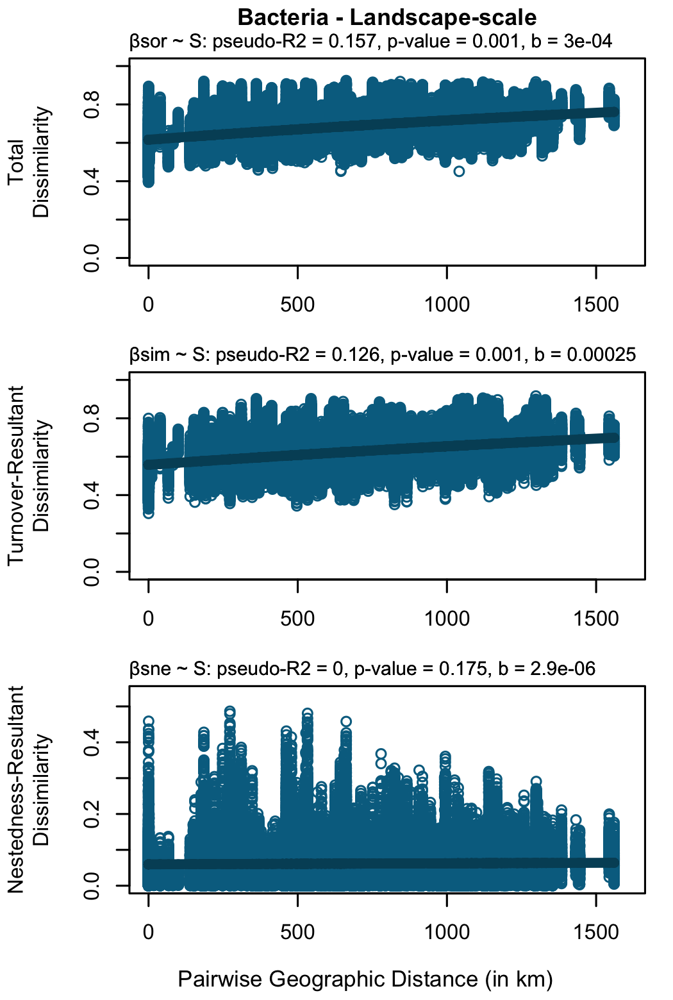
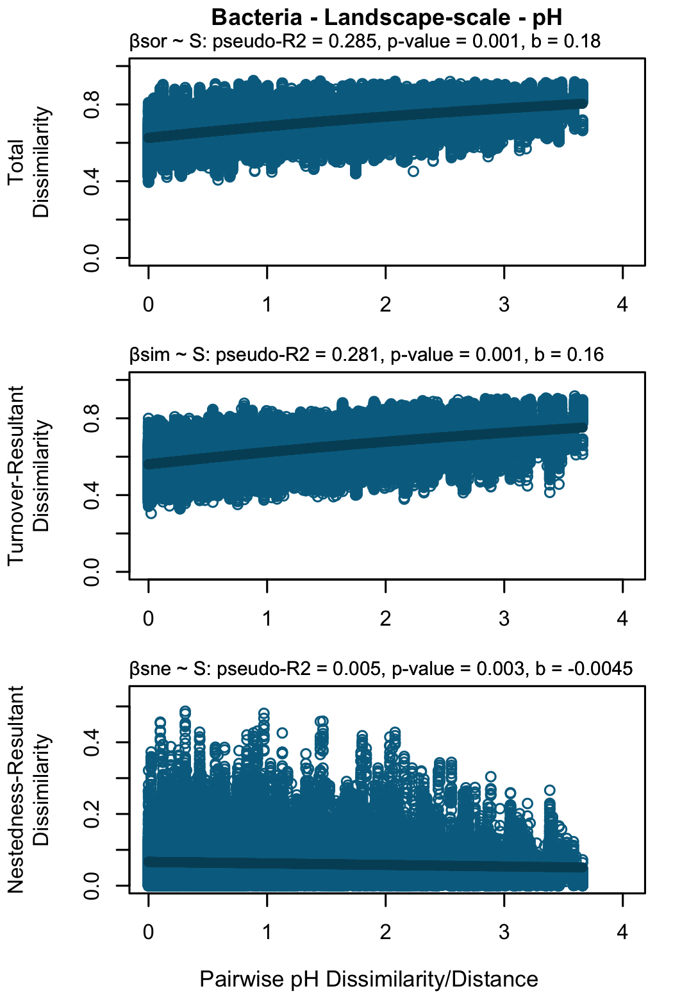
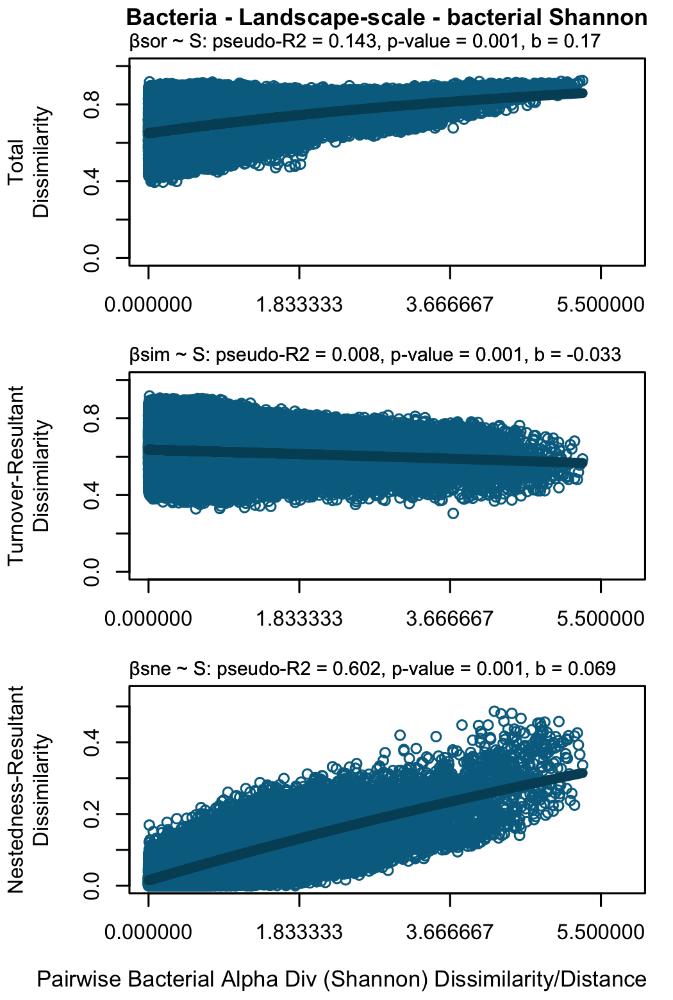
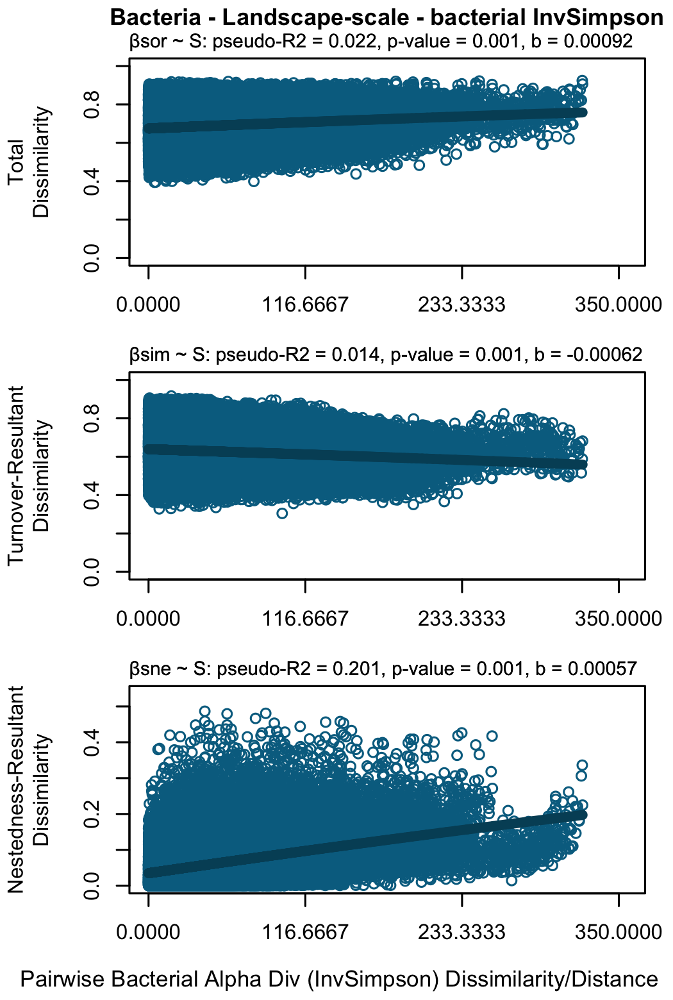
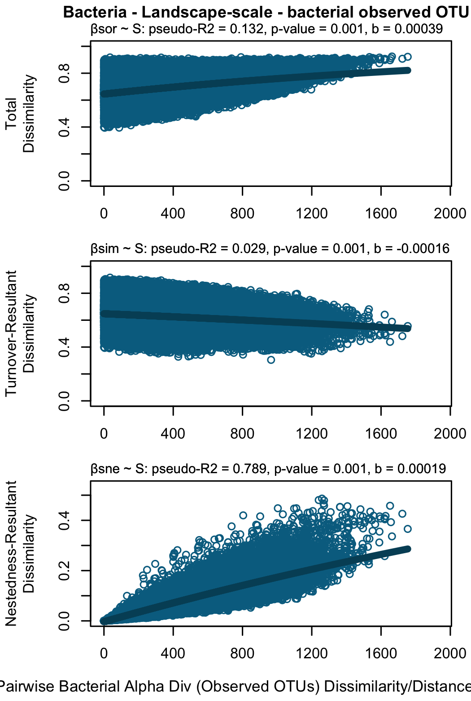

\

# Set-up {.unlisted .unnumbered .hidden}


## load packages


## load cache & rds


### Edaphic/environmental variables: generate distance matrices

### list of env var


``` r
vard_sample <- c("Site","Grass","Site_Grass","Grassland","Latitude","Longitude","Elevation_m")

vard_intpred <- c("Site","Grass","Site_Grass",
                  "Bac_sor_clusters","Fun_sor_clusters",
                  "nsamples_per_Site",
                  "nsamples_perBac_sor_clusters","nsamples_perFun_sor_clusters",
                  "ngrass_persite","ngrass_perBac_sor_clusters","ngrass_perFun_sor_clusters",
                  "nsamples_at_site_within_Fun_sor_clus2","ngrasses_at_site_within_Fun_sor_clus2",
                  "Bac_gamma_Site","Fun_gamma_Site",
                  "Bac_Observed","Fun_Observed",
                  "Bac_Chao1","Fun_Chao1",
                  "Bac_InvSimpson","Fun_InvSimpson",
                  "Bac_Shannon","Fun_Shannon")

vard_climate <- c("GDD3yr_m.std","ppt3yr_m.std")

vard_edaphic <- c("soil_water_content_m.std","pH_m.std","phos_m.std","ammonium_m.std","SOM_m.std")

vard_plant <- c("avg_SRL_m.std","avg_SLA_m.std","herbivory_perc_m.std")

vard_all <- c("Site","Grass","Site_Grass","Grassland","Latitude","Longitude","Elevation_m",
              "GDD3yr_m.std","ppt3yr_m.std",
              "soil_water_content_m.std","pH_m.std","phos_m.std","ammonium_m.std","SOM_m.std",
              "avg_SRL_m.std","avg_SLA_m.std","herbivory_perc_m.std",
              "Bac_sor_clusters","Fun_sor_clusters",
              "nsamples_per_Site",
              "nsamples_perBac_sor_clusters","nsamples_perFun_sor_clusters",
              "ngrass_persite","ngrass_perBac_sor_clusters","ngrass_perFun_sor_clusters",
              "nsamples_at_site_within_Fun_sor_clus2","ngrasses_at_site_within_Fun_sor_clus2",
                  "Bac_gamma_Site","Fun_gamma_Site",
                  "Bac_Observed","Fun_Observed",
                  "Bac_Chao1","Fun_Chao1",
                  "Bac_InvSimpson","Fun_InvSimpson",
                  "Bac_Shannon","Fun_Shannon")

vard_all_numeric <- c("Latitude","Longitude","Elevation_m",
              "GDD3yr_m.std","ppt3yr_m.std",
              "soil_water_content_m.std","pH_m.std","phos_m.std","ammonium_m.std","SOM_m.std",
              "avg_SRL_m.std","avg_SLA_m.std","herbivory_perc_m.std",
              "nsamples_per_Site",
              "nsamples_perBac_sor_clusters","nsamples_perFun_sor_clusters",
              "ngrass_persite","ngrass_perBac_sor_clusters","ngrass_perFun_sor_clusters",
              "nsamples_at_site_within_Fun_sor_clus2","ngrasses_at_site_within_Fun_sor_clus2",
                  "Bac_gamma_Site","Fun_gamma_Site",
                  "Bac_Observed","Fun_Observed",
                  "Bac_Chao1","Fun_Chao1",
                  "Bac_InvSimpson","Fun_InvSimpson",
                  "Bac_Shannon","Fun_Shannon")

vard_all_numeric_env <- c("GDD3yr_m.std","ppt3yr_m.std","soil_water_content_m.std","pH_m.std","phos_m.std","ammonium_m.std","SOM_m.std","avg_SRL_m.std","avg_SLA_m.std","herbivory_perc_m.std",
                          "nsamples_per_Site",
              "nsamples_perBac_sor_clusters","nsamples_perFun_sor_clusters",
              "ngrass_persite","ngrass_perBac_sor_clusters","ngrass_perFun_sor_clusters",
              "nsamples_at_site_within_Fun_sor_clus2","ngrasses_at_site_within_Fun_sor_clus2",
                  "Bac_gamma_Site","Fun_gamma_Site",
                  "Bac_Observed","Fun_Observed",
                  "Bac_Chao1","Fun_Chao1",
                  "Bac_InvSimpson","Fun_InvSimpson",
                  "Bac_Shannon","Fun_Shannon")

vard_all_numeric_intpred <- c("nsamples_per_Site",
                              "nsamples_perBac_sor_clusters","nsamples_perFun_sor_clusters",
              "ngrass_persite","ngrass_perBac_sor_clusters","ngrass_perFun_sor_clusters",
              "nsamples_at_site_within_Fun_sor_clus2","ngrasses_at_site_within_Fun_sor_clus2",
                  "Bac_gamma_Site","Fun_gamma_Site",
                  "Bac_Observed","Fun_Observed",
                  "Bac_Chao1","Fun_Chao1",
                  "Bac_InvSimpson","Fun_InvSimpson",
                  "Bac_Shannon","Fun_Shannon")
vard_all_numeric_env_intpred <-union(vard_all_numeric_env,vard_all_numeric_intpred)

vard_all_numeric_env_intpred_NOTSTD <- c("Latitude","Longitude","Elevation_m",
              "GDD3yr","ppt3yr",
              "soil_water_content","pH","phos","ammonium","SOM",
              "avg_SRL","avg_SLA","herbivory_perc",
                  "Bac_gamma_Site","Fun_gamma_Site",
                  "Bac_Observed","Fun_Observed",
                  "Bac_Chao1","Fun_Chao1",
                  "Bac_InvSimpson","Fun_InvSimpson",
                  "Bac_Shannon","Fun_Shannon",
              "nsamples_per_Site",
              "nsamples_perBac_sor_clusters","nsamples_perFun_sor_clusters",
              "ngrass_persite","ngrass_perBac_sor_clusters","ngrass_perFun_sor_clusters",
              "nsamples_at_site_within_Fun_sor_clus2","ngrasses_at_site_within_Fun_sor_clus2")
```

#### generate distance matrices of env var and Lat/long distance matrix calc


``` r
var_Fun_sor_clus2 <- levels(sd$Fun_sor_clus2)
var_Fun_sor_clusters <- levels(sd$Fun_sor_clusters)
var_Bac_sor_clusters <- levels(sd$Bac_sor_clusters)
var_Site <- levels(sd$Site)
var_Grass <- levels(sd$Grass)

# Create an empty list to store the distance matrices
env_dist_matrices <- list("all"=list(),"allNSTD"=list(),"Site"=list(),"Grass"=list(),"Bac_sor_clusters"=list(),
                          "Fun_sor_clusters"=list(),"Fun_sor_clus2"=list())

  
# all
for (var in vard_all_numeric_env_intpred) {
  # Calculate geodistance matrices 
  Bac_all.geo<-as(subset(sd, select = c(Longitude,Latitude)), "data.frame")
  Bac_all.geodist_mat <- as.dist(geodist(Bac_all.geo, measure = 'geodesic' )/1000) #converting it to km
  
  Fun_all.geo<-as(subset(sd, select = c(Longitude,Latitude)), "data.frame")
  Fun_all.geodist_mat <- as.dist(geodist(Fun_all.geo, measure = 'geodesic' )/1000) #converting it to km
  
  # Store the geodist matrices in the list using variable name as key
  env_dist_matrices$all[["geodist_Bac"]] <- Bac_all.geodist_mat
  env_dist_matrices$all[["geodist_Fun"]] <- Fun_all.geodist_mat

  # Subset the data for the current variable
  Bac_subset <- subset(as.data.frame(sample_data(Bac_wholecommunity)), select = var)
  Fun_subset <- subset(as.data.frame(sample_data(Fun_wholecommunity)), select = var)
  
  # Calculate distance matrices and store them in the list
  Bac_dist_matrix <- dist(Bac_subset, method = "euclidean", diag = TRUE, upper = FALSE)
  Fun_dist_matrix <- dist(Fun_subset, method = "euclidean", diag = TRUE, upper = FALSE)
  
  # Store the matrices in the list using variable name as key
  env_dist_matrices$all[[paste0(var,"_Bac")]] <- Bac_dist_matrix
  env_dist_matrices$all[[paste0(var,"_Fun")]] <- Fun_dist_matrix

}

# allNSTD NOT STANDARDIZED
for (var in vard_all_numeric_env_intpred_NOTSTD) {
  # Calculate geodistance matrices 
  Bac_all.geo<-as(subset(sd, select = c(Longitude,Latitude)), "data.frame")
  Bac_all.geodist_mat <- as.dist(geodist(Bac_all.geo, measure = 'geodesic' )/1000) #converting it to km
  
  Fun_all.geo<-as(subset(sd, select = c(Longitude,Latitude)), "data.frame")
  Fun_all.geodist_mat <- as.dist(geodist(Fun_all.geo, measure = 'geodesic' )/1000) #converting it to km
  
  # Store the geodist matrices in the list using variable name as key
  env_dist_matrices$allNSTD[["geodist_Bac"]] <- Bac_all.geodist_mat
  env_dist_matrices$allNSTD[["geodist_Fun"]] <- Fun_all.geodist_mat

  # Subset the data for the current variable
  Bac_subset <- subset(as.data.frame(sample_data(Bac_wholecommunity)), select = var)
  Fun_subset <- subset(as.data.frame(sample_data(Fun_wholecommunity)), select = var)
  
  # Calculate distance matrices and store them in the list
  Bac_dist_matrix <- dist(Bac_subset, method = "euclidean", diag = TRUE, upper = FALSE)
  Fun_dist_matrix <- dist(Fun_subset, method = "euclidean", diag = TRUE, upper = FALSE)
  
  # Store the matrices in the list using variable name as key
  env_dist_matrices$allNSTD[[paste0(var,"_Bac")]] <- Bac_dist_matrix
  env_dist_matrices$allNSTD[[paste0(var,"_Fun")]] <- Fun_dist_matrix

}


# var_Site
for (var in var_Site) {
  # Subset the data for the current variable
  sd_subset <- subset(sd, Site == var)
  
  subset.geo<-as(subset(sd_subset, select = c(Longitude,Latitude)), "data.frame")
  subset.geodist_mat <- as.dist(geodist(subset.geo, measure = 'geodesic' )/1000) #convert to km

  # Store the matrices in the list using variable name as key
  env_dist_matrices$Site[[paste0(var,"_geodist")]] <- subset.geodist_mat
  
  for (var2 in vard_all_numeric_env_intpred) {
    sd_subsubset <- subset(sd_subset, select = var2)
  
    # Calculate distance matrices and store them in the list
    subset_dist_matrix <- dist(sd_subsubset, method = "euclidean", diag = T, upper = F)
  
    # Store the matrices in the list using variable name as key
    env_dist_matrices$Site[[paste0(var,"_",var2)]] <- subset_dist_matrix
  }
}

# var_Grass
for (var in var_Grass) {
  # Subset the data for the current variable
  sd_subset <- subset(sd, Grass == var)
  
  subset.geo<-as(subset(sd_subset, select = c(Longitude,Latitude)), "data.frame")
  subset.geodist_mat <- as.dist(geodist(subset.geo, measure = 'geodesic' )/1000) #convert to km

  # Store the matrices in the list using variable name as key
  env_dist_matrices$Grass[[paste0(var,"_geodist")]] <- subset.geodist_mat
  
  for (var2 in vard_all_numeric_env_intpred) {
    sd_subsubset <- subset(sd_subset, select = var2)
  
    # Calculate distance matrices and store them in the list
    subset_dist_matrix <- dist(sd_subsubset, method = "euclidean", diag = T, upper = F)
  
    # Store the matrices in the list using variable name as key
    env_dist_matrices$Grass[[paste0(var,"_",var2)]] <- subset_dist_matrix
  }
}

# var_Bac_sor_clusters
for (var in var_Bac_sor_clusters) {
  # Subset the data for the current variable
  sd_subset <- subset(sd, Bac_sor_clusters == var)
  
  subset.geo<-as(subset(sd_subset, select = c(Longitude,Latitude)), "data.frame")
  subset.geodist_mat <- as.dist(geodist(subset.geo, measure = 'geodesic' )/1000) #convert to km

  # Store the matrices in the list using variable name as key
  env_dist_matrices$Bac_sor_clusters[[paste0(var,"_geodist")]] <- subset.geodist_mat
  
  for (var2 in vard_all_numeric_env_intpred) {
    sd_subsubset <- subset(sd_subset, select = var2)
  
    # Calculate distance matrices and store them in the list
    subset_dist_matrix <- dist(sd_subsubset, method = "euclidean", diag = T, upper = F)
  
    # Store the matrices in the list using variable name as key
    env_dist_matrices$Bac_sor_clusters[[paste0(var,"_",var2)]] <- subset_dist_matrix
  }
}

# var_Fun_sor_clusters
for (var in var_Fun_sor_clusters) {
  # Subset the data for the current variable
  sd_subset <- subset(sd, Fun_sor_clusters == var)
  
  subset.geo<-as(subset(sd_subset, select = c(Longitude,Latitude)), "data.frame")
  subset.geodist_mat <- as.dist(geodist(subset.geo, measure = 'geodesic' )/1000) #convert to km

  # Store the matrices in the list using variable name as key
  env_dist_matrices$Fun_sor_clusters[[paste0(var,"_geodist")]] <- subset.geodist_mat
  
  for (var2 in vard_all_numeric_env_intpred) {
    sd_subsubset <- subset(sd_subset, select = var2)
  
    # Calculate distance matrices and store them in the list
    subset_dist_matrix <- dist(sd_subsubset, method = "euclidean", diag = T, upper = F)
  
    # Store the matrices in the list using variable name as key
    env_dist_matrices$Fun_sor_clusters[[paste0(var,"_",var2)]] <- subset_dist_matrix
  }
}

# var_Fun_sor_clus2
for (var in var_Fun_sor_clus2) {
  # Subset the data for the current variable
  sd_subset <- subset(sd, Fun_sor_clus2 == var)
  
  subset.geo<-as(subset(sd_subset, select = c(Longitude,Latitude)), "data.frame")
  subset.geodist_mat <- as.dist(geodist(subset.geo, measure = 'geodesic' )/1000) #convert to km

  # Store the matrices in the list using variable name as key
  env_dist_matrices$Fun_sor_clus2[[paste0(var,"_geodist")]] <- subset.geodist_mat
  
  for (var2 in vard_all_numeric_env_intpred) {
    sd_subsubset <- subset(sd_subset, select = var2)
  
    # Calculate distance matrices and store them in the list
    subset_dist_matrix <- dist(sd_subsubset, method = "euclidean", diag = T, upper = F)
  
    # Store the matrices in the list using variable name as key
    env_dist_matrices$Fun_sor_clus2[[paste0(var,"_",var2)]] <- subset_dist_matrix
  }
}

# var_Grass


# saveRDS(env_dist_matrices, file = "../processed_data/clean_rds_saves/env_dist_matrices_MRM.rds")

saveRDS(env_dist_matrices, file = "../docs/processed_data/clean_rds_saves/env_dist_matrices_MRM.rds")
```


\
\

## load functions


------------------------------------------------------------------------

------------------------------------------------------------------------

\
\

# Results

## Results - Bacteria

\

### Landscape-scale: All samples (agnostic to site) {.tabset}

#### Pure spatial effects (S)

Distance-decay relationships between geographic distance (in km) between communities and i) total community pairwise dissimilarity (β~sor~), ii) spatial turnover-resultant dissimilarity (β~sim~), and iii) nestedness-resultant dissimilarity (β~sne~) using 1,000 permutations. Differences between bacterial and fungal model parameters were assessed via block-site bootstrap whether the parameters of both models are equal (n = 1,000 bootstrap resamples). Both tests were conducted independently, one for the equality of the first parameters of both models, another for the equality of the second parameters (slopes) of both models.


The main current hypotheses about the origin of beta diversity are as follows:

1) Species composition is uniform over large areas. This hypothesis, which plays the role of a null model, emphasizes the role of biological interactions. It suggests that communities are dominated by a limited suite of competitively superior species (Pitman et al. 1999, 2001); beta diversity is small.

2) Species composition fluctuates in a random, autocorrelated way. This hypothesis emphasizes spatially limited dispersal history. Models derived from neutral theory state that all species are demographically and competitively equal. Differences are created through spatially limited dispersal of species drawn at random from a metacommunity, plus possibly the appearance of newly evolved species in different areas. Neutral models differ in the details of the mechanisms that they invoke (Bell 2001, Hubbell 2001, He 2005).

3) Species distributions are related to environmental conditions. This hypothesis emphasizes environmental control. Landscapes are mosaics where species composition is controlled by environmental site characteristics (Whittaker 1956, Bray and Curtis 1957, Hutchinson 1957, Gentry 1988, Tuomisto et al. 1995).

Testing these hypotheses is important for understanding the functioning of ecosystems, for the conservation of biodiversity, and for ecosystem management. Regarding the establishment of natural reserves, e.g., hypothesis 1 implies that all parts of the ecosystem are equivalent. Reserves can be located anywhere. Hypothesis 2 implies that different parts of the ecosystem may, for historical reasons, sustain different species compositions, although these parts are environmentally equivalent. Portions of space supporting the different species compositions should be preserved. Reserves must be large, allowing the dynamics to go on without many species going extinct. Hypothesis 3 implies that all parts of the ecosystem are not equivalent. Reserves must represent the different types of habitat and each portion must be of sufficient size to be sustainable. The parts representing favorable dispersion routes must be especially preserved.
(https://esajournals.onlinelibrary.wiley.com/doi/10.1890/05-0549)


When studying the origin of beta diversity, one must consider different hypotheses and answer the following questions. (1) Is the variation in species composition among sites random, i.e., devoid of significant spatial pattern? A positive answer will support hypothesis 1. (2) Is there significant spatial patchiness (different from random) in the distributions of species? A positive answer will support hypothesis 2, and possibly hypothesis 3 if the environmental variables influencing species distributions are spatially structured. (3) Can the environmental variables explain a significant proportion of the community composition variation? A positive answer will support hypothesis 3, which is compatible with hypothesis 2.

Empirical data must be used to determine the likelihood of each hypothesis in different systems and at different spatial scales. To test these hypotheses, the variation of community composition at many sites must be analyzed to determine if significant spatial patterns (different from random) are present in the data and if the environmental variables explain a significant proportion of the community composition variation. In this contribution, we explain how hypotheses about the origin of beta diversity can be tested by partitioning the spatial variation of community composition (presence– absence or abundance data) with respect to environmental variables and spatial base functions. Next we set out to assess the appropriateness and robustness of two partitioning approaches used by researchers to assess the likelihood of different mechanisms structuring beta diversity.

<table class="table table-striped table-hover table-condensed table-responsive" style="margin-left: auto; margin-right: auto;">
<caption>(\#tab:display-MRM-Spatial-rawresults-Bac)MRM results for all bacterial samples assessing βsor ~ S (Spatial - geographic distance)</caption>
 <thead>
<tr><th style="border-bottom:hidden;padding-bottom:0; padding-left:3px;padding-right:3px;text-align: left; font-style: italic; " colspan="3"><div style="border-bottom: 1px solid #ddd; padding-bottom: 5px; ">Model Rsquared = 0.153 (p-value = 0.001)</div></th></tr>
<tr><th style="border-bottom:hidden;padding-bottom:0; padding-left:3px;padding-right:3px;text-align: left; font-style: italic; " colspan="3"><div style="border-bottom: 1px solid #ddd; padding-bottom: 5px; ">Model F.test = 21111.86 (F.p-value = 0.001)</div></th></tr>
  <tr>
   <th style="text-align:left;"> terms </th>
   <th style="text-align:center;"> coef </th>
   <th style="text-align:center;"> p.value </th>
  </tr>
 </thead>
<tbody>
  <tr>
   <td style="text-align:left;"> Intercept </td>
   <td style="text-align:center;color: white !important;background-color: rgba(67, 191, 113, 255) !important;"> 0.6227 </td>
   <td style="text-align:center;"> 1.000 </td>
  </tr>
  <tr>
   <td style="text-align:left;"> geodist </td>
   <td style="text-align:center;color: white !important;background-color: rgba(68, 1, 84, 255) !important;"> 0.0001 </td>
   <td style="text-align:center;"> 0.001 </td>
  </tr>
</tbody>
</table>

\

##### Spatial decay plots




\

#### Pure environmental effects (E) {.tabset .tabset-pills}

##### Climate

<table class="table table-striped table-hover table-condensed table-responsive" style="margin-left: auto; margin-right: auto;">
<caption>(\#tab:display-MRM-E-Climate-rawresults-Bac)MRM results for all bacterial samples assessing βsor ~ E_climate (Environmental - Climate)</caption>
 <thead>
<tr><th style="border-bottom:hidden;padding-bottom:0; padding-left:3px;padding-right:3px;text-align: left; font-style: italic; " colspan="3"><div style="border-bottom: 1px solid #ddd; padding-bottom: 5px; ">Model Rsquared = 0.1837 (p-value = 0.001)</div></th></tr>
<tr><th style="border-bottom:hidden;padding-bottom:0; padding-left:3px;padding-right:3px;text-align: left; font-style: italic; " colspan="3"><div style="border-bottom: 1px solid #ddd; padding-bottom: 5px; ">Model F.test = 13152.66 (F.p-value = 0.001)</div></th></tr>
  <tr>
   <th style="text-align:left;"> terms </th>
   <th style="text-align:center;"> coef </th>
   <th style="text-align:center;"> p.value </th>
  </tr>
 </thead>
<tbody>
  <tr>
   <td style="text-align:left;"> Intercept </td>
   <td style="text-align:center;color: white !important;background-color: rgba(67, 191, 113, 255) !important;"> 0.6412 </td>
   <td style="text-align:center;"> 0.001 </td>
  </tr>
  <tr>
   <td style="text-align:left;"> ppt3yr </td>
   <td style="text-align:center;color: white !important;background-color: rgba(72, 21, 103, 255) !important;"> 0.0455 </td>
   <td style="text-align:center;"> 0.001 </td>
  </tr>
  <tr>
   <td style="text-align:left;"> GDD3yr </td>
   <td style="text-align:center;color: white !important;background-color: rgba(68, 1, 84, 255) !important;"> -0.0037 </td>
   <td style="text-align:center;"> 0.033 </td>
  </tr>
</tbody>
</table>

\

##### Edaphic

<table class="table table-striped table-hover table-condensed table-responsive" style="margin-left: auto; margin-right: auto;">
<caption>(\#tab:display-MRM-E-Edaphic-rawresults-Bac)MRM results for all bacterial samples assessing βsor ~ E_edaphic (Environmental - Edaphic)</caption>
 <thead>
<tr><th style="border-bottom:hidden;padding-bottom:0; padding-left:3px;padding-right:3px;text-align: left; font-style: italic; " colspan="3"><div style="border-bottom: 1px solid #ddd; padding-bottom: 5px; ">Model Rsquared = 0.3274 (p-value = 0.001)</div></th></tr>
<tr><th style="border-bottom:hidden;padding-bottom:0; padding-left:3px;padding-right:3px;text-align: left; font-style: italic; " colspan="3"><div style="border-bottom: 1px solid #ddd; padding-bottom: 5px; ">Model F.test = 14226.63 (F.p-value = 0.001)</div></th></tr>
  <tr>
   <th style="text-align:left;"> terms </th>
   <th style="text-align:center;"> coef </th>
   <th style="text-align:center;"> p.value </th>
  </tr>
 </thead>
<tbody>
  <tr>
   <td style="text-align:left;"> Intercept </td>
   <td style="text-align:center;color: white !important;background-color: rgba(67, 191, 113, 255) !important;"> 0.6115 </td>
   <td style="text-align:center;"> 0.001 </td>
  </tr>
  <tr>
   <td style="text-align:left;"> pH </td>
   <td style="text-align:center;color: white !important;background-color: rgba(72, 22, 104, 255) !important;"> 0.0490 </td>
   <td style="text-align:center;"> 0.001 </td>
  </tr>
  <tr>
   <td style="text-align:left;"> soil_water_content </td>
   <td style="text-align:center;color: white !important;background-color: rgba(70, 7, 90, 255) !important;"> 0.0135 </td>
   <td style="text-align:center;"> 0.001 </td>
  </tr>
  <tr>
   <td style="text-align:left;"> ammonium </td>
   <td style="text-align:center;color: white !important;background-color: rgba(69, 4, 87, 255) !important;"> 0.0074 </td>
   <td style="text-align:center;"> 0.140 </td>
  </tr>
  <tr>
   <td style="text-align:left;"> phos </td>
   <td style="text-align:center;color: white !important;background-color: rgba(68, 1, 84, 255) !important;"> 0.0003 </td>
   <td style="text-align:center;"> 0.949 </td>
  </tr>
</tbody>
</table>

\

##### Plant-Associated

<table class="table table-striped table-hover table-condensed table-responsive" style="margin-left: auto; margin-right: auto;">
<caption>(\#tab:display-MRM-E-Plant-rawresults-Bac)MRM results for all bacterial samples assessing βsor ~ E_plant (Environmental - Plant-Associated)</caption>
 <thead>
<tr><th style="border-bottom:hidden;padding-bottom:0; padding-left:3px;padding-right:3px;text-align: left; font-style: italic; " colspan="3"><div style="border-bottom: 1px solid #ddd; padding-bottom: 5px; ">Model Rsquared = 0.0176 (p-value = 0.001)</div></th></tr>
<tr><th style="border-bottom:hidden;padding-bottom:0; padding-left:3px;padding-right:3px;text-align: left; font-style: italic; " colspan="3"><div style="border-bottom: 1px solid #ddd; padding-bottom: 5px; ">Model F.test = 696.27 (F.p-value = 0.001)</div></th></tr>
  <tr>
   <th style="text-align:left;"> terms </th>
   <th style="text-align:center;"> coef </th>
   <th style="text-align:center;"> p.value </th>
  </tr>
 </thead>
<tbody>
  <tr>
   <td style="text-align:left;"> Intercept </td>
   <td style="text-align:center;color: white !important;background-color: rgba(67, 191, 113, 255) !important;"> 0.6850 </td>
   <td style="text-align:center;"> 0.346 </td>
  </tr>
  <tr>
   <td style="text-align:left;"> herbivory_perc </td>
   <td style="text-align:center;color: white !important;background-color: rgba(70, 7, 90, 255) !important;"> 0.0104 </td>
   <td style="text-align:center;"> 0.001 </td>
  </tr>
  <tr>
   <td style="text-align:left;"> avg_SRL </td>
   <td style="text-align:center;color: white !important;background-color: rgba(68, 1, 84, 255) !important;"> -0.0053 </td>
   <td style="text-align:center;"> 0.010 </td>
  </tr>
  <tr>
   <td style="text-align:left;"> avg_SLA </td>
   <td style="text-align:center;color: white !important;background-color: rgba(68, 3, 86, 255) !important;"> -0.0002 </td>
   <td style="text-align:center;"> 0.936 </td>
  </tr>
</tbody>
</table>

\

##### All Environmental (Climate, Edaphic, Plant-Assoc.) {.tabset .tabset-pills}

###### All environmental variables (Full model)

<table class="table table-striped table-hover table-condensed table-responsive" style="margin-left: auto; margin-right: auto;">
<caption>(\#tab:display-MRM-E-All-rawresults-Bac)MRM results full model for all bacterial samples assessing βsor ~ E_all (Environmental - Climate, Edaphic, and Plant-Associated)</caption>
 <thead>
<tr><th style="border-bottom:hidden;padding-bottom:0; padding-left:3px;padding-right:3px;text-align: left; font-style: italic; " colspan="3"><div style="border-bottom: 1px solid #ddd; padding-bottom: 5px; ">Model Rsquared = 0.418 (p-value = 0.001)</div></th></tr>
<tr><th style="border-bottom:hidden;padding-bottom:0; padding-left:3px;padding-right:3px;text-align: left; font-style: italic; " colspan="3"><div style="border-bottom: 1px solid #ddd; padding-bottom: 5px; ">Model F.test = 9328.39 (F.p-value = 0.001)</div></th></tr>
  <tr>
   <th style="text-align:left;"> terms </th>
   <th style="text-align:center;"> coef </th>
   <th style="text-align:center;"> p.value </th>
  </tr>
 </thead>
<tbody>
  <tr>
   <td style="text-align:left;"> Intercept </td>
   <td style="text-align:center;color: white !important;background-color: rgba(67, 191, 113, 255) !important;"> 0.5806 </td>
   <td style="text-align:center;"> 0.001 </td>
  </tr>
  <tr>
   <td style="text-align:left;"> pH </td>
   <td style="text-align:center;color: white !important;background-color: rgba(72, 23, 105, 255) !important;"> 0.0448 </td>
   <td style="text-align:center;"> 0.001 </td>
  </tr>
  <tr>
   <td style="text-align:left;"> ppt3yr </td>
   <td style="text-align:center;color: white !important;background-color: rgba(71, 16, 99, 255) !important;"> 0.0301 </td>
   <td style="text-align:center;"> 0.001 </td>
  </tr>
  <tr>
   <td style="text-align:left;"> herbivory_perc </td>
   <td style="text-align:center;color: white !important;background-color: rgba(69, 6, 90, 255) !important;"> 0.0098 </td>
   <td style="text-align:center;"> 0.001 </td>
  </tr>
  <tr>
   <td style="text-align:left;"> soil_water_content </td>
   <td style="text-align:center;color: white !important;background-color: rgba(69, 5, 89, 255) !important;"> 0.0065 </td>
   <td style="text-align:center;"> 0.003 </td>
  </tr>
  <tr>
   <td style="text-align:left;"> phos </td>
   <td style="text-align:center;color: white !important;background-color: rgba(69, 4, 87, 255) !important;"> 0.0038 </td>
   <td style="text-align:center;"> 0.452 </td>
  </tr>
  <tr>
   <td style="text-align:left;"> GDD3yr </td>
   <td style="text-align:center;color: white !important;background-color: rgba(68, 3, 86, 255) !important;"> 0.0027 </td>
   <td style="text-align:center;"> 0.077 </td>
  </tr>
  <tr>
   <td style="text-align:left;"> avg_SRL </td>
   <td style="text-align:center;color: white !important;background-color: rgba(68, 1, 84, 255) !important;"> -0.0023 </td>
   <td style="text-align:center;"> 0.115 </td>
  </tr>
  <tr>
   <td style="text-align:left;"> avg_SLA </td>
   <td style="text-align:center;color: white !important;background-color: rgba(68, 3, 86, 255) !important;"> 0.0022 </td>
   <td style="text-align:center;"> 0.116 </td>
  </tr>
  <tr>
   <td style="text-align:left;"> ammonium </td>
   <td style="text-align:center;color: white !important;background-color: rgba(68, 1, 86, 255) !important;"> 0.0003 </td>
   <td style="text-align:center;"> 0.957 </td>
  </tr>
</tbody>
</table>

\

###### Down-selected model


All predictor variables included in down-selected MRM model if $P$-value ≤ 0.05 and the order of model terms was determined by ranking the absolute value of the regression coefficients for the significant model terms.\

*Not significant:* GDD3yr, phos, ammonium, avg_SRL, avg_SLA\


**Down-selected model summary:**\

$R^2$-value = 0.418, $P$-value = 0.001, $F_{test}$ = 9328.39, $F_{test}-Pvalue$ = 0.001

   -These terms were significant ($P$-value < 0.05): Intercept, pH, ppt3yr, herbivory_perc, soil_water_content (sorted by decreasing coefficient)
   \

<table class="table table-striped table-hover table-condensed table-responsive" style="margin-left: auto; margin-right: auto;">
<caption>(\#tab:display-MRM-E-All-rawresults-DS-Bac)MRM results down-selected model for all bacterial samples assessing βsor ~ E_all (Environmental - Climate, Edaphic, and Plant-Associated)</caption>
 <thead>
<tr><th style="border-bottom:hidden;padding-bottom:0; padding-left:3px;padding-right:3px;text-align: left; font-style: italic; " colspan="3"><div style="border-bottom: 1px solid #ddd; padding-bottom: 5px; ">Model Rsquared = 0.4164 (p-value = 0.001)</div></th></tr>
<tr><th style="border-bottom:hidden;padding-bottom:0; padding-left:3px;padding-right:3px;text-align: left; font-style: italic; " colspan="3"><div style="border-bottom: 1px solid #ddd; padding-bottom: 5px; ">Model F.test = 16677.88 (F.p-value = 0.001)</div></th></tr>
  <tr>
   <th style="text-align:left;"> terms </th>
   <th style="text-align:center;"> coef </th>
   <th style="text-align:center;"> p.value </th>
  </tr>
 </thead>
<tbody>
  <tr>
   <td style="text-align:left;"> Intercept </td>
   <td style="text-align:center;color: white !important;background-color: rgba(67, 191, 113, 255) !important;"> 0.5811 </td>
   <td style="text-align:center;"> 0.001 </td>
  </tr>
  <tr>
   <td style="text-align:left;"> pH </td>
   <td style="text-align:center;color: white !important;background-color: rgba(72, 20, 102, 255) !important;"> 0.0448 </td>
   <td style="text-align:center;"> 0.001 </td>
  </tr>
  <tr>
   <td style="text-align:left;"> ppt3yr </td>
   <td style="text-align:center;color: white !important;background-color: rgba(71, 13, 96, 255) !important;"> 0.0309 </td>
   <td style="text-align:center;"> 0.001 </td>
  </tr>
  <tr>
   <td style="text-align:left;"> herbivory_perc </td>
   <td style="text-align:center;color: white !important;background-color: rgba(69, 4, 87, 255) !important;"> 0.0095 </td>
   <td style="text-align:center;"> 0.001 </td>
  </tr>
  <tr>
   <td style="text-align:left;"> soil_water_content </td>
   <td style="text-align:center;color: white !important;background-color: rgba(69, 4, 87, 255) !important;"> 0.0090 </td>
   <td style="text-align:center;"> 0.001 </td>
  </tr>
  <tr>
   <td style="text-align:left;"> GDD3yr </td>
   <td style="text-align:center;color: white !important;background-color: rgba(68, 1, 84, 255) !important;"> 0.0029 </td>
   <td style="text-align:center;"> 0.045 </td>
  </tr>
</tbody>
</table>

\

#### Mixed effects (E \* S) {.tabset .tabset-pills}

##### All variables (Full model)

<table class="table table-striped table-hover table-condensed table-responsive" style="margin-left: auto; margin-right: auto;">
<caption>(\#tab:display-MRM-ES-All-rawresults-Bac)MRM results full mixed model for all bacterial samples assessing βsor ~ E*S (Environmental - Climate, Edaphic, and Plant-Associated)</caption>
 <thead>
<tr><th style="border-bottom:hidden;padding-bottom:0; padding-left:3px;padding-right:3px;text-align: left; font-style: italic; " colspan="3"><div style="border-bottom: 1px solid #ddd; padding-bottom: 5px; ">Model Rsquared = 0.4327 (p-value = 0.001)</div></th></tr>
<tr><th style="border-bottom:hidden;padding-bottom:0; padding-left:3px;padding-right:3px;text-align: left; font-style: italic; " colspan="3"><div style="border-bottom: 1px solid #ddd; padding-bottom: 5px; ">Model F.test = 8915.54 (F.p-value = 0.001)</div></th></tr>
  <tr>
   <th style="text-align:left;"> terms </th>
   <th style="text-align:center;"> coef </th>
   <th style="text-align:center;"> p.value </th>
  </tr>
 </thead>
<tbody>
  <tr>
   <td style="text-align:left;"> Intercept </td>
   <td style="text-align:center;color: white !important;background-color: rgba(67, 191, 113, 255) !important;"> 0.5700 </td>
   <td style="text-align:center;"> 0.001 </td>
  </tr>
  <tr>
   <td style="text-align:left;"> pH </td>
   <td style="text-align:center;color: white !important;background-color: rgba(72, 23, 105, 255) !important;"> 0.0439 </td>
   <td style="text-align:center;"> 0.001 </td>
  </tr>
  <tr>
   <td style="text-align:left;"> ppt3yr </td>
   <td style="text-align:center;color: white !important;background-color: rgba(71, 12, 95, 255) !important;"> 0.0210 </td>
   <td style="text-align:center;"> 0.001 </td>
  </tr>
  <tr>
   <td style="text-align:left;"> herbivory_perc </td>
   <td style="text-align:center;color: white !important;background-color: rgba(69, 6, 90, 255) !important;"> 0.0096 </td>
   <td style="text-align:center;"> 0.001 </td>
  </tr>
  <tr>
   <td style="text-align:left;"> soil_water_content </td>
   <td style="text-align:center;color: white !important;background-color: rgba(69, 5, 89, 255) !important;"> 0.0060 </td>
   <td style="text-align:center;"> 0.006 </td>
  </tr>
  <tr>
   <td style="text-align:left;"> ammonium </td>
   <td style="text-align:center;color: white !important;background-color: rgba(69, 4, 87, 255) !important;"> 0.0038 </td>
   <td style="text-align:center;"> 0.402 </td>
  </tr>
  <tr>
   <td style="text-align:left;"> avg_SRL </td>
   <td style="text-align:center;color: white !important;background-color: rgba(68, 1, 84, 255) !important;"> -0.0027 </td>
   <td style="text-align:center;"> 0.062 </td>
  </tr>
  <tr>
   <td style="text-align:left;"> avg_SLA </td>
   <td style="text-align:center;color: white !important;background-color: rgba(68, 3, 86, 255) !important;"> 0.0018 </td>
   <td style="text-align:center;"> 0.192 </td>
  </tr>
  <tr>
   <td style="text-align:left;"> GDD3yr </td>
   <td style="text-align:center;color: white !important;background-color: rgba(68, 1, 86, 255) !important;"> -0.0009 </td>
   <td style="text-align:center;"> 0.618 </td>
  </tr>
  <tr>
   <td style="text-align:left;"> phos </td>
   <td style="text-align:center;color: white !important;background-color: rgba(68, 1, 86, 255) !important;"> -0.0005 </td>
   <td style="text-align:center;"> 0.908 </td>
  </tr>
  <tr>
   <td style="text-align:left;"> geodist </td>
   <td style="text-align:center;color: white !important;background-color: rgba(68, 1, 86, 255) !important;"> 0.0000 </td>
   <td style="text-align:center;"> 0.001 </td>
  </tr>
</tbody>
</table>

\

##### Down-selected model


\

All predictor variables included in down-selected MRM model if $P$-value ≤ 0.05 and the order of model terms was determined by ranking the absolute value of the regression coefficients for the significant model terms.\

*Not significant:* GDD3yr, phos, ammonium, avg_SRL, avg_SLA\


**Down-selected model summary:**\

$R^2$-value = 0.4327, $P$-value = 0.001, $F_{test}$ = 8915.54, $F_{test}-Pvalue$ = 0.001

   -These terms were significant ($P$-value < 0.05): Intercept, pH, ppt3yr, herbivory_perc, soil_water_content, geodist (sorted by decreasing coefficient)
   \


<table class="table table-striped table-hover table-condensed table-responsive" style="margin-left: auto; margin-right: auto;">
<caption>(\#tab:display-MRM-ES-All-rawresults-DS-Bac)MRM results down-selected mixed model for all bacterial samples assessing βsor ~ E*S (Environmental - Climate, Edaphic, and Plant-Associated)</caption>
 <thead>
<tr><th style="border-bottom:hidden;padding-bottom:0; padding-left:3px;padding-right:3px;text-align: left; font-style: italic; " colspan="3"><div style="border-bottom: 1px solid #ddd; padding-bottom: 5px; ">Model Rsquared = 0.4318 (p-value = 0.001)</div></th></tr>
<tr><th style="border-bottom:hidden;padding-bottom:0; padding-left:3px;padding-right:3px;text-align: left; font-style: italic; " colspan="3"><div style="border-bottom: 1px solid #ddd; padding-bottom: 5px; ">Model F.test = 14800.58 (F.p-value = 0.001)</div></th></tr>
  <tr>
   <th style="text-align:left;"> terms </th>
   <th style="text-align:center;"> coef </th>
   <th style="text-align:center;"> p.value </th>
  </tr>
 </thead>
<tbody>
  <tr>
   <td style="text-align:left;"> Intercept </td>
   <td style="text-align:center;color: white !important;background-color: rgba(67, 191, 113, 255) !important;"> 0.5720 </td>
   <td style="text-align:center;"> 0.001 </td>
  </tr>
  <tr>
   <td style="text-align:left;"> pH </td>
   <td style="text-align:center;color: white !important;background-color: rgba(72, 23, 105, 255) !important;"> 0.0438 </td>
   <td style="text-align:center;"> 0.001 </td>
  </tr>
  <tr>
   <td style="text-align:left;"> ppt3yr </td>
   <td style="text-align:center;color: white !important;background-color: rgba(71, 12, 95, 255) !important;"> 0.0214 </td>
   <td style="text-align:center;"> 0.001 </td>
  </tr>
  <tr>
   <td style="text-align:left;"> herbivory_perc </td>
   <td style="text-align:center;color: white !important;background-color: rgba(69, 6, 90, 255) !important;"> 0.0095 </td>
   <td style="text-align:center;"> 0.001 </td>
  </tr>
  <tr>
   <td style="text-align:left;"> soil_water_content </td>
   <td style="text-align:center;color: white !important;background-color: rgba(69, 6, 90, 255) !important;"> 0.0080 </td>
   <td style="text-align:center;"> 0.001 </td>
  </tr>
  <tr>
   <td style="text-align:left;"> avg_SRL </td>
   <td style="text-align:center;color: white !important;background-color: rgba(68, 1, 84, 255) !important;"> -0.0025 </td>
   <td style="text-align:center;"> 0.091 </td>
  </tr>
  <tr>
   <td style="text-align:left;"> geodist </td>
   <td style="text-align:center;color: white !important;background-color: rgba(68, 1, 86, 255) !important;"> 0.0000 </td>
   <td style="text-align:center;"> 0.001 </td>
  </tr>
</tbody>
</table>

\

#### Derived measures {.tabset .tabset-pills}

##### All variables (Full model)

<table class="table table-striped table-hover table-condensed table-responsive" style="margin-left: auto; margin-right: auto;">
<caption>(\#tab:display-MRM-Intpred-All-rawresults-Bac)MRM results full model for all bacterial samples assessing βsor ~ D (Derived measures)</caption>
 <thead>
<tr><th style="border-bottom:hidden;padding-bottom:0; padding-left:3px;padding-right:3px;text-align: left; font-style: italic; " colspan="3"><div style="border-bottom: 1px solid #ddd; padding-bottom: 5px; ">Model Rsquared = 0.3843 (p-value = 0.001)</div></th></tr>
<tr><th style="border-bottom:hidden;padding-bottom:0; padding-left:3px;padding-right:3px;text-align: left; font-style: italic; " colspan="3"><div style="border-bottom: 1px solid #ddd; padding-bottom: 5px; ">Model F.test = 4052.97 (F.p-value = 0.001)</div></th></tr>
  <tr>
   <th style="text-align:left;"> terms </th>
   <th style="text-align:center;"> coef </th>
   <th style="text-align:center;"> p.value </th>
  </tr>
 </thead>
<tbody>
  <tr>
   <td style="text-align:left;"> Intercept </td>
   <td style="text-align:center;color: white !important;background-color: rgba(67, 191, 113, 255) !important;"> 0.5816 </td>
   <td style="text-align:center;"> 0.001 </td>
  </tr>
  <tr>
   <td style="text-align:left;"> Bac_Shannon </td>
   <td style="text-align:center;color: white !important;background-color: rgba(72, 23, 105, 255) !important;"> 0.0380 </td>
   <td style="text-align:center;"> 0.001 </td>
  </tr>
  <tr>
   <td style="text-align:left;"> ngrass_persite </td>
   <td style="text-align:center;color: white !important;background-color: rgba(71, 13, 96, 255) !important;"> 0.0156 </td>
   <td style="text-align:center;"> 0.210 </td>
  </tr>
  <tr>
   <td style="text-align:left;"> ngrass_perBac_sor_clusters </td>
   <td style="text-align:center;color: white !important;background-color: rgba(70, 11, 94, 255) !important;"> 0.0114 </td>
   <td style="text-align:center;"> 0.001 </td>
  </tr>
  <tr>
   <td style="text-align:left;"> ngrasses_at_site_within_Fun_sor_clus2 </td>
   <td style="text-align:center;color: white !important;background-color: rgba(68, 1, 84, 255) !important;"> -0.0112 </td>
   <td style="text-align:center;"> 0.364 </td>
  </tr>
  <tr>
   <td style="text-align:left;"> ngrass_perFun_sor_clusters </td>
   <td style="text-align:center;color: white !important;background-color: rgba(70, 8, 92, 255) !important;"> 0.0047 </td>
   <td style="text-align:center;"> 0.047 </td>
  </tr>
  <tr>
   <td style="text-align:left;"> Fun_Shannon </td>
   <td style="text-align:center;color: white !important;background-color: rgba(69, 4, 87, 255) !important;"> -0.0043 </td>
   <td style="text-align:center;"> 0.398 </td>
  </tr>
  <tr>
   <td style="text-align:left;"> nsamples_perBac_sor_clusters </td>
   <td style="text-align:center;color: white !important;background-color: rgba(70, 7, 90, 255) !important;"> 0.0017 </td>
   <td style="text-align:center;"> 0.001 </td>
  </tr>
  <tr>
   <td style="text-align:left;"> Fun_InvSimpson </td>
   <td style="text-align:center;color: white !important;background-color: rgba(70, 7, 90, 255) !important;"> 0.0017 </td>
   <td style="text-align:center;"> 0.002 </td>
  </tr>
  <tr>
   <td style="text-align:left;"> nsamples_per_Site </td>
   <td style="text-align:center;color: white !important;background-color: rgba(69, 5, 89, 255) !important;"> -0.0009 </td>
   <td style="text-align:center;"> 0.669 </td>
  </tr>
  <tr>
   <td style="text-align:left;"> nsamples_at_site_within_Fun_sor_clus2 </td>
   <td style="text-align:center;color: white !important;background-color: rgba(69, 6, 90, 255) !important;"> 0.0003 </td>
   <td style="text-align:center;"> 0.868 </td>
  </tr>
  <tr>
   <td style="text-align:left;"> Bac_InvSimpson </td>
   <td style="text-align:center;color: white !important;background-color: rgba(69, 6, 90, 255) !important;"> -0.0003 </td>
   <td style="text-align:center;"> 0.001 </td>
  </tr>
  <tr>
   <td style="text-align:left;"> Fun_Chao1 </td>
   <td style="text-align:center;color: white !important;background-color: rgba(69, 6, 90, 255) !important;"> 0.0001 </td>
   <td style="text-align:center;"> 0.008 </td>
  </tr>
  <tr>
   <td style="text-align:left;"> Fun_Observed </td>
   <td style="text-align:center;color: white !important;background-color: rgba(69, 6, 90, 255) !important;"> -0.0001 </td>
   <td style="text-align:center;"> 0.189 </td>
  </tr>
  <tr>
   <td style="text-align:left;"> nsamples_perFun_sor_clusters </td>
   <td style="text-align:center;color: white !important;background-color: rgba(69, 6, 90, 255) !important;"> 0.0000 </td>
   <td style="text-align:center;"> 0.067 </td>
  </tr>
  <tr>
   <td style="text-align:left;"> Bac_Observed </td>
   <td style="text-align:center;color: white !important;background-color: rgba(69, 6, 90, 255) !important;"> 0.0000 </td>
   <td style="text-align:center;"> 0.018 </td>
  </tr>
  <tr>
   <td style="text-align:left;"> Fun_gamma_Site </td>
   <td style="text-align:center;color: white !important;background-color: rgba(69, 6, 90, 255) !important;"> 0.0000 </td>
   <td style="text-align:center;"> 0.005 </td>
  </tr>
  <tr>
   <td style="text-align:left;"> Bac_gamma_Site </td>
   <td style="text-align:center;color: white !important;background-color: rgba(69, 6, 90, 255) !important;"> 0.0000 </td>
   <td style="text-align:center;"> 0.001 </td>
  </tr>
  <tr>
   <td style="text-align:left;"> Bac_Chao1 </td>
   <td style="text-align:center;color: white !important;background-color: rgba(69, 6, 90, 255) !important;"> 0.0000 </td>
   <td style="text-align:center;"> 0.255 </td>
  </tr>
</tbody>
</table>

\

##### Down-selected model


All predictor variables included in down-selected MRM model if $P$-value ≤ 0.05 and the order of model terms was determined by ranking the absolute value of the regression coefficients for the significant model terms.\

*Not significant:* nsamples_per_Site, nsamples_perFun_sor_clusters, ngrass_persite, nsamples_at_site_within_Fun_sor_clus2, ngrasses_at_site_within_Fun_sor_clus2, Fun_Observed, Bac_Chao1, Fun_Shannon\


**Down-selected model summary:**\

$R^2$-value = 0.3843, $P$-value = 0.001, $F_{test}$ = 4052.97, $F_{test}-Pvalue$ = 0.001

   -These terms were significant ($P$-value < 0.05): Intercept, Bac_Shannon, ngrass_perBac_sor_clusters, ngrass_perFun_sor_clusters, nsamples_perBac_sor_clusters, Fun_InvSimpson, Bac_InvSimpson, Fun_Chao1, Bac_Observed, Fun_gamma_Site, Bac_gamma_Site (sorted by decreasing coefficient)
   \

\

<table class="table table-striped table-hover table-condensed table-responsive" style="margin-left: auto; margin-right: auto;">
<caption>(\#tab:display-MRM-Intpred-All-rawresults-DS-Bac)MRM results down-selected model for all bacterial samples assessing βsor ~ D (Derived measures)</caption>
 <thead>
<tr><th style="border-bottom:hidden;padding-bottom:0; padding-left:3px;padding-right:3px;text-align: left; font-style: italic; " colspan="3"><div style="border-bottom: 1px solid #ddd; padding-bottom: 5px; ">Model Rsquared = 0.3818 (p-value = 0.001)</div></th></tr>
<tr><th style="border-bottom:hidden;padding-bottom:0; padding-left:3px;padding-right:3px;text-align: left; font-style: italic; " colspan="3"><div style="border-bottom: 1px solid #ddd; padding-bottom: 5px; ">Model F.test = 6562.49 (F.p-value = 0.001)</div></th></tr>
  <tr>
   <th style="text-align:left;"> terms </th>
   <th style="text-align:center;"> coef </th>
   <th style="text-align:center;"> p.value </th>
  </tr>
 </thead>
<tbody>
  <tr>
   <td style="text-align:left;"> Intercept </td>
   <td style="text-align:center;color: white !important;background-color: rgba(67, 191, 113, 255) !important;"> 0.5809 </td>
   <td style="text-align:center;"> 0.001 </td>
  </tr>
  <tr>
   <td style="text-align:left;"> Bac_Shannon </td>
   <td style="text-align:center;color: white !important;background-color: rgba(71, 17, 100, 255) !important;"> 0.0367 </td>
   <td style="text-align:center;"> 0.001 </td>
  </tr>
  <tr>
   <td style="text-align:left;"> ngrass_perBac_sor_clusters </td>
   <td style="text-align:center;color: white !important;background-color: rgba(69, 6, 90, 255) !important;"> 0.0113 </td>
   <td style="text-align:center;"> 0.001 </td>
  </tr>
  <tr>
   <td style="text-align:left;"> ngrass_perFun_sor_clusters </td>
   <td style="text-align:center;color: white !important;background-color: rgba(68, 3, 86, 255) !important;"> 0.0041 </td>
   <td style="text-align:center;"> 0.060 </td>
  </tr>
  <tr>
   <td style="text-align:left;"> nsamples_perBac_sor_clusters </td>
   <td style="text-align:center;color: white !important;background-color: rgba(68, 1, 86, 255) !important;"> 0.0017 </td>
   <td style="text-align:center;"> 0.001 </td>
  </tr>
  <tr>
   <td style="text-align:left;"> Fun_InvSimpson </td>
   <td style="text-align:center;color: white !important;background-color: rgba(68, 1, 86, 255) !important;"> 0.0013 </td>
   <td style="text-align:center;"> 0.001 </td>
  </tr>
  <tr>
   <td style="text-align:left;"> Bac_InvSimpson </td>
   <td style="text-align:center;color: white !important;background-color: rgba(68, 1, 84, 255) !important;"> -0.0003 </td>
   <td style="text-align:center;"> 0.001 </td>
  </tr>
  <tr>
   <td style="text-align:left;"> Fun_Chao1 </td>
   <td style="text-align:center;color: white !important;background-color: rgba(68, 1, 84, 255) !important;"> 0.0001 </td>
   <td style="text-align:center;"> 0.003 </td>
  </tr>
  <tr>
   <td style="text-align:left;"> Bac_Observed </td>
   <td style="text-align:center;color: white !important;background-color: rgba(68, 1, 84, 255) !important;"> 0.0001 </td>
   <td style="text-align:center;"> 0.001 </td>
  </tr>
  <tr>
   <td style="text-align:left;"> nsamples_perFun_sor_clusters </td>
   <td style="text-align:center;color: white !important;background-color: rgba(68, 1, 84, 255) !important;"> 0.0000 </td>
   <td style="text-align:center;"> 0.065 </td>
  </tr>
  <tr>
   <td style="text-align:left;"> Fun_gamma_Site </td>
   <td style="text-align:center;color: white !important;background-color: rgba(68, 1, 84, 255) !important;"> 0.0000 </td>
   <td style="text-align:center;"> 0.001 </td>
  </tr>
  <tr>
   <td style="text-align:left;"> Bac_gamma_Site </td>
   <td style="text-align:center;color: white !important;background-color: rgba(68, 1, 84, 255) !important;"> 0.0000 </td>
   <td style="text-align:center;"> 0.001 </td>
  </tr>
</tbody>
</table>

\

#### All PredVar {.tabset .tabset-pills}

##### All variables (Full model)

\

Full Model Summary:\

  - $R^2$-value = 0.608, $P$-value = 0.001, $F_{test}$ = 6472.63, $F_{test}-Pvalue$ = 0.001
  
  - These terms were significant ($P$-value < 0.05): Intercept, pH, Bac_Shannon, ppt3yr, ngrass_perBac_sor_clusters, ngrass_perFun_sor_clusters, soil_water_content, herbivory_perc, nsamples_perBac_sor_clusters, Bac_InvSimpson, geodist, Bac_Observed, Fun_gamma_Site, Bac_gamma_Site (sorted by decreasing coefficient)

\
\


<table class="table table-striped table-hover table-condensed table-responsive" style="margin-left: auto; margin-right: auto;">
<caption>(\#tab:display-MRM-Var-All-rawresults-Bac)MRM results full model for all bacterial samples assessing βsor ~ All (All variables and measures)</caption>
 <thead>
<tr><th style="border-bottom:hidden;padding-bottom:0; padding-left:3px;padding-right:3px;text-align: left; font-style: italic; " colspan="3"><div style="border-bottom: 1px solid #ddd; padding-bottom: 5px; ">Model Rsquared = 0.608 (p-value = 0.001)</div></th></tr>
<tr><th style="border-bottom:hidden;padding-bottom:0; padding-left:3px;padding-right:3px;text-align: left; font-style: italic; " colspan="3"><div style="border-bottom: 1px solid #ddd; padding-bottom: 5px; ">Model F.test = 6472.63 (F.p-value = 0.001)</div></th></tr>
  <tr>
   <th style="text-align:left;"> terms </th>
   <th style="text-align:center;"> coef </th>
   <th style="text-align:center;"> p.value </th>
  </tr>
 </thead>
<tbody>
  <tr>
   <td style="text-align:left;"> Intercept </td>
   <td style="text-align:center;color: white !important;background-color: rgba(67, 191, 113, 255) !important;"> 0.5277 </td>
   <td style="text-align:center;"> 0.001 </td>
  </tr>
  <tr>
   <td style="text-align:left;"> pH </td>
   <td style="text-align:center;color: white !important;background-color: rgba(72, 23, 105, 255) !important;"> 0.0376 </td>
   <td style="text-align:center;"> 0.001 </td>
  </tr>
  <tr>
   <td style="text-align:left;"> Bac_Shannon </td>
   <td style="text-align:center;color: white !important;background-color: rgba(72, 23, 105, 255) !important;"> 0.0373 </td>
   <td style="text-align:center;"> 0.001 </td>
  </tr>
  <tr>
   <td style="text-align:left;"> ngrass_persite </td>
   <td style="text-align:center;color: white !important;background-color: rgba(70, 11, 94, 255) !important;"> 0.0158 </td>
   <td style="text-align:center;"> 0.127 </td>
  </tr>
  <tr>
   <td style="text-align:left;"> ppt3yr </td>
   <td style="text-align:center;color: white !important;background-color: rgba(70, 10, 93, 255) !important;"> 0.0128 </td>
   <td style="text-align:center;"> 0.001 </td>
  </tr>
  <tr>
   <td style="text-align:left;"> ngrass_perBac_sor_clusters </td>
   <td style="text-align:center;color: white !important;background-color: rgba(70, 8, 92, 255) !important;"> 0.0086 </td>
   <td style="text-align:center;"> 0.001 </td>
  </tr>
  <tr>
   <td style="text-align:left;"> ammonium </td>
   <td style="text-align:center;color: white !important;background-color: rgba(70, 7, 90, 255) !important;"> 0.0063 </td>
   <td style="text-align:center;"> 0.087 </td>
  </tr>
  <tr>
   <td style="text-align:left;"> ngrass_perFun_sor_clusters </td>
   <td style="text-align:center;color: white !important;background-color: rgba(70, 7, 90, 255) !important;"> 0.0063 </td>
   <td style="text-align:center;"> 0.001 </td>
  </tr>
  <tr>
   <td style="text-align:left;"> phos </td>
   <td style="text-align:center;color: white !important;background-color: rgba(68, 1, 84, 255) !important;"> -0.0060 </td>
   <td style="text-align:center;"> 0.099 </td>
  </tr>
  <tr>
   <td style="text-align:left;"> soil_water_content </td>
   <td style="text-align:center;color: white !important;background-color: rgba(69, 6, 90, 255) !important;"> 0.0052 </td>
   <td style="text-align:center;"> 0.004 </td>
  </tr>
  <tr>
   <td style="text-align:left;"> ngrasses_at_site_within_Fun_sor_clus2 </td>
   <td style="text-align:center;color: white !important;background-color: rgba(68, 1, 86, 255) !important;"> -0.0045 </td>
   <td style="text-align:center;"> 0.651 </td>
  </tr>
  <tr>
   <td style="text-align:left;"> herbivory_perc </td>
   <td style="text-align:center;color: white !important;background-color: rgba(69, 5, 89, 255) !important;"> 0.0028 </td>
   <td style="text-align:center;"> 0.038 </td>
  </tr>
  <tr>
   <td style="text-align:left;"> GDD3yr </td>
   <td style="text-align:center;color: white !important;background-color: rgba(69, 5, 89, 255) !important;"> 0.0026 </td>
   <td style="text-align:center;"> 0.060 </td>
  </tr>
  <tr>
   <td style="text-align:left;"> avg_SLA </td>
   <td style="text-align:center;color: white !important;background-color: rgba(69, 4, 87, 255) !important;"> 0.0013 </td>
   <td style="text-align:center;"> 0.272 </td>
  </tr>
  <tr>
   <td style="text-align:left;"> nsamples_perBac_sor_clusters </td>
   <td style="text-align:center;color: white !important;background-color: rgba(69, 4, 87, 255) !important;"> 0.0010 </td>
   <td style="text-align:center;"> 0.001 </td>
  </tr>
  <tr>
   <td style="text-align:left;"> Fun_Shannon </td>
   <td style="text-align:center;color: white !important;background-color: rgba(69, 4, 87, 255) !important;"> 0.0010 </td>
   <td style="text-align:center;"> 0.792 </td>
  </tr>
  <tr>
   <td style="text-align:left;"> nsamples_per_Site </td>
   <td style="text-align:center;color: white !important;background-color: rgba(69, 4, 87, 255) !important;"> -0.0006 </td>
   <td style="text-align:center;"> 0.723 </td>
  </tr>
  <tr>
   <td style="text-align:left;"> Fun_InvSimpson </td>
   <td style="text-align:center;color: white !important;background-color: rgba(69, 4, 87, 255) !important;"> 0.0006 </td>
   <td style="text-align:center;"> 0.131 </td>
  </tr>
  <tr>
   <td style="text-align:left;"> nsamples_at_site_within_Fun_sor_clus2 </td>
   <td style="text-align:center;color: white !important;background-color: rgba(69, 4, 87, 255) !important;"> -0.0005 </td>
   <td style="text-align:center;"> 0.795 </td>
  </tr>
  <tr>
   <td style="text-align:left;"> avg_SRL </td>
   <td style="text-align:center;color: white !important;background-color: rgba(69, 4, 87, 255) !important;"> 0.0004 </td>
   <td style="text-align:center;"> 0.754 </td>
  </tr>
  <tr>
   <td style="text-align:left;"> Bac_InvSimpson </td>
   <td style="text-align:center;color: white !important;background-color: rgba(69, 4, 87, 255) !important;"> -0.0002 </td>
   <td style="text-align:center;"> 0.001 </td>
  </tr>
  <tr>
   <td style="text-align:left;"> Fun_Observed </td>
   <td style="text-align:center;color: white !important;background-color: rgba(69, 4, 87, 255) !important;"> -0.0001 </td>
   <td style="text-align:center;"> 0.145 </td>
  </tr>
  <tr>
   <td style="text-align:left;"> Fun_Chao1 </td>
   <td style="text-align:center;color: white !important;background-color: rgba(69, 4, 87, 255) !important;"> 0.0001 </td>
   <td style="text-align:center;"> 0.066 </td>
  </tr>
  <tr>
   <td style="text-align:left;"> geodist </td>
   <td style="text-align:center;color: white !important;background-color: rgba(69, 4, 87, 255) !important;"> 0.0000 </td>
   <td style="text-align:center;"> 0.001 </td>
  </tr>
  <tr>
   <td style="text-align:left;"> Bac_Observed </td>
   <td style="text-align:center;color: white !important;background-color: rgba(69, 4, 87, 255) !important;"> 0.0000 </td>
   <td style="text-align:center;"> 0.010 </td>
  </tr>
  <tr>
   <td style="text-align:left;"> nsamples_perFun_sor_clusters </td>
   <td style="text-align:center;color: white !important;background-color: rgba(69, 4, 87, 255) !important;"> 0.0000 </td>
   <td style="text-align:center;"> 0.178 </td>
  </tr>
  <tr>
   <td style="text-align:left;"> Fun_gamma_Site </td>
   <td style="text-align:center;color: white !important;background-color: rgba(69, 4, 87, 255) !important;"> 0.0000 </td>
   <td style="text-align:center;"> 0.023 </td>
  </tr>
  <tr>
   <td style="text-align:left;"> Bac_gamma_Site </td>
   <td style="text-align:center;color: white !important;background-color: rgba(69, 4, 87, 255) !important;"> 0.0000 </td>
   <td style="text-align:center;"> 0.009 </td>
  </tr>
  <tr>
   <td style="text-align:left;"> Bac_Chao1 </td>
   <td style="text-align:center;color: white !important;background-color: rgba(69, 4, 87, 255) !important;"> 0.0000 </td>
   <td style="text-align:center;"> 0.674 </td>
  </tr>
</tbody>
</table>


\

##### Down-selected model


All predictor variables included in down-selected MRM model if $P$-value ≤ 0.05 and the order of model terms was determined by ranking the absolute value of the regression coefficients for the significant model terms.\

*Not significant:* GDD3yr, phos, ammonium, avg_SRL, avg_SLA, nsamples_per_Site, nsamples_perFun_sor_clusters, ngrass_persite, nsamples_at_site_within_Fun_sor_clus2, ngrasses_at_site_within_Fun_sor_clus2, Fun_Observed, Bac_Chao1, Fun_Chao1, Fun_InvSimpson, Fun_Shannon\


**Down-selected model summary:**\

$R^2$-value = 0.5997, $P$-value = 0.001, $F_{test}$ = 1.591615\times 10^{4}, $F_{test}-Pvalue$ = 0.001

   -These terms were significant ($P$-value < 0.05): Intercept, pH, Bac_Shannon, ppt3yr, ngrass_perBac_sor_clusters, ngrass_perFun_sor_clusters, soil_water_content, nsamples_perBac_sor_clusters, nsamples_per_Site, Bac_InvSimpson, geodist, Bac_Observed (sorted by decreasing coefficient)
   \

<table class="table table-striped table-hover table-condensed table-responsive" style="margin-left: auto; margin-right: auto;">
<caption>(\#tab:display-MRM-Var-All-rawresults-DS-Bac-raw)MRM results down-selected model for all bacterial samples assessing βsor ~ All (All variables and measures)</caption>
 <thead>
<tr><th style="border-bottom:hidden;padding-bottom:0; padding-left:3px;padding-right:3px;text-align: left; font-style: italic; " colspan="3"><div style="border-bottom: 1px solid #ddd; padding-bottom: 5px; ">Model Rsquared = 0.5997 (p-value = 0.001)</div></th></tr>
<tr><th style="border-bottom:hidden;padding-bottom:0; padding-left:3px;padding-right:3px;text-align: left; font-style: italic; " colspan="3"><div style="border-bottom: 1px solid #ddd; padding-bottom: 5px; ">Model F.test = 15916.15 (F.p-value = 0.001)</div></th></tr>
  <tr>
   <th style="text-align:left;"> terms </th>
   <th style="text-align:center;"> coef </th>
   <th style="text-align:center;"> p.value </th>
  </tr>
 </thead>
<tbody>
  <tr>
   <td style="text-align:left;"> Intercept </td>
   <td style="text-align:center;color: white !important;background-color: rgba(67, 191, 113, 255) !important;"> 0.5359 </td>
   <td style="text-align:center;"> 0.001 </td>
  </tr>
  <tr>
   <td style="text-align:left;"> pH </td>
   <td style="text-align:center;color: white !important;background-color: rgba(72, 20, 102, 255) !important;"> 0.0374 </td>
   <td style="text-align:center;"> 0.001 </td>
  </tr>
  <tr>
   <td style="text-align:left;"> Bac_Shannon </td>
   <td style="text-align:center;color: white !important;background-color: rgba(72, 20, 102, 255) !important;"> 0.0371 </td>
   <td style="text-align:center;"> 0.001 </td>
  </tr>
  <tr>
   <td style="text-align:left;"> ppt3yr </td>
   <td style="text-align:center;color: white !important;background-color: rgba(70, 8, 92, 255) !important;"> 0.0145 </td>
   <td style="text-align:center;"> 0.001 </td>
  </tr>
  <tr>
   <td style="text-align:left;"> ngrass_perBac_sor_clusters </td>
   <td style="text-align:center;color: white !important;background-color: rgba(69, 5, 89, 255) !important;"> 0.0091 </td>
   <td style="text-align:center;"> 0.001 </td>
  </tr>
  <tr>
   <td style="text-align:left;"> ngrass_perFun_sor_clusters </td>
   <td style="text-align:center;color: white !important;background-color: rgba(69, 4, 87, 255) !important;"> 0.0055 </td>
   <td style="text-align:center;"> 0.001 </td>
  </tr>
  <tr>
   <td style="text-align:left;"> soil_water_content </td>
   <td style="text-align:center;color: white !important;background-color: rgba(68, 3, 86, 255) !important;"> 0.0050 </td>
   <td style="text-align:center;"> 0.002 </td>
  </tr>
  <tr>
   <td style="text-align:left;"> nsamples_perBac_sor_clusters </td>
   <td style="text-align:center;color: white !important;background-color: rgba(68, 1, 86, 255) !important;"> 0.0010 </td>
   <td style="text-align:center;"> 0.001 </td>
  </tr>
  <tr>
   <td style="text-align:left;"> nsamples_per_Site </td>
   <td style="text-align:center;color: white !important;background-color: rgba(68, 1, 84, 255) !important;"> -0.0002 </td>
   <td style="text-align:center;"> 0.024 </td>
  </tr>
  <tr>
   <td style="text-align:left;"> Bac_InvSimpson </td>
   <td style="text-align:center;color: white !important;background-color: rgba(68, 1, 84, 255) !important;"> -0.0002 </td>
   <td style="text-align:center;"> 0.001 </td>
  </tr>
  <tr>
   <td style="text-align:left;"> geodist </td>
   <td style="text-align:center;color: white !important;background-color: rgba(68, 1, 84, 255) !important;"> 0.0000 </td>
   <td style="text-align:center;"> 0.001 </td>
  </tr>
  <tr>
   <td style="text-align:left;"> Bac_Observed </td>
   <td style="text-align:center;color: white !important;background-color: rgba(68, 1, 84, 255) !important;"> 0.0000 </td>
   <td style="text-align:center;"> 0.001 </td>
  </tr>
</tbody>
</table>

\
\
\

## Residuals


\
\
\

## Decay plots of significant PredVar {.tabset .tabset-pills}

\

##### pH STANDARDIZED decay plots




\

##### pH NOT STANDARDIZED decay plots


\

##### Bacterial Shannon decay plots




\

##### Bacterial InvSimpson decay plots




\

##### Bacterial Observed decay plots




\


\
\

# Cut for now {.unlisted .hidden}

## Plotting spatial distance decay

### Fungal subassemblage spatial distance decay


## bacterial subassemblage spatial distance decay


``` r
# B1
decay.Bac_B1.exp.sor<-decay.model(y=betapart_results[["Bac"]][["Bac_sor_clusters"]][["pairwise"]][["B1_Bac"]][["beta.sor"]], x=env_dist_matrices[["Bac_sor_clusters"]][["B1_geodist"]], y.type="dissim", model.type="exp")
# B2 
decay.Bac_B2.exp.sor<-decay.model(y=betapart_results[["Bac"]][["Bac_sor_clusters"]][["pairwise"]][["B2_Bac"]]$beta.sor, x=env_dist_matrices[["Bac_sor_clusters"]][["B2_geodist"]], y.type="dissim", model.type="exp")
# B3
decay.Bac_B3.exp.sor<-decay.model(y=betapart_results[["Bac"]][["Bac_sor_clusters"]][["pairwise"]][["B3_Bac"]]$beta.sor, x=env_dist_matrices[["Bac_sor_clusters"]][["B3_geodist"]], y.type="dissim", model.type="exp")
# B4
decay.Bac_B4.exp.sor<-decay.model(y=betapart_results[["Bac"]][["Bac_sor_clusters"]][["pairwise"]][["B4_Bac"]]$beta.sor, x=env_dist_matrices[["Bac_sor_clusters"]][["B4_geodist"]], y.type="dissim", model.type="exp")
# B5
decay.Bac_B5.exp.sor<-decay.model(y=betapart_results[["Bac"]][["Bac_sor_clusters"]][["pairwise"]][["B5_Bac"]]$beta.sor, x=env_dist_matrices[["Bac_sor_clusters"]][["B5_geodist"]], y.type="dissim", model.type="exp")
# B6 - singular gradient matrix at initial parameter estimates
# decay.Bac_B6.exp.sor<-decay.model(y=betapart_results[["Bac"]][["Bac_sor_clusters"]][["pairwise"]][["B6_Bac"]]$beta.sor, x=env_dist_matrices[["Bac_sor_clusters"]][["B6_geodist"]], y.type="dissim", model.type="exp")
# B7
decay.Bac_B7.exp.sor<-decay.model(y=betapart_results[["Bac"]][["Bac_sor_clusters"]][["pairwise"]][["B7_Bac"]]$beta.sor, x=env_dist_matrices[["Bac_sor_clusters"]][["B7_geodist"]], y.type="dissim", model.type="exp")
# B8
decay.Bac_B8.exp.sor<-decay.model(y=betapart_results[["Bac"]][["Bac_sor_clusters"]][["pairwise"]][["B8_Bac"]]$beta.sor, x=env_dist_matrices[["Bac_sor_clusters"]][["B8_geodist"]], y.type="dissim", model.type="exp")
# B9
decay.Bac_B9.exp.sor<-decay.model(y=betapart_results[["Bac"]][["Bac_sor_clusters"]][["pairwise"]][["B9_Bac"]]$beta.sor, x=env_dist_matrices[["Bac_sor_clusters"]][["B9_geodist"]], y.type="dissim", model.type="exp")
# B10
decay.Bac_B10.exp.sor<-decay.model(y=betapart_results[["Bac"]][["Bac_sor_clusters"]][["pairwise"]][["B10_Bac"]]$beta.sor, x=env_dist_matrices[["Bac_sor_clusters"]][["B10_geodist"]], y.type="dissim", model.type="exp")
# B11
decay.Bac_B11.exp.sor<-decay.model(y=betapart_results[["Bac"]][["Bac_sor_clusters"]][["pairwise"]][["B11_Bac"]]$beta.sor, x=env_dist_matrices[["Bac_sor_clusters"]][["B11_geodist"]], y.type="dissim", model.type="exp")
# B12
decay.Bac_B12.exp.sor<-decay.model(y=betapart_results[["Bac"]][["Bac_sor_clusters"]][["pairwise"]][["B12_Bac"]]$beta.sor, x=env_dist_matrices[["Bac_sor_clusters"]][["B12_geodist"]], y.type="dissim", model.type="exp")
# B13
decay.Bac_B13.exp.sor<-decay.model(y=betapart_results[["Bac"]][["Bac_sor_clusters"]][["pairwise"]][["B13_Bac"]]$beta.sor, x=env_dist_matrices[["Bac_sor_clusters"]][["B13_geodist"]], y.type="dissim", model.type="exp")
# B14 - singular gradient matrix at initial parameter estimates
# decay.Bac_B14.exp.sor<-decay.model(y=betapart_results[["Bac"]][["Bac_sor_clusters"]][["pairwise"]][["B14_Bac"]]$beta.sor, x=env_dist_matrices[["Bac_sor_clusters"]][["B14_geodist"]], y.type="dissim", model.type="exp")
```


``` r
paste0("B1: ","b=",prettyNum(decay.Bac_B1.exp.sor$second.parameter,digits=3),
       ", R2.adj=",round(decay.Bac_B1.exp.sor$pseudo.r.squared,3),
       ", pval=",decay.Bac_B1.exp.sor$p.value, cat("\n"))
paste0("B2: ","b=",prettyNum(decay.Bac_B2.exp.sor$second.parameter,digits=3),
       ", R2.adj=",round(decay.Bac_B2.exp.sor$pseudo.r.squared,3),
       ", pval=",decay.Bac_B2.exp.sor$p.value)
paste0("B3: ","b=",prettyNum(decay.Bac_B3.exp.sor$second.parameter,digits=3),
       ", R2.adj=",round(decay.Bac_B3.exp.sor$pseudo.r.squared,3),
       ", pval=",decay.Bac_B3.exp.sor$p.value)
paste0("B4: ","b=",prettyNum(decay.Bac_B4.exp.sor$second.parameter,digits=3),
       ", R2.adj=",round(decay.Bac_B4.exp.sor$pseudo.r.squared,3),
       ", pval=",decay.Bac_B4.exp.sor$p.value)
paste0("B5: ","b=",prettyNum(decay.Bac_B5.exp.sor$second.parameter,digits=3),
       ", R2.adj=",round(decay.Bac_B5.exp.sor$pseudo.r.squared,3),
       ", pval=",decay.Bac_B5.exp.sor$p.value)
paste0("B7: ","b=",prettyNum(decay.Bac_B7.exp.sor$second.parameter,digits=3),
       ", R2.adj=",round(decay.Bac_B7.exp.sor$pseudo.r.squared,3),
       ", pval=",decay.Bac_B7.exp.sor$p.value)
paste0("B8: ","b=",prettyNum(decay.Bac_B8.exp.sor$second.parameter,digits=3),
       ", R2.adj=",round(decay.Bac_B8.exp.sor$pseudo.r.squared,3),
       ", pval=",decay.Bac_B8.exp.sor$p.value)
paste0("B9: ","b=",prettyNum(decay.Bac_B9.exp.sor$second.parameter,digits=3),
       ", R2.adj=",round(decay.Bac_B9.exp.sor$pseudo.r.squared,3),
       ", pval=",decay.Bac_B9.exp.sor$p.value)
paste0("B10: ","b=",prettyNum(decay.Bac_B10.exp.sor$second.parameter,digits=3),
       ", R2.adj=",round(decay.Bac_B10.exp.sor$pseudo.r.squared,3),
       ", pval=",decay.Bac_B10.exp.sor$p.value)
paste0("B11: ","b=",prettyNum(decay.Bac_B11.exp.sor$second.parameter,digits=3),
       ", R2.adj=",round(decay.Bac_B11.exp.sor$pseudo.r.squared,3),
       ", pval=",decay.Bac_B11.exp.sor$p.value)
paste0("B12: ","b=",prettyNum(decay.Bac_B12.exp.sor$second.parameter,digits=3),
       ", R2.adj=",round(decay.Bac_B12.exp.sor$pseudo.r.squared,3),
       ", pval=",decay.Bac_B12.exp.sor$p.value)
paste0("B13: ","b=",prettyNum(decay.Bac_B13.exp.sor$second.parameter,digits=3),
       ", R2.adj=",round(decay.Bac_B13.exp.sor$pseudo.r.squared,3),
       ", pval=",decay.Bac_B13.exp.sor$p.value)
```


## spatial extent {.unlisted .hidden}


