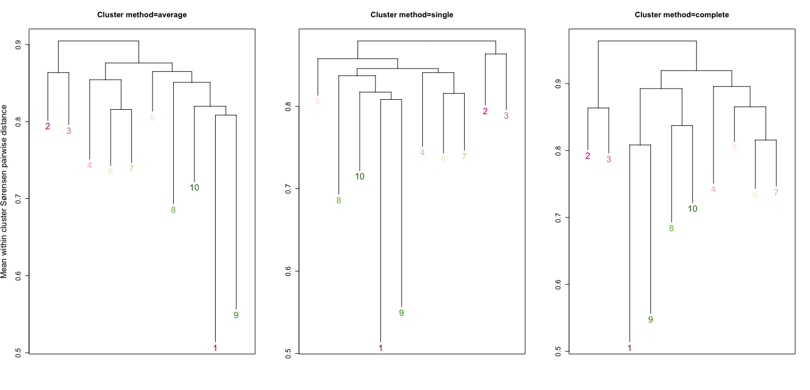

\

::: homelink
<a href="https://kellifeeser.github.io/ksu-paired-amplicon-workflow/index.html" target="_blank" style="text-align:right">Back to Home</a>
:::


# Set-up {.unlisted .unnumbered .hidden}


## load phylo, ord, pam res


# More in-depth: Sørensen-distance-based clustering

\

[Background]{.underline} \
Microbiome sample clustering can be performed using either model-based methods and machine learning methods.\
- Machine learning methods, which rely on defined distance metrics, are used more frequently than model-based statistical methods ("due to their efficient implementation and easy interpretation.")\
- I used the **partition around medoids (PAM)** clustering method, which is related to but considered more robust than K-means. In contrast to K-means, which can be sensitive to the effects of outliers, PAM's optimization goal is to minimize the sum of distances to the medoids instead of minimizing the sum of the squared distances to the cluster centers.\
\

***Note: clustering was performed directly on distance matrices,** not **ordinations or ordination scores***\


## Clustering evaluation: Gap Statistic (on Sørensen distance matrix)

<!-- -->

\
\

## View clustering on ordinations (NMDS)


### Sørensen-based clusters {.unnumbered .unlisted .tabset .tabset-pills}

\

#### k = 10 {.unnumbered .unlisted .tabset}

Note the density of cluster 1 - I'll investigate that further.


##### All samples {.unnumbered .unlisted}

<!-- -->

\

##### Facet by Lat {.unnumbered .unlisted}

<!-- -->

\

##### Facet by Long {.unnumbered .unlisted}

<!-- -->

\

##### Facet by Cluster, color Site {.unnumbered .unlisted}

We do see clusters with only 1 site and others with multiple sites.\

<!-- -->

\


# Cluster descriptions

\
[in-progress]\


| Cluster | total n | Site(s)           | Grass(es)                 | Characteristics†                       | Exclusivity                                                           |     |
|-----------|-----------|-----------|-----------|-----------|-----------|-----------|
| 1       | 183     |                   |                           | spans pH range                         |                                                                       |     |
| 2       | 37      | BNP,DMT,FMT,SEV   | BOER (n=33), BOGR (n=4)   | high pH\* (6.8 - 8.3, mean 7.5)        |                                                                       |     |
| 3       | 56      |                   |                           | high pH\*\*\*\* (6.8 - 8.3, mean 7.8)  |                                                                       |     |
| 4       | 17      |                   |                           | lower pH\*\*\*\* (5.6 - 7.6, mean 6.2) |                                                                       |     |
| 5       | 43      |                   |                           | high pH\*\* (7.1 - 7.8, mean 7.6)      |                                                                       |     |
| 6       | 32      |                   |                           | lower pH\*\*\*\* (5.1 - 7.8, mean 6.2) |                                                                       |     |
| 7       | 38      |                   |                           |                                        |                                                                       |     |
| 8       | 29      | mostly LAR (n=27) |                           | high pH\*\*\*\* (7.2 - 8.2, mean 8.0)  |                                                                       |     |
| 9       | 9       | SFA               | SCSC (only grass present) |                                        | Site=SFA                                                              |     |
| 10      | 29      | KAE               |                           | lower pH\*\*\*\* (5.9 - 7.2, mean 6.3) | Site=KAE (of the 32 KAE samples, only 3 others were in diff clusters) |     |

: Descriptions of Sørensen distance-based clusters. †variables listed are significant in all vs. base-mean Wilcox test with BH p-value corrections. \* p-value \< 0.05, \*\* \< 0.001, \*\*\* \< 0.0001, \*\*\*\* \< 1e-5.

[\
]{.underline}

\
\

# Are the clusters distinct/distinguishable? -> yes, mostly

[Clusters]{.underline}: Sørensen dissimilarity clusters based on pam (k = 10)

[Method]{.underline}: R package `randomForest v4.7.1.1`

```         
predictors.all<-t(otu_table(Fun_wholecommunity))

response.clus_sor_k10<-as.factor(sample_data(Fun_wholecommunity)$clus_sor_k10)

rf.data.clus_sor_k10<-data.frame(response.clus_sor_k10, predictors.all)

classify.clus_sor_k10<-randomForest(response.clus_sor_k10~., data = rf.data.clus_sor_k10, ntree=999)
```

Call: randomForest(formula = response.clus_sor_k10 \~ ., data = rf.data.clus_sor_k10, ntree = 999)

Type of random forest: classification

Number of trees: 999

No. of variables tried at each split: 81

OOB estimate of error rate: 6.82%

|        | 1   | 2   | 3   | 4   | 5   | 6   | 7   | 8   | 9   | 10  | Cluster error % |
|--------|:---:|:---:|:---:|:---:|:---:|:---:|:---:|:---:|:---:|:---:|:---------------:|
| **1**  | 183 |     |     |     |     |     |     |     |     |     | 0.0             |
| **2**  |     | 34  | 3   |     |     |     |     |     |     |     | 8.1             |
| **3**  |     | 5   | 50  |     | 1   |     |     |     |     |     | 10.7            |
| **4**  |     |     |     | 12  | 4   |     | 1   |     |     |     | 29.4            |
| **5**  |     |     | 1   |     | 50  | 1   | 1   |     |     |     | 5.7             |
| **6**  |     |     |     |     | 7   | 23  | 2   |     |     |     | 28.1            |
| **7**  |     |     | 1   |     |     | 2   | 34  |     |     | 1   | 10.5            |
| **8**  |     |     | 1   |     |     |     |     | 27  |     | 1   | 6.9             |
| **9**  |     |     |     |     |     |     |     |     | 10  |     | 0               |
| **10** |     |     |     |     | 1   |     |     |     |     | 28  | 3.4             |

: Confusion matrix of fungal whole community randomForest classification based on Sørensen-based PAM clusters. Diagonals are accurate calls. Misclassifications are shown as values by row, i.e., cluster 2 was misclassified as cluster 3 in 3 samples, while 34 samples were accurately called, resulting in an error rate of 8.1% for that cluster.


\

## Dendrogram of Sørensen-based clusters (k = 10) 

\

**Fungal whole community**\

{out.width="500px"}

Clusters 2 & 3 seem to be the outgroup / most distantly related \
**Clusters 1 & 9 are very similar, followed by 10 -> wrap-around cluster numbering**\


## Which OTUs are driving the differences between clusters 1 & 2? {.tabset}
\

### SIMPER results {.unnumbered}
\

`average` - Species contribution to average between-group dissimilarity\
`cusum`	- Ordered cumulative contribution (to between-group dissimilarity). These are based on item `average`, but they sum up to total 1\
`p` - Permutation $p$-value. Probability of getting a larger or equal average contribution in random permutation of the group factor\
\
\

**Mean Sørensen dissimilarity between Clusters 1 & 2:** 0.920 (unweighted) / 0.903 (weighted by sample size)\

*Mean within-cluster similarities*\
-    Cluster 1: 0.514\
-    Cluster 2: 0.802\
\


\


# Significantly differential taxa among clusters

\


## Genus-level

\

### Fusarium {.unnumbered}
\

<!-- -->

\

## OTU-level {.tabset}

\

### OTU1252 {.unnumbered}

\

<!-- -->

\

### OTU6679 {.unnumbered}

\

<!-- -->

\

### OTU205 {.unnumbered}

\

<!-- -->

\
\
\
\

# Taxonomy of clusters

\
\

# Fungal {.tabset}

## Phylum {.unnumbered}

{width="100%"}

\

## Class {.unnumbered}

{width="100%"}

\

## Order {.unnumbered}

{width="100%"}

\

## Family {.unnumbered}

{width="100%"}

\

## Generalists v Specialists {.unnumbered}

{width="100%"}

\


\
\
\


# hide {.unnumbered .hidden .unlisted}

Notes: OTU205 is highest in relative abundance in Cluster 1, most other clusters have minimal or no presence. ~~Exception is sample in Cluster 7, which was the one misclassified into Cluster 1.~~

OTU6679, Generalist\nwilcox.test: all (global RA = 1.65%) v. Cluster 1 (mean RA = 3.75%)


\

