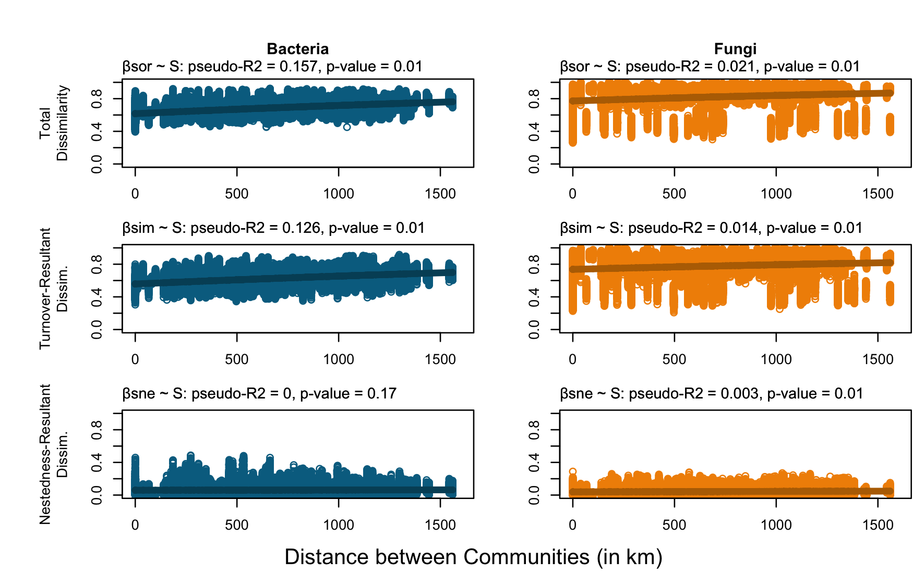
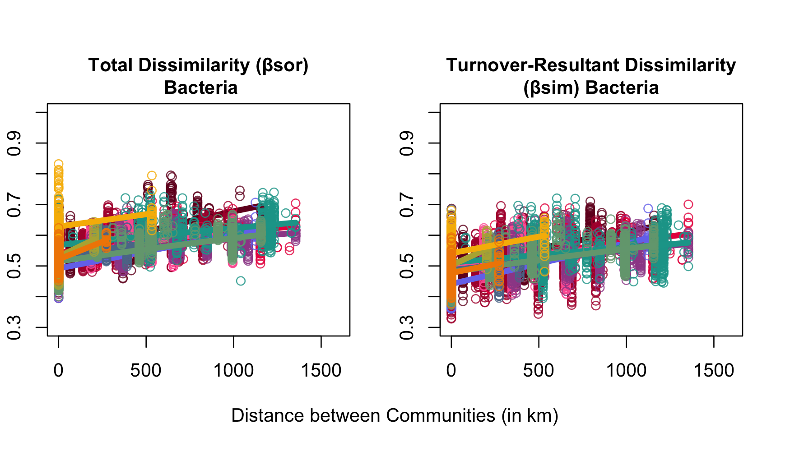
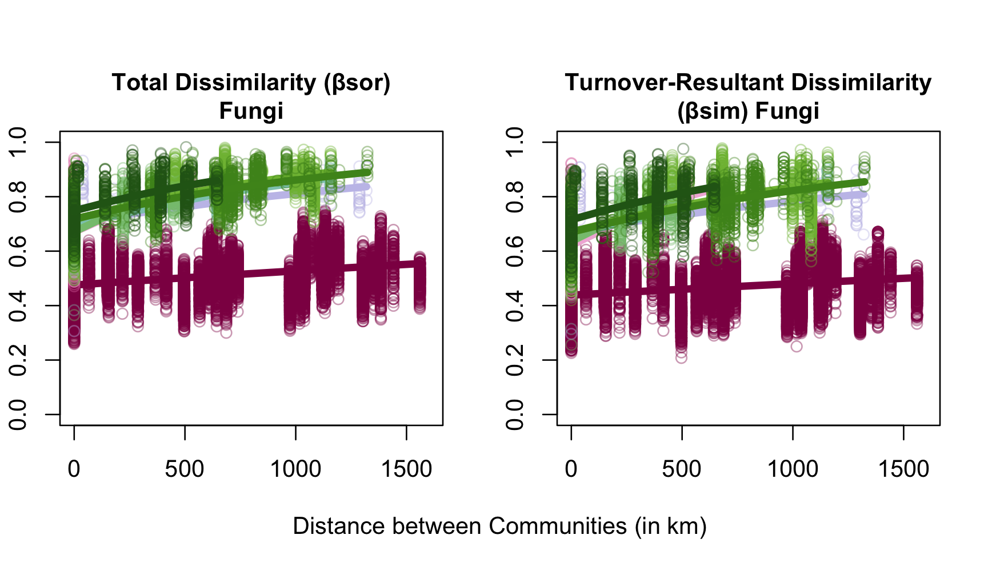
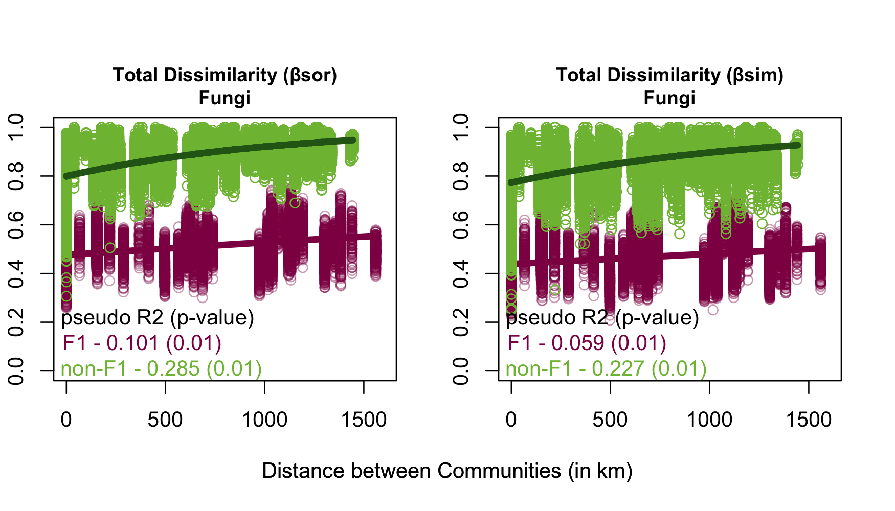

\

::: homelink
<a href="https://kellifeeser.github.io/ksu-paired-amplicon-workflow/index.html" target="_blank" style="text-align:right">Back to Home</a>
:::

\

------------------------------------------------------------------------

Document last updated: 2025-02-13

------------------------------------------------------------------------

\

# Set-up {.unlisted .unnumbered .hidden}


## load packages


```r
library("vegan"); packageVersion("vegan") # ‘2.6.4’
library("phyloseq"); packageVersion("phyloseq") # ‘1.41.1’
library("betapart"); packageVersion("betapart") # ‘1.6’
library("ecodist"); packageVersion("ecodist") # ‘2.0.9’
library("measurements"); packageVersion("measurements") # ‘1.5.1’
library("geosphere"); packageVersion("geosphere") # ‘1.5.18’
  # The legacy packages maptools, rgdal, and rgeos, underpinning the sp package,
  # which was just loaded, were retired in October 2023.
  # Please refer to R-spatial evolution reports for details, especially
  # https://r-spatial.org/r/2023/05/15/evolution4.html.
  # It may be desirable to make the sf package available;
  # package maintainers should consider adding sf to Suggests:.
library("gdata"); packageVersion("gdata") # ‘2.19.0’
# library("spam"); packageVersion("spam") # ‘2.9.1’
library("ggplot2"); packageVersion("ggplot2") # ‘3.4.4’
library("ggpubr"); packageVersion("ggpubr") # ‘0.6.0’
library("cowplot"); packageVersion("cowplot") # ‘1.1.1’
library("geodist"); packageVersion("geodist") # ‘0.0.8’
library(kableExtra)

source("RAM_bulk_harvester.R")
```

## load cache & rds


## fig captions

\

# Theory on the partitioning of beta diversity

> **Summary:** As Sørensen dissimilarity and Simpson dissimilarity are equal in the absence of nestedness, their difference is a net measure of the nestedness-resultant component of beta diversity (Baselga 2010; Leprieuret al.2011). I chose Sørensen because it is a presence/absence diversity measure formulated to enable additive partitioning of beta diversity (Sørensen is a monotonic transformation of Jaccard).

## Definition of β-diversity

Beta diversity can be viewed as a measure that compares inventory diversity at two different scales (alpha and gamma diversity).

$$
\text{If}\ \gamma \neq \bar{\alpha} \text{, then the diversity of a region (} \gamma \text{) exceeds the mean diversity of local sites (} \bar{\alpha} \text{) within the region.}
$$

Therefore, in the strictest sense, the definition of beta diversity ($\beta$) is the ratio between gamma and mean alpha diversities ([Tuomisto, 2010](https://onlinelibrary.wiley.com/doi/10.1111/j.1466-8238.2011.00756.x#b21)).

$$
\beta =  {\gamma \over \bar{\alpha}}
$$

It is clear that gamma diversity can be different from mean alpha diversity if, and only if, local sites differ in species composition. Therefore, the actual parameter determining the ratio between gamma and mean alpha diversities is *the degree to which species composition changes* from site to site. For this reason, the term beta diversity is usually applied in a broad sense to any measure of variation in species composition ([Anderson *et al*., 2011](https://onlinelibrary.wiley.com/doi/10.1111/j.1466-8238.2011.00756.x#b3)). Some of the most popular measures of variation in species composition, like the Jaccard and Sørensen indices, are monotonic transformations of beta diversity that therefore reflect the same concept ([Jost, 2007](https://onlinelibrary.wiley.com/doi/10.1111/j.1466-8238.2011.00756.x#b13)).

There are two general approaches to defining beta diversity:

1.  *proportional diversity*
    a.  classical multiplicative formulation (Whittaker's beta; ($\beta = {\gamma \over \alpha}$)

    b.  if using species count data, the use of classical multiplicative partition is mandatory ([Baselga 2010b](https://www.jstor.org/stable/25680449)), because independence between beta and alpha is a necessary property (Wilson & Shmida, 1984).
2.  *differentiation diversity*
    a.  additive partitioning of diversity ($\beta = \gamma - \alpha$)
    b.  can be used if using (dis)similarity metrics

However, on *proportional diversity* vs. *differentiation diversity*: it's really all the same in the end because pairwise similarity indices are monotonic transformations of the multiplicative Whittaker's beta computed for two sites ([Jost, 2007](https://onlinelibrary.wiley.com/doi/full/10.1111/j.1466-8238.2009.00490.x#b18)).

The issue is exemplified by the fact that pairwise similarity indices can be generalized and applied to situations involving multiple sites, with multiple-site similarity measures again being monotonic transformations of Whittaker's beta for any number of sites ([Diserud & Ødegaard, 2007](https://onlinelibrary.wiley.com/doi/full/10.1111/j.1466-8238.2009.00490.x#b10)). Therefore, these apparently divergent views on beta diversity are actually consistent with a single beta-diversity concept.

------------------------------------------------------------------------

## Additive partitioning of beta diversity into its components

1.  dissimilarity due to species replacement
2.  dissimilarity due to nestedness

-   Changes in species composition (beta diversity) can arise from two phenomena: **spatial turnover** and **nestedness** ([Harrison *et al.*, 1992](https://onlinelibrary.wiley.com/doi/full/10.1111/j.1466-8238.2009.00490.x#b15); [Baselga *et al.*, 2007](https://onlinelibrary.wiley.com/doi/full/10.1111/j.1466-8238.2009.00490.x#b6)).

    -   **spatial turnover:** the replacement of some species by others from site to site

        -   Spatial turnover implies the replacement of some species by others as a consequence of environmental sorting or spatial and historical constraints ([Qian *et al.*, 2005](https://onlinelibrary.wiley.com/doi/full/10.1111/j.1466-8238.2009.00490.x#b27)).

    -   **nestedness:** a pattern characterized by the poorest site being a strict subset of the richest site.

        -   Two sites can have obviously different species composition (i.e. the richest site has unique species not present in the poorest site), but no species is replaced by other.

        -   Nestedness of species assemblages occurs when the biotas of sites with smaller numbers of species are subsets of the biotas at richer sites ([Wright & Reeves, 1992](https://onlinelibrary.wiley.com/doi/full/10.1111/j.1466-8238.2009.00490.x#b43); [Ulrich & Gotelli, 2007](https://onlinelibrary.wiley.com/doi/full/10.1111/j.1466-8238.2009.00490.x#b36)), reflecting a non-random process of species loss as a consequence of any factor that promotes the orderly disaggregation of assemblages ([Gaston & Blackburn, 2000](https://onlinelibrary.wiley.com/doi/full/10.1111/j.1466-8238.2009.00490.x#b14)).

        -   This effect of richness differences in measures of compositional change was realized by Simpson (1943) as he noted that richness differences could be responsible for the dissimilarity between sites even in the absence of species replacement.

        -   To assess nestedness, need to use a measure that accounts for matrix filling

        -   On the relationship between beta diversity and nestedness:

            -   Harrison et al. (1992) stressed that Whittaker's beta diversity 'does not distinguish between true species turnover along a distance (or environmental) gradient, and situations in which species drop out along the gradient without any new species being added'.

The turnover and nestedness components of beta diversity have contrasting spatial patterns and that the separation of these components is crucial for understanding the historic and present-day determinants of beta diversity (e.g. Dobrovolski et al., 2012; Hortal et al., 2011; Leprieur et al., 2011; Svenning et al., 2011).

It should be stressed that although many matrix configurations are possible ([Almeida-Neto *et al.*, 2008](https://onlinelibrary.wiley.com/doi/full/10.1111/j.1466-8238.2009.00490.x#b1)), **all situations in which communities are not identical can be described with only these two main patterns (turnover and nestedness) or combinations of both**, since the only processes needed to generate all the possible patterns are species replacement and species loss (or gain). Note that I use the term 'species loss' just to indicate that some species are absent from some sites, without regard to the underlying mechanism (i.e. extinction, differential dispersal capacity and others; [Ulrich *et al.*, 2009](https://onlinelibrary.wiley.com/doi/full/10.1111/j.1466-8238.2009.00490.x#b37)).

------------------------------------------------------------------------

## Pairwise dissimilarity: Sørensen-based dissimilarity and related measures

The Sørensen dissimilarity index (β~sor~) is one of the most used measures due to its dependence on the proportion of species shared between two communities and its linear relationship with Whittaker's beta ([Diserud & Ødegaard, 2007](https://onlinelibrary.wiley.com/doi/full/10.1111/j.1466-8238.2009.00490.x#b10)). The Sørensen dissimilarity index (β~sor~) is formulated as:

$$
\beta_{sor} = {b + c \over 2a + b + c}
$$

where *a* is the number of species common to both sites, *b* is the number of species that occur in the first site but not in the second and *c* is the number of species that occur in the second site but not in the first. It is well known that this measure incorporates both true spatial turnover and differences in richness ([Koleff *et al.*, 2003](https://onlinelibrary.wiley.com/doi/full/10.1111/j.1466-8238.2009.00490.x#b20)).

To describe spatial turnover without the influence of richness gradients, the Simpson dissimilarity index (β~sim~) was first proposed by [Simpson (1943](https://onlinelibrary.wiley.com/doi/full/10.1111/j.1466-8238.2009.00490.x#b31)) and later recovered by [Lennon *et al.* (2001](https://onlinelibrary.wiley.com/doi/full/10.1111/j.1466-8238.2009.00490.x#b22)):

$$
\beta_{sim} = {min(b,c) \over a + min(b,c)}
$$

where *a*, *b* and *c* are the same variables as defined for Sørensen dissimilarity.

Under equal richness:

-   When both localities have the same number of species *b* and *c* must be equal, thus β~sor~ and β~sim~ are also equal because *b*/(*a*+*b*) = 2*b*/(2*a*+ 2*b*).

-   It is apparent that any dissimilarity between two localities with the same number of species is completely due to spatial turnover because nestedness cannot occur.

Since β~sor~ and β~sim~ are equal in the absence of nestedness, their difference is a measure of the nestedness component of beta diversity. Therefore, I (read: [Baselga 2010a](https://onlinelibrary.wiley.com/doi/full/10.1111/j.1466-8238.2009.00490.x)) here introduce the nestedness-resultant dissimilarity (β~nes~) which is derived using basic operations on fractions, and formulated as

$$
\beta_{nes} = \beta_{sor} - \beta_{sim} = {b + c \over 2a + b + c} - {min(b,c) \over a + min(b,c)} \\
\implies {max(b,c) - min(b,c) \over 2a + min(b,c) + max(b,c)} \times {a \over a+ min(b,c)}
$$

It should be noted that the first term of the product is very similar to β~gl~ ([Lennon *et al.*, 2001](https://onlinelibrary.wiley.com/doi/full/10.1111/j.1466-8238.2009.00490.x#b22); [Koleff *et al.*, 2003](https://onlinelibrary.wiley.com/doi/full/10.1111/j.1466-8238.2009.00490.x#b20)), a measure of differences in richness, but in this case this term is multiplied by the second term, which is Simpson similarity (i.e. similarity independent of richness differences = 1 −β~sim~). This product is needed to separate differences in richness caused by nestedness from other differences in richness: for example, two completely different communities (sharing no species, i.e. 1 −β~sim~= 0) may have a different number of species, but they are obviously not nested ([Fig.1, island D](https://onlinelibrary.wiley.com/doi/full/10.1111/j.1466-8238.2009.00490.x#f1)). In this way, β~nes~ yields the nestedness component of beta diversity, instead of any difference on richness.

Therefore we have a dissimilarity measure accounting for all aspects of beta diversity (β~sor~) that can be partitioned into two additive components accounting for pure spatial turnover (β~sim~) and nestedness (β~nes~):

$$
\beta_{sor} = \beta_{sim} - \beta_{nes}
$$

------------------------------------------------------------------------

## Pairwise vs. multiple-site dissimilarity measures

::: {style="color: darkgreen;"}
Note that *pairwise* and *multiple-site* measures are different! Modifications (monotonic transformations) need to be made to the pairwise input data & multiple-site indices must be formulated in terms of matching components as pairwise measures.
:::

    ↪  This means building multiple-site equivalents of the matching components (*a*, *b*, *c*)

-   *a* is the number of species common to both sites

    -   the *a*-component analogue for the multiple-site measures is very simply computed, while still accounting for the different degrees of overlap derived from species shared by more than two sites, because it is derived using the inclusion--exclusion principle‡ ([Erickson, 1996](https://onlinelibrary.wiley.com/doi/full/10.1111/j.1466-8238.2009.00490.x#b12))

-   *b* is the number of species that occur in the first site but not in the second

    -   for the multiple-site analogue - derive minimum number of species exclusive to sites *i* and *j*, when compared by pairs

-   *c* is the number of species that occur in the second site but not in the first

    -   for the multiple-site analogue - derive maximum number of species exclusive to sites *i* and *j*, when compared by pairs

    -   note that the *b*- and *c*-component analogues cannot be simplified as in *a* while maintaining comparisons among more than three sites because of the need to separate the maximum and minimum values. For this reason, the *b*- and *c*-component analogues are computed only for pairs of sites because doing the contrary would imply severe computational difficulties in the generalization of indices for situations involving any number of sites.

‡Doing this simplification to the *a*-component analogue, the multiple-site nature of the measures is not compromised, since the *a*-component analogue accounts for the information on species shared by more than two sites, but, as a consequence, measures are dependent on the number of sites (*n*), i.e. β~SOR~ is a transformation of Whittaker's beta and β~−1~, but the shape of the relationship depends on *n*. **Therefore, it is essential that comparisons between multiple-site measures should always be conducted among areas with equal numbers, or a very similar number, of sites.**

|        Examples of pairwise measures        |             Multiple-site measure equivalents             |
|:-----------------------------:|:---------------------------------------:|
|   Simpson pairwise dissimilarity (β~sim~)   |    Simpson-based multiple-site dissimilarity (β~SIM~)     |
|  Sørensen pairwise dissimilarity (β~sor~)   |    Sørensen-based multiple-site dissimilarity (β~SOR~)    |
| Nestedness-resultant dissimilarity (β~nes~) | Nestedness-resultant multiple-site dissimilarity (β~NES~) |

------------------------------------------------------------------------

## Multiple site dissimilarities (Sørensen)

The same additive partition can be conducted for multiple-site dissimilarity measures, but only if multiple-site indices are formulated in terms of matching components as pairwise measures. Otherwise, nestedness and turnover cannot be separated and measures do not perform well in all situations.

Therefore, it is necessary to adopt the approach suggested in [Baselga *et al.* (2007](https://onlinelibrary.wiley.com/doi/full/10.1111/j.1466-8238.2009.00490.x#b6)) and build multiple-site equivalents of the matching components (*a*, *b*, *c*). In the cited paper, an index accounting just for the species turnover component was proposed, but the same procedure can be followed to formulate an index accounting for both species turnover and nestedness derived from the pairwise Sørensen dissimilarity:

$$
\beta_{SOR} = { \left[ \sum_ \limits{i>j} min(b_{ij},b_{ji}] \right] + \left[ \sum_ \limits{i>j} max(b_{ij},b_{ji}] \right] \over 2\left[ \sum_ \limits{i} S_i - S_T \right] + \left[ \sum_ \limits{i>j} min(b_{ij},b_{ji}] \right] + \left[ \sum_ \limits{i>j} max(b_{ij},b_{ji}] \right] }
$$

where S~*i*~ is the total number of species in site *i*, S~T~ is the total number of species in all sites considered together and *b~ij~*, *b~ji~* are the number of species exclusive to sites *i* and *j*, respectively, when compared by pairs. Thus$\left[ \sum_ \limits{i>j} min(b_{ij},b_{ji}] \right]$and $\left[ \sum_ \limits{i>j} max(b_{ij},b_{ji}] \right]$ are the multiple-site analogues of the *b* and *c* matching components of pairwise measures, respectively, and $\left[ \sum_ \limits{i} S_i - S_T \right]$ is the analogue of the *a*-component.

As mentioned before, a multiple-site similarity measure accounting only for species turnover is already known ([Baselga *et al.*, 2007](https://onlinelibrary.wiley.com/doi/full/10.1111/j.1466-8238.2009.00490.x#b6)), and β~SIM~ is just its complement:

$$
\beta_{SIM} = { \left[ \sum_ \limits{i>j} min(b_{ij},b_{ji}] \right] \over \left[ \sum_ \limits{i} S_i - S_T \right] + \left[ \sum_ \limits{i>j} min(b_{ij},b_{ji}] \right] }
$$

The multiple-site dissimilarity accounting only for nestedness can be derived by simple subtraction:

$$
\beta_{NES} = \beta_{SOR} - \beta_{SIM}
$$

------------------------------------------------------------------------

## Relationship between β~NES~ and nestedness measures

It should be stressed that β~NES~ is rooted in the framework of beta-diversity analyses and intended to account for the patterns of beta diversity caused by nestedness. In other words, it is *not* a measure of nestedness in absolute terms but a measure of the dissimilarity of communities due to the effect of nestedness patterns.

Many measures of nestedness are available, diverging in the different philosophies behind each metric ([Ulrich *et al.*, 2009](https://onlinelibrary.wiley.com/doi/full/10.1111/j.1466-8238.2009.00490.x#b37)).

β~NES~ reflects the increasing dissimilarity between nested communities produced by the increasing differences in the number of species.

In summary, nestedness and *dissimilarity due to nestedness* are related but different concepts, thus divergences in performance between NODF and β~NES~ are consistent with differences between both concepts.\

------------------------------------------------------------------------

## Parsing effect of nestedness on community similarities (multiple-site measures)

If we are to understand biotic patterns and their causes, patterns which may be revealing different processes must be discerned ([Williams *et al.*, 1999](https://onlinelibrary.wiley.com/doi/full/10.1111/j.1466-8238.2009.00490.x#b41)) and, in this case, the two processes underlying measures of beta diversity (species loss and species replacement) are not only different but antithetic ([Williams, 1996](https://onlinelibrary.wiley.com/doi/full/10.1111/j.1466-8238.2009.00490.x#b40); [Gaston & Blackburn, 2000](https://onlinelibrary.wiley.com/doi/full/10.1111/j.1466-8238.2009.00490.x#b14)). Therefore, nestedness and species turnover must be disentangled ([Baselga, 2007](https://onlinelibrary.wiley.com/doi/full/10.1111/j.1466-8238.2009.00490.x#b3)).

To deal with this effect, several measures ([Shi, 1993](https://onlinelibrary.wiley.com/doi/full/10.1111/j.1466-8238.2009.00490.x#b30); [Williams, 1996](https://onlinelibrary.wiley.com/doi/full/10.1111/j.1466-8238.2009.00490.x#b40); [Lennon *et al.*, 2001](https://onlinelibrary.wiley.com/doi/full/10.1111/j.1466-8238.2009.00490.x#b22); [Koleff *et al.*, 2003](https://onlinelibrary.wiley.com/doi/full/10.1111/j.1466-8238.2009.00490.x#b20); [Baselga *et al.*, 2007](https://onlinelibrary.wiley.com/doi/full/10.1111/j.1466-8238.2009.00490.x#b6)) have been developed to compute values of: (1) spatial turnover independent of nestedness, and (2) compositional differences attributable to richness.

![**Conceptual Diagram.** (From Baselga2010a) Hypothetical examples involving four islands (A--D) and three sampling sites in each. Biotas of sites A1--A3 are completely nested, because poorer biotas are subsets of richer biotas. Sites B1--B3 have the same richness (six species each) with three species common to all three sites and three species exclusive to each site, i.e. displaying a pattern of spatial turnover. Sites C1--C3 present both patterns, because C2 and C3 are subsets of C1 (nestedness), but some species are replaced between C2 and C3, which are not subsets of each other. Sites D1--D3 present spatial turnover and are obviously not nested, but present differences in richness.](../code/Baselga2010_Fig1.png){width="30%"}

Prior poor performing measures:

-   Several multiple-site measures intended to account for spatial turnover, $\beta_{-2}$ ([Harrison *et al.*, 1992](https://onlinelibrary.wiley.com/doi/full/10.1111/j.1466-8238.2009.00490.x#b15)) and $\beta_{-3}$ ([Williams, 1996](https://onlinelibrary.wiley.com/doi/full/10.1111/j.1466-8238.2009.00490.x#b40)) do not provide satisfactory results for certain situations in which both nestedness and spatial turnover are involved, because both measures would identify these mixed patterns as completely nested (β~−2~=β~−3~= 0 in both islands A and C).

-   Prior to ([Baselga *et al.*, 2010a](https://onlinelibrary.wiley.com/doi/full/10.1111/j.1466-8238.2009.00490.x)), no unified framework existed for measuring beta diversity and partitioning the contributions of spatial turnover and nestedness

However, the pairwise Simpson dissimilarity measure (β~sim~), recovered by [Lennon *et al.* (2001](https://onlinelibrary.wiley.com/doi/full/10.1111/j.1466-8238.2009.00490.x#b22)) based on [Simpson (1943](https://onlinelibrary.wiley.com/doi/full/10.1111/j.1466-8238.2009.00490.x#b31)), and its multiple-site generalization ([Baselga *et al.*, 2007](https://onlinelibrary.wiley.com/doi/full/10.1111/j.1466-8238.2009.00490.x#b6)) have proved to efficiently discriminate turnover from nestedness (β~SIM~= 0 in island A, β~SIM~= 0.6 in island B) and mixed situations (β~SIM~= 0.2 in island C).

The total dissimilarity between two assemblages (i.e. beta diversity or, in my specific framework, a monotonic transformation of beta diversity -- Sørensen dissimilarity, $\beta_{sor}$) can be partitioned into two components: dissimilarity due to species replacement (Simpson dissimilarity or spatial turnover, $\beta_{sim}$) and dissimilarity due to nestedness (nestedness-resultant dissimilarity, $\beta_{sne}$).

-   It should be noted that the second component is not a measure of nestedness itself, but a measure of the fraction of total dissimilarity that it is not caused by species replacement but instead by nestedness.

------------------------------------------------------------------------

## Analyses on distance matrices

-   [2 distance matrices]{.underline}: simple Mantel
    -   a test for association between two $n × n$ matrices whose entries are distances or similarities between all pair-wise combinations of $n$ objects.
    -   The objects may be plots, species, or any other type of sampling unit, and the pair-wise measures may reflect distance or similarity in terms of species abundance(s), environmental conditions, or geographic location (when the objects are plots); physiology, behavior, morphology, or phylogeny (when the objects are species); or any other uni- or multivariate space.
-   [3 matrices]{.underline}: partial Mantel
    -   Partial Mantel analysis is partial correlation analysis performed on distance matrices, each unfolded into a vector. The partial correlation between two distance matrices is computed while controlling for the effect of a third matrix. It is commonly used to obtain the variance partitioning in which variation in species data is partitioned into environmental and spatial components.
    -   However, distance and raw data matrices have very different properties, and distance matrix analysis should not be used for making inferences about raw data (applies to all).
-   [≥ 2 matrices]{.underline}: **MRM**
    -   multiple regression on distance matrices (MRM)
    -   MRM entails a multiple regression of a response distance matrix, $D_Y$, on two or more environmental, spatial, or other explanatory distance matrices, each unfolded into a distance vector. The significance of an MRM model and its regression coefficients are tested by permuting $D_Y$ while holding the explanatory matrices constant. When $D_Y$ is an ordinary distance or similarity matrix, its rows and columns are permuted and the model $R^2$ and regression coefficients are calculated for each permutation to generate null distributions.
    -   MRM offers two advantages over traditional partial Mantel analysis:
        -   Polynomial, nonlinear, or nonparametric regression methods, such as generalized additive models (Yee and Mitchell 1991), can be used with MRM: Once the distance matrices have been unfolded into vectors, the calculations for fitting an MRM model are no different than those for multiple regression with raw data. The only computational difference lies in significance testing, which is performed by permuting the objects of the response distance matrix.
        -   Expanding the number of explanatory matrices allows each environmental variable to be represented by its own distance matrix. This provides an improved species--environment correlation (because the effects of important variables are not diluted by unimportant ones), and a convenient way to determine the statistical significance and relative importance of each environmental factor.

------------------------------------------------------------------------

# References

Baselga, A., Jiménez-Valverde, A. & Niccolini, G. (2007) A multiple-site similarity measure independent of richness. *Biology Letters*, **3**, 642--645. (<https://www.ncbi.nlm.nih.gov/pmc/articles/PMC2391238/>)

Baselga, A. (2007) Disentangling distance decay of similarity from richness gradients: response to Soininen *et al.* 2007. *Ecography*, 30, 838--841. (<https://www.jstor.org/stable/30244535>)

Baselga, A. (2008) Determinants of species richness, endemism and turnover in European longhorn beetles. *Ecography*, 31, 263--271. (<https://doi.org/10.1111/j.0906-7590.2008.5335.x>)

Baselga, A. (2010a) Partitioning the turnover and nestedness components of beta diversity. Global Ecology and Biogeography 19:134-143 (<https://onlinelibrary.wiley.com/doi/full/10.1111/j.1466-8238.2009.00490.x#b6>)

Baselga, A. (2010b) Multiplicative partitioning of true diversity yields independent alpha and beta components, additive partitioning does not. *Ecology*, *91*(7), 1974-1981. (<https://www.jstor.org/stable/25680449>)

Baselga, A. (2012) The relationship between species replacement, dissimilarity derived from nestedness, and nestedness. Global Ecology and Biogeography 21, 1223-1232 (<https://onlinelibrary.wiley.com/doi/pdfdirect/10.1111/j.1466-8238.2011.00756.x>)

-   From the latter, "Here, I review the concepts and methods used in these recent contributions, with the aim of clarifying: (1) the rationale behind the partitioning of beta diversity into species replacement and nestedness-resultant dissimilarity, (2) how, based on this rationale, numerators and denominators of indices have to match, and (3) how nestedness and nestedness-resultant dissimilarity are related but different concepts... Nestedness should be assessed using consistent measures that depend both on paired overlap and matrix filling, e.g. NODF, whereas beta-diversity patterns should be examined using measures that allow the total dissimilarity to be separated into the components of dissimilarity due to species replacement and dissimilarity due to nestedness. In the case of multiple-site dissimilarity patterns, averaged pairwise indices should never be used because the mean of the pairwise values is unable to accurately reflect the multiple-site attributes of dissimilarity."

    -   It should be stressed that βNES is rooted in the framework of beta-diversity analyses and intended to account for the patterns of beta diversity caused by nestedness. In other words, it is not a measure of nestedness in absolute terms but a measure of the dissimilarity of communities due to the effect of nestedness patterns.

\

------------------------------------------------------------------------

------------------------------------------------------------------------

\

# Methods 

[needs updating]

\

## Prepare input data: explanatory variables {.unlisted}

Down-selected from all variables available based on i) gradient length (if applicable) and ii) permANOVA (`vegan::adonis2(..., distance="bray")) significance and $R^2$ values. See R script [].R for details.

Down-selected list

-   Grass hosts

Details by variable type:

-   Discrete categories/binned data

    -   Grass hosts (n = 5)

        -   ANGE (n = 9 sites, 95 samples); BOER (n = 7 sites, 78 samples); BOGR (n = 14 sites, 75 samples); BUDA (n = 7 sites, 79 samples); SCSC (n = 15 sites, 157 samples)
        -   To build multiple-site equivalent to pairwise (via re-sampling):
            -   The minimum number of sites is 7 and the minimum number of samples is 75, therefore to compare the dissimilarities I selected 75 random samples of 7 site inventories (list of all 16S and ITS OTUs present) and computed the average $beta$ values of each domain, as measured by Sørensen dissimilarity

-   Continuous data: explanatory variables were converted into Euclidean distance matrices.

    -   Data were mean standardized, i.e., scaled data values so that they have a mean of zero and standard deviation of one. Because I want to assess variable importance via regression models by fitting a regression model using the standardized independent variables and comparing the absolute value of their standardized coefficients. But, if the independent variables are not standardized, comparing their coefficients becomes meaningless.

    -   soil moisture/soil water content (%), although normalized (inherently bounded between 0 and 100), was still mean standardized.

        `soil_water_content.dist = dist(soil_water_content_m.std, method = "euclidean", diag=TRUE, upper=FALSE)`

        `soil_water_content.matrix <- matrix(soil_water_content.dist)`

-   Geographic distance

    -   I assessed the increase of biotic dissimilarity with geographic distance (equivalent to the distance decay of similarity) using `as.matrix(geodist(Bac_all.geo, measure = 'geodesic' )/1000)`

    -   I created distance matrices based on longitude and latitude, calculated the actual distances in kilometers

    -   Since the lack of independence of observations (distances) precludes the test for significance by means of traditional regression procedures, significance of the Pearson correlations was computed by means of Mantel permutation tests using the vegan package ([Oksanen *et al.*, 2007](https://onlinelibrary.wiley.com/doi/full/10.1111/j.1466-8238.2009.00490.x#b26)) in R ([R Development Core Team, 2006](https://onlinelibrary.wiley.com/doi/full/10.1111/j.1466-8238.2009.00490.x#b28))

## Randomly subsample 16S and ITS OTU tables to the lowest common denominator number of sites and samples {.unlisted}

-   Rarefied fungal and bacterial OTU tables were converted to presence/absence matrices.

-   For each analysis, groups of locations and samples within were randomly sub-sampled so that the number of sites and samples were comparable (common minimum, as described above).\

## Compute incidence-based multiple-site dissimilarities {.unlisted}

To partition the turnover and nestedness components of beta diversity within each domain, I used `betapart::beta.multi(otu_df, index.family="sorensen")` to compute 3 dissimilarity matrices that account for the (i) total dissimilarity, (ii) turnover (replacement), and (iii) nestedness-resultant component.

        i. total dissimilarity, measured as Sorensen dissimilarity (a monotonic transformation of beta diversity). Notably the sum of components ii and iii.

        ii. spatial turnover (replacement), measured as Simpson pair-wise dissimilarity

        iii. nestedness-resultant dissimilarity, measured as the nestedness-fraction of Sørensen pair-wise dissimilarity\


[Regional-scale]{.underscore} \

-   ~~All multiple-site comparisons were performed at the 'Site' scale, i.e., $\gamma$ = site-level OTU inventories. The minimum number of samples per site was 5, so all calculations used n = 5 sites, resampled 1,000 times.~~

## Statistical analysis

### Distance-decay relationships

From [Baselga 2010a](https://onlinelibrary.wiley.com/doi/full/10.1111/j.1466-8238.2009.00490.x):

"In a second analysis, I assessed the increase of biotic dissimilarity with geographic distance (equivalent to the distance decay of similarity), as computed with the total beta diversity (β~sor~), as well as with the turnover (β~sim~) and nestedness (β~nes~) measures. Since the lack of independence of observations (distances) precludes the test for significance by means of traditional regression procedures, significance of the Pearson correlations was computed by means of Mantel permutation tests using the vegan package ([Oksanen *et al.*, 2007](https://onlinelibrary.wiley.com/doi/full/10.1111/j.1466-8238.2009.00490.x#b26)) in R ([R Development Core Team, 2006](https://onlinelibrary.wiley.com/doi/full/10.1111/j.1466-8238.2009.00490.x#b28)). To compare the intercepts and slopes yielded by the different dissimilarity indices, the frequency distributions of the parameters were estimated by bootstrapping in order to detect significant differences between measures. A frequency distribution of 1000 slopes and intercepts was retrieved by bootstrapping, using the boot package ([Canty & Ripley, 2008](https://onlinelibrary.wiley.com/doi/full/10.1111/j.1466-8238.2009.00490.x#b7)). When assessing the significance of one parameter being larger in one region than in the other, the probability of obtaining the opposite result by chance was empirically computed by comparing the estimated distributions of parameters."

### Gradient analyses: multiple regression models for distance matrices (MRM)

To assess the impact of environmental gradients on beta-diversity patterns, I used multiple regression models for distance matrices (MRM) (Lichstein 2007) to examine the relationships between dissimilarity matrices (overall beta diversity, and its turnover and nestedness-resultant components) and the Euclidean distance matrices of environmental variables:

1.  difference in area (note to me: re-org so not under 'Gradient')

2.  soil water content

3.  TBD

Compared to multiple regressions, all variables in MRM are distance matrices and P-values are estimated by permutation test (9999 runs) to remove the effect of non-independence between cases on P-values (Legendre, Lapointe & Casgrain 1994).

MRM is an explicitly distance-based method somewhat similar to the (partial) Mantel test, except that MRM preserves the individual-nature of input distance matrices instead of a compound distance, i.e., each dependent variables is converted to a distance matrix separately ➞ be careful to state hypotheses and conclusions in terms of distances rather than raw data

| Test                                           | Formula    | Hypothesis                                     | Components                                                                                    |
|:--------------------|:----------------|:----------------|-----------------|
| Multiple regression on distance matrices (MRM) | $y$ \~ $X$ | Explanatory power of each member of $X$ on $y$ | $y$ is an individual distance matrix; $X$ represents one or more individual distance matrices |

#### **Multiple Regression on Distance Matrices**

**R package**

`ecodist 2.0.9`

**Description**

Multiple regression on distance matrices (MRM) using permutation tests of significance for regression coefficients and R-squared.

**Usage**

```         
MRM(formula = formula(data), data, nperm = 1000,
    method = "linear", mrank = FALSE)
```

**Arguments**

|           |                                                                                                                                                                                            |
|---------------|---------------------------------------------------------|
| `formula` | formula describing the test to be conducted.                                                                                                                                               |
| `data`    | an optional dataframe containing the variables in the model as columns of dissimilarities. By default the variables are taken from the current environment.                                |
| `nperm`   | number of permutations to use. If set to 0, the permutation test will be omitted.                                                                                                          |
| `mrank`   | if this is set to FALSE (the default option), Pearson correlations will be used. If set to TRUE, the Spearman correlation (correlation ranked distances) will be used.                     |
| `method`  | if "linear", the default, uses multiple regression analysis. If "logistic", performs logistic regression with appropriate permutation testing. Note that this may be substantially slower. |

**Details**

Performs multiple regression on distance matrices following the methods outlined in Legendre et al. 1994. Specificaly, the permutation test uses a pseudo-t test to assess significance, rather than using the regression coefficients directly.

**Value**

|             |                                                                                                                                       |
|---------------|---------------------------------------------------------|
| `coef`      | A matrix with regression coefficients and associated p-values from the permutation test (using the pseudo-t of Legendre et al. 1994). |
| `r.squared` | Regression R-squared and associated p-value from the permutation test (linear only).                                                  |
| `F.test`    | F-statistic and p-value for overall F-test for lack of fit (linear only).                                                             |
| `dev`       | Residual deviance, degrees of freedom, and associated p-value (logistic only).                                                        |

\
\

------------------------------------------------------------------------

\

## Scripts for coding analyses

### Beta.part workflow 

    - looped by Site, Bac_sor_clusters, Fun_sor_clusters, and Fun_sor_clus2 (F1 vs. non-F1)


```r
# make results list
multi_or_pairwise <- list("multi"=list(),"pairwise"=list(),"resamp"=list(),"core"=list())

BFC <- list("all"=list(),"Site"=list(),"Bac_sor_clusters"=list(),"Fun_sor_clusters"=list(),"Fun_sor_clus2"=list())
BFC[[1]]  <- multi_or_pairwise
BFC[[2]]  <- multi_or_pairwise
BFC[[3]]  <- multi_or_pairwise
BFC[[4]]  <- multi_or_pairwise
BFC[[5]]  <- multi_or_pairwise

betapart_results <- list("Bac"=BFC,"Fun"=BFC)

var_Fun_sor_clus2 <- levels(sd$Fun_sor_clus2)
var_Fun_sor_clusters <- levels(sd$Fun_sor_clusters)
var_Bac_sor_clusters <- levels(sd$Bac_sor_clusters)
var_Site <- levels(sd$Site)

# betapart_results$Bac$Bac_sor_clusters <- multi_or_pairwise

# all ----
  Bac.otu.pres.abs <- decostand(x = as.data.frame(t(otu_table(Bac_wholecommunity))), method = "pa")
  
  Bac.all.core<-betapart.core(Bac.otu.pres.abs)
  betapart_results$Bac$all$core <- Bac.all.core

  Bac.all.samp_nsites6 <- beta.sample(Bac.all.core, index.family="sorensen", sites=6, samples = 100)
  betapart_results$Bac$all$resamp[["all.samp_nsites6_Bac"]] <- Bac.all.samp_nsites6

  Bac.all.samp_nsites22 <- beta.sample(Bac.all.core, index.family="sorensen", sites=22, samples = 100)
  betapart_results$Bac$all$resamp[["all.samp_nsites22_Bac"]] <- Bac.all.samp_nsites22

  Bac.beta.multi <- beta.multi(Bac.all.core, index.family = "sorensen")
  betapart_results$Bac$all$multi <- Bac.beta.multi
  
  Bac.beta.pair <- beta.pair(Bac.all.core, index.family = "sorensen")
  betapart_results$Bac$all$pairwise <- Bac.beta.pair

  
  Fun.otu.pres.abs <- decostand(x = as.data.frame(t(otu_table(Fun_wholecommunity))), method = "pa")

  Fun.all.core<-betapart.core(Fun.otu.pres.abs)
  betapart_results$Fun$all$core <- Fun.all.core

  Fun.all.samp_nsites6 <- beta.sample(Fun.all.core, index.family="sorensen", sites=6, samples = 100)
  betapart_results$Fun$all$resamp[["all.samp_nsites6_Fun"]] <- Fun.all.samp_nsites6

  Fun.all.samp_nsites22 <- beta.sample(Fun.all.core, index.family="sorensen", sites=22, samples = 100)
  betapart_results$Fun$all$resamp[["all.samp_nsites22_Fun"]] <- Fun.all.samp_nsites22

  Fun.beta.multi <- beta.multi(Fun.all.core, index.family = "sorensen")
  betapart_results$Fun$all$multi <- Fun.beta.multi
  
  Fun.beta.pair <- beta.pair(Fun.all.core, index.family = "sorensen")
  betapart_results$Fun$all$pairwise <- Fun.beta.pair
# ----

  
# BacFun:Loop through each site ----
for (site in var_Site) {
  if (site != "SCP") {  # Skip SCP site
    # Subset samples by site for bacteria
    subset_bacteria <- subset_samples(Bac_wholecommunity, Site == site)
    
    # Subset samples by site for fungi
    subset_fungi <- subset_samples(Fun_wholecommunity, Site == site)
    
    # Prune OTUs based on presence in each subset
    pruned_bacteria <- prune_taxa(taxa_sums(subset_bacteria) > 0, subset_bacteria)
    pruned_fungi <- prune_taxa(taxa_sums(subset_fungi) > 0, subset_fungi)
    
    # Bac
    # Make OTU df for bacteria
    Bac_Site_otu <- as.data.frame(t(otu_table(pruned_bacteria)))
    
    # Create presence absence matrices for bacteria
    Bac_Site_otu.pres.abs <- decostand(x = Bac_Site_otu, method = "pa")
    
    # Get betapart objects for bacteria
    Bac.Site.core <- betapart.core(Bac_Site_otu.pres.abs) # n site obs. of n_OTUs variables
    betapart_results$Bac$Site$core[[paste0(site,"_Bac")]] <- Bac.Site.core

    # Multiple site measures for bacteria
    Bac.Site.multi <- beta.multi(Bac.Site.core, index.family = "sorensen")
    betapart_results$Bac$Site$multi[[paste0(site,"_Bac")]] <- Bac.Site.multi
    
    # Sampling across equal sites for bacteria
    Bac.Site.samp <- beta.sample(Bac.Site.core, index.family = "sorensen", 
                                 sites = min(ave(as.numeric(factor(sample_data(pruned_bacteria)$SampleID)), sample_data(pruned_bacteria)$Site, FUN = function(x) length(unique(x)))), 
                                 samples = 1000)
    betapart_results$Bac$Site$resamp[[paste0(site,"_Bac_n",min(ave(as.numeric(factor(sample_data(pruned_bacteria)$SampleID)), sample_data(pruned_bacteria)$Site, FUN = function(x) length(unique(x)))))]] <- Bac.Site.samp
    
    # Pairwise measures for bacteria
    Bac.Site.pairwise <- beta.pair(Bac.Site.core, index.family = "sorensen")
    betapart_results$Bac$Site$pairwise[[paste0(site,"_Bac")]] <- Bac.Site.pairwise

    # Fun
    # Make OTU df for fungi
    Fun_Site_otu <- as.data.frame(t(otu_table(pruned_fungi)))
    
    # Create presence absence matrices for fungi
    Fun_Site_otu.pres.abs <- decostand(x = Fun_Site_otu, method = "pa")
    
    # Get betapart objects for fungi
    Fun.Site.core <- betapart.core(Fun_Site_otu.pres.abs) # n site obs. of n_OTUs variables
    betapart_results$Fun$Site$core[[paste0(site,"_Fun")]] <- Fun.Site.core
    
    # Multiple site measures for fungi
    Fun.Site.multi <- beta.multi(Fun.Site.core, index.family = "sorensen")
    betapart_results$Fun$Site$multi[[paste0(site,"_Fun")]] <- Fun.Site.multi
    
    # Sampling across equal sites for fungi
    Fun.Site.samp <- beta.sample(Fun.Site.core, index.family = "sorensen", 
                                 sites = min(ave(as.numeric(factor(sample_data(pruned_fungi)$SampleID)), sample_data(pruned_fungi)$Site, FUN = function(x) length(unique(x)))), 
                                 samples = 1000)
    betapart_results$Fun$Site$resamp[[paste0(site,"_Fun_n",min(ave(as.numeric(factor(sample_data(pruned_fungi)$SampleID)), sample_data(pruned_fungi)$Site, FUN = function(x) length(unique(x)))))]] <- Fun.Site.samp
    
    # Pairwise measures for fungi
    Fun.Site.pairwise <- beta.pair(Fun.Site.core, index.family = "sorensen")
    betapart_results$Fun$Site$pairwise[[paste0(site,"_Fun")]] <- Fun.Site.pairwise
  }
}
# ----

# BacFun:Loop through each Bac_sor_clusters ----
for (Bac_sor_cluster in var_Bac_sor_clusters) {
    # Subset samples by Bac_sor_clusters for bacteria
    subset_bacteria <- subset_samples(Bac_wholecommunity, Bac_sor_clusters == Bac_sor_cluster)
    
    # Subset samples by Bac_sor_clusters for fungi
    subset_fungi <- subset_samples(Fun_wholecommunity, Bac_sor_clusters == Bac_sor_cluster)
    
    # Prune OTUs based on presence in each subset
    pruned_bacteria <- prune_taxa(taxa_sums(subset_bacteria) > 0, subset_bacteria)
    pruned_fungi <- prune_taxa(taxa_sums(subset_fungi) > 0, subset_fungi)
    
    # Bac
    # Make OTU df for bacteria
    Bac_Bac_sor_clusters_otu <- as.data.frame(t(otu_table(pruned_bacteria)))
    
    # Create presence absence matrices for bacteria
    Bac_Bac_sor_clusters_otu.pres.abs <- decostand(x = Bac_Bac_sor_clusters_otu, method = "pa")
    
    # Get betapart objects for bacteria
    Bac.Bac_sor_clusters.core <- betapart.core(Bac_Bac_sor_clusters_otu.pres.abs) # n obs. of n_OTUs variables
    betapart_results$Bac$Bac_sor_clusters$core[[paste0(Bac_sor_cluster,"_Bac")]] <- Bac.Bac_sor_clusters.core
    
    # Multiple site measures for bacteria
    Bac.Bac_sor_clusters.multi <- beta.multi(Bac.Bac_sor_clusters.core, index.family = "sorensen")
    betapart_results$Bac$Bac_sor_clusters$multi[[paste0(Bac_sor_cluster,"_Bac")]] <- Bac.Bac_sor_clusters.multi
    
    # Sampling across equal sites for bacteria
    n_sites.Bac.Bac_sor_clusters <- ave(as.numeric(factor(sample_data(pruned_bacteria)$Site)), 
               sample_data(pruned_bacteria)$Bac_sor_clusters, 
               FUN = function(x) length(unique(x)))
    
    Bac.Bac_sor_clusters.samp.bysamples <- beta.sample(Bac.Bac_sor_clusters.core, index.family = "sorensen", 
                                 sites = min(ave(as.numeric(factor(sample_data(pruned_bacteria)$SampleID)), sample_data(pruned_bacteria)$Bac_sor_clusters, FUN = function(x) length(unique(x)))), 
                                 samples = 1000)
    betapart_results$Bac$Bac_sor_clusters$resamp[[paste0(Bac_sor_cluster,"_Bac_nsamples",min(ave(as.numeric(factor(sample_data(pruned_bacteria)$SampleID)), sample_data(pruned_bacteria)$Bac_sor_clusters, FUN = function(x) length(unique(x)))))]] <- Bac.Bac_sor_clusters.samp.bysamples
    
    # skip if only one site per cluster
    if (length(unique(n_sites.Bac.Bac_sor_clusters)) == 1 && unique(n_sites.Bac.Bac_sor_clusters) == 1) {
        # Get the name of the looped variable
        message(paste("Skipping bacterial beta.sample for bacterial", Bac_sor_cluster, "due to only 1 Site per Bac_sor_clusters level."))
    } else {
       # Otherwise, proceed with beta.sample
        # min_n_sites <- min(n_sites.Bac.Bac_sor_clusters)

    Bac.Bac_sor_clusters.samp.bysites <- beta.sample(Bac.Bac_sor_clusters.core, index.family = "sorensen", 
                                             sites = min(ave(as.numeric(factor(sample_data(pruned_bacteria)$Site)), sample_data(pruned_bacteria)$Bac_sor_clusters, FUN = function(x) length(unique(x)))), 
                                             samples = 1000)
    betapart_results$Bac$Bac_sor_clusters$resamp[[paste0(Bac_sor_cluster,"_Bac_nsites",min(ave(as.numeric(factor(sample_data(pruned_bacteria)$Site)), sample_data(pruned_bacteria)$Bac_sor_clusters, FUN = function(x) length(unique(x)))))]] <- Bac.Bac_sor_clusters.samp.bysites
    }
    
    # Pairwise measures for bacteria
    Bac.Bac_sor_clusters.pairwise <- beta.pair(Bac.Bac_sor_clusters.core, index.family = "sorensen")
    betapart_results$Bac$Bac_sor_clusters$pairwise[[paste0(Bac_sor_cluster,"_Bac")]] <- Bac.Bac_sor_clusters.pairwise
    
    # Fun
    # Make OTU df for fungi
    Fun_Bac_sor_clusters_otu <- as.data.frame(t(otu_table(pruned_fungi)))
    
    # Create presence absence matrices for fungi
    Fun_Bac_sor_clusters_otu.pres.abs <- decostand(x = Fun_Bac_sor_clusters_otu, method = "pa")
    
    # Get betapart objects for fungi
    Fun.Bac_sor_clusters.core <- betapart.core(Fun_Bac_sor_clusters_otu.pres.abs) # n obs. of n_OTUs variables
    betapart_results$Fun$Bac_sor_clusters$core[[paste0(Bac_sor_cluster,"_Fun")]] <- Fun.Bac_sor_clusters.core
    
    # Multiple site measures for fungi
    Fun.Bac_sor_clusters.multi <- beta.multi(Fun.Bac_sor_clusters.core, index.family = "sorensen")
    betapart_results$Fun$Bac_sor_clusters$multi[[paste0(Bac_sor_cluster,"_Fun")]] <- Fun.Bac_sor_clusters.multi
    
    # Sampling across equal sites for fungi
    n_sites.Fun.Bac_sor_clusters <- ave(as.numeric(factor(sample_data(pruned_fungi)$Site)), 
               sample_data(pruned_fungi)$Bac_sor_clusters, 
               FUN = function(x) length(unique(x)))

    Fun.Bac_sor_clusters.samp.bysamples <- beta.sample(Fun.Bac_sor_clusters.core, index.family = "sorensen", 
                                                       sites = min(ave(as.numeric(factor(sample_data(pruned_fungi)$SampleID)), sample_data(pruned_fungi)$Bac_sor_clusters, FUN = function(x) length(unique(x)))), 
                                                       samples = 1000)
    betapart_results$Fun$Bac_sor_clusters$resamp[[paste0(Bac_sor_cluster,"_Fun_nsamples",min(ave(as.numeric(factor(sample_data(pruned_fungi)$SampleID)), sample_data(pruned_fungi)$Bac_sor_clusters, FUN = function(x) length(unique(x)))))]] <- Fun.Bac_sor_clusters.samp.bysamples
    
    # skip if only one site per cluster
    if (length(unique(n_sites.Fun.Bac_sor_clusters)) == 1 && unique(n_sites.Fun.Bac_sor_clusters) == 1) {
        # Get the name of the looped variable
        message(paste("Skipping fungal beta.sample for bacterial", Bac_sor_cluster, "due to only 1 Site per Bac_sor_clusters level."))
    } else {
       # Otherwise, proceed with beta.sample
    Fun.Bac_sor_clusters.samp.bysites <- beta.sample(Fun.Bac_sor_clusters.core, index.family = "sorensen", 
                                                     sites = min(ave(as.numeric(factor(sample_data(pruned_fungi)$Site)), sample_data(pruned_fungi)$Bac_sor_clusters, FUN = function(x) length(unique(x)))), 
                                                     samples = 1000)
    betapart_results$Fun$Bac_sor_clusters$resamp[[paste0(Bac_sor_cluster,"_Fun_nsites",min(ave(as.numeric(factor(sample_data(pruned_fungi)$Site)), sample_data(pruned_fungi)$Bac_sor_clusters, FUN = function(x) length(unique(x)))))]] <- Fun.Bac_sor_clusters.samp.bysites
    }
    
    # Pairwise measures for fungi
    Fun.Bac_sor_clusters.pairwise <- beta.pair(Fun.Bac_sor_clusters.core, index.family = "sorensen")
    betapart_results$Fun$Bac_sor_clusters$pairwise[[paste0(Bac_sor_cluster,"_Fun")]] <- Fun.Bac_sor_clusters.pairwise
    }
# ----

# BacFun:Loop through each Fun_sor_clusters ----
for (Fun_sor_cluster in var_Fun_sor_clusters) {
  # Subset samples by Fun_sor_clusters for bacteria
  subset_bacteria <- subset_samples(Bac_wholecommunity, Fun_sor_clusters == Fun_sor_cluster)
  
  # Subset samples by Fun_sor_clusters for fungi
  subset_fungi <- subset_samples(Fun_wholecommunity, Fun_sor_clusters == Fun_sor_cluster)
  
  # Prune OTUs based on presence in each subset
  pruned_bacteria <- prune_taxa(taxa_sums(subset_bacteria) > 0, subset_bacteria)
  pruned_fungi <- prune_taxa(taxa_sums(subset_fungi) > 0, subset_fungi)
  
  # Bac
  # Make OTU df for bacteria
  Bac_Fun_sor_clusters_otu <- as.data.frame(t(otu_table(pruned_bacteria)))
  
  # Create presence absence matrices for bacteria
  Bac_Fun_sor_clusters_otu.pres.abs <- decostand(x = Bac_Fun_sor_clusters_otu, method = "pa")
  
  # Get betapart objects for bacteria
  Bac.Fun_sor_clusters.core <- betapart.core(Bac_Fun_sor_clusters_otu.pres.abs) # n obs. of n_OTUs variables
  betapart_results$Bac$Fun_sor_clusters$core[[paste0(Fun_sor_cluster,"_Bac")]] <- Bac.Fun_sor_clusters.core
  
  # Multiple site measures for bacteria
  Bac.Fun_sor_clusters.multi <- beta.multi(Bac.Fun_sor_clusters.core, index.family = "sorensen")
  betapart_results$Bac$Fun_sor_clusters$multi[[paste0(Fun_sor_cluster,"_Bac")]] <- Bac.Fun_sor_clusters.multi
  
  # Sampling across equal sites for bacteria
  n_sites.Bac.Fun_sor_clusters <- ave(as.numeric(factor(sample_data(pruned_bacteria)$Site)), 
                                      sample_data(pruned_bacteria)$Fun_sor_clusters, 
                                      FUN = function(x) length(unique(x)))
  
  Bac.Fun_sor_clusters.samp.bysamples <- beta.sample(Bac.Fun_sor_clusters.core, index.family = "sorensen", 
                                                     sites = min(ave(as.numeric(factor(sample_data(pruned_bacteria)$SampleID)), sample_data(pruned_bacteria)$Fun_sor_clusters, FUN = function(x) length(unique(x)))), 
                                                     samples = 1000)
  betapart_results$Bac$Fun_sor_clusters$resamp[[paste0(Fun_sor_cluster,"_Bac_nsamples",min(ave(as.numeric(factor(sample_data(pruned_bacteria)$SampleID)), sample_data(pruned_bacteria)$Fun_sor_clusters, FUN = function(x) length(unique(x)))))]] <- Bac.Fun_sor_clusters.samp.bysamples
  
  # skip if only one site per cluster
  if (length(unique(n_sites.Bac.Fun_sor_clusters)) == 1 && unique(n_sites.Bac.Fun_sor_clusters) == 1) {
    # Get the name of the looped variable
    message(paste("Skipping bacterial beta.sample for bacterial", Fun_sor_cluster, "due to only 1 Site per Fun_sor_clusters level."))
  } else {
    # Otherwise, proceed with beta.sample
    # min_n_sites <- min(n_sites.Bac.Fun_sor_clusters)
    
    Bac.Fun_sor_clusters.samp.bysites <- beta.sample(Bac.Fun_sor_clusters.core, index.family = "sorensen", 
                                                     sites = min(ave(as.numeric(factor(sample_data(pruned_bacteria)$Site)), sample_data(pruned_bacteria)$Fun_sor_clusters, FUN = function(x) length(unique(x)))), 
                                                     samples = 1000)
    betapart_results$Bac$Fun_sor_clusters$resamp[[paste0(Fun_sor_cluster,"_Bac_nsites",min(ave(as.numeric(factor(sample_data(pruned_bacteria)$Site)), sample_data(pruned_bacteria)$Fun_sor_clusters, FUN = function(x) length(unique(x)))))]] <- Bac.Fun_sor_clusters.samp.bysites
  }
  
  # Pairwise measures for bacteria
  Bac.Fun_sor_clusters.pairwise <- beta.pair(Bac.Fun_sor_clusters.core, index.family = "sorensen")
  betapart_results$Bac$Fun_sor_clusters$pairwise[[paste0(Fun_sor_cluster,"_Bac")]] <- Bac.Fun_sor_clusters.pairwise
  
  # Fun
  # Make OTU df for fungi
  Fun_Fun_sor_clusters_otu <- as.data.frame(t(otu_table(pruned_fungi)))
  
  # Create presence absence matrices for fungi
  Fun_Fun_sor_clusters_otu.pres.abs <- decostand(x = Fun_Fun_sor_clusters_otu, method = "pa")
  
  # Get betapart objects for fungi
  Fun.Fun_sor_clusters.core <- betapart.core(Fun_Fun_sor_clusters_otu.pres.abs) # n obs. of n_OTUs variables
  betapart_results$Fun$Fun_sor_clusters$core[[paste0(Fun_sor_cluster,"_Fun")]] <- Fun.Fun_sor_clusters.core
  
  # Multiple site measures for fungi
  Fun.Fun_sor_clusters.multi <- beta.multi(Fun.Fun_sor_clusters.core, index.family = "sorensen")
  betapart_results$Fun$Fun_sor_clusters$multi[[paste0(Fun_sor_cluster,"_Fun")]] <- Fun.Fun_sor_clusters.multi
  
  # Sampling across equal sites for fungi
  n_sites.Fun.Fun_sor_clusters <- ave(as.numeric(factor(sample_data(pruned_fungi)$Site)), 
                                      sample_data(pruned_fungi)$Fun_sor_clusters, 
                                      FUN = function(x) length(unique(x)))
  
  Fun.Fun_sor_clusters.samp.bysamples <- beta.sample(Fun.Fun_sor_clusters.core, index.family = "sorensen", 
                                                     sites = min(ave(as.numeric(factor(sample_data(pruned_fungi)$SampleID)), sample_data(pruned_fungi)$Fun_sor_clusters, FUN = function(x) length(unique(x)))), 
                                                     samples = 1000)
  betapart_results$Fun$Fun_sor_clusters$resamp[[paste0(Fun_sor_cluster,"_Fun_nsamples",min(ave(as.numeric(factor(sample_data(pruned_fungi)$SampleID)), sample_data(pruned_fungi)$Fun_sor_clusters, FUN = function(x) length(unique(x)))))]] <- Fun.Fun_sor_clusters.samp.bysamples
  
  # skip if only one site per cluster
  if (length(unique(n_sites.Fun.Fun_sor_clusters)) == 1 && unique(n_sites.Fun.Fun_sor_clusters) == 1) {
    # Get the name of the looped variable
    message(paste("Skipping fungal beta.sample for bacterial", Fun_sor_cluster, "due to only 1 Site per Fun_sor_clusters level."))
  } else {
    # Otherwise, proceed with beta.sample
    Fun.Fun_sor_clusters.samp.bysites <- beta.sample(Fun.Fun_sor_clusters.core, index.family = "sorensen", 
                                                     sites = min(ave(as.numeric(factor(sample_data(pruned_fungi)$Site)), sample_data(pruned_fungi)$Fun_sor_clusters, FUN = function(x) length(unique(x)))), 
                                                     samples = 1000)
    betapart_results$Fun$Fun_sor_clusters$resamp[[paste0(Fun_sor_cluster,"_Fun_nsites",min(ave(as.numeric(factor(sample_data(pruned_fungi)$Site)), sample_data(pruned_fungi)$Fun_sor_clusters, FUN = function(x) length(unique(x)))))]] <- Fun.Fun_sor_clusters.samp.bysites
  }
  
  # Pairwise measures for fungi
  Fun.Fun_sor_clusters.pairwise <- beta.pair(Fun.Fun_sor_clusters.core, index.family = "sorensen")
  betapart_results$Fun$Fun_sor_clusters$pairwise[[paste0(Fun_sor_cluster,"_Fun")]] <- Fun.Fun_sor_clusters.pairwise
}
# ----

# BacFun:Loop through each Fun_sor_clus2 ----
for (Fun_F1ornonF1 in var_Fun_sor_clus2) {
  # Subset samples by Fun_sor_clus2 for bacteria
  subset_bacteria <- subset_samples(Bac_wholecommunity, Fun_sor_clus2 == Fun_F1ornonF1)
  
  # Subset samples by Fun_sor_clus2 for fungi
  subset_fungi <- subset_samples(Fun_wholecommunity, Fun_sor_clus2 == Fun_F1ornonF1)
  
  # Prune OTUs based on presence in each subset
  pruned_bacteria <- prune_taxa(taxa_sums(subset_bacteria) > 0, subset_bacteria)
  pruned_fungi <- prune_taxa(taxa_sums(subset_fungi) > 0, subset_fungi)
  
  # Bac
  # Make OTU df for bacteria
  Bac_Fun_sor_clus2_otu <- as.data.frame(t(otu_table(pruned_bacteria)))
  
  # Create presence absence matrices for bacteria
  Bac_Fun_sor_clus2_otu.pres.abs <- decostand(x = Bac_Fun_sor_clus2_otu, method = "pa")
  
  # Get betapart objects for bacteria
  Bac.Fun_sor_clus2.core <- betapart.core(Bac_Fun_sor_clus2_otu.pres.abs) # n obs. of n_OTUs variables
  betapart_results$Bac$Fun_sor_clus2$core[[paste0(Fun_F1ornonF1,"_Bac")]] <- Bac.Fun_sor_clus2.core
  
  # Multiple site measures for bacteria
  Bac.Fun_sor_clus2.multi <- beta.multi(Bac.Fun_sor_clus2.core, index.family = "sorensen")
  betapart_results$Bac$Fun_sor_clus2$multi[[paste0(Fun_F1ornonF1,"_Bac")]] <- Bac.Fun_sor_clus2.multi
  
  # Sampling across equal sites for bacteria
  n_sites.Bac.Fun_sor_clus2 <- ave(as.numeric(factor(sample_data(pruned_bacteria)$Site)), 
                                      sample_data(pruned_bacteria)$Fun_sor_clus2, 
                                      FUN = function(x) length(unique(x)))
  
  Bac.Fun_sor_clus2.samp.bysamples <- beta.sample(Bac.Fun_sor_clus2.core, index.family = "sorensen", 
                                                     sites = min(ave(as.numeric(factor(sample_data(pruned_bacteria)$SampleID)), sample_data(pruned_bacteria)$Fun_sor_clus2, FUN = function(x) length(unique(x)))), 
                                                     samples = 1000)
  betapart_results$Bac$Fun_sor_clus2$resamp[[paste0(Fun_F1ornonF1,"_Bac_nsamples",min(ave(as.numeric(factor(sample_data(pruned_bacteria)$SampleID)), sample_data(pruned_bacteria)$Fun_sor_clus2, FUN = function(x) length(unique(x)))))]] <- Bac.Fun_sor_clus2.samp.bysamples
  
  # skip if only one site per cluster
  if (length(unique(n_sites.Bac.Fun_sor_clus2)) == 1 && unique(n_sites.Bac.Fun_sor_clus2) == 1) {
    # Get the name of the looped variable
    message(paste("Skipping bacterial beta.sample for bacterial", Fun_F1ornonF1, "due to only 1 Site per Fun_sor_clus2 level."))
  } else {
    # Otherwise, proceed with beta.sample
    # min_n_sites <- min(n_sites.Bac.Fun_sor_clus2)
    
    Bac.Fun_sor_clus2.samp.bysites <- beta.sample(Bac.Fun_sor_clus2.core, index.family = "sorensen", 
                                                     sites = min(ave(as.numeric(factor(sample_data(pruned_bacteria)$Site)), sample_data(pruned_bacteria)$Fun_sor_clus2, FUN = function(x) length(unique(x)))), 
                                                     samples = 1000)
    betapart_results$Bac$Fun_sor_clus2$resamp[[paste0(Fun_F1ornonF1,"_Bac_nsites",min(ave(as.numeric(factor(sample_data(pruned_bacteria)$Site)), sample_data(pruned_bacteria)$Fun_sor_clus2, FUN = function(x) length(unique(x)))))]] <- Bac.Fun_sor_clus2.samp.bysites
  }
  
  # Pairwise measures for bacteria
  Bac.Fun_sor_clus2.pairwise <- beta.pair(Bac.Fun_sor_clus2.core, index.family = "sorensen")
  betapart_results$Bac$Fun_sor_clus2$pairwise[[paste0(Fun_F1ornonF1,"_Bac")]] <- Bac.Fun_sor_clus2.pairwise
  
  # Fun
  # Make OTU df for fungi
  Fun_Fun_sor_clus2_otu <- as.data.frame(t(otu_table(pruned_fungi)))
  
  # Create presence absence matrices for fungi
  Fun_Fun_sor_clus2_otu.pres.abs <- decostand(x = Fun_Fun_sor_clus2_otu, method = "pa")
  
  # Get betapart objects for fungi
  Fun.Fun_sor_clus2.core <- betapart.core(Fun_Fun_sor_clus2_otu.pres.abs) # n obs. of n_OTUs variables
  betapart_results$Fun$Fun_sor_clus2$core[[paste0(Fun_F1ornonF1,"_Fun")]] <- Fun.Fun_sor_clus2.core
  
  # Multiple site measures for fungi
  Fun.Fun_sor_clus2.multi <- beta.multi(Fun.Fun_sor_clus2.core, index.family = "sorensen")
  betapart_results$Fun$Fun_sor_clus2$multi[[paste0(Fun_F1ornonF1,"_Fun")]] <- Fun.Fun_sor_clus2.multi
  
  # Sampling across equal sites for fungi
  n_sites.Fun.Fun_sor_clus2 <- ave(as.numeric(factor(sample_data(pruned_fungi)$Site)), 
                                      sample_data(pruned_fungi)$Fun_sor_clus2, 
                                      FUN = function(x) length(unique(x)))
  
  Fun.Fun_sor_clus2.samp.bysamples <- beta.sample(Fun.Fun_sor_clus2.core, index.family = "sorensen", 
                                                     sites = min(ave(as.numeric(factor(sample_data(pruned_fungi)$SampleID)), sample_data(pruned_fungi)$Fun_sor_clus2, FUN = function(x) length(unique(x)))), 
                                                     samples = 1000)
  betapart_results$Fun$Fun_sor_clus2$resamp[[paste0(Fun_F1ornonF1,"_Fun_nsamples",min(ave(as.numeric(factor(sample_data(pruned_fungi)$SampleID)), sample_data(pruned_fungi)$Fun_sor_clus2, FUN = function(x) length(unique(x)))))]] <- Fun.Fun_sor_clus2.samp.bysamples
  
  # skip if only one site per cluster
  if (length(unique(n_sites.Fun.Fun_sor_clus2)) == 1 && unique(n_sites.Fun.Fun_sor_clus2) == 1) {
    # Get the name of the looped variable
    message(paste("Skipping fungal beta.sample for bacterial", Fun_F1ornonF1, "due to only 1 Site per Fun_sor_clus2 level."))
  } else {
    # Otherwise, proceed with beta.sample
    Fun.Fun_sor_clus2.samp.bysites <- beta.sample(Fun.Fun_sor_clus2.core, index.family = "sorensen", 
                                                     sites = min(ave(as.numeric(factor(sample_data(pruned_fungi)$Site)), sample_data(pruned_fungi)$Fun_sor_clus2, FUN = function(x) length(unique(x)))), 
                                                     samples = 1000)
    betapart_results$Fun$Fun_sor_clus2$resamp[[paste0(Fun_F1ornonF1,"_Fun_nsites",min(ave(as.numeric(factor(sample_data(pruned_fungi)$Site)), sample_data(pruned_fungi)$Fun_sor_clus2, FUN = function(x) length(unique(x)))))]] <- Fun.Fun_sor_clus2.samp.bysites
  }
  
  # Pairwise measures for fungi
  Fun.Fun_sor_clus2.pairwise <- beta.pair(Fun.Fun_sor_clus2.core, index.family = "sorensen")
  betapart_results$Fun$Fun_sor_clus2$pairwise[[paste0(Fun_F1ornonF1,"_Fun")]] <- Fun.Fun_sor_clus2.pairwise
}
  
saveRDS(betapart_results, file = "../processed_data/clean_rds_saves/betapart_results.rds")
```

### Edaphic/environmental variables: generate distance matrices

### list of env var


```r
vard_sample <- c("Site","Grass","Site_Grass","Grassland","Latitude","Longitude","Elevation_m")

vard_intpred <- c("Site","Grass","Site_Grass",
                  "Bac_sor_clusters","Fun_sor_clusters",
                  "nsamples_per_Site",
                  "nsamples_perBac_sor_clusters","nsamples_perFun_sor_clusters",
                  "ngrass_persite","ngrass_perBac_sor_clusters","ngrass_perFun_sor_clusters",
                  "Bac_gamma_Site","Fun_gamma_Site")

vard_climate <- c("GDD3yr_m.std","ppt3yr_m.std")

vard_edaphic <- c("soil_water_content_m.std","pH_m.std","phos_m.std","ammonium_m.std","SOM_m.std")

vard_plant <- c("avg_SRL_m.std","avg_SLA_m.std","herbivory_perc_m.std")

vard_all <- c("Site","Grass","Site_Grass","Grassland","Latitude","Longitude","Elevation_m",
              "GDD3yr_m.std","ppt3yr_m.std",
              "soil_water_content_m.std","pH_m.std","phos_m.std","ammonium_m.std","SOM_m.std",
              "avg_SRL_m.std","avg_SLA_m.std","herbivory_perc_m.std",
              "Bac_sor_clusters","Fun_sor_clusters",
              "nsamples_per_Site",
              "nsamples_perBac_sor_clusters","nsamples_perFun_sor_clusters",
              "ngrass_persite","ngrass_perBac_sor_clusters","ngrass_perFun_sor_clusters",
              "Bac_gamma_Site","Fun_gamma_Site")

vard_all_numeric <- c("Latitude","Longitude","Elevation_m",
              "GDD3yr_m.std","ppt3yr_m.std",
              "soil_water_content_m.std","pH_m.std","phos_m.std","ammonium_m.std","SOM_m.std",
              "avg_SRL_m.std","avg_SLA_m.std","herbivory_perc_m.std",
              "nsamples_per_Site",
              "nsamples_perBac_sor_clusters","nsamples_perFun_sor_clusters",
              "ngrass_persite","ngrass_perBac_sor_clusters","ngrass_perFun_sor_clusters",
              "Bac_gamma_Site","Fun_gamma_Site")

vard_all_numeric_env <- c("GDD3yr_m.std","ppt3yr_m.std","soil_water_content_m.std","pH_m.std","phos_m.std","ammonium_m.std","SOM_m.std","avg_SRL_m.std","avg_SLA_m.std","herbivory_perc_m.std",
                          "nsamples_per_Site",
              "nsamples_perBac_sor_clusters","nsamples_perFun_sor_clusters",
              "ngrass_persite","ngrass_perBac_sor_clusters","ngrass_perFun_sor_clusters",
              "Bac_gamma_Site","Fun_gamma_Site")

vard_all_numeric_intpred <- c("nsamples_per_Site",
                              "nsamples_perBac_sor_clusters","nsamples_perFun_sor_clusters",
              "ngrass_persite","ngrass_perBac_sor_clusters","ngrass_perFun_sor_clusters",
              "Bac_gamma_Site","Fun_gamma_Site")
vard_all_numeric_env_intpred <-union(vard_all_numeric_env,vard_all_numeric_intpred)
```

#### generate distance matrices of env var and Lat/long distance matrix calc


```r
var_Fun_sor_clus2 <- levels(sd$Fun_sor_clus2)
var_Fun_sor_clusters <- levels(sd$Fun_sor_clusters)
var_Bac_sor_clusters <- levels(sd$Bac_sor_clusters)
var_Site <- levels(sd$Site)

# Create an empty list to store the distance matrices
env_dist_matrices <- list("all"=list(),"Site"=list(),"Bac_sor_clusters"=list(),
                          "Fun_sor_clusters"=list(),"Fun_sor_clus2"=list())

  
# all
for (var in vard_all_numeric_env_intpred) {
  # Calculate geodistance matrices 
  Bac_all.geo<-as(subset(sd, select = c(Longitude,Latitude)), "data.frame")
  Bac_all.geodist_mat <- as.dist(geodist(Bac_all.geo, measure = 'geodesic' )/1000) #converting it to km
  
  Fun_all.geo<-as(subset(sd, select = c(Longitude,Latitude)), "data.frame")
  Fun_all.geodist_mat <- as.dist(geodist(Fun_all.geo, measure = 'geodesic' )/1000) #converting it to km
  
  # Store the geodist matrices in the list using variable name as key
  env_dist_matrices$all[["geodist_Bac"]] <- Bac_all.geodist_mat
  env_dist_matrices$all[["geodist_Fun"]] <- Fun_all.geodist_mat

  # Subset the data for the current variable
  Bac_subset <- subset(as.data.frame(sample_data(Bac_wholecommunity)), select = var)
  Fun_subset <- subset(as.data.frame(sample_data(Fun_wholecommunity)), select = var)
  
  # Calculate distance matrices and store them in the list
  Bac_dist_matrix <- dist(Bac_subset, method = "euclidean", diag = TRUE, upper = FALSE)
  Fun_dist_matrix <- dist(Fun_subset, method = "euclidean", diag = TRUE, upper = FALSE)
  
  # Store the matrices in the list using variable name as key
  env_dist_matrices$all[[paste0(var,"_Bac")]] <- Bac_dist_matrix
  env_dist_matrices$all[[paste0(var,"_Fun")]] <- Fun_dist_matrix

}

# var_Site
for (var in var_Site) {
  # Subset the data for the current variable
  sd_subset <- subset(sd, Site == var)
  
  subset.geo<-as(subset(sd_subset, select = c(Longitude,Latitude)), "data.frame")
  subset.geodist_mat <- as.dist(geodist(subset.geo, measure = 'geodesic' )/1000) #convert to km

  # Store the matrices in the list using variable name as key
  env_dist_matrices$Site[[paste0(var,"_geodist")]] <- subset.geodist_mat
  
  for (var2 in vard_all_numeric_env_intpred) {
    sd_subsubset <- subset(sd_subset, select = var2)
  
    # Calculate distance matrices and store them in the list
    subset_dist_matrix <- dist(sd_subsubset, method = "euclidean", diag = T, upper = F)
  
    # Store the matrices in the list using variable name as key
    env_dist_matrices$Site[[paste0(var,"_",var2)]] <- subset_dist_matrix
  }
}

# var_Bac_sor_clusters
for (var in var_Bac_sor_clusters) {
  # Subset the data for the current variable
  sd_subset <- subset(sd, Bac_sor_clusters == var)
  
  subset.geo<-as(subset(sd_subset, select = c(Longitude,Latitude)), "data.frame")
  subset.geodist_mat <- as.dist(geodist(subset.geo, measure = 'geodesic' )/1000) #convert to km

  # Store the matrices in the list using variable name as key
  env_dist_matrices$Bac_sor_clusters[[paste0(var,"_geodist")]] <- subset.geodist_mat
  
  for (var2 in vard_all_numeric_env_intpred) {
    sd_subsubset <- subset(sd_subset, select = var2)
  
    # Calculate distance matrices and store them in the list
    subset_dist_matrix <- dist(sd_subsubset, method = "euclidean", diag = T, upper = F)
  
    # Store the matrices in the list using variable name as key
    env_dist_matrices$Bac_sor_clusters[[paste0(var,"_",var2)]] <- subset_dist_matrix
  }
}

# var_Fun_sor_clusters
for (var in var_Fun_sor_clusters) {
  # Subset the data for the current variable
  sd_subset <- subset(sd, Fun_sor_clusters == var)
  
  subset.geo<-as(subset(sd_subset, select = c(Longitude,Latitude)), "data.frame")
  subset.geodist_mat <- as.dist(geodist(subset.geo, measure = 'geodesic' )/1000) #convert to km

  # Store the matrices in the list using variable name as key
  env_dist_matrices$Fun_sor_clusters[[paste0(var,"_geodist")]] <- subset.geodist_mat
  
  for (var2 in vard_all_numeric_env_intpred) {
    sd_subsubset <- subset(sd_subset, select = var2)
  
    # Calculate distance matrices and store them in the list
    subset_dist_matrix <- dist(sd_subsubset, method = "euclidean", diag = T, upper = F)
  
    # Store the matrices in the list using variable name as key
    env_dist_matrices$Fun_sor_clusters[[paste0(var,"_",var2)]] <- subset_dist_matrix
  }
}

# var_Fun_sor_clus2
for (var in var_Fun_sor_clus2) {
  # Subset the data for the current variable
  sd_subset <- subset(sd, Fun_sor_clus2 == var)
  
  subset.geo<-as(subset(sd_subset, select = c(Longitude,Latitude)), "data.frame")
  subset.geodist_mat <- as.dist(geodist(subset.geo, measure = 'geodesic' )/1000) #convert to km

  # Store the matrices in the list using variable name as key
  env_dist_matrices$Fun_sor_clus2[[paste0(var,"_geodist")]] <- subset.geodist_mat
  
  for (var2 in vard_all_numeric_env_intpred) {
    sd_subsubset <- subset(sd_subset, select = var2)
  
    # Calculate distance matrices and store them in the list
    subset_dist_matrix <- dist(sd_subsubset, method = "euclidean", diag = T, upper = F)
  
    # Store the matrices in the list using variable name as key
    env_dist_matrices$Fun_sor_clus2[[paste0(var,"_",var2)]] <- subset_dist_matrix
  }
}
saveRDS(env_dist_matrices, file = "../processed_data/clean_rds_saves/env_dist_matrices.rds")
```

\
\

------------------------------------------------------------------------

------------------------------------------------------------------------

\
\

# Results

\

## Landscape-scale: All samples (agnostic to site)

### Pure spatial effects {.tabset}

Distance-decay relationships between geographic distance (in km) between communities and i) total community pairwise dissimilarity (&beta;~sor~), ii) spatial turnover-resultant dissimilarity (&beta;~sim~), and iii) nestedness-resultant dissimilarity (&beta;~sne~). Differences between bacterial and fungal model parameters were assessed via block-site bootstrap whether the parameters of both models are equal (n = 500 bootstrap resamples). Both tests were conducted independently, one for the equality of the first parameters of both models, another for the equality of the second parameters (slopes) of both models.


```r
# (MRM(betapart_results[["Bac"]][["all"]][["pairwise"]][["beta.sor"]] ~ env_dist_matrices[["all"]][["geodist_Bac"]],nperm=1000))
#$r.squared R2 0.1529891     pval 0.0010000
  

decay.Bac_all.exp.sor<-decay.model(y=betapart_results[["Bac"]][["all"]][["pairwise"]][["beta.sor"]], x=env_dist_matrices[["all"]][["geodist_Bac"]], y.type="dissim", model.type="exp")
# $aic -264040.7
# $pseudo.r.squared 0.1566976

decay.Bac_all.exp.sim<-decay.model(y=betapart_results[["Bac"]][["all"]][["pairwise"]][["beta.sim"]], x=env_dist_matrices[["all"]][["geodist_Bac"]], y.type="dissim", model.type="exp")
# $aic -241756
# $pseudo.r.squared 0.1260104

decay.Bac_all.exp.sne<-decay.model(y=betapart_results[["Bac"]][["all"]][["pairwise"]][["beta.sne"]], x=env_dist_matrices[["all"]][["geodist_Bac"]], y.type="dissim", model.type="exp")
# $aic -264040.7
# $pseudo.r.squared 0.1566976 0.0003461677


decay.Fun_all.exp.sor<-decay.model(y=betapart_results[["Fun"]][["all"]][["pairwise"]][["beta.sor"]], x=env_dist_matrices[["all"]][["geodist_Fun"]], y.type="dissim", model.type="exp")
# $aic -130861.6
# $pseudo.r.squared 0.0211216

decay.Fun_all.exp.sim<-decay.model(y=betapart_results[["Fun"]][["all"]][["pairwise"]][["beta.sim"]], x=env_dist_matrices[["all"]][["geodist_Fun"]], y.type="dissim", model.type="exp")
# $aic -117996.9
# $pseudo.r.squared 0.01433185

decay.Fun_all.exp.sne<-decay.model(y=betapart_results[["Fun"]][["all"]][["pairwise"]][["beta.sne"]], x=env_dist_matrices[["all"]][["geodist_Fun"]], y.type="dissim", model.type="exp")
# $aic -442536.6
# $pseudo.r.squared 0.003166138

# Site-block bootstrap

# Assessing the differences between parameters of two distance-decay models computed with decay.model().
zdepDDBF_All_sor<-zdep(decay.Bac_all.exp.sor, decay.Fun_all.exp.sor, resamples=500, st.val = c(1, 0))

zdepDDBF_All_sim<-zdep(decay.Bac_all.exp.sim, decay.Fun_all.exp.sim, resamples=500, st.val = c(1, 0))

zdepDDBF_All_sne<-zdep(decay.Bac_all.exp.sne, decay.Fun_all.exp.sne, resamples=500, st.val = c(1, 0))

# plot.decay.pretty(decay.Fun_F1.exp.sor, col="#C51B7D", add=F, main="F1", 
#            xlim = c(0,1600),ylim = c(0,1),las=1, lty=1,lwd=5,
#            col.line="#8E0152",xaxp = c(0,1500,3),
#            ylab="",xlab="")
# 
# plot.decay.pretty(decay.Fun_nonF1.exp.sor, col="#7FBC41", add=T, main="non-F1",
#            xlim = c(0,1600),ylim = c(0,1),las=1, lty=1,lwd=5,
#            col.line="#276419",xaxp = c(0,1500,3),
#            ylab="",xlab="")
# mtext("Distance between Communities (in km)", side = 1, line = -2, outer = TRUE)
```


<div class="figure">

<p class="caption">(\#fig:plot-DD-BF-all)(ref:DD-BF-all-fig-caption)</p>
</div>

(ref:DD-BF-all-fig-caption) Distance decay models of pairwise bacterial (blue) and fungal (orange) community dissimilarities, across all sites and samples. Models were fit using negative exponential to describe decay of community similarity with spatial distance (in km). The first model parameter ('a') is the intercept, the second parameter ('b') is the slope, the $pseudo-R^2$ being proportion of the variation in the dependent variable that the model accounts for, calculated as []. A) Bac βsor ~ S: $pseudo-R^2$ = 0.157, a = 0.616, b = 3.042e-04, $p$-value = 0.01. B) Fungal βsor ~ S: $pseudo-R^2$ = 0.021, a = 0.772, b = 3.514e-04, $p$-value = 0.01. Both model parameters differed between domains (βsor ~ S assessed via block-site bootstrap; 'a' $p$-value = 9.524e-232, 'b' $p$-value = 5.187e-02). 


<table class="table" style="margin-left: auto; margin-right: auto;">
 <thead>
<tr>
<th style="empty-cells: hide;border-bottom:hidden;" colspan="1"></th>
<th style="border-bottom:hidden;padding-bottom:0; padding-left:3px;padding-right:3px;text-align: center; " colspan="4"><div style="border-bottom: 1px solid #ddd; padding-bottom: 5px; ">Bacteria</div></th>
<th style="border-bottom:hidden;padding-bottom:0; padding-left:3px;padding-right:3px;text-align: center; " colspan="4"><div style="border-bottom: 1px solid #ddd; padding-bottom: 5px; ">Fungi</div></th>
<th style="border-bottom:hidden;padding-bottom:0; padding-left:3px;padding-right:3px;text-align: center; " colspan="2"><div style="border-bottom: 1px solid #ddd; padding-bottom: 5px; ">Between-Kingdom Bootstrap</div></th>
</tr>
  <tr>
   <th style="text-align:left;">   </th>
   <th style="text-align:left;"> pseudo-R2 </th>
   <th style="text-align:left;"> intercept </th>
   <th style="text-align:left;"> slope </th>
   <th style="text-align:left;"> p-value </th>
   <th style="text-align:left;"> pseudo-R2 </th>
   <th style="text-align:left;"> intercept </th>
   <th style="text-align:left;"> slope </th>
   <th style="text-align:left;"> p-value </th>
   <th style="text-align:left;"> BvF: intercept p-value </th>
   <th style="text-align:left;"> BvF: slope p-value </th>
  </tr>
 </thead>
<tbody>
  <tr>
   <td style="text-align:left;"> βsor </td>
   <td style="text-align:left;"> 0.157 </td>
   <td style="text-align:left;"> 0.616 </td>
   <td style="text-align:left;"> 3.042e-04 </td>
   <td style="text-align:left;"> 0.01 </td>
   <td style="text-align:left;"> 0.021 </td>
   <td style="text-align:left;"> 0.772 </td>
   <td style="text-align:left;"> 3.514e-04 </td>
   <td style="text-align:left;"> 0.01 </td>
   <td style="text-align:left;"> 9.52e-232 </td>
   <td style="text-align:left;"> 5.19e-02 </td>
  </tr>
  <tr>
   <td style="text-align:left;"> βsim </td>
   <td style="text-align:left;"> 0.126 </td>
   <td style="text-align:left;"> 0.558 </td>
   <td style="text-align:left;"> 2.461e-04 </td>
   <td style="text-align:left;"> 0.01 </td>
   <td style="text-align:left;"> 0.014 </td>
   <td style="text-align:left;"> 0.737 </td>
   <td style="text-align:left;"> 2.409e-04 </td>
   <td style="text-align:left;"> 0.01 </td>
   <td style="text-align:left;"> 0.00e+00 </td>
   <td style="text-align:left;"> 7.96e-01 </td>
  </tr>
  <tr>
   <td style="text-align:left;"> βnes </td>
   <td style="text-align:left;"> 0 </td>
   <td style="text-align:left;"> 0.06 </td>
   <td style="text-align:left;"> 2.929e-06 </td>
   <td style="text-align:left;"> 0.18 </td>
   <td style="text-align:left;"> 0.003 </td>
   <td style="text-align:left;"> 0.039 </td>
   <td style="text-align:left;"> 6.003e-06 </td>
   <td style="text-align:left;"> 0.01 </td>
   <td style="text-align:left;"> 3.74e-19 </td>
   <td style="text-align:left;"> 2.02e-01 </td>
  </tr>
</tbody>
</table>


## Subassemblage-scale

### Pure spatial effects {.tabset}

#### Bacterial 


```r
# B1
decay.Bac_B1.exp.sor<-decay.model(y=betapart_results[["Bac"]][["Bac_sor_clusters"]][["pairwise"]][["B1_Bac"]][["beta.sor"]], x=env_dist_matrices[["Bac_sor_clusters"]][["B1_geodist"]], y.type="dissim", model.type="exp")
# B2 
decay.Bac_B2.exp.sor<-decay.model(y=betapart_results[["Bac"]][["Bac_sor_clusters"]][["pairwise"]][["B2_Bac"]]$beta.sor, x=env_dist_matrices[["Bac_sor_clusters"]][["B2_geodist"]], y.type="dissim", model.type="exp")
# B3
decay.Bac_B3.exp.sor<-decay.model(y=betapart_results[["Bac"]][["Bac_sor_clusters"]][["pairwise"]][["B3_Bac"]]$beta.sor, x=env_dist_matrices[["Bac_sor_clusters"]][["B3_geodist"]], y.type="dissim", model.type="exp")
# B4
decay.Bac_B4.exp.sor<-decay.model(y=betapart_results[["Bac"]][["Bac_sor_clusters"]][["pairwise"]][["B4_Bac"]]$beta.sor, x=env_dist_matrices[["Bac_sor_clusters"]][["B4_geodist"]], y.type="dissim", model.type="exp")
# B5
decay.Bac_B5.exp.sor<-decay.model(y=betapart_results[["Bac"]][["Bac_sor_clusters"]][["pairwise"]][["B5_Bac"]]$beta.sor, x=env_dist_matrices[["Bac_sor_clusters"]][["B5_geodist"]], y.type="dissim", model.type="exp")
# B6 - singular gradient matrix at initial parameter estimates
# decay.Bac_B6.exp.sor<-decay.model(y=betapart_results[["Bac"]][["Bac_sor_clusters"]][["pairwise"]][["B6_Bac"]]$beta.sor, x=env_dist_matrices[["Bac_sor_clusters"]][["B6_geodist"]], y.type="dissim", model.type="exp")
# B7
decay.Bac_B7.exp.sor<-decay.model(y=betapart_results[["Bac"]][["Bac_sor_clusters"]][["pairwise"]][["B7_Bac"]]$beta.sor, x=env_dist_matrices[["Bac_sor_clusters"]][["B7_geodist"]], y.type="dissim", model.type="exp")
# B8
decay.Bac_B8.exp.sor<-decay.model(y=betapart_results[["Bac"]][["Bac_sor_clusters"]][["pairwise"]][["B8_Bac"]]$beta.sor, x=env_dist_matrices[["Bac_sor_clusters"]][["B8_geodist"]], y.type="dissim", model.type="exp")
# B9
decay.Bac_B9.exp.sor<-decay.model(y=betapart_results[["Bac"]][["Bac_sor_clusters"]][["pairwise"]][["B9_Bac"]]$beta.sor, x=env_dist_matrices[["Bac_sor_clusters"]][["B9_geodist"]], y.type="dissim", model.type="exp")
# B10
decay.Bac_B10.exp.sor<-decay.model(y=betapart_results[["Bac"]][["Bac_sor_clusters"]][["pairwise"]][["B10_Bac"]]$beta.sor, x=env_dist_matrices[["Bac_sor_clusters"]][["B10_geodist"]], y.type="dissim", model.type="exp")
# B11
decay.Bac_B11.exp.sor<-decay.model(y=betapart_results[["Bac"]][["Bac_sor_clusters"]][["pairwise"]][["B11_Bac"]]$beta.sor, x=env_dist_matrices[["Bac_sor_clusters"]][["B11_geodist"]], y.type="dissim", model.type="exp")
# B12
decay.Bac_B12.exp.sor<-decay.model(y=betapart_results[["Bac"]][["Bac_sor_clusters"]][["pairwise"]][["B12_Bac"]]$beta.sor, x=env_dist_matrices[["Bac_sor_clusters"]][["B12_geodist"]], y.type="dissim", model.type="exp")
# B13
decay.Bac_B13.exp.sor<-decay.model(y=betapart_results[["Bac"]][["Bac_sor_clusters"]][["pairwise"]][["B13_Bac"]]$beta.sor, x=env_dist_matrices[["Bac_sor_clusters"]][["B13_geodist"]], y.type="dissim", model.type="exp")
# B14 - singular gradient matrix at initial parameter estimates
# decay.Bac_B14.exp.sor<-decay.model(y=betapart_results[["Bac"]][["Bac_sor_clusters"]][["pairwise"]][["B14_Bac"]]$beta.sor, x=env_dist_matrices[["Bac_sor_clusters"]][["B14_geodist"]], y.type="dissim", model.type="exp")
```


```r
# B1
decay.Bac_B1.exp.sim<-decay.model(y=betapart_results[["Bac"]][["Bac_sor_clusters"]][["pairwise"]][["B1_Bac"]][["beta.sim"]], x=env_dist_matrices[["Bac_sor_clusters"]][["B1_geodist"]], y.type="dissim", model.type="exp")
# B2 
decay.Bac_B2.exp.sim<-decay.model(y=betapart_results[["Bac"]][["Bac_sor_clusters"]][["pairwise"]][["B2_Bac"]]$beta.sim, x=env_dist_matrices[["Bac_sor_clusters"]][["B2_geodist"]], y.type="dissim", model.type="exp")
# B3
decay.Bac_B3.exp.sim<-decay.model(y=betapart_results[["Bac"]][["Bac_sor_clusters"]][["pairwise"]][["B3_Bac"]]$beta.sim, x=env_dist_matrices[["Bac_sor_clusters"]][["B3_geodist"]], y.type="dissim", model.type="exp")
# B4
decay.Bac_B4.exp.sim<-decay.model(y=betapart_results[["Bac"]][["Bac_sor_clusters"]][["pairwise"]][["B4_Bac"]]$beta.sim, x=env_dist_matrices[["Bac_sor_clusters"]][["B4_geodist"]], y.type="dissim", model.type="exp")
# B5
decay.Bac_B5.exp.sim<-decay.model(y=betapart_results[["Bac"]][["Bac_sor_clusters"]][["pairwise"]][["B5_Bac"]]$beta.sim, x=env_dist_matrices[["Bac_sor_clusters"]][["B5_geodist"]], y.type="dissim", model.type="exp")
# B6 - singular gradient matrix at initial parameter estimates
# decay.Bac_B6.exp.sim<-decay.model(y=betapart_results[["Bac"]][["Bac_sor_clusters"]][["pairwise"]][["B6_Bac"]]$beta.sim, x=env_dist_matrices[["Bac_sor_clusters"]][["B6_geodist"]], y.type="dissim", model.type="exp")
# B7
decay.Bac_B7.exp.sim<-decay.model(y=betapart_results[["Bac"]][["Bac_sor_clusters"]][["pairwise"]][["B7_Bac"]]$beta.sim, x=env_dist_matrices[["Bac_sor_clusters"]][["B7_geodist"]], y.type="dissim", model.type="exp")
# B8
decay.Bac_B8.exp.sim<-decay.model(y=betapart_results[["Bac"]][["Bac_sor_clusters"]][["pairwise"]][["B8_Bac"]]$beta.sim, x=env_dist_matrices[["Bac_sor_clusters"]][["B8_geodist"]], y.type="dissim", model.type="exp")
# B9
decay.Bac_B9.exp.sim<-decay.model(y=betapart_results[["Bac"]][["Bac_sor_clusters"]][["pairwise"]][["B9_Bac"]]$beta.sim, x=env_dist_matrices[["Bac_sor_clusters"]][["B9_geodist"]], y.type="dissim", model.type="exp")
# B10
decay.Bac_B10.exp.sim<-decay.model(y=betapart_results[["Bac"]][["Bac_sor_clusters"]][["pairwise"]][["B10_Bac"]]$beta.sim, x=env_dist_matrices[["Bac_sor_clusters"]][["B10_geodist"]], y.type="dissim", model.type="exp")
# B11
decay.Bac_B11.exp.sim<-decay.model(y=betapart_results[["Bac"]][["Bac_sor_clusters"]][["pairwise"]][["B11_Bac"]]$beta.sim, x=env_dist_matrices[["Bac_sor_clusters"]][["B11_geodist"]], y.type="dissim", model.type="exp")
# B12
decay.Bac_B12.exp.sim<-decay.model(y=betapart_results[["Bac"]][["Bac_sor_clusters"]][["pairwise"]][["B12_Bac"]]$beta.sim, x=env_dist_matrices[["Bac_sor_clusters"]][["B12_geodist"]], y.type="dissim", model.type="exp")
# B13
decay.Bac_B13.exp.sim<-decay.model(y=betapart_results[["Bac"]][["Bac_sor_clusters"]][["pairwise"]][["B13_Bac"]]$beta.sim, x=env_dist_matrices[["Bac_sor_clusters"]][["B13_geodist"]], y.type="dissim", model.type="exp")
# B14 - singular gradient matrix at initial parameter estimates
# decay.Bac_B14.exp.sim<-decay.model(y=betapart_results[["Bac"]][["Bac_sor_clusters"]][["pairwise"]][["B14_Bac"]]$beta.sim, x=env_dist_matrices[["Bac_sor_clusters"]][["B14_geodist"]], y.type="dissim", model.type="exp")
```

<!-- -->

<table class="table" style="margin-left: auto; margin-right: auto;">
 <thead>
<tr>
<th style="empty-cells: hide;border-bottom:hidden;" colspan="1"></th>
<th style="border-bottom:hidden;padding-bottom:0; padding-left:3px;padding-right:3px;text-align: center; " colspan="4"><div style="border-bottom: 1px solid #ddd; padding-bottom: 5px; ">Bacterial Decay parameters</div></th>
<th style="border-bottom:hidden;padding-bottom:0; padding-left:3px;padding-right:3px;text-align: center; " colspan="1"><div style="border-bottom: 1px solid #ddd; padding-bottom: 5px; ">Distance Spanned</div></th>
</tr>
  <tr>
   <th style="text-align:center;"> Bacterial sub-assemblage </th>
   <th style="text-align:center;"> pseudo-R2 </th>
   <th style="text-align:center;"> intercept </th>
   <th style="text-align:center;"> slope </th>
   <th style="text-align:center;"> p-value </th>
   <th style="text-align:center;"> max pairwise distance (km) </th>
  </tr>
 </thead>
<tbody>
  <tr grouplength="12"><td colspan="6" style="border-bottom: 1px solid;"><strong>βsor</strong></td></tr>
<tr>
   <td style="text-align:center;padding-left: 2em;" indentlevel="1"> B1 </td>
   <td style="text-align:center;"> 0.398 </td>
   <td style="text-align:center;"> 0.532 </td>
   <td style="text-align:center;"> 3.72e-04 </td>
   <td style="text-align:center;"> 0.01 </td>
   <td style="text-align:center;"> 1158 </td>
  </tr>
  <tr>
   <td style="text-align:center;padding-left: 2em;" indentlevel="1"> B2 </td>
   <td style="text-align:center;"> 0.358 </td>
   <td style="text-align:center;"> 0.53 </td>
   <td style="text-align:center;"> 2.25e-04 </td>
   <td style="text-align:center;"> 0.01 </td>
   <td style="text-align:center;"> 969 </td>
  </tr>
  <tr>
   <td style="text-align:center;padding-left: 2em;" indentlevel="1"> B3 </td>
   <td style="text-align:center;"> 0.312 </td>
   <td style="text-align:center;"> 0.543 </td>
   <td style="text-align:center;"> 1.55e-04 </td>
   <td style="text-align:center;"> 0.01 </td>
   <td style="text-align:center;"> 1354 </td>
  </tr>
  <tr>
   <td style="text-align:center;padding-left: 2em;" indentlevel="1"> B4 </td>
   <td style="text-align:center;"> 0.243 </td>
   <td style="text-align:center;"> 0.531 </td>
   <td style="text-align:center;"> 2.05e-04 </td>
   <td style="text-align:center;"> 0.01 </td>
   <td style="text-align:center;"> 995 </td>
  </tr>
  <tr>
   <td style="text-align:center;padding-left: 2em;" indentlevel="1"> B5 </td>
   <td style="text-align:center;"> 0.286 </td>
   <td style="text-align:center;"> 0.529 </td>
   <td style="text-align:center;"> 1.36e-04 </td>
   <td style="text-align:center;"> 0.01 </td>
   <td style="text-align:center;"> 1354 </td>
  </tr>
  <tr>
   <td style="text-align:center;padding-left: 2em;" indentlevel="1"> B7 </td>
   <td style="text-align:center;"> 0.641 </td>
   <td style="text-align:center;"> 0.492 </td>
   <td style="text-align:center;"> 2.50e-04 </td>
   <td style="text-align:center;"> 0.01 </td>
   <td style="text-align:center;"> 1124 </td>
  </tr>
  <tr>
   <td style="text-align:center;padding-left: 2em;" indentlevel="1"> B8 </td>
   <td style="text-align:center;"> 0.149 </td>
   <td style="text-align:center;"> 0.529 </td>
   <td style="text-align:center;"> 2.03e-04 </td>
   <td style="text-align:center;"> 0.01 </td>
   <td style="text-align:center;"> 505 </td>
  </tr>
  <tr>
   <td style="text-align:center;padding-left: 2em;" indentlevel="1"> B9 </td>
   <td style="text-align:center;"> 0.297 </td>
   <td style="text-align:center;"> 0.568 </td>
   <td style="text-align:center;"> 1.36e-04 </td>
   <td style="text-align:center;"> 0.01 </td>
   <td style="text-align:center;"> 1354 </td>
  </tr>
  <tr>
   <td style="text-align:center;padding-left: 2em;" indentlevel="1"> B10 </td>
   <td style="text-align:center;"> 0.447 </td>
   <td style="text-align:center;"> 0.515 </td>
   <td style="text-align:center;"> 1.70e-04 </td>
   <td style="text-align:center;"> 0.01 </td>
   <td style="text-align:center;"> 1155 </td>
  </tr>
  <tr>
   <td style="text-align:center;padding-left: 2em;" indentlevel="1"> B11 </td>
   <td style="text-align:center;"> 0.12 </td>
   <td style="text-align:center;"> 0.53 </td>
   <td style="text-align:center;"> 6.24e-04 </td>
   <td style="text-align:center;"> 0.05 </td>
   <td style="text-align:center;"> 203 </td>
  </tr>
  <tr>
   <td style="text-align:center;padding-left: 2em;" indentlevel="1"> B12 </td>
   <td style="text-align:center;"> 0.044 </td>
   <td style="text-align:center;"> 0.628 </td>
   <td style="text-align:center;"> 2.29e-04 </td>
   <td style="text-align:center;"> 0.03 </td>
   <td style="text-align:center;"> 533 </td>
  </tr>
  <tr>
   <td style="text-align:center;padding-left: 2em;" indentlevel="1"> B13 </td>
   <td style="text-align:center;"> 0.266 </td>
   <td style="text-align:center;"> 0.522 </td>
   <td style="text-align:center;"> 5.10e-04 </td>
   <td style="text-align:center;"> 0.01 </td>
   <td style="text-align:center;"> 273 </td>
  </tr>
  <tr grouplength="12"><td colspan="6" style="border-bottom: 1px solid;"><strong>βsim</strong></td></tr>
<tr>
   <td style="text-align:center;padding-left: 2em;" indentlevel="1"> B1 </td>
   <td style="text-align:center;"> 0.329 </td>
   <td style="text-align:center;"> 0.492 </td>
   <td style="text-align:center;"> 2.70e-04 </td>
   <td style="text-align:center;"> 0.01 </td>
   <td style="text-align:center;"> 1158 </td>
  </tr>
  <tr>
   <td style="text-align:center;padding-left: 2em;" indentlevel="1"> B2 </td>
   <td style="text-align:center;"> 0.157 </td>
   <td style="text-align:center;"> 0.487 </td>
   <td style="text-align:center;"> 1.65e-04 </td>
   <td style="text-align:center;"> 0.01 </td>
   <td style="text-align:center;"> 969 </td>
  </tr>
  <tr>
   <td style="text-align:center;padding-left: 2em;" indentlevel="1"> B3 </td>
   <td style="text-align:center;"> 0.314 </td>
   <td style="text-align:center;"> 0.499 </td>
   <td style="text-align:center;"> 1.74e-04 </td>
   <td style="text-align:center;"> 0.01 </td>
   <td style="text-align:center;"> 1354 </td>
  </tr>
  <tr>
   <td style="text-align:center;padding-left: 2em;" indentlevel="1"> B4 </td>
   <td style="text-align:center;"> 0.095 </td>
   <td style="text-align:center;"> 0.504 </td>
   <td style="text-align:center;"> 1.34e-04 </td>
   <td style="text-align:center;"> 0.01 </td>
   <td style="text-align:center;"> 995 </td>
  </tr>
  <tr>
   <td style="text-align:center;padding-left: 2em;" indentlevel="1"> B5 </td>
   <td style="text-align:center;"> 0.247 </td>
   <td style="text-align:center;"> 0.483 </td>
   <td style="text-align:center;"> 1.39e-04 </td>
   <td style="text-align:center;"> 0.01 </td>
   <td style="text-align:center;"> 1354 </td>
  </tr>
  <tr>
   <td style="text-align:center;padding-left: 2em;" indentlevel="1"> B7 </td>
   <td style="text-align:center;"> 0.595 </td>
   <td style="text-align:center;"> 0.441 </td>
   <td style="text-align:center;"> 2.77e-04 </td>
   <td style="text-align:center;"> 0.01 </td>
   <td style="text-align:center;"> 1124 </td>
  </tr>
  <tr>
   <td style="text-align:center;padding-left: 2em;" indentlevel="1"> B8 </td>
   <td style="text-align:center;"> 0.04 </td>
   <td style="text-align:center;"> 0.487 </td>
   <td style="text-align:center;"> 1.22e-04 </td>
   <td style="text-align:center;"> 0.12 </td>
   <td style="text-align:center;"> 505 </td>
  </tr>
  <tr>
   <td style="text-align:center;padding-left: 2em;" indentlevel="1"> B9 </td>
   <td style="text-align:center;"> 0.179 </td>
   <td style="text-align:center;"> 0.511 </td>
   <td style="text-align:center;"> 1.05e-04 </td>
   <td style="text-align:center;"> 0.01 </td>
   <td style="text-align:center;"> 1354 </td>
  </tr>
  <tr>
   <td style="text-align:center;padding-left: 2em;" indentlevel="1"> B10 </td>
   <td style="text-align:center;"> 0.401 </td>
   <td style="text-align:center;"> 0.48 </td>
   <td style="text-align:center;"> 1.57e-04 </td>
   <td style="text-align:center;"> 0.01 </td>
   <td style="text-align:center;"> 1155 </td>
  </tr>
  <tr>
   <td style="text-align:center;padding-left: 2em;" indentlevel="1"> B11 </td>
   <td style="text-align:center;"> 0.098 </td>
   <td style="text-align:center;"> 0.502 </td>
   <td style="text-align:center;"> 5.63e-04 </td>
   <td style="text-align:center;"> 0.03 </td>
   <td style="text-align:center;"> 203 </td>
  </tr>
  <tr>
   <td style="text-align:center;padding-left: 2em;" indentlevel="1"> B12 </td>
   <td style="text-align:center;"> 0.101 </td>
   <td style="text-align:center;"> 0.542 </td>
   <td style="text-align:center;"> 2.50e-04 </td>
   <td style="text-align:center;"> 0.01 </td>
   <td style="text-align:center;"> 533 </td>
  </tr>
  <tr>
   <td style="text-align:center;padding-left: 2em;" indentlevel="1"> B13 </td>
   <td style="text-align:center;"> 0.047 </td>
   <td style="text-align:center;"> 0.477 </td>
   <td style="text-align:center;"> 2.26e-04 </td>
   <td style="text-align:center;"> 0.13 </td>
   <td style="text-align:center;"> 273 </td>
  </tr>
</tbody>
</table>

\

#### Fungal 


```r
# F1
decay.Fun_F1.exp.sor<-decay.model(y=betapart_results[["Fun"]][["Fun_sor_clusters"]][["pairwise"]][["F1_Fun"]]$beta.sor, x=env_dist_matrices[["Fun_sor_clusters"]][["F1_geodist"]], y.type="dissim", model.type="exp")
# F2 - singular gradient matrix at initial parameter estimates
# decay.Fun_F2.exp.sor<-decay.model(y=betapart_results[["Fun"]][["Fun_sor_clusters"]][["pairwise"]][["F2_Fun"]]$beta.sor, x=env_dist_matrices[["Fun_sor_clusters"]][["F2_geodist"]], y.type="dissim", model.type="exp")
# F3
decay.Fun_F3.exp.sor<-decay.model(y=betapart_results[["Fun"]][["Fun_sor_clusters"]][["pairwise"]][["F3_Fun"]]$beta.sor, x=env_dist_matrices[["Fun_sor_clusters"]][["F3_geodist"]], y.type="dissim", model.type="exp")
# F4
decay.Fun_F4.exp.sor<-decay.model(y=betapart_results[["Fun"]][["Fun_sor_clusters"]][["pairwise"]][["F4_Fun"]]$beta.sor, x=env_dist_matrices[["Fun_sor_clusters"]][["F4_geodist"]], y.type="dissim", model.type="exp")
# F5
decay.Fun_F5.exp.sor<-decay.model(y=betapart_results[["Fun"]][["Fun_sor_clusters"]][["pairwise"]][["F5_Fun"]]$beta.sor, x=env_dist_matrices[["Fun_sor_clusters"]][["F5_geodist"]], y.type="dissim", model.type="exp")
# F6
decay.Fun_F6.exp.sor<-decay.model(y=betapart_results[["Fun"]][["Fun_sor_clusters"]][["pairwise"]][["F6_Fun"]]$beta.sor, x=env_dist_matrices[["Fun_sor_clusters"]][["F6_geodist"]], y.type="dissim", model.type="exp")
# F7
decay.Fun_F7.exp.sor<-decay.model(y=betapart_results[["Fun"]][["Fun_sor_clusters"]][["pairwise"]][["F7_Fun"]]$beta.sor, x=env_dist_matrices[["Fun_sor_clusters"]][["F7_geodist"]], y.type="dissim", model.type="exp")
# F8
decay.Fun_F8.exp.sor<-decay.model(y=betapart_results[["Fun"]][["Fun_sor_clusters"]][["pairwise"]][["F8_Fun"]]$beta.sor, x=env_dist_matrices[["Fun_sor_clusters"]][["F8_geodist"]], y.type="dissim", model.type="exp")
# F9
decay.Fun_F9.exp.sor<-decay.model(y=betapart_results[["Fun"]][["Fun_sor_clusters"]][["pairwise"]][["F9_Fun"]]$beta.sor, x=env_dist_matrices[["Fun_sor_clusters"]][["F9_geodist"]], y.type="dissim", model.type="exp")
# F10
decay.Fun_F10.exp.sor<-decay.model(y=betapart_results[["Fun"]][["Fun_sor_clusters"]][["pairwise"]][["F10_Fun"]]$beta.sor, x=env_dist_matrices[["Fun_sor_clusters"]][["F10_geodist"]], y.type="dissim", model.type="exp")

# non-F1
# decay.Fun_nonF1.exp.sor<-decay.model(y=betapart_results[["Fun"]][["Fun_sor_clus2"]][["pairwise"]][["non-F1_Fun"]]$beta.sor, x=env_dist_matrices[["Fun_sor_clus2"]][["non-F1_geodist"]], y.type="dissim", model.type="exp")
```


<!-- -->

<table class="table" style="margin-left: auto; margin-right: auto;">
 <thead>
<tr>
<th style="empty-cells: hide;border-bottom:hidden;" colspan="1"></th>
<th style="border-bottom:hidden;padding-bottom:0; padding-left:3px;padding-right:3px;text-align: center; " colspan="4"><div style="border-bottom: 1px solid #ddd; padding-bottom: 5px; ">Fungal Decay parameters</div></th>
<th style="border-bottom:hidden;padding-bottom:0; padding-left:3px;padding-right:3px;text-align: center; " colspan="1"><div style="border-bottom: 1px solid #ddd; padding-bottom: 5px; ">Distance Spanned</div></th>
</tr>
  <tr>
   <th style="text-align:center;"> Fungal sub-assemblage </th>
   <th style="text-align:center;"> pseudo-R2 </th>
   <th style="text-align:center;"> intercept </th>
   <th style="text-align:center;"> slope </th>
   <th style="text-align:center;"> p-value </th>
   <th style="text-align:center;"> max pairwise distance (km) </th>
  </tr>
 </thead>
<tbody>
  <tr grouplength="9"><td colspan="6" style="border-bottom: 1px solid;"><strong>βsor</strong></td></tr>
<tr>
   <td style="text-align:center;padding-left: 2em;" indentlevel="1"> F1 </td>
   <td style="text-align:center;"> 0.101 </td>
   <td style="text-align:center;"> 0.476 </td>
   <td style="text-align:center;"> 1.04e-04 </td>
   <td style="text-align:center;"> 0.01 </td>
   <td style="text-align:center;"> 1560 </td>
  </tr>
  <tr>
   <td style="text-align:center;padding-left: 2em;" indentlevel="1"> F3 </td>
   <td style="text-align:center;"> 0.662 </td>
   <td style="text-align:center;"> 0.645 </td>
   <td style="text-align:center;"> 2.16e+00 </td>
   <td style="text-align:center;"> 0.01 </td>
   <td style="text-align:center;"> 0.31 </td>
  </tr>
  <tr>
   <td style="text-align:center;padding-left: 2em;" indentlevel="1"> F4 </td>
   <td style="text-align:center;"> 0.566 </td>
   <td style="text-align:center;"> 0.67 </td>
   <td style="text-align:center;"> 1.31e-03 </td>
   <td style="text-align:center;"> 0.01 </td>
   <td style="text-align:center;"> 643 </td>
  </tr>
  <tr>
   <td style="text-align:center;padding-left: 2em;" indentlevel="1"> F5 </td>
   <td style="text-align:center;"> 0.266 </td>
   <td style="text-align:center;"> 0.705 </td>
   <td style="text-align:center;"> 4.49e-04 </td>
   <td style="text-align:center;"> 0.01 </td>
   <td style="text-align:center;"> 1319 </td>
  </tr>
  <tr>
   <td style="text-align:center;padding-left: 2em;" indentlevel="1"> F6 </td>
   <td style="text-align:center;"> 0.525 </td>
   <td style="text-align:center;"> 0.7 </td>
   <td style="text-align:center;"> 7.07e-04 </td>
   <td style="text-align:center;"> 0.01 </td>
   <td style="text-align:center;"> 1155 </td>
  </tr>
  <tr>
   <td style="text-align:center;padding-left: 2em;" indentlevel="1"> F7 </td>
   <td style="text-align:center;"> 0.517 </td>
   <td style="text-align:center;"> 0.671 </td>
   <td style="text-align:center;"> 1.36e-03 </td>
   <td style="text-align:center;"> 0.01 </td>
   <td style="text-align:center;"> 478 </td>
  </tr>
  <tr>
   <td style="text-align:center;padding-left: 2em;" indentlevel="1"> F8 </td>
   <td style="text-align:center;"> 0.511 </td>
   <td style="text-align:center;"> 0.717 </td>
   <td style="text-align:center;"> 8.13e-04 </td>
   <td style="text-align:center;"> 0.01 </td>
   <td style="text-align:center;"> 1158 </td>
  </tr>
  <tr>
   <td style="text-align:center;padding-left: 2em;" indentlevel="1"> F9 </td>
   <td style="text-align:center;"> 0.386 </td>
   <td style="text-align:center;"> 0.718 </td>
   <td style="text-align:center;"> 7.08e-04 </td>
   <td style="text-align:center;"> 0.01 </td>
   <td style="text-align:center;"> 1323 </td>
  </tr>
  <tr>
   <td style="text-align:center;padding-left: 2em;" indentlevel="1"> F10 </td>
   <td style="text-align:center;"> 0.237 </td>
   <td style="text-align:center;"> 0.748 </td>
   <td style="text-align:center;"> 9.07e-04 </td>
   <td style="text-align:center;"> 0.01 </td>
   <td style="text-align:center;"> 645 </td>
  </tr>
  <tr grouplength="1"><td colspan="6" style="border-bottom: 1px solid;"><strong>βsim</strong></td></tr>
<tr>
   <td style="text-align:center;padding-left: 2em;" indentlevel="1"> F1 </td>
   <td style="text-align:center;"> 0.059 </td>
   <td style="text-align:center;"> 0.439 </td>
   <td style="text-align:center;"> 7.76e-05 </td>
   <td style="text-align:center;"> 0.01 </td>
   <td style="text-align:center;"> 1560 </td>
  </tr>
  <tr>
   <td style="text-align:center;"> F3 </td>
   <td style="text-align:center;"> 0.66 </td>
   <td style="text-align:center;"> 0.609 </td>
   <td style="text-align:center;"> 2.02e+00 </td>
   <td style="text-align:center;"> 0.01 </td>
   <td style="text-align:center;"> 0.31 </td>
  </tr>
  <tr>
   <td style="text-align:center;"> F4 </td>
   <td style="text-align:center;"> 0.519 </td>
   <td style="text-align:center;"> 0.621 </td>
   <td style="text-align:center;"> 1.22e-03 </td>
   <td style="text-align:center;"> 0.01 </td>
   <td style="text-align:center;"> 643 </td>
  </tr>
  <tr>
   <td style="text-align:center;"> F5 </td>
   <td style="text-align:center;"> 0.245 </td>
   <td style="text-align:center;"> 0.674 </td>
   <td style="text-align:center;"> 4.08e-04 </td>
   <td style="text-align:center;"> 0.01 </td>
   <td style="text-align:center;"> 1319 </td>
  </tr>
  <tr>
   <td style="text-align:center;"> F6 </td>
   <td style="text-align:center;"> 0.503 </td>
   <td style="text-align:center;"> 0.661 </td>
   <td style="text-align:center;"> 6.92e-04 </td>
   <td style="text-align:center;"> 0.01 </td>
   <td style="text-align:center;"> 1155 </td>
  </tr>
  <tr>
   <td style="text-align:center;"> F7 </td>
   <td style="text-align:center;"> 0.47 </td>
   <td style="text-align:center;"> 0.636 </td>
   <td style="text-align:center;"> 1.28e-03 </td>
   <td style="text-align:center;"> 0.01 </td>
   <td style="text-align:center;"> 478 </td>
  </tr>
  <tr>
   <td style="text-align:center;"> F8 </td>
   <td style="text-align:center;"> 0.391 </td>
   <td style="text-align:center;"> 0.671 </td>
   <td style="text-align:center;"> 6.92e-04 </td>
   <td style="text-align:center;"> 0.01 </td>
   <td style="text-align:center;"> 1158 </td>
  </tr>
  <tr>
   <td style="text-align:center;"> F9 </td>
   <td style="text-align:center;"> 0.346 </td>
   <td style="text-align:center;"> 0.67 </td>
   <td style="text-align:center;"> 6.19e-04 </td>
   <td style="text-align:center;"> 0.01 </td>
   <td style="text-align:center;"> 1323 </td>
  </tr>
  <tr>
   <td style="text-align:center;"> F10 </td>
   <td style="text-align:center;"> 0.192 </td>
   <td style="text-align:center;"> 0.715 </td>
   <td style="text-align:center;"> 8.54e-04 </td>
   <td style="text-align:center;"> 0.01 </td>
   <td style="text-align:center;"> 645 </td>
  </tr>
</tbody>
</table>


\

#### Fungal F1 vs. non-F1


```r
#sor
# F1
decay.Fun_sor_clus2F1.exp.sor<-decay.model(y=betapart_results[["Fun"]][["Fun_sor_clus2"]][["pairwise"]][["F1_Fun"]]$beta.sor, x=env_dist_matrices[["Fun_sor_clus2"]][["F1_geodist"]], y.type="dissim", model.type="exp")

# non-F1
decay.Fun_sor_clus2nonF1.exp.sor<-decay.model(y=betapart_results[["Fun"]][["Fun_sor_clus2"]][["pairwise"]][["non-F1_Fun"]]$beta.sor, x=env_dist_matrices[["Fun_sor_clus2"]][["non-F1_geodist"]], y.type="dissim", model.type="exp")

#sor
# F1
decay.Fun_sor_clus2F1.exp.sim<-decay.model(y=betapart_results[["Fun"]][["Fun_sor_clus2"]][["pairwise"]][["F1_Fun"]]$beta.sim, x=env_dist_matrices[["Fun_sor_clus2"]][["F1_geodist"]], y.type="dissim", model.type="exp")

# non-F1
decay.Fun_sor_clus2nonF1.exp.sim<-decay.model(y=betapart_results[["Fun"]][["Fun_sor_clus2"]][["pairwise"]][["non-F1_Fun"]]$beta.sim, x=env_dist_matrices[["Fun_sor_clus2"]][["non-F1_geodist"]], y.type="dissim", model.type="exp")

#sne
# F1
decay.Fun_sor_clus2F1.exp.sne<-decay.model(y=betapart_results[["Fun"]][["Fun_sor_clus2"]][["pairwise"]][["F1_Fun"]]$beta.sne, x=env_dist_matrices[["Fun_sor_clus2"]][["F1_geodist"]], y.type="dissim", model.type="exp")

# non-F1
decay.Fun_sor_clus2nonF1.exp.sne<-decay.model(y=betapart_results[["Fun"]][["Fun_sor_clus2"]][["pairwise"]][["non-F1_Fun"]]$beta.sne, x=env_dist_matrices[["Fun_sor_clus2"]][["non-F1_geodist"]], y.type="dissim", model.type="exp")
```


<!-- -->

note: different y-axis in third panel.\


```
## $data.y
##             SRR13801399 SRR13801186 SRR13801171 SRR13801400 SRR13801525 SRR13800997 SRR13801246 SRR13801475 SRR13801023
## SRR13801186   0.3903134                                                                                                
## SRR13801171   0.5606936   0.5457227                                                                                    
## SRR13801400   0.4425287   0.4310850   0.5833333                                                                        
## SRR13801525   0.4417476   0.4518519   0.5500000   0.4278607                                                            
## SRR13800997   0.4607330   0.4400000   0.5675676   0.3709677   0.3899083                                                
##             SRR13801012 SRR13801398 SRR13801333 SRR13801311 SRR13801300 SRR13801289 SRR13801322 SRR13801278 SRR13801219
## SRR13801186                                                                                                            
## SRR13801171                                                                                                            
## SRR13801400                                                                                                            
## SRR13801525                                                                                                            
## SRR13800997                                                                                                            
##             SRR13801208 SRR13801197 SRR13801185 SRR13801126 SRR13801115 SRR13801346 SRR13801345 SRR13801344 SRR13801347
## SRR13801186                                                                                                            
## SRR13801171                                                                                                            
## SRR13801400                                                                                                            
## SRR13801525                                                                                                            
## SRR13800997                                                                                                            
##             SRR13801342 SRR13801341 SRR13801340 SRR13801339 SRR13801338 SRR13801337 SRR13801336 SRR13801335 SRR13801330
## SRR13801186                                                                                                            
## SRR13801171                                                                                                            
## SRR13801400                                                                                                            
## SRR13801525                                                                                                            
## SRR13800997                                                                                                            
##             SRR13801329 SRR13801328 SRR13801320 SRR13801319 SRR13801318 SRR13801321 SRR13801317 SRR13801316 SRR13801315
## SRR13801186                                                                                                            
## SRR13801171                                                                                                            
## SRR13801400                                                                                                            
## SRR13801525                                                                                                            
## SRR13800997                                                                                                            
##             SRR13801314 SRR13801313 SRR13801312 SRR13801310 SRR13801309 SRR13800971 SRR13800970 SRR13800969 SRR13800972
## SRR13801186                                                                                                            
## SRR13801171                                                                                                            
## SRR13801400                                                                                                            
## SRR13801525                                                                                                            
## SRR13800997                                                                                                            
##             SRR13800968 SRR13800967 SRR13800966 SRR13800965 SRR13800964 SRR13800963 SRR13800961 SRR13800960 SRR13800935
## SRR13801186                                                                                                            
## SRR13801171                                                                                                            
## SRR13801400                                                                                                            
## SRR13801525                                                                                                            
## SRR13800997                                                                                                            
##             SRR13800930 SRR13800929 SRR13800928 SRR13800926 SRR13800925 SRR13800924 SRR13801472 SRR13801471 SRR13801470
## SRR13801186                                                                                                            
## SRR13801171                                                                                                            
## SRR13801400                                                                                                            
## SRR13801525                                                                                                            
## SRR13800997                                                                                                            
##             SRR13801402 SRR13801469 SRR13801468 SRR13801466 SRR13801465 SRR13801464 SRR13801463 SRR13801461 SRR13801005
## SRR13801186                                                                                                            
## SRR13801171                                                                                                            
## SRR13801400                                                                                                            
## SRR13801525                                                                                                            
## SRR13800997                                                                                                            
##             SRR13801004 SRR13801003 SRR13801006 SRR13801002 SRR13801001 SRR13801000 SRR13800999 SRR13800998 SRR13800995
## SRR13801186                                                                                                            
## SRR13801171                                                                                                            
## SRR13801400                                                                                                            
## SRR13801525                                                                                                            
## SRR13800997                                                                                                            
##             SRR13800994 SRR13800991 SRR13800990 SRR13800989 SRR13800992 SRR13800988 SRR13800987 SRR13800986 SRR13800984
## SRR13801186                                                                                                            
## SRR13801171                                                                                                            
## SRR13801400                                                                                                            
## SRR13801525                                                                                                            
## SRR13800997                                                                                                            
##             SRR13801271 SRR13801270 SRR13801269 SRR13801268 SRR13801266 SRR13801265 SRR13801264 SRR13801267 SRR13801263
## SRR13801186                                                                                                            
## SRR13801171                                                                                                            
## SRR13801400                                                                                                            
## SRR13801525                                                                                                            
## SRR13800997                                                                                                            
##             SRR13801261 SRR13801260 SRR13801259 SRR13801258 SRR13801257 SRR13801256 SRR13801254 SRR13801253 SRR13801252
## SRR13801186                                                                                                            
## SRR13801171                                                                                                            
## SRR13801400                                                                                                            
## SRR13801525                                                                                                            
## SRR13800997                                                                                                            
##             SRR13801255 SRR13801249 SRR13801103 SRR13801102 SRR13801101 SRR13801100 SRR13801099 SRR13801097 SRR13801095
## SRR13801186                                                                                                            
## SRR13801171                                                                                                            
## SRR13801400                                                                                                            
## SRR13801525                                                                                                            
## SRR13800997                                                                                                            
##             SRR13801098 SRR13801093 SRR13801092 SRR13801091 SRR13801090 SRR13801089 SRR13801088 SRR13801087 SRR13801082
## SRR13801186                                                                                                            
## SRR13801171                                                                                                            
## SRR13801400                                                                                                            
## SRR13801525                                                                                                            
## SRR13800997                                                                                                            
##             SRR13801081 SRR13801084 SRR13801080 SRR13801520 SRR13801519 SRR13801518 SRR13801517 SRR13801516 SRR13801514
## SRR13801186                                                                                                            
## SRR13801171                                                                                                            
## SRR13801400                                                                                                            
## SRR13801525                                                                                                            
## SRR13800997                                                                                                            
##             SRR13801511 SRR13801510 SRR13801509 SRR13801512 SRR13801508 SRR13801507 SRR13801506 SRR13801505 SRR13801503
## SRR13801186                                                                                                            
## SRR13801171                                                                                                            
## SRR13801400                                                                                                            
## SRR13801525                                                                                                            
## SRR13800997                                                                                                            
##             SRR13801502 SRR13801501 SRR13801500 SRR13801499 SRR13801054 SRR13801053 SRR13801051 SRR13801050 SRR13801049
## SRR13801186                                                                                                            
## SRR13801171                                                                                                            
## SRR13801400                                                                                                            
## SRR13801525                                                                                                            
## SRR13800997                                                                                                            
##             SRR13801061 SRR13801058 SRR13801062 SRR13801056 SRR13801496 SRR13801495 SRR13801494 SRR13801493 SRR13801492
## SRR13801186                                                                                                            
## SRR13801171                                                                                                            
## SRR13801400                                                                                                            
## SRR13801525                                                                                                            
## SRR13800997                                                                                                            
##             SRR13801491 SRR13801488 SRR13801487 SRR13801486 SRR13801490 SRR13801485 SRR13801484 SRR13801483 SRR13801481
## SRR13801186                                                                                                            
## SRR13801171                                                                                                            
## SRR13801400                                                                                                            
## SRR13801525                                                                                                            
## SRR13800997                                                                                                            
##             SRR13801480 SRR13801479
## SRR13801186                        
## SRR13801171                        
## SRR13801400                        
## SRR13801525                        
## SRR13800997                        
##  [ reached getOption("max.print") -- omitted 177 rows ]
## 
## $data.x
##                1            2            3            4            5            6            7            8            9
## 2      0.0000000                                                                                                        
## 3      0.0000000    0.0000000                                                                                           
## 4      0.0000000    0.0000000    0.0000000                                                                              
## 5      0.0000000    0.0000000    0.0000000    0.0000000                                                                 
## 6      0.0000000    0.0000000    0.0000000    0.0000000    0.0000000                                                    
##               10           11           12           13           14           15           16           17           18
## 2                                                                                                                       
## 3                                                                                                                       
## 4                                                                                                                       
## 5                                                                                                                       
## 6                                                                                                                       
##               19           20           21           22           23           24           25           26           27
## 2                                                                                                                       
## 3                                                                                                                       
## 4                                                                                                                       
## 5                                                                                                                       
## 6                                                                                                                       
##               28           29           30           31           32           33           34           35           36
## 2                                                                                                                       
## 3                                                                                                                       
## 4                                                                                                                       
## 5                                                                                                                       
## 6                                                                                                                       
##               37           38           39           40           41           42           43           44           45
## 2                                                                                                                       
## 3                                                                                                                       
## 4                                                                                                                       
## 5                                                                                                                       
## 6                                                                                                                       
##               46           47           48           49           50           51           52           53           54
## 2                                                                                                                       
## 3                                                                                                                       
## 4                                                                                                                       
## 5                                                                                                                       
## 6                                                                                                                       
##               55           56           57           58           59           60           61           62           63
## 2                                                                                                                       
## 3                                                                                                                       
## 4                                                                                                                       
## 5                                                                                                                       
## 6                                                                                                                       
##               64           65           66           67           68           69           70           71           72
## 2                                                                                                                       
## 3                                                                                                                       
## 4                                                                                                                       
## 5                                                                                                                       
## 6                                                                                                                       
##               73           74           75           76           77           78           79           80           81
## 2                                                                                                                       
## 3                                                                                                                       
## 4                                                                                                                       
## 5                                                                                                                       
## 6                                                                                                                       
##               82           83           84           85           86           87           88           89           90
## 2                                                                                                                       
## 3                                                                                                                       
## 4                                                                                                                       
## 5                                                                                                                       
## 6                                                                                                                       
##               91           92           93           94           95           96           97           98           99
## 2                                                                                                                       
## 3                                                                                                                       
## 4                                                                                                                       
## 5                                                                                                                       
## 6                                                                                                                       
##              100          101          102          103          104          105          106          107          108
## 2                                                                                                                       
## 3                                                                                                                       
## 4                                                                                                                       
## 5                                                                                                                       
## 6                                                                                                                       
##              109          110          111          112          113          114          115          116          117
## 2                                                                                                                       
## 3                                                                                                                       
## 4                                                                                                                       
## 5                                                                                                                       
## 6                                                                                                                       
##              118          119          120          121          122          123          124          125          126
## 2                                                                                                                       
## 3                                                                                                                       
## 4                                                                                                                       
## 5                                                                                                                       
## 6                                                                                                                       
##              127          128          129          130          131          132          133          134          135
## 2                                                                                                                       
## 3                                                                                                                       
## 4                                                                                                                       
## 5                                                                                                                       
## 6                                                                                                                       
##              136          137          138          139          140          141          142          143          144
## 2                                                                                                                       
## 3                                                                                                                       
## 4                                                                                                                       
## 5                                                                                                                       
## 6                                                                                                                       
##              145          146          147          148          149          150          151          152          153
## 2                                                                                                                       
## 3                                                                                                                       
## 4                                                                                                                       
## 5                                                                                                                       
## 6                                                                                                                       
##              154          155          156          157          158          159          160          161          162
## 2                                                                                                                       
## 3                                                                                                                       
## 4                                                                                                                       
## 5                                                                                                                       
## 6                                                                                                                       
##              163          164          165          166          167          168          169          170          171
## 2                                                                                                                       
## 3                                                                                                                       
## 4                                                                                                                       
## 5                                                                                                                       
## 6                                                                                                                       
##              172          173          174          175          176          177          178          179          180
## 2                                                                                                                       
## 3                                                                                                                       
## 4                                                                                                                       
## 5                                                                                                                       
## 6                                                                                                                       
##              181          182
## 2                            
## 3                            
## 4                            
## 5                            
## 6                            
##  [ reached getOption("max.print") -- omitted 177 rows ]
## 
## $model
## Nonlinear regression model
##   model: ydis ~ a * exp(-b * x)
##    data: parent.frame()
##         a         b 
## 0.5244699 0.0001042 
##  residual sum-of-squares: 74.82
## 
## Number of iterations to convergence: 4 
## Achieved convergence tolerance: 1.49e-08
## 
## $model.type
## [1] "exponential"
## 
## $y.type
## [1] "dissimilarities"
## 
## $first.parameter
##         a 
## 0.4755301 
## 
## $second.parameter
##            b 
## 0.0001042152 
## 
## $aic
## [1] -42748.18
## 
## $pseudo.r.squared
## [1] 0.1008844
## 
## $p.value
## [1] 0.01
## 
## attr(,"class")
## [1] "decay"
```

```
## $data.y
##             SRR13800962 SRR13800927 SRR13800916 SRR13800973 SRR13801586 SRR13801575 SRR13801170 SRR13801159 SRR13801370
## SRR13800927   0.6455696                                                                                                
## SRR13800916   0.6463415   0.7042254                                                                                    
## SRR13800973   0.7419355   0.8170732   0.7294118                                                                        
##             SRR13801359 SRR13801423 SRR13801412 SRR13801401 SRR13801146 SRR13801135 SRR13801425 SRR13800996 SRR13800985
## SRR13800927                                                                                                            
## SRR13800916                                                                                                            
## SRR13800973                                                                                                            
##             SRR13801436 SRR13801262 SRR13801251 SRR13801085 SRR13801515 SRR13801504 SRR13801052 SRR13801041 SRR13801476
## SRR13800927                                                                                                            
## SRR13800916                                                                                                            
## SRR13800973                                                                                                            
##             SRR13801030 SRR13801029 SRR13801028 SRR13801031 SRR13801027 SRR13801026 SRR13801025 SRR13801024 SRR13801021
## SRR13800927                                                                                                            
## SRR13800916                                                                                                            
## SRR13800973                                                                                                            
##             SRR13801020 SRR13801019 SRR13801016 SRR13801015 SRR13801018 SRR13801014 SRR13801013 SRR13801011 SRR13801010
## SRR13800927                                                                                                            
## SRR13800916                                                                                                            
## SRR13800973                                                                                                            
##             SRR13801009 SRR13801008 SRR13801349 SRR13801546 SRR13801070 SRR13801059 SRR13801489 SRR13801478 SRR13801307
## SRR13800927                                                                                                            
## SRR13800916                                                                                                            
## SRR13800973                                                                                                            
##             SRR13801306 SRR13801305 SRR13801308 SRR13801304 SRR13801302 SRR13801301 SRR13801299 SRR13801298 SRR13801297
## SRR13800927                                                                                                            
## SRR13800916                                                                                                            
## SRR13800973                                                                                                            
##             SRR13801296 SRR13801294 SRR13801293 SRR13801292 SRR13801295 SRR13801291 SRR13801290 SRR13801288 SRR13801287
## SRR13800927                                                                                                            
## SRR13800916                                                                                                            
## SRR13800973                                                                                                            
##             SRR13801286 SRR13801285 SRR13801284 SRR13801283 SRR13801279 SRR13801282 SRR13801277 SRR13801276 SRR13801274
## SRR13800927                                                                                                            
## SRR13800916                                                                                                            
## SRR13800973                                                                                                            
##             SRR13801220 SRR13801221 SRR13801216 SRR13801215 SRR13801214 SRR13801213 SRR13801212 SRR13801211 SRR13801210
## SRR13800927                                                                                                            
## SRR13800916                                                                                                            
## SRR13800973                                                                                                            
##             SRR13801207 SRR13801203 SRR13801202 SRR13801200 SRR13801193 SRR13801192 SRR13801191 SRR13801194 SRR13801190
## SRR13800927                                                                                                            
## SRR13800916                                                                                                            
## SRR13800973                                                                                                            
##             SRR13801189 SRR13801188 SRR13801187 SRR13801184 SRR13801183 SRR13801182 SRR13801181 SRR13801179 SRR13801178
## SRR13800927                                                                                                            
## SRR13800916                                                                                                            
## SRR13800973                                                                                                            
##             SRR13801177 SRR13801176 SRR13801127 SRR13801125 SRR13801124 SRR13801123 SRR13801122 SRR13801121 SRR13801120
## SRR13800927                                                                                                            
## SRR13800916                                                                                                            
## SRR13800973                                                                                                            
##             SRR13801118 SRR13801116 SRR13801119 SRR13801114 SRR13801113 SRR13801112 SRR13801111 SRR13801110 SRR13801109
## SRR13800927                                                                                                            
## SRR13800916                                                                                                            
## SRR13800973                                                                                                            
##             SRR13801108 SRR13801107 SRR13801105 SRR13800981 SRR13800980 SRR13800978 SRR13801074 SRR13801073 SRR13801075
## SRR13800927                                                                                                            
## SRR13800916                                                                                                            
## SRR13800973                                                                                                            
##             SRR13801071 SRR13801069 SRR13801068 SRR13801067 SRR13801066 SRR13801065 SRR13801064 SRR13801576 SRR13801574
## SRR13800927                                                                                                            
## SRR13800916                                                                                                            
## SRR13800973                                                                                                            
##             SRR13801572 SRR13801569 SRR13801175 SRR13801174 SRR13801173 SRR13801168 SRR13801167 SRR13801172 SRR13801166
## SRR13800927                                                                                                            
## SRR13800916                                                                                                            
## SRR13800973                                                                                                            
##             SRR13801165 SRR13801164 SRR13801162 SRR13801161 SRR13801160 SRR13801158 SRR13801157 SRR13801153 SRR13801152
## SRR13800927                                                                                                            
## SRR13800916                                                                                                            
## SRR13800973                                                                                                            
##             SRR13801373 SRR13801372 SRR13801371 SRR13801365 SRR13801364 SRR13801366 SRR13801362 SRR13801361 SRR13801360
## SRR13800927                                                                                                            
## SRR13800916                                                                                                            
## SRR13800973                                                                                                            
##             SRR13801358 SRR13801356 SRR13801355 SRR13801354 SRR13801352 SRR13801351 SRR13801353 SRR13801424 SRR13801422
## SRR13800927                                                                                                            
## SRR13800916                                                                                                            
## SRR13800973                                                                                                            
##             SRR13801421 SRR13801420 SRR13801419 SRR13801418 SRR13801417 SRR13801416 SRR13801410 SRR13801409 SRR13801408
## SRR13800927                                                                                                            
## SRR13800916                                                                                                            
## SRR13800973                                                                                                            
##             SRR13801407 SRR13801459 SRR13801458 SRR13801457 SRR13801460 SRR13801456 SRR13801455 SRR13801454 SRR13801452
## SRR13800927                                                                                                            
## SRR13800916                                                                                                            
## SRR13800973                                                                                                            
##             SRR13801450 SRR13801449 SRR13801544 SRR13801542 SRR13801541 SRR13801540 SRR13801543 SRR13801539 SRR13801538
## SRR13800927                                                                                                            
## SRR13800916                                                                                                            
## SRR13800973                                                                                                            
##             SRR13801537 SRR13801535 SRR13801534 SRR13801533 SRR13801532 SRR13801531 SRR13801529 SRR13801528 SRR13801527
## SRR13800927                                                                                                            
## SRR13800916                                                                                                            
## SRR13800973                                                                                                            
##             SRR13801530 SRR13801526 SRR13801522 SRR13801521 SRR13800958 SRR13800956 SRR13800954 SRR13800953 SRR13800951
## SRR13800927                                                                                                            
## SRR13800916                                                                                                            
## SRR13800973                                                                                                            
##             SRR13800955 SRR13800949 SRR13800948 SRR13800947 SRR13800946 SRR13800945 SRR13800944 SRR13800943 SRR13800940
## SRR13800927                                                                                                            
## SRR13800916                                                                                                            
## SRR13800973                                                                                                            
##             SRR13800938 SRR13800937 SRR13800936 SRR13801151 SRR13801150 SRR13801149 SRR13801147 SRR13801145 SRR13801143
## SRR13800927                                                                                                            
## SRR13800916                                                                                                            
## SRR13800973                                                                                                            
##             SRR13801142 SRR13801141 SRR13801144 SRR13801140 SRR13801139 SRR13801138 SRR13801136 SRR13801134 SRR13801133
## SRR13800927                                                                                                            
## SRR13800916                                                                                                            
## SRR13800973                                                                                                            
##             SRR13801132 SRR13801130 SRR13801129 SRR13801128 SRR13801131 SRR13801396 SRR13801395 SRR13801393 SRR13801392
## SRR13800927                                                                                                            
## SRR13800916                                                                                                            
## SRR13800973                                                                                                            
##             SRR13801391 SRR13801390 SRR13801389 SRR13801387 SRR13801386 SRR13801388 SRR13801384 SRR13801382 SRR13801381
## SRR13800927                                                                                                            
## SRR13800916                                                                                                            
## SRR13800973                                                                                                            
##             SRR13801380 SRR13801379 SRR13801378 SRR13801377 SRR13801376 SRR13801375 SRR13801445 SRR13801444 SRR13801441
## SRR13800927                                                                                                            
## SRR13800916                                                                                                            
## SRR13800973                                                                                                            
##             SRR13801435 SRR13801434 SRR13801433 SRR13801437 SRR13801432 SRR13801431 SRR13801430 SRR13801429 SRR13801428
## SRR13800927                                                                                                            
## SRR13800916                                                                                                            
## SRR13800973                                                                                                            
##             SRR13801427 SRR13801426 SRR13801007 SRR13801565 SRR13801564 SRR13801563 SRR13801566 SRR13801561 SRR13801559
## SRR13800927                                                                                                            
## SRR13800916                                                                                                            
## SRR13800973                                                                                                            
##             SRR13801558 SRR13801556 SRR13801555
## SRR13800927                                    
## SRR13800916                                    
## SRR13800973                                    
##  [ reached getOption("max.print") -- omitted 297 rows ]
## 
## $data.x
##                1            2            3            4            5            6            7            8            9
## 2   0.000000e+00                                                                                                        
## 3   0.000000e+00 0.000000e+00                                                                                           
## 4   0.000000e+00 0.000000e+00 0.000000e+00                                                                              
##               10           11           12           13           14           15           16           17           18
## 2                                                                                                                       
## 3                                                                                                                       
## 4                                                                                                                       
##               19           20           21           22           23           24           25           26           27
## 2                                                                                                                       
## 3                                                                                                                       
## 4                                                                                                                       
##               28           29           30           31           32           33           34           35           36
## 2                                                                                                                       
## 3                                                                                                                       
## 4                                                                                                                       
##               37           38           39           40           41           42           43           44           45
## 2                                                                                                                       
## 3                                                                                                                       
## 4                                                                                                                       
##               46           47           48           49           50           51           52           53           54
## 2                                                                                                                       
## 3                                                                                                                       
## 4                                                                                                                       
##               55           56           57           58           59           60           61           62           63
## 2                                                                                                                       
## 3                                                                                                                       
## 4                                                                                                                       
##               64           65           66           67           68           69           70           71           72
## 2                                                                                                                       
## 3                                                                                                                       
## 4                                                                                                                       
##               73           74           75           76           77           78           79           80           81
## 2                                                                                                                       
## 3                                                                                                                       
## 4                                                                                                                       
##               82           83           84           85           86           87           88           89           90
## 2                                                                                                                       
## 3                                                                                                                       
## 4                                                                                                                       
##               91           92           93           94           95           96           97           98           99
## 2                                                                                                                       
## 3                                                                                                                       
## 4                                                                                                                       
##              100          101          102          103          104          105          106          107          108
## 2                                                                                                                       
## 3                                                                                                                       
## 4                                                                                                                       
##              109          110          111          112          113          114          115          116          117
## 2                                                                                                                       
## 3                                                                                                                       
## 4                                                                                                                       
##              118          119          120          121          122          123          124          125          126
## 2                                                                                                                       
## 3                                                                                                                       
## 4                                                                                                                       
##              127          128          129          130          131          132          133          134          135
## 2                                                                                                                       
## 3                                                                                                                       
## 4                                                                                                                       
##              136          137          138          139          140          141          142          143          144
## 2                                                                                                                       
## 3                                                                                                                       
## 4                                                                                                                       
##              145          146          147          148          149          150          151          152          153
## 2                                                                                                                       
## 3                                                                                                                       
## 4                                                                                                                       
##              154          155          156          157          158          159          160          161          162
## 2                                                                                                                       
## 3                                                                                                                       
## 4                                                                                                                       
##              163          164          165          166          167          168          169          170          171
## 2                                                                                                                       
## 3                                                                                                                       
## 4                                                                                                                       
##              172          173          174          175          176          177          178          179          180
## 2                                                                                                                       
## 3                                                                                                                       
## 4                                                                                                                       
##              181          182          183          184          185          186          187          188          189
## 2                                                                                                                       
## 3                                                                                                                       
## 4                                                                                                                       
##              190          191          192          193          194          195          196          197          198
## 2                                                                                                                       
## 3                                                                                                                       
## 4                                                                                                                       
##              199          200          201          202          203          204          205          206          207
## 2                                                                                                                       
## 3                                                                                                                       
## 4                                                                                                                       
##              208          209          210          211          212          213          214          215          216
## 2                                                                                                                       
## 3                                                                                                                       
## 4                                                                                                                       
##              217          218          219          220          221          222          223          224          225
## 2                                                                                                                       
## 3                                                                                                                       
## 4                                                                                                                       
##              226          227          228          229          230          231          232          233          234
## 2                                                                                                                       
## 3                                                                                                                       
## 4                                                                                                                       
##              235          236          237          238          239          240          241          242          243
## 2                                                                                                                       
## 3                                                                                                                       
## 4                                                                                                                       
##              244          245          246          247          248          249          250          251          252
## 2                                                                                                                       
## 3                                                                                                                       
## 4                                                                                                                       
##              253          254          255          256          257          258          259          260          261
## 2                                                                                                                       
## 3                                                                                                                       
## 4                                                                                                                       
##              262          263          264          265          266          267          268          269          270
## 2                                                                                                                       
## 3                                                                                                                       
## 4                                                                                                                       
##              271          272          273          274          275          276          277          278          279
## 2                                                                                                                       
## 3                                                                                                                       
## 4                                                                                                                       
##              280          281          282          283          284          285          286          287          288
## 2                                                                                                                       
## 3                                                                                                                       
## 4                                                                                                                       
##              289          290          291          292          293          294          295          296          297
## 2                                                                                                                       
## 3                                                                                                                       
## 4                                                                                                                       
##              298          299          300
## 2                                         
## 3                                         
## 4                                         
##  [ reached getOption("max.print") -- omitted 297 rows ]
## 
## $model
## Nonlinear regression model
##   model: ydis ~ a * exp(-b * x)
##    data: parent.frame()
##         a         b 
## 0.2004809 0.0009226 
##  residual sum-of-squares: 175
## 
## Number of iterations to convergence: 7 
## Achieved convergence tolerance: 1.49e-08
## 
## $model.type
## [1] "exponential"
## 
## $y.type
## [1] "dissimilarities"
## 
## $first.parameter
##         a 
## 0.7995191 
## 
## $second.parameter
##            b 
## 0.0009226288 
## 
## $aic
## [1] -122578.6
## 
## $pseudo.r.squared
## [1] 0.2851397
## 
## $p.value
## [1] 0.01
## 
## attr(,"class")
## [1] "decay"
```

<table class="table" style="margin-left: auto; margin-right: auto;">
 <thead>
<tr>
<th style="empty-cells: hide;border-bottom:hidden;" colspan="1"></th>
<th style="border-bottom:hidden;padding-bottom:0; padding-left:3px;padding-right:3px;text-align: center; " colspan="4"><div style="border-bottom: 1px solid #ddd; padding-bottom: 5px; ">Fungal Decay parameters</div></th>
<th style="border-bottom:hidden;padding-bottom:0; padding-left:3px;padding-right:3px;text-align: center; " colspan="1"><div style="border-bottom: 1px solid #ddd; padding-bottom: 5px; ">Distance Spanned</div></th>
</tr>
  <tr>
   <th style="text-align:center;"> Fungal sub-assemblage </th>
   <th style="text-align:center;"> pseudo-R2 </th>
   <th style="text-align:center;"> intercept </th>
   <th style="text-align:center;"> slope </th>
   <th style="text-align:center;"> p-value </th>
   <th style="text-align:center;"> max pairwise distance (km) </th>
  </tr>
 </thead>
<tbody>
  <tr grouplength="2"><td colspan="6" style="border-bottom: 1px solid;"><strong>βsor</strong></td></tr>
<tr>
   <td style="text-align:center;padding-left: 2em;" indentlevel="1"> F1 </td>
   <td style="text-align:center;"> 0.101 </td>
   <td style="text-align:center;"> 0.476 </td>
   <td style="text-align:center;"> 1.04e-04 </td>
   <td style="text-align:center;"> 0.01 </td>
   <td style="text-align:center;"> 1560 </td>
  </tr>
  <tr>
   <td style="text-align:center;padding-left: 2em;" indentlevel="1"> non-F1 </td>
   <td style="text-align:center;"> 0.285 </td>
   <td style="text-align:center;"> 0.8 </td>
   <td style="text-align:center;"> 9.23e-04 </td>
   <td style="text-align:center;"> 0.01 </td>
   <td style="text-align:center;"> 1444.53 </td>
  </tr>
  <tr grouplength="2"><td colspan="6" style="border-bottom: 1px solid;"><strong>βsim</strong></td></tr>
<tr>
   <td style="text-align:center;padding-left: 2em;" indentlevel="1"> F1 </td>
   <td style="text-align:center;"> 0.059 </td>
   <td style="text-align:center;"> 0.439 </td>
   <td style="text-align:center;"> 7.76e-05 </td>
   <td style="text-align:center;"> 0.01 </td>
   <td style="text-align:center;"> 1560 </td>
  </tr>
  <tr>
   <td style="text-align:center;padding-left: 2em;" indentlevel="1"> non-F1 </td>
   <td style="text-align:center;"> 0.227 </td>
   <td style="text-align:center;"> 0.773 </td>
   <td style="text-align:center;"> 7.84e-04 </td>
   <td style="text-align:center;"> 0.01 </td>
   <td style="text-align:center;"> 1444.53 </td>
  </tr>
  <tr grouplength="2"><td colspan="6" style="border-bottom: 1px solid;"><strong>βsne</strong></td></tr>
<tr>
   <td style="text-align:center;padding-left: 2em;" indentlevel="1"> F1 </td>
   <td style="text-align:center;"> 0.014 </td>
   <td style="text-align:center;"> 0.037 </td>
   <td style="text-align:center;"> 1.00e-05 </td>
   <td style="text-align:center;"> 0.01 </td>
   <td style="text-align:center;"> 1560 </td>
  </tr>
  <tr>
   <td style="text-align:center;padding-left: 2em;" indentlevel="1"> non-F1 </td>
   <td style="text-align:center;"> 0.003 </td>
   <td style="text-align:center;"> 0.028 </td>
   <td style="text-align:center;"> -3.84e-06 </td>
   <td style="text-align:center;"> 0.01 </td>
   <td style="text-align:center;"> 1444.53 </td>
  </tr>
</tbody>
</table>
